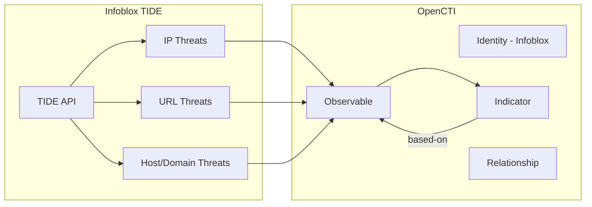

# OpenCTI Infoblox TIDE Connector

| Status | Date | Comment |
|--------|------|---------|
| Community | -    | -       |

The Infoblox connector imports threat intelligence data from the Infoblox Threat Intelligence Data Exchange (TIDE) into OpenCTI.

## Table of Contents

- [OpenCTI Infoblox TIDE Connector](#opencti-infoblox-tide-connector)
  - [Table of Contents](#table-of-contents)
  - [Introduction](#introduction)
  - [Installation](#installation)
    - [Requirements](#requirements)
  - [Configuration variables](#configuration-variables)
    - [OpenCTI environment variables](#opencti-environment-variables)
    - [Base connector environment variables](#base-connector-environment-variables)
    - [Connector extra parameters environment variables](#connector-extra-parameters-environment-variables)
  - [Deployment](#deployment)
    - [Docker Deployment](#docker-deployment)
    - [Manual Deployment](#manual-deployment)
  - [Usage](#usage)
  - [Behavior](#behavior)
  - [Debugging](#debugging)
  - [Additional information](#additional-information)

## Introduction

[Infoblox](https://www.infoblox.com/) provides threat intelligence through their TIDE (Threat Intelligence Data Exchange) platform. TIDE aggregates threat data from multiple sources and provides high-confidence indicators of compromise including malicious IP addresses, domains, and URLs.

This connector fetches threat data from the Infoblox TIDE API and imports it into OpenCTI as observables, indicators, and relationships.

## Installation

### Requirements

- OpenCTI Platform >= 6.2.0
- Infoblox TIDE API key (subscription required)

## Configuration variables

There are a number of configuration options, which are set either in `docker-compose.yml` (for Docker) or in `config.yml` (for manual deployment).

### OpenCTI environment variables

| Parameter     | config.yml | Docker environment variable | Mandatory | Description                                          |
|---------------|------------|-----------------------------|-----------|------------------------------------------------------|
| OpenCTI URL   | url        | `OPENCTI_URL`               | Yes       | The URL of the OpenCTI platform.                     |
| OpenCTI Token | token      | `OPENCTI_TOKEN`             | Yes       | The default admin token set in the OpenCTI platform. |

### Base connector environment variables

| Parameter        | config.yml | Docker environment variable | Default  | Mandatory | Description                                                              |
|------------------|------------|-----------------------------|----------|-----------|--------------------------------------------------------------------------|
| Connector ID     | id         | `CONNECTOR_ID`              |          | Yes       | A unique `UUIDv4` identifier for this connector instance.                |
| Connector Name   | name       | `CONNECTOR_NAME`            | INFOBLOX | Yes       | Name of the connector.                                                   |
| Connector Scope  | scope      | `CONNECTOR_SCOPE`           |          | Yes       | The scope or type of data the connector is importing.                    |
| Log Level        | log_level  | `CONNECTOR_LOG_LEVEL`       | info     | No        | Determines the verbosity of logs: `debug`, `info`, `warn`, or `error`.   |

### Connector extra parameters environment variables

| Parameter          | config.yml                | Docker environment variable | Default                                            | Mandatory | Description                                                                 |
|--------------------|---------------------------|-----------------------------|----------------------------------------------------|-----------|-----------------------------------------------------------------------------|
| API Key            | infoblox.api_key          | `INFOBLOX_API_KEY`          |                                                    | Yes       | Your Infoblox TIDE API key.                                                 |
| URL                | infoblox.url              | `INFOBLOX_URL`              | https://csp.infoblox.com/tide/api/data/threats     | No        | Infoblox TIDE API endpoint URL.                                             |
| Interval           | infoblox.interval         | `INFOBLOX_INTERVAL`         | 12                                                 | No        | Polling interval in hours.                                                  |
| IOC Limit          | infoblox.ioc_limit        | `INFOBLOX_IOC_LIMIT`        | 10000                                              | No        | Maximum number of IOCs to fetch per type per run.                           |
| Marking Definition | infoblox.marking_definition| `INFOBLOX_MARKING`         | TLP:AMBER+STRICT                                   | No        | TLP marking for imported data (`TLP:CLEAR`, `TLP:GREEN`, `TLP:AMBER`, `TLP:AMBER+STRICT`, `TLP:RED`). |

## Deployment

### Docker Deployment

Build the Docker image:

```bash
docker build -t opencti/connector-infoblox:latest .
```

Configure the connector in `docker-compose.yml`:

```yaml
  connector-infoblox:
    image: opencti/connector-infoblox:latest
    environment:
      - OPENCTI_URL=http://localhost
      - OPENCTI_TOKEN=ChangeMe
      - CONNECTOR_ID=ChangeMe
      - CONNECTOR_NAME=INFOBLOX
      - CONNECTOR_SCOPE=infoblox
      - CONNECTOR_LOG_LEVEL=info
      - INFOBLOX_API_KEY=ChangeMe
      - INFOBLOX_URL=https://csp.infoblox.com/tide/api/data/threats
      - INFOBLOX_INTERVAL=12
      - INFOBLOX_IOC_LIMIT=10000
      - INFOBLOX_MARKING=TLP:AMBER+STRICT
    restart: always
```

Start the connector:

```bash
docker compose up -d
```

### Manual Deployment

1. Create `config.yml` based on `config.yml.sample`.

2. Install dependencies:

```bash
pip3 install -r requirements.txt
```

3. Start the connector from the `src` directory:

```bash
python3 infoblox.py
```

## Usage

The connector runs automatically at the interval defined by `INFOBLOX_INTERVAL`. To force an immediate run:

**Data Management → Ingestion → Connectors**

Find the connector and click the refresh button to reset the state and trigger a new data fetch.

## Behavior

The connector fetches threat indicators from Infoblox TIDE and imports them as observables and indicators into OpenCTI.

### Data Flow



### Entity Mapping

| Infoblox Data   | OpenCTI Entity      | Description                                      |
|-----------------|---------------------|--------------------------------------------------|
| IP (type=ip)    | IPv4-Addr Observable| Malicious IP address observable                  |
| IP              | Indicator           | STIX pattern `[ipv4-addr:value = '...']`         |
| URL (type=url)  | URL Observable      | Malicious URL observable                         |
| URL             | Indicator           | STIX pattern `[url:value = '...']`               |
| HOST (type=host)| Domain-Name Observable| Malicious domain observable                    |
| HOST            | Indicator           | STIX pattern `[domain-name:value = '...']`       |
| -               | Relationship        | `based-on` from Indicator to Observable          |

### Threat Properties

Each threat from Infoblox includes the following metadata:

| Infoblox Field  | OpenCTI Mapping         | Description                                      |
|-----------------|-------------------------|--------------------------------------------------|
| threat_level    | x_opencti_score         | Threat severity score                            |
| confidence      | confidence              | Indicator confidence level                       |
| class           | label                   | Threat classification                            |
| property        | label                   | Threat property type                             |
| detected        | created                 | When the threat was first detected               |
| imported        | modified                | When the threat was imported to TIDE             |
| notes           | description             | Additional threat notes/description              |

### Processing Details

1. **Three IOC Types**: The connector fetches three types of threats:
   - IP addresses (`type=ip`)
   - URLs (`type=url`)
   - Hosts/Domains (`type=host`)

2. **Period-Based Fetching**: Uses the `period` parameter to fetch threats from the last N hours (based on `INFOBLOX_INTERVAL`)

3. **IID Profile**: Requests are filtered using the `profile=IID` parameter

4. **DGA Filtering**: DGA (Domain Generation Algorithm) domains are excluded (`dga=false`)

5. **Active Threats Only**: Only active/up threats are fetched (`up=true`)

### API Query Parameters

Each request to Infoblox TIDE includes:

| Parameter | Value                  | Description                           |
|-----------|------------------------|---------------------------------------|
| type      | ip/url/host            | IOC type to fetch                     |
| period    | {interval}h            | Time period (e.g., `12h`)             |
| profile   | IID                    | Threat profile filter                 |
| dga       | false                  | Exclude DGA domains                   |
| up        | true                   | Only active threats                   |
| rlimit    | {ioc_limit}            | Maximum results per request           |

## Debugging

Enable verbose logging:

```env
CONNECTOR_LOG_LEVEL=debug
```

Log output includes:
- API synchronization status
- Last run timestamp
- Bundle sending status
- Error messages for unsupported object types

## Additional information

- **Subscription Required**: Infoblox TIDE requires a commercial subscription for API access
- **Three Separate Requests**: The connector makes three API calls (one per IOC type) per run
- **IOC Limit Per Type**: The `INFOBLOX_IOC_LIMIT` applies to each IOC type separately (e.g., 10000 IPs + 10000 URLs + 10000 hosts)
- **High Timeout**: API requests have an extended timeout (80000 seconds) for large result sets
- **TLP Default**: Data is marked TLP:AMBER+STRICT by default due to the commercial nature of the feed
- **Reference**: [Infoblox TIDE](https://www.infoblox.com/products/threat-intelligence/)
