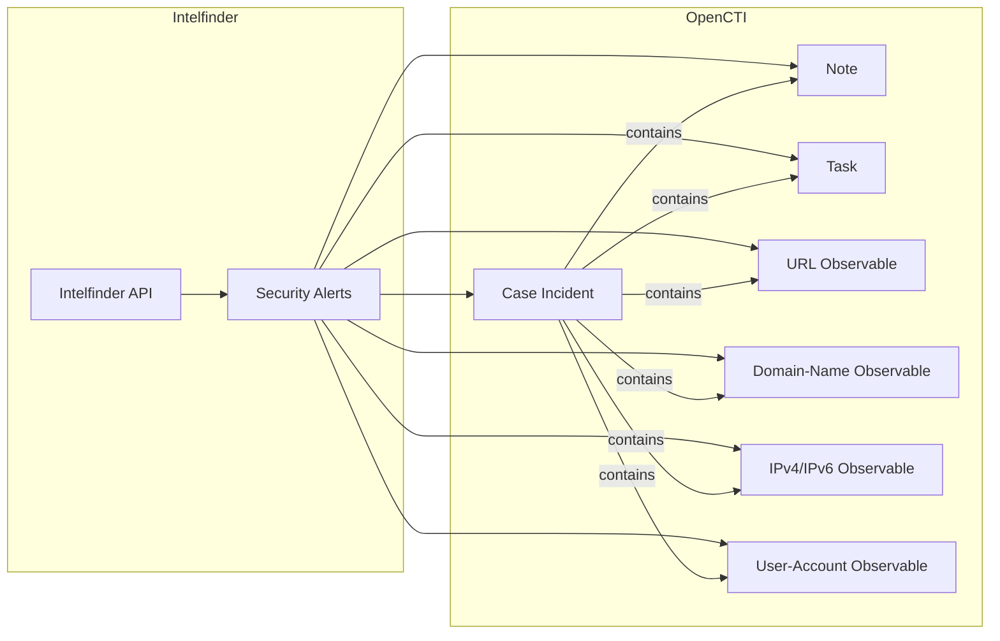

# OpenCTI Intelfinder Connector

| Status | Date | Comment |
|--------|------|---------|
| Community | -    | -       |

The Intelfinder connector imports security alerts from the Intelfinder platform into OpenCTI as case incidents with associated observables and notes.

## Table of Contents

- [OpenCTI Intelfinder Connector](#opencti-intelfinder-connector)
  - [Table of Contents](#table-of-contents)
  - [Introduction](#introduction)
  - [Installation](#installation)
    - [Requirements](#requirements)
  - [Configuration variables](#configuration-variables)
    - [OpenCTI environment variables](#opencti-environment-variables)
    - [Base connector environment variables](#base-connector-environment-variables)
    - [Connector extra parameters environment variables](#connector-extra-parameters-environment-variables)
  - [Deployment](#deployment)
    - [Docker Deployment](#docker-deployment)
    - [Manual Deployment](#manual-deployment)
  - [Usage](#usage)
  - [Behavior](#behavior)
  - [Debugging](#debugging)
  - [Additional information](#additional-information)

## Introduction

[Intelfinder](https://intelfinder.io/) is a threat intelligence platform that monitors the dark web, deep web, and surface web for security threats targeting your organization. This connector imports Intelfinder alerts and converts them into OpenCTI case incidents with associated observables and analysis notes.

The connector supports extraction of various indicator types from alert elements including domains, IP addresses, URLs, and user credentials.

## Installation

### Requirements

- OpenCTI Platform >= 6.9.22
- Intelfinder subscription with API access
- Intelfinder API Token (obtain from https://dash.intelfinder.io/integrations.php?i=api)

## Configuration variables

There are a number of configuration options, which are set either in `docker-compose.yml` (for Docker) or in `.env` file.

### OpenCTI environment variables

| Parameter     | config.yml | Docker environment variable | Mandatory | Description                                          |
|---------------|------------|-----------------------------|-----------|------------------------------------------------------|
| OpenCTI URL   | url        | `OPENCTI_URL`               | Yes       | The URL of the OpenCTI platform.                     |
| OpenCTI Token | token      | `OPENCTI_TOKEN`             | Yes       | The default admin token set in the OpenCTI platform. |

### Base connector environment variables

| Parameter              | config.yml           | Docker environment variable    | Default     | Mandatory | Description                                                              |
|------------------------|----------------------|--------------------------------|-------------|-----------|--------------------------------------------------------------------------|
| Connector ID           | id                   | `CONNECTOR_ID`                 |             | Yes       | A unique `UUIDv4` identifier for this connector instance.                |
| Connector Name         | name                 | `CONNECTOR_NAME`               | Intelfinder | Yes       | Name of the connector.                                                   |
| Connector Scope        | scope                | `CONNECTOR_SCOPE`              | stix2       | Yes       | The scope or type of data the connector is importing.                    |
| Log Level              | log_level            | `CONNECTOR_LOG_LEVEL`          | info        | Yes       | Determines the verbosity of logs: `debug`, `info`, `warning`, `error`.   |
| Run Every              | run_every            | `CONNECTOR_RUN_EVERY`          |             | Yes       | Interval between runs (e.g., `30s`, `5m`, `1h`, `1d`).                   |
| Update Existing Data   | update_existing_data | `CONNECTOR_UPDATE_EXISTING_DATA` | true      | Yes       | Whether to update existing data.                                         |

### Connector extra parameters environment variables

| Parameter         | config.yml              | Docker environment variable    | Default   | Mandatory | Description                                                    |
|-------------------|-------------------------|--------------------------------|-----------|-----------|----------------------------------------------------------------|
| API Token         | intelfinder.token       | `INTELFINDER_TOKEN`            |           | Yes       | Intelfinder API token.                                         |
| Labels            | intelfinder.labels      | `INTELFINDER_LABELS`           |           | Yes       | Labels to apply (e.g., `intelfinder,osint`).                   |
| Marking Refs      | intelfinder.marking_refs| `INTELFINDER_MARKING_REFS`     | TLP:WHITE | Yes       | TLP marking (`TLP:WHITE`, `TLP:GREEN`, `TLP:AMBER`, `TLP:RED`).|
| Seed Alert ID     | intelfinder.seed_alert_id| `INTELFINDER_SEED_ALERT_ID`   |           | No        | Initial alert ID to start import from.                         |

## Deployment

### Docker Deployment

Build the Docker image:

```bash
docker build -t opencti/connector-intelfinder:latest .
```

Configure the connector in `docker-compose.yml`:

```yaml
  connector-intelfinder:
    image: opencti/connector-intelfinder:latest
    environment:
      - OPENCTI_URL=http://localhost
      - OPENCTI_TOKEN=ChangeMe
      - CONNECTOR_ID=ChangeMe
      - CONNECTOR_NAME=Intelfinder
      - CONNECTOR_SCOPE=stix2
      - CONNECTOR_LOG_LEVEL=info
      - CONNECTOR_RUN_EVERY=1h
      - CONNECTOR_UPDATE_EXISTING_DATA=true
      - INTELFINDER_TOKEN=ChangeMe
      - INTELFINDER_LABELS=intelfinder,osint
      - INTELFINDER_MARKING_REFS=TLP:AMBER
    restart: always
```

Start the connector:

```bash
docker compose up -d
```

### Manual Deployment

1. Create `.env` file based on provided sample.

2. Install dependencies:

```bash
pip3 install -r requirements.txt
```

3. Start the connector:

```bash
python3 main.py
```

## Usage

The connector runs automatically at the interval defined by `CONNECTOR_RUN_EVERY`. To force an immediate run:

**Data Management → Ingestion → Connectors**

Find the connector and click the refresh button to reset the state and trigger a new data fetch.

## Behavior

The connector fetches alerts from Intelfinder API and transforms them into STIX 2.1 objects for import into OpenCTI.

### Data Flow



### Entity Mapping

| Intelfinder Data     | OpenCTI Entity      | Description                                          |
|----------------------|---------------------|------------------------------------------------------|
| Alert                | Case Incident       | Main alert container with severity and description   |
| Alert Details        | Note                | Detailed alert content in markdown                   |
| Recommendation       | Task                | Recommended actions for the alert                    |
| Domain Element       | Domain-Name         | Domain names from alert elements                     |
| IP Address Element   | IPv4-Addr/IPv6-Addr | IP addresses from alert elements                     |
| URL Element          | URL                 | URLs from alert elements                             |
| Record Element       | User-Account        | Credentials/accounts from record elements            |

### Severity Mapping

| Intelfinder Priority | OpenCTI Severity |
|---------------------|------------------|
| 1 (Very Low)        | low              |
| 2 (Low)             | low              |
| 3 (Medium)          | medium           |
| 4 (High)            | high             |
| 5 (Urgent)          | critical         |

### Processing Details

1. **Alert Fetching**:
   - Retrieves up to 20 alerts per request (API page size)
   - Uses cursor-based pagination for incremental updates
   - Handles rate limiting with automatic retry (60s delay)

2. **Element Extraction**:
   - **Domain Elements**: Extracts from "Domain", "Similar to Domain", "Name Server", "Mail Server" labels
   - **IP Elements**: Extracts from "IP Address" labels, supports both IPv4 and IPv6
   - **URL Elements**: Extracts from "URL" labels with validation
   - **Record Elements**: Parses credential records with email, username, password fields

3. **STIX Object Creation**:
   - Case Incident created with external reference to Intelfinder dashboard
   - Note contains alert details with element table
   - Task created if recommendation exists
   - All observables linked to parent Case Incident

4. **Content Truncation**:
   - Large payloads exceeding 80% of RabbitMQ limit (128 MB) are truncated
   - Truncation message: "TRUNCATED DUE TO SIZE LIMIT, CHECK INTELFINDER FOR FULL CONTENT."

### State Management

| State Key | Description                              |
|-----------|------------------------------------------|
| `cursor`  | Last processed alert ID for pagination   |

## Debugging

Enable verbose logging:

```env
CONNECTOR_LOG_LEVEL=debug
```

### Common Issues

| Issue                     | Solution                                            |
|---------------------------|-----------------------------------------------------|
| Rate limit exceeded       | Connector auto-retries after 60 seconds             |
| Invalid API key           | Verify token at Intelfinder integrations page       |
| No alerts imported        | Check `INTELFINDER_SEED_ALERT_ID` for starting point|

### Error Codes

| Code | Description                                    |
|------|------------------------------------------------|
| 0    | Successful request                             |
| 1    | API key invalid or not provided                |
| 2    | API not enabled for user                       |
| 3    | Invalid action parameter                       |
| 4    | Request frequency exceeded limit               |
| 5    | Invalid alert ID provided                      |
| 6    | Invalid parameter value                        |
| 7    | Other error (details in error field)           |

## Additional information

- **API Documentation**: https://dash.intelfinder.io/integrations.php?i=api
- **Dashboard URL**: Alerts link back to https://dash.intelfinder.io/alert.php?id={alert_id}
- **Rate Limiting**: Applied after response returns ≤20 alerts; no limit when queue >20 alerts
- **Reference**: [Intelfinder](https://intelfinder.io/)
