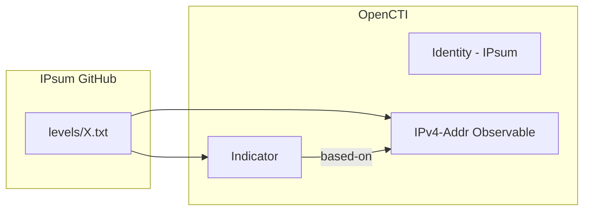

# OpenCTI IPsum Connector

The IPsum connector imports malicious IP addresses from the IPsum threat intelligence feed into OpenCTI.

| Status            | Date | Comment |
|-------------------|------|---------|
| Filigran Verified | -    | -       |

## Table of Contents

- [OpenCTI IPsum Connector](#opencti-ipsum-connector)
  - [Table of Contents](#table-of-contents)
  - [Introduction](#introduction)
  - [Installation](#installation)
    - [Requirements](#requirements)
  - [Configuration variables](#configuration-variables)
    - [OpenCTI environment variables](#opencti-environment-variables)
    - [Base connector environment variables](#base-connector-environment-variables)
    - [Connector extra parameters environment variables](#connector-extra-parameters-environment-variables)
  - [Deployment](#deployment)
    - [Docker Deployment](#docker-deployment)
    - [Manual Deployment](#manual-deployment)
  - [Usage](#usage)
  - [Behavior](#behavior)
  - [Debugging](#debugging)
  - [Additional information](#additional-information)

## Introduction

[IPsum](https://github.com/stamparm/ipsum) is a threat intelligence feed based on 30+ different publicly available lists of suspicious and/or malicious IP addresses. All lists are automatically retrieved and parsed on a daily (24h) basis.

The feed provides IP addresses together with a total number of blacklist occurrences. Greater the number, lesser the chance of false positive detection. The list is sorted from most problematic to least occurring IP addresses.

## Installation

### Requirements

- OpenCTI Platform >= 6.x
- Internet access to GitHub raw content

## Configuration variables

There are a number of configuration options, which are set either in `docker-compose.yml` (for Docker) or in `config.yml` (for manual deployment).

### OpenCTI environment variables

| Parameter     | config.yml | Docker environment variable | Mandatory | Description                                          |
|---------------|------------|-----------------------------|-----------|------------------------------------------------------|
| OpenCTI URL   | url        | `OPENCTI_URL`               | Yes       | The URL of the OpenCTI platform.                     |
| OpenCTI Token | token      | `OPENCTI_TOKEN`             | Yes       | The default admin token set in the OpenCTI platform. |

### Base connector environment variables

| Parameter       | config.yml | Docker environment variable | Default | Mandatory | Description                                                              |
|-----------------|------------|-----------------------------|---------|-----------|--------------------------------------------------------------------------|
| Connector ID    | id         | `CONNECTOR_ID`              |         | Yes       | A unique `UUIDv4` identifier for this connector instance.                |
| Connector Name  | name       | `CONNECTOR_NAME`            | IPsum   | No        | Name of the connector.                                                   |
| Connector Scope | scope      | `CONNECTOR_SCOPE`           | ipsum   | No        | The scope or type of data the connector is importing.                    |
| Log Level       | log_level  | `CONNECTOR_LOG_LEVEL`       | error   | No        | Determines the verbosity of logs: `debug`, `info`, `warn`, or `error`.   |

### Connector extra parameters environment variables

| Parameter    | config.yml              | Docker environment variable               | Default                                                                           | Mandatory | Description                                                    |
|--------------|-------------------------|-------------------------------------------|-----------------------------------------------------------------------------------|-----------|----------------------------------------------------------------|
| API Base URL | api_base_url            | `CONNECTOR_IPSUM_API_BASE_URL`            | https://raw.githubusercontent.com/stamparm/ipsum/refs/heads/master/levels/5.txt   | Yes       | IPsum feed URL (levels 1-8 available).                         |
| API Key      | api_key                 | `CONNECTOR_IPSUM_API_KEY`                 |                                                                                   | No        | GitHub API key (optional, for rate limiting).                  |
| Score        | default_x_opencti_score | `CONNECTOR_IPSUM_DEFAULT_X_OPENCTI_SCORE` | 60                                                                                | No        | Default x_opencti_score for indicators.                        |
| TLP Level    | tlp_level               | `CONNECTOR_IPSUM_TLP_LEVEL`               | white                                                                             | No        | TLP marking: `white`, `green`, `amber`, `amber+strict`, `red`. |

## Deployment

### Docker Deployment

Build the Docker image:

```bash
docker build -t opencti/connector-ipsum:latest .
```

Configure the connector in `docker-compose.yml`:

```yaml
  connector-ipsum:
    image: opencti/connector-ipsum:latest
    environment:
      - OPENCTI_URL=http://localhost
      - OPENCTI_TOKEN=ChangeMe
      - CONNECTOR_ID=ChangeMe
      - CONNECTOR_NAME=IPsum
      - CONNECTOR_SCOPE=ipsum
      - CONNECTOR_LOG_LEVEL=error
      - CONNECTOR_IPSUM_API_BASE_URL=https://raw.githubusercontent.com/stamparm/ipsum/refs/heads/master/levels/5.txt
      - CONNECTOR_IPSUM_DEFAULT_X_OPENCTI_SCORE=60
      - CONNECTOR_IPSUM_TLP_LEVEL=white
    restart: always
```

Start the connector:

```bash
docker compose up -d
```

### Manual Deployment

1. Create `config.yml` based on `config.yml.sample`.

2. Install dependencies:

```bash
pip3 install -r requirements.txt
```

3. Start the connector:

```bash
python3 main.py
```

## Usage

The connector runs automatically at the configured interval. To force an immediate run:

**Data Management → Ingestion → Connectors**

Find the connector and click the refresh button to reset the state and trigger a new data fetch.

## Behavior

The connector fetches malicious IP addresses from the IPsum feed and imports them as indicators and observables into OpenCTI.

### Data Flow



### Entity Mapping

| IPsum Data       | OpenCTI Entity      | Description                                      |
|------------------|---------------------|--------------------------------------------------|
| IP Address       | IPv4-Addr           | Malicious IP observable                          |
| IP Address       | Indicator           | STIX pattern `[ipv4-addr:value = '...']`         |
| Occurrence Count | x_opencti_score     | Higher count = higher confidence                 |

### Feed Levels

IPsum provides different confidence levels:

| Level | Description                                      | False Positive Risk |
|-------|--------------------------------------------------|---------------------|
| 1     | Appeared in 1+ blacklists                        | High                |
| 2     | Appeared in 2+ blacklists                        | Medium-High         |
| 3     | Appeared in 3+ blacklists                        | Medium              |
| 4     | Appeared in 4+ blacklists                        | Medium-Low          |
| 5     | Appeared in 5+ blacklists (recommended)          | Low                 |
| 6     | Appeared in 6+ blacklists                        | Very Low            |
| 7     | Appeared in 7+ blacklists                        | Minimal             |
| 8     | Appeared in 8+ blacklists                        | None                |

> **Recommendation**: Use level 5 or higher for production to minimize false positives.

## Debugging

Enable verbose logging:

```env
CONNECTOR_LOG_LEVEL=debug
```

## Additional information

- **Public Feed**: IPsum data is publicly available without authentication
- **Update Frequency**: Feed is updated daily
- **Source Lists**: Aggregates from 30+ public blacklists
- **Reference**: [IPsum GitHub Repository](https://github.com/stamparm/ipsum)
