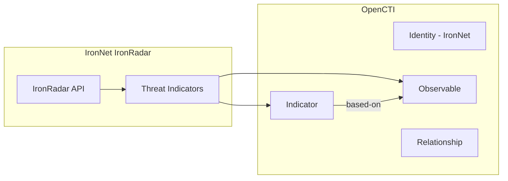

# OpenCTI IronNet Connector

| Status | Date | Comment |
|--------|------|---------|
| Partner | -    | -       |

The IronNet connector imports threat intelligence from the IronRadar threat feed into OpenCTI.

## Table of Contents

- [OpenCTI IronNet Connector](#opencti-ironnet-connector)
  - [Table of Contents](#table-of-contents)
  - [Introduction](#introduction)
  - [Installation](#installation)
    - [Requirements](#requirements)
  - [Configuration variables](#configuration-variables)
    - [OpenCTI environment variables](#opencti-environment-variables)
    - [Base connector environment variables](#base-connector-environment-variables)
    - [Connector extra parameters environment variables](#connector-extra-parameters-environment-variables)
  - [Deployment](#deployment)
    - [Docker Deployment](#docker-deployment)
    - [Manual Deployment](#manual-deployment)
  - [Usage](#usage)
  - [Behavior](#behavior)
  - [Debugging](#debugging)
  - [Additional information](#additional-information)

## Introduction

The OpenCTI IronNet connector imports threat intelligence from the [IronRadar](https://www.ironnet.com/products/ironradar) threat intel feed. IronRadar provides curated threat data including malicious IPs, domains, and command-and-control infrastructure.

> **Note**: Requires a subscription to the IronRadar threat intel feed.

## Installation

### Requirements

- OpenCTI Platform >= 6.x
- IronRadar subscription with API access
- IronNet API key

## Configuration variables

There are a number of configuration options, which are set either in `docker-compose.yml` (for Docker) or in `config.yml` (for manual deployment).

### OpenCTI environment variables

| Parameter     | config.yml | Docker environment variable | Mandatory | Description                                          |
|---------------|------------|-----------------------------|-----------|------------------------------------------------------|
| OpenCTI URL   | url        | `OPENCTI_URL`               | Yes       | The URL of the OpenCTI platform.                     |
| OpenCTI Token | token      | `OPENCTI_TOKEN`             | Yes       | The default admin token set in the OpenCTI platform. |

### Base connector environment variables

| Parameter       | config.yml | Docker environment variable | Default  | Mandatory | Description                                                              |
|-----------------|------------|-----------------------------|----------|-----------|--------------------------------------------------------------------------|
| Connector ID    | id         | `CONNECTOR_ID`              |          | Yes       | A unique `UUIDv4` identifier for this connector instance.                |
| Connector Name  | name       | `CONNECTOR_NAME`            | IronNet  | No        | Name of the connector.                                                   |
| Connector Scope | scope      | `CONNECTOR_SCOPE`           | ironnet  | No        | The scope or type of data the connector is importing.                    |
| Log Level       | log_level  | `CONNECTOR_LOG_LEVEL`       | info     | No        | Determines the verbosity of logs: `debug`, `info`, `warn`, or `error`.   |

### Connector extra parameters environment variables

| Parameter              | config.yml             | Docker environment variable        | Default                                          | Mandatory | Description                                                    |
|------------------------|------------------------|------------------------------------|--------------------------------------------------|-----------|----------------------------------------------------------------|
| API URL                | api_url                | `IRONNET_API_URL`                  | https://api.threatanalysis.io/prod/all/1d/json   | No        | IronRadar API endpoint URL.                                    |
| API Key                | api_key                | `IRONNET_API_KEY`                  |                                                  | Yes       | IronNet API key.                                               |
| Verify SSL             | verify                 | `IRONNET_VERIFY`                   | true                                             | No        | Verify SSL connections to the API.                             |
| Create Indicators      | create_indicators      | `IRONNET_CREATE_INDICATORS`        | true                                             | No        | Create STIX indicators from the data.                          |
| Create IP Indicators   | create_ip_indicators   | `IRONNET_CREATE_IP_INDICATORS`     | false                                            | No        | Create IP-based indicators.                                    |
| IP Indicator Valid Until| ip_indicator_valid_until| `IRONNET_IP_INDICATOR_VALID_UNTIL`| P90D                                             | No        | ISO8601 duration for IP indicator validity.                    |
| Interval               | interval               | `CONNECTOR_INTERVAL`               | 86400                                            | No        | Interval in minutes between runs.                              |
| Loop Interval          | loop_interval          | `CONNECTOR_LOOP_INTERVAL`          | 600                                              | No        | Interval in minutes between loops.                             |

## Deployment

### Docker Deployment

Build the Docker image:

```bash
docker build -t opencti/connector-ironnet:latest .
```

Configure the connector in `docker-compose.yml`:

```yaml
  connector-ironnet:
    image: opencti/connector-ironnet:latest
    environment:
      - OPENCTI_URL=http://localhost
      - OPENCTI_TOKEN=ChangeMe
      - CONNECTOR_ID=ChangeMe
      - CONNECTOR_NAME=IronNet
      - CONNECTOR_SCOPE=ironnet
      - CONNECTOR_LOG_LEVEL=info
      - IRONNET_API_URL=https://api.threatanalysis.io/prod/all/1d/json
      - IRONNET_API_KEY=ChangeMe
      - IRONNET_VERIFY=true
      - IRONNET_CREATE_INDICATORS=true
      - IRONNET_CREATE_IP_INDICATORS=false
      - IRONNET_IP_INDICATOR_VALID_UNTIL=P90D
      - CONNECTOR_INTERVAL=86400
    restart: always
```

Start the connector:

```bash
docker compose up -d
```

### Manual Deployment

1. Create `config.yml` based on `config.yml.sample`.

2. Install dependencies:

```bash
pip3 install -r requirements.txt
```

3. Start the connector:

```bash
python3 main.py
```

## Usage

The connector runs automatically at the interval defined by `CONNECTOR_INTERVAL`. To force an immediate run:

**Data Management → Ingestion → Connectors**

Find the connector and click the refresh button to reset the state and trigger a new data fetch.

## Behavior

The connector fetches threat data from IronRadar API and imports them as observables and indicators into OpenCTI.

### Data Flow



### Entity Mapping

| IronRadar Data   | OpenCTI Entity      | Description                                      |
|------------------|---------------------|--------------------------------------------------|
| IP Address       | IPv4-Addr           | Malicious IP observable                          |
| IP (indicator)   | Indicator           | STIX pattern `[ipv4-addr:value = '...']`         |
| Domain           | Domain-Name         | Malicious domain observable                      |
| Domain (indicator)| Indicator          | STIX pattern `[domain-name:value = '...']`       |
| URL              | URL                 | Malicious URL observable                         |
| threat_type      | Label               | Threat classification (recon, c2, etc.)          |
| confidence       | confidence          | Indicator confidence level                       |
| -                | Relationship        | `based-on` from Indicator to Observable          |

### API Filtering

The IronRadar API supports query parameters for filtering:

| Parameter    | Example Values              | Description                        |
|--------------|-----------------------------|------------------------------------|
| filter       | `domain`, `ip`              | Filter by indicator type           |
| confidence   | `high`, `medium`, `low`     | Filter by confidence level         |
| threat_type  | `recon`, `c2`, `malware`    | Filter by threat type              |

Example filtered URL:
```
https://api.threatanalysis.io/prod/all/1d/json?filter=domain&confidence=high&threat_type=recon
```

## Debugging

Enable verbose logging:

```env
CONNECTOR_LOG_LEVEL=debug
```

Common issues:
- **Authentication errors**: Verify API key
- **SSL errors**: Set `IRONNET_VERIFY=false` for testing
- **No data**: Check API URL and filter parameters

## Additional information

- **Subscription Required**: IronRadar feed requires a paid subscription
- **API Documentation**: https://api.threatanalysis.io/prod/docs/index.html
- **IP Indicators**: Disabled by default; enable with `IRONNET_CREATE_IP_INDICATORS=true`
- **Validity Period**: IP indicators expire after 90 days by default (configurable via `IP_INDICATOR_VALID_UNTIL`)
- **Reference**: [IronNet IronRadar](https://www.ironnet.com/products/ironradar)
