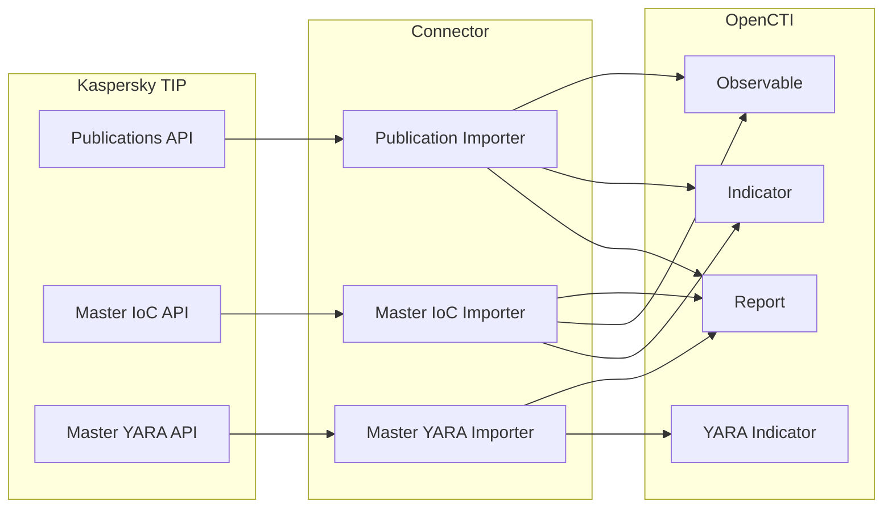

# OpenCTI Kaspersky Connector

The Kaspersky connector imports threat intelligence from Kaspersky Threat Intelligence Portal into OpenCTI, including reports, IoCs, and YARA rules.

| Status            | Date       | Comment                   |
|-------------------|------------|---------------------------|
| Filigran Verified | 2025-12-06 | -                         |

## Introduction

The OpenCTI Kaspersky connector imports threat intelligence from the Kaspersky Threat Intelligence Portal API. This includes publications (threat reports with associated IoCs), Master IoC files (consolidated indicator lists), and Master YARA files (detection rules).

### Key Features

- **Publication Import**: Threat reports with PDF attachments and extracted IoCs
- **Master IoC Import**: Consolidated indicator files updated periodically
- **Master YARA Import**: YARA detection rules for malware families
- **Flexible Scopes**: Enable/disable specific data streams independently
- **Configurable Filtering**: Exclude specific IoC types or report prefixes

**Note**: A Kaspersky Threat Intelligence Portal license is required to use this connector.

---

## Installation

### Requirements

| Requirement            | Description                                      |
|------------------------|--------------------------------------------------|
| OpenCTI Platform       | Version 6.x or higher                           |
| Kaspersky TIP License  | Active subscription to Kaspersky TIP            |
| Client Certificate     | Certificate file provided by Kaspersky          |
| Network Access         | Access to Kaspersky TIP API endpoint            |

---

## Configuration

The connector can be configured with the following variables:

### OpenCTI Parameters

| Parameter      | Docker Environment Variable | Mandatory | Description                          |
|----------------|----------------------------|-----------|--------------------------------------|
| OpenCTI URL    | `OPENCTI_URL`              | Yes       | URL of the OpenCTI platform         |
| OpenCTI Token  | `OPENCTI_TOKEN`            | Yes       | API token for the OpenCTI platform  |

### Base Connector Parameters

| Parameter         | Docker Environment Variable | Default | Mandatory | Description                               |
|-------------------|-----------------------------|---------|-----------|-------------------------------------------|
| Connector ID      | `CONNECTOR_ID`              |         | Yes       | Unique identifier (UUIDv4)               |
| Connector Name    | `CONNECTOR_NAME`            |         | Yes       | Name of the connector                    |
| Connector Scope   | `CONNECTOR_SCOPE`           |         | Yes       | Connector scope                          |
| Log Level         | `CONNECTOR_LOG_LEVEL`       | info    | No        | Log verbosity                            |

### Kaspersky Connector Parameters

| Config Parameter                           | Docker Environment Variable                          | Default                       | Description                                                            |
|--------------------------------------------|------------------------------------------------------|-------------------------------|------------------------------------------------------------------------|
| `base_url`                                 | `KASPERSKY_BASE_URL`                                 | `https://tip.kaspersky.com`   | Kaspersky TIP API base URL                                            |
| `user`                                     | `KASPERSKY_USER`                                     |                               | Kaspersky TIP username                                                |
| `password`                                 | `KASPERSKY_PASSWORD`                                 |                               | Kaspersky TIP password                                                |
| `certificate_path`                         | `KASPERSKY_CERTIFICATE_PATH`                         |                               | Full path to client certificate                                       |
| `tlp`                                      | `KASPERSKY_TLP`                                      | `Amber`                       | TLP marking for imported objects                                      |
| `create_observables`                       | `KASPERSKY_CREATE_OBSERVABLES`                       | `true`                        | Create observables from IoCs                                          |
| `create_indicators`                        | `KASPERSKY_CREATE_INDICATORS`                        | `true`                        | Create indicators from IoCs                                           |
| `scopes`                                   | `KASPERSKY_SCOPES`                                   | `publication,master_ioc,master_yara` | Data scopes to import                                         |
| `publication_start_timestamp`              | `KASPERSKY_PUBLICATION_START_TIMESTAMP`              | `0`                           | Import publications updated after this timestamp (Unix epoch)        |
| `publication_report_type`                  | `KASPERSKY_PUBLICATION_REPORT_TYPE`                  | `threat-report`               | Report type in OpenCTI                                                |
| `publication_report_status`                | `KASPERSKY_PUBLICATION_REPORT_STATUS`                | `New`                         | Report status in OpenCTI                                              |
| `publication_report_ignore_prefixes`       | `KASPERSKY_PUBLICATION_REPORT_IGNORE_PREFIXES`       | `Monthly APT activity report` | Exclude reports starting with these prefixes                          |
| `publication_excluded_ioc_indicator_types` | `KASPERSKY_PUBLICATION_EXCLUDED_IOC_INDICATOR_TYPES` | `Md5sum,FileItem/Sha1sum`     | OpenIOC indicator types to exclude                                    |
| `master_ioc_fetch_weekday`                 | `KASPERSKY_MASTER_IOC_FETCH_WEEKDAY`                 | `1`                           | ISO weekday to fetch Master IoC (1=Monday, empty=every run)          |
| `master_ioc_excluded_ioc_indicator_types`  | `KASPERSKY_MASTER_IOC_EXCLUDED_IOC_INDICATOR_TYPES`  | `md5Hash,sha1Hash`            | OpenIOC indicator types to exclude                                    |
| `master_ioc_report_type`                   | `KASPERSKY_MASTER_IOC_REPORT_TYPE`                   | `threat-report`               | Report type for Master IoC publications                               |
| `master_ioc_report_status`                 | `KASPERSKY_MASTER_IOC_REPORT_STATUS`                 | `New`                         | Report status for Master IoC publications                             |
| `master_yara_fetch_weekday`                | `KASPERSKY_MASTER_YARA_FETCH_WEEKDAY`                | `2`                           | ISO weekday to fetch Master YARA (empty=every run)                   |
| `master_yara_include_report`               | `KASPERSKY_MASTER_YARA_INCLUDE_REPORT`               | `true`                        | Include related reports with YARA rules                               |
| `master_yara_report_type`                  | `KASPERSKY_MASTER_YARA_REPORT_TYPE`                  | `threat-report`               | Report type for Master YARA publications                              |
| `master_yara_report_status`                | `KASPERSKY_MASTER_YARA_REPORT_STATUS`                | `New`                         | Report status for Master YARA publications                            |
| `interval_sec`                             | `KASPERSKY_INTERVAL_SEC`                             | `43200`                       | Import interval in seconds (default: 12 hours)                        |

**Note**: It is not recommended to use the default value `0` for `publication_start_timestamp` due to large data volumes.

---

## Deployment

### Docker Deployment

Build a Docker image using the provided Dockerfile:

```bash
docker build -t opencti/connector-kaspersky:latest .
```

Example `docker-compose.yml`:

```yaml
version: '3'
services:
  connector-kaspersky:
    image: opencti/connector-kaspersky:latest
    environment:
      - OPENCTI_URL=http://localhost:8080
      - OPENCTI_TOKEN=ChangeMe
      - CONNECTOR_ID=ChangeMe
      - CONNECTOR_NAME=Kaspersky
      - CONNECTOR_SCOPE=kaspersky
      - CONNECTOR_LOG_LEVEL=info
      - KASPERSKY_BASE_URL=https://tip.kaspersky.com
      - KASPERSKY_USER=ChangeMe
      - KASPERSKY_PASSWORD=ChangeMe
      - KASPERSKY_CERTIFICATE_PATH=/path/to/certificate.pem
      - KASPERSKY_TLP=Amber
      - KASPERSKY_CREATE_OBSERVABLES=true
      - KASPERSKY_CREATE_INDICATORS=true
      - KASPERSKY_SCOPES=publication,master_ioc,master_yara
      - KASPERSKY_PUBLICATION_START_TIMESTAMP=1704067200
      - KASPERSKY_INTERVAL_SEC=43200
    volumes:
      - /path/to/certificate.pem:/path/to/certificate.pem:ro
    restart: always
```

### Manual Deployment

1. Clone the connector repository
2. Navigate to the connector directory:

```bash
cd external-import/kaspersky
```

3. Create a virtual environment and install dependencies:

```bash
python3 -m venv venv
source venv/bin/activate
pip3 install -r requirements.txt
```

4. Create a `config.yml` from `config.yml.sample` and configure variables
5. Run the connector:

```bash
python3 src/main.py
```

---

## Usage

After installation, the connector runs automatically at the configured interval. To force an immediate sync:

1. Navigate to **Data management → Ingestion → Connectors** in OpenCTI
2. Find the **Kaspersky** connector
3. Click the refresh button to reset state and trigger a new poll

---

## Behavior

### Data Flow



### Entity Mapping

| Kaspersky Data             | OpenCTI Entity Type | Notes                                            |
|----------------------------|--------------------|-------------------------------------------------|
| Publication                | Report             | Threat reports with PDF attachments             |
| Publication IoC            | Indicator          | Indicators extracted from publications          |
| Publication IoC            | Observable         | Observables (IP, Domain, File, URL)            |
| Master IoC Entry           | Indicator          | Consolidated indicator list                     |
| Master IoC Entry           | Observable         | Observable with metadata                        |
| Master IoC Publication     | Report             | Associated publication reference                |
| Master YARA Rule           | Indicator (YARA)   | YARA detection pattern                          |
| Master YARA Publication    | Report             | Associated report (if enabled)                  |

### Import Scopes

| Scope          | API Endpoint      | Description                                                     |
|----------------|------------------|-----------------------------------------------------------------|
| `publication`  | Publications API | Threat reports with IoCs, updated incrementally                |
| `master_ioc`   | Master IoC API   | Consolidated IoC file, fetched on configured weekday           |
| `master_yara`  | Master YARA API  | YARA rules file, fetched on configured weekday                 |

### Processing Details

#### Publication Import

1. Fetches publications updated since `publication_start_timestamp`
2. Filters out reports matching `publication_report_ignore_prefixes`
3. Creates Report SDO with PDF attachment as external reference
4. Extracts IoCs and creates Indicators/Observables
5. Excludes IoC types listed in `publication_excluded_ioc_indicator_types`

#### Master IoC Import

1. Downloads Master IoC file (on specified weekday or every run)
2. Parses OpenIOC format
3. Creates Indicators and Observables
4. Links to associated publications as Reports
5. Excludes indicator types listed in `master_ioc_excluded_ioc_indicator_types`

#### Master YARA Import

1. Downloads Master YARA file (on specified weekday or every run)
2. Parses YARA rules
3. Creates YARA pattern Indicators
4. Optionally includes related publication Reports

### Relationships Created

| Source Entity     | Relationship Type | Target Entity    | Description                        |
|-------------------|------------------|------------------|------------------------------------|
| Indicator         | based-on         | Observable       | Indicator based on observable      |
| Report            | object           | Indicator        | Report contains indicator          |
| Report            | object           | Observable       | Report contains observable         |

### State Management

The connector maintains state for incremental imports:

| State Key                | Description                           |
|--------------------------|---------------------------------------|
| `latest_run_timestamp`   | Last successful run timestamp         |
| Publication timestamps   | Per-publication state for incremental |

---

## Debugging

### Common Issues

| Issue                     | Solution                                                    |
|---------------------------|-------------------------------------------------------------|
| Certificate error         | Verify `KASPERSKY_CERTIFICATE_PATH` and file permissions   |
| Authentication failed     | Check username and password credentials                     |
| No data imported          | Verify `KASPERSKY_SCOPES` configuration                    |
| Too much data             | Increase `publication_start_timestamp` to recent date      |

### Logging

Enable detailed logging by setting `CONNECTOR_LOG_LEVEL=debug`.

---

## Additional Information

### Resources

- [Kaspersky Threat Intelligence Portal](https://tip.kaspersky.com/)
- [OpenCTI Documentation](https://docs.opencti.io/)

### License

A valid Kaspersky Threat Intelligence Portal subscription is required to use this connector.
