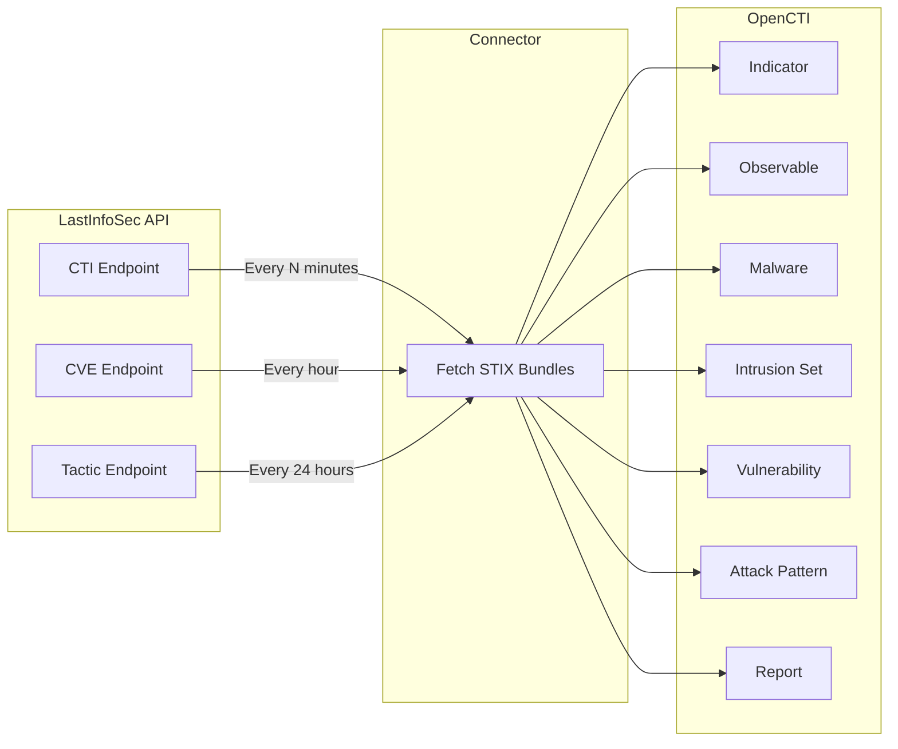

# OpenCTI LastInfoSec Connector

The LastInfoSec connector imports threat intelligence from Gatewatcher's LastInfoSec platform into OpenCTI, including CTI feeds, CVE data, and tactical intelligence.

| Status  | Date       | Comment                   |
|---------|------------|---------------------------|
| Partner | -          | -                         |

## Introduction

LastInfoSec (now part of Gatewatcher) provides comprehensive threat intelligence feeds with STIX 2.1 formatted data. This connector enables automated ingestion of three distinct intelligence streams into OpenCTI: real-time IOC feeds (CTI), vulnerability data (CVE), and tactical intelligence about malware and intrusion sets.

### Key Features

- **CTI Feed**: Real-time IOC intelligence including IPs, URLs, hashes, domains with relationships
- **CVE Feed**: Hourly vulnerability updates in STIX 2.1 format
- **Tactical Feed**: Daily intelligence about Malware and Intrusion Sets with MITRE ATT&CK mappings
- **Native STIX 2.1**: Direct bundle import without transformation

### Useful Links

- LastInfoSec: https://www.gatewatcher.com/en/our-solutions/lastinfosec/
- API Access: https://info.gatewatcher.com/en/lp/opencti

**Note**: A LastInfoSec API key is required. Contact Gatewatcher to obtain access.

---

## Installation

### Requirements

| Requirement          | Description                           |
|----------------------|---------------------------------------|
| OpenCTI Platform     | Version 6.x or higher                |
| LastInfoSec API Key  | Obtain from Gatewatcher              |
| Network Access       | Access to api.client.lastinfosec.com |

---

## Configuration variables

### OpenCTI Parameters

| Parameter            | config.yml          | Docker Environment Variable | Mandatory | Description                           |
|----------------------|---------------------|----------------------------|-----------|---------------------------------------|
| OpenCTI URL          | `opencti.url`       | `OPENCTI_URL`              | Yes       | URL of the OpenCTI platform          |
| OpenCTI Token        | `opencti.token`     | `OPENCTI_TOKEN`            | Yes       | API token for the OpenCTI platform   |
| HTTP Proxy           | `opencti.proxy_http`| `PROXY_HTTP`               | No        | HTTP proxy URL (optional)            |
| HTTPS Proxy          | `opencti.proxy_https`| `PROXY_HTTPS`             | No        | HTTPS proxy URL (optional)           |

### Base Connector Parameters

| Parameter            | config.yml                   | Docker Environment Variable     | Default | Mandatory | Description                              |
|----------------------|------------------------------|---------------------------------|---------|-----------|------------------------------------------|
| Connector ID         | `connector.id`               | `CONNECTOR_ID`                  |         | Yes       | Unique identifier (UUIDv4)              |
| Connector Name       | `connector.name`             | `CONNECTOR_NAME`                |         | Yes       | Name of the connector                   |
| Connector Scope      | `connector.scope`            | `CONNECTOR_SCOPE`               |         | Yes       | Connector scope (`application/json`)    |
| Log Level            | `connector.log_level`        | `CONNECTOR_LOG_LEVEL`           | info    | No        | Log verbosity                           |
| Run and Terminate    | `connector.run_and_terminate`| `CONNECTOR_RUN_AND_TERMINATE`   | False   | No        | Run once and exit                       |

### LastInfoSec Parameters

| Parameter            | config.yml                 | Docker Environment Variable  | Default | Mandatory | Description                                                           |
|----------------------|----------------------------|------------------------------|---------|-----------|-----------------------------------------------------------------------|
| API Key              | `lastinfosec.api_key`      | `CONFIG_LIS_APIKEY`          |         | Yes       | LastInfoSec CTI API Key                                               |
| CTI Enabled          | `lastinfosec.cti_is_enabled`| `CONFIG_LIS_CTI_ENABLED`    | False   | No        | Enable CTI feed (IOCs)                                                |
| CTI Interval         | `lastinfosec.cti_interval` | `CONFIG_LIS_CTI_INTERVAL`    | 30      | No        | Polling interval in minutes for CTI feed                              |
| CVE Enabled          | `lastinfosec.cve_is_enabled`| `CONFIG_LIS_CVE_ENABLED`    | False   | No        | Enable CVE feed (vulnerabilities)                                     |
| Tactic Enabled       | `lastinfosec.tactic_is_enabled`| `CONFIG_LIS_TACTIC_ENABLED`| False | No        | Enable Tactic feed (malware/intrusion sets)                           |

> **Important**: Only one feed can be enabled per connector instance. Deploy multiple instances to use multiple feeds.

---

## Deployment

### Docker Deployment

Build a Docker image using the provided Dockerfile:

```bash
docker build -t opencti/connector-lastinfosec:latest .
```

Example `docker-compose.yml` (CTI feed enabled):

```yaml
version: '3.2'
services:
  connector-lastinfosec-cti:
    image: opencti/connector-lastinfosec:latest
    environment:
      - OPENCTI_URL=http://localhost:8080
      - OPENCTI_TOKEN=ChangeMe
      - CONNECTOR_ID=ChangeMe
      - CONNECTOR_NAME=LastInfoSec-CTI
      - CONNECTOR_SCOPE=application/json
      - CONNECTOR_LOG_LEVEL=info
      - CONFIG_LIS_APIKEY=ChangeMe
      - CONFIG_LIS_CTI_ENABLED=True
      - CONFIG_LIS_CTI_INTERVAL=30
      - CONFIG_LIS_CVE_ENABLED=False
      - CONFIG_LIS_TACTIC_ENABLED=False
    restart: always
```

To enable multiple feeds, deploy separate instances:

```yaml
  connector-lastinfosec-cve:
    image: opencti/connector-lastinfosec:latest
    environment:
      - OPENCTI_URL=http://localhost:8080
      - OPENCTI_TOKEN=ChangeMe
      - CONNECTOR_ID=ChangeMe-CVE
      - CONNECTOR_NAME=LastInfoSec-CVE
      - CONNECTOR_SCOPE=application/json
      - CONFIG_LIS_APIKEY=ChangeMe
      - CONFIG_LIS_CTI_ENABLED=False
      - CONFIG_LIS_CVE_ENABLED=True
      - CONFIG_LIS_TACTIC_ENABLED=False
    restart: always
```

### Manual Deployment

1. Navigate to the connector directory:

```bash
cd external-import/lastinfosec/src
```

2. Install dependencies:

```bash
pip3 install -r requirements.txt
```

3. Configure `config.yml`:

```yaml
opencti:
  url: 'http://localhost:8080'
  token: 'ChangeMe'

connector:
  id: 'ChangeMe'
  name: 'LastInfoSec-CTI'
  scope: 'application/json'
  log_level: 'info'

lastinfosec:
  api_key: 'ChangeMe'
  cti_is_enabled: true
  cti_interval: 30
  cve_is_enabled: false
  tactic_is_enabled: false
```

4. Run the connector:

```bash
python3 lastinfosec.py
```

---

## Usage

After installation, the connector runs automatically based on the enabled feed's interval. To force an immediate sync:

1. Navigate to **Data management → Ingestion → Connectors** in OpenCTI
2. Find the **LastInfoSec** connector
3. Click the refresh button to trigger a new poll

---

## Behavior

### Data Flow



### Feed Details

#### CTI Feed (IOC Intelligence)

| Aspect              | Details                                                              |
|---------------------|----------------------------------------------------------------------|
| **Endpoint**        | `/v2/stix21/getbyminutes/{interval}`                                |
| **Update Frequency**| Configurable (default: 30 minutes)                                  |
| **Content**         | STIX 2.1 bundles with IOCs and relationships                        |
| **Data Types**      | IP addresses, URLs, file hashes, domains                            |
| **Relationships**   | Links to Indicators, Malware, Tools, Intrusion Sets, Attack Patterns |

#### CVE Feed (Vulnerability Intelligence)

| Aspect              | Details                                                              |
|---------------------|----------------------------------------------------------------------|
| **Endpoint**        | `/v2/stix21/vulnerabilities/getlasthour`                            |
| **Update Frequency**| Every hour (fixed)                                                  |
| **Content**         | STIX 2.1 vulnerability objects                                      |
| **Data Types**      | CVE identifiers with descriptions and references                    |

#### Tactic Feed (Strategic Intelligence)

| Aspect              | Details                                                              |
|---------------------|----------------------------------------------------------------------|
| **Endpoint**        | `/v2/stix21/tactic/getlast24hour`                                   |
| **Update Frequency**| Every 24 hours (fixed)                                              |
| **Content**         | STIX 2.1 bundles with tactical intelligence                         |
| **Data Types**      | Malware families, Intrusion Sets, Attack Patterns, Identities       |
| **Relationships**   | MITRE ATT&CK technique mappings                                     |

### Entity Mapping

| LastInfoSec Data        | OpenCTI Entity Type | Notes                                    |
|-------------------------|--------------------|-----------------------------------------|
| IP Observable           | IPv4-Addr/IPv6-Addr| Network indicators                      |
| URL Observable          | URL                | Web-based indicators                    |
| Hash Observable         | File               | File hash indicators (MD5, SHA-1, SHA-256)|
| Domain Observable       | Domain-Name        | Domain indicators                       |
| Indicator               | Indicator          | Pattern-based detection rules           |
| Malware                 | Malware            | Malware family information              |
| Intrusion Set           | Intrusion Set      | Threat actor groups                     |
| Tool                    | Tool               | Attacker tools                          |
| Vulnerability           | Vulnerability      | CVE data                                |
| Attack Pattern          | Attack Pattern     | MITRE ATT&CK techniques                 |
| Report                  | Report             | Intelligence reports                    |
| Location                | Location           | Geographic context                      |
| Identity                | Identity           | Targeted entities                       |

### State Management

| State Key   | Description                           |
|-------------|---------------------------------------|
| `last_run`  | Timestamp of last successful run      |

---

## Debugging

### Common Issues

| Issue                     | Solution                                            |
|---------------------------|-----------------------------------------------------|
| Multiple feeds error      | Enable only one feed per connector instance         |
| API authentication failed | Verify `CONFIG_LIS_APIKEY` is correct              |
| No data imported          | Check that at least one feed is enabled            |
| Connection timeout        | Verify proxy settings if behind corporate firewall |

### Logging

Enable detailed logging by setting `CONNECTOR_LOG_LEVEL=debug`.

---

## Additional Information

### API Endpoints

| Feed    | Endpoint Pattern                                      | Interval       |
|---------|-------------------------------------------------------|----------------|
| CTI     | `/v2/stix21/getbyminutes/{minutes}`                  | Configurable   |
| CVE     | `/v2/stix21/vulnerabilities/getlasthour`             | Fixed (1 hour) |
| Tactic  | `/v2/stix21/tactic/getlast24hour`                    | Fixed (24 hours)|

### Multi-Feed Deployment

To use all three feeds, deploy three separate connector instances with different `CONNECTOR_ID` values and only one feed enabled per instance.

### Resources

- [Gatewatcher Solutions](https://www.gatewatcher.com/en/our-solutions/lastinfosec/)
- [OpenCTI Integration](https://info.gatewatcher.com/en/lp/opencti)
