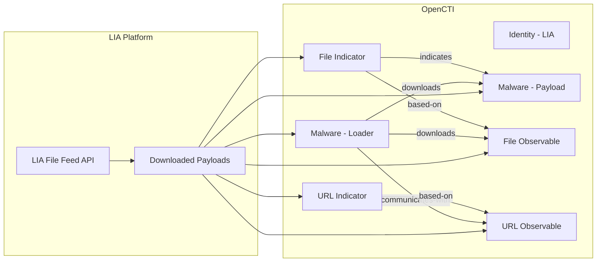

# OpenCTI Loader Insight Agency (LIA) File Feed Connector

The LIA File Feed connector imports indicators of compromise (IOCs) from the Loader Insight Agency platform into OpenCTI, providing context about malware loader activities and their payloads.

| Status    | Date | Comment |
|-----------|------|---------|
| Community | -    | -       |

## Table of Contents

- [OpenCTI Loader Insight Agency (LIA) File Feed Connector](#opencti-loader-insight-agency-lia-file-feed-connector)
  - [Table of Contents](#table-of-contents)
  - [Introduction](#introduction)
  - [Installation](#installation)
    - [Requirements](#requirements)
  - [Configuration variables](#configuration-variables)
    - [OpenCTI environment variables](#opencti-environment-variables)
    - [Base connector environment variables](#base-connector-environment-variables)
    - [Connector extra parameters environment variables](#connector-extra-parameters-environment-variables)
  - [Deployment](#deployment)
    - [Docker Deployment](#docker-deployment)
    - [Manual Deployment](#manual-deployment)
  - [Usage](#usage)
  - [Behavior](#behavior)
  - [Debugging](#debugging)
  - [Additional information](#additional-information)

## Introduction

The [Loader Insight Agency (LIA)](https://loaderinsight.agency/) is a platform that tracks activities of malware loaders through C2 traffic emulation. The platform monitors malware loaders and their downloaded payloads, providing intelligence about which loaders deliver which malware families.

This connector fetches data from the LIA File Feed API and imports it into OpenCTI, establishing relationships between IOCs to provide context such as:
- Which loader family downloaded a specific payload
- The URL from which the payload was downloaded
- The detected malware family of the payload

> **Note**: Requires a LIA File Feed subscription. Contact [loaderinsight.agency](https://loaderinsight.agency) for access.

## Installation

### Requirements

- OpenCTI Platform >= 6.3.6
- LIA File Feed subscription with API access

## Configuration variables

There are a number of configuration options, which are set either in `docker-compose.yml` (for Docker) or in `config.yml` (for manual deployment).

### OpenCTI environment variables

| Parameter     | config.yml | Docker environment variable | Mandatory | Description                                          |
|---------------|------------|-----------------------------|-----------|------------------------------------------------------|
| OpenCTI URL   | url        | `OPENCTI_URL`               | Yes       | The URL of the OpenCTI platform.                     |
| OpenCTI Token | token      | `OPENCTI_TOKEN`             | Yes       | The default admin token set in the OpenCTI platform. |

### Base connector environment variables

| Parameter         | config.yml      | Docker environment variable   | Default                            | Mandatory | Description                                                                 |
|-------------------|-----------------|-------------------------------|------------------------------------|-----------|-----------------------------------------------------------------------------|
| Connector ID      | id              | `CONNECTOR_ID`                |                                    | Yes       | A unique `UUIDv4` identifier for this connector instance.                   |
| Connector Name    | name            | `CONNECTOR_NAME`              | Loader Insight Agency File Feed    | Yes       | Name of the connector.                                                      |
| Connector Scope   | scope           | `CONNECTOR_SCOPE`             | indicator,file,malware,url         | Yes       | The scope or type of data the connector is importing.                       |
| Log Level         | log_level       | `CONNECTOR_LOG_LEVEL`         | info                               | No        | Determines the verbosity of the logs: `debug`, `info`, `warn`, or `error`.  |
| Duration Period   | duration_period | `CONNECTOR_DURATION_PERIOD`   | PT60M                              | Yes       | Time interval between connector runs in ISO 8601 format.                    |

### Connector extra parameters environment variables

| Parameter     | config.yml                | Docker environment variable | Default | Mandatory | Description                                                    |
|---------------|---------------------------|------------------------------|---------|-----------|----------------------------------------------------------------|
| API Base URL  | lia_file_feed.api_base_url| `LIA_API_BASE_URL`           |         | Yes       | The LIA File Feed API endpoint URL.                            |
| API Key       | lia_file_feed.api_key     | `LIA_API_KEY`                |         | Yes       | Your LIA API key for authentication.                           |

## Deployment

### Docker Deployment

Build the Docker image:

```bash
docker build -t opencti/connector-lia-file-feed:latest .
```

Configure the connector in `docker-compose.yml`:

```yaml
  connector-lia-file-feed:
    image: opencti/connector-lia-file-feed:latest
    environment:
      - OPENCTI_URL=http://localhost
      - OPENCTI_TOKEN=ChangeMe
      - CONNECTOR_ID=ChangeMe
      - CONNECTOR_NAME=Loader Insight Agency File Feed
      - CONNECTOR_SCOPE=indicator,file,malware,url
      - CONNECTOR_LOG_LEVEL=info
      - CONNECTOR_DURATION_PERIOD=PT60M
      - LIA_API_BASE_URL=ChangeMe
      - LIA_API_KEY=ChangeMe
    restart: always
```

Start the connector:

```bash
docker compose up -d
```

### Manual Deployment

1. Create `config.yml` based on `config.yml.sample`.

2. Install dependencies:

```bash
pip3 install -r requirements.txt
```

3. Start the connector from the `src` directory:

```bash
python3 main.py
```

## Usage

The connector runs automatically at the interval defined by `CONNECTOR_DURATION_PERIOD`. To force an immediate run:

**Data Management → Ingestion → Connectors**

Find the connector and click the refresh button to reset the state and trigger a new data fetch.

## Behavior

The connector fetches malware loader activity data from LIA and creates rich relationships between loaders, payloads, and distribution URLs.

### Data Flow



### Entity Mapping

| LIA Data         | OpenCTI Entity      | Description                                          |
|------------------|---------------------|------------------------------------------------------|
| source_family    | Malware             | The loader malware family (e.g., Emotet, QakBot)     |
| detected_as      | Malware             | The detected payload family (if known)               |
| sha256           | File Observable     | File observable with SHA-256 hash                    |
| sha256           | Indicator           | STIX pattern `[file:hashes.'SHA-256' = '...']`       |
| source_url       | URL Observable      | Distribution URL for the payload                     |
| source_url       | Indicator           | STIX pattern `[url:value = '...']`                   |

### Relationships Created

| Source            | Relationship       | Target             | Description                                      |
|-------------------|--------------------|--------------------|--------------------------------------------------|
| Loader Malware    | `downloads`        | File Observable    | Loader downloads this payload                    |
| Loader Malware    | `downloads`        | Detected Malware   | Loader delivers this malware family              |
| Loader Malware    | `communicates-with`| URL Observable     | Loader retrieves payloads from this URL          |
| File Indicator    | `based-on`         | File Observable    | Indicator based on file observable               |
| File Indicator    | `indicates`        | Detected Malware   | File hash indicates this malware family          |
| URL Indicator     | `based-on`         | URL Observable     | Indicator based on URL observable                |

### Processing Details

For each payload entry from LIA, the connector creates:

1. **Source Malware**: The loader family that downloaded the payload
   - Labels: `malware`, `threat`
   - `is_family: true`

2. **Detected Malware** (if known): The identified payload family
   - Only created if `detected_as` is not "Unknown"
   - Labels: `malware`, `threat`
   - `is_family: true`

3. **File Observable**: The downloaded payload file
   - SHA-256 hash
   - File size and MIME type
   - Name: `{detected_as} malware downloaded by {source_family}`

4. **File Indicator**: STIX pattern for the file hash
   - Pattern: `[file:hashes.'SHA-256'='{hash}']`
   - Labels: `malicious`, `file`, source_family, source_botnet, detected_as
   - External reference to LIA payload view

5. **URL Observable**: The distribution URL

6. **URL Indicator**: STIX pattern for the source URL
   - Pattern: `[url:value='{url}']`
   - Labels: `malicious`, `url`, source_family, source_botnet, detected_as

### Labels Applied

| Label Type       | Examples                                 |
|------------------|------------------------------------------|
| Source Family    | `Emotet`, `QakBot`, `IcedID`             |
| Source Botnet    | Botnet identifier from the loader        |
| Detected As      | `Cobalt Strike`, `Unknown`, `Dridex`     |
| Generic          | `malicious`, `file`, `url`               |

## Debugging

Enable verbose logging:

```env
CONNECTOR_LOG_LEVEL=debug
```

Log output includes:
- Data fetch timestamps
- Bundle sending status (object and relationship counts)
- Error messages for API failures

## Additional information

- **Subscription Required**: LIA File Feed requires a commercial subscription
- **Rich Context**: The connector provides valuable context about malware delivery chains
- **Loader Focus**: Specifically tracks malware loaders and their payload distribution
- **External Links**: Each file indicator includes a link to the LIA platform for detailed analysis
- **Reference**: [Loader Insight Agency](https://loaderinsight.agency/)
