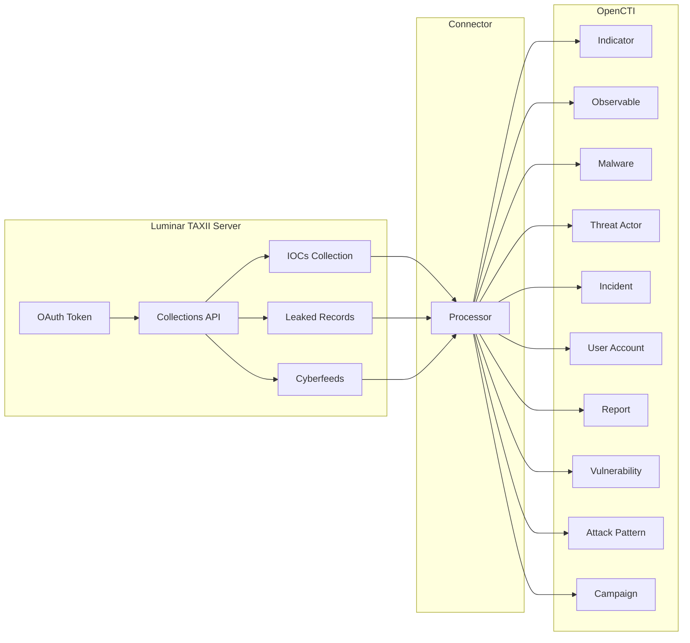

# OpenCTI Luminar CTI Connector

| Status | Date | Comment |
|--------|------|---------|
| Community | -    | -       |

The Luminar connector imports threat intelligence from Cognyte Luminar platform into OpenCTI, including IOCs, leaked credentials, and strategic cyber intelligence feeds.

## Table of Contents

- [Introduction](#introduction)
- [Installation](#installation)
  - [Requirements](#requirements)
- [Configuration variables](#configuration-variables)
  - [OpenCTI environment variables](#opencti-environment-variables)
  - [Base connector environment variables](#base-connector-environment-variables)
  - [Luminar CTI Connector extra parameters](#luminar-cti-connector-extra-parameters)
- [Deployment](#deployment)
  - [Docker Deployment](#docker-deployment)
  - [Manual Deployment](#manual-deployment)
- [Usage](#usage)
- [Behavior](#behavior)
  - [Data Flow](#data-flow)
  - [Entity Mapping](#entity-mapping)
  - [Processing Details](#processing-details)
  - [Relationships Created](#relationships-created)
- [Debugging](#debugging)
- [Additional Information](#additional-information)

---

## Introduction

Cognyte is a global leader in security analytics software that empowers governments and enterprises with Actionable Intelligence. Luminar is Cognyte's asset-based cybersecurity intelligence platform that enables organizations to build and maintain a proactive threat intelligence operation.

This connector integrates with the Luminar TAXII 2 server to import three distinct intelligence feeds:

| Feed Alias      | Description                                                         |
|-----------------|---------------------------------------------------------------------|
| `iocs`          | Indicators of Compromise (IPs, domains, URLs, file hashes)         |
| `leakedrecords` | Leaked credentials and compromise incidents                         |
| `cyberfeeds`    | Strategic intelligence (malware, threat actors, campaigns, reports)|

---

## Installation

### Requirements

| Requirement          | Description                                      |
|----------------------|--------------------------------------------------|
| OpenCTI Platform     | Version 6.7.4 or higher                         |
| Luminar Account      | Active Cognyte Luminar subscription             |
| API Credentials      | Client ID and Client Secret from Luminar        |

---

## Configuration variables

### OpenCTI environment variables

| Parameter     | config.yml | Docker Environment Variable | Mandatory | Description                          |
|---------------|------------|----------------------------|-----------|--------------------------------------|
| OpenCTI URL   | url        | `OPENCTI_URL`              | Yes       | URL of the OpenCTI platform         |
| OpenCTI Token | token      | `OPENCTI_TOKEN`            | Yes       | API token for the OpenCTI platform  |

### Base connector environment variables

| Parameter         | config.yml      | Docker Environment Variable | Default         | Mandatory | Description                                                |
|-------------------|-----------------|-----------------------------|-----------------|-----------|------------------------------------------------------------|
| Connector ID      | id              | `CONNECTOR_ID`              |                 | Yes       | Unique identifier (UUIDv4)                                |
| Connector Type    | type            | `CONNECTOR_TYPE`            | EXTERNAL_IMPORT | Yes       | Must be `EXTERNAL_IMPORT`                                  |
| Connector Name    | name            | `CONNECTOR_NAME`            |                 | Yes       | Name of the connector                                      |
| Connector Scope   | scope           | `CONNECTOR_SCOPE`           |                 | Yes       | Connector scope                                            |
| Log Level         | log_level       | `CONNECTOR_LOG_LEVEL`       | info            | No        | Log verbosity: `debug`, `info`, `warn`, `error`           |
| Duration Period   | duration_period | `CONNECTOR_DURATION_PERIOD` | PT1D            | No        | Interval between runs (ISO 8601 format)                   |

### Luminar CTI Connector extra parameters

| Parameter            | config.yml          | Docker Environment Variable  | Default                      | Mandatory | Description                                   |
|----------------------|---------------------|------------------------------|------------------------------|-----------|-----------------------------------------------|
| Luminar Base URL     | base_url            | `LUMINAR_BASE_URL`           | https://www.cyberluminar.com | Yes       | Luminar API base URL                         |
| Account ID           | account_id          | `LUMINAR_ACCOUNT_ID`         |                              | Yes       | Luminar Account ID                           |
| Client ID            | client_id           | `LUMINAR_CLIENT_ID`          |                              | Yes       | Luminar API Client ID                        |
| Client Secret        | client_secret       | `LUMINAR_CLIENT_SECRET`      |                              | Yes       | Luminar API Client Secret                    |
| Initial Fetch Date   | initial_fetch_date  | `LUMINAR_INITIAL_FETCH_DATE` |                              | Yes       | Start date for import (YYYY-MM-DD format)    |
| Create Observable    | create_observable   | `LUMINAR_CREATE_OBSERVABLE`  | True                         | No        | Create observables from indicators           |

---

## Deployment

### Docker Deployment

Build a Docker image using the provided Dockerfile:

```bash
docker build -t opencti/connector-luminar:latest .
```

Example `docker-compose.yml`:

```yaml
version: '3'
services:
  connector-luminar:
    image: opencti/connector-luminar:latest
    environment:
      - OPENCTI_URL=http://localhost:8080
      - OPENCTI_TOKEN=ChangeMe
      - CONNECTOR_ID=ChangeMe
      - CONNECTOR_NAME=Luminar
      - CONNECTOR_SCOPE=luminar
      - CONNECTOR_LOG_LEVEL=info
      - CONNECTOR_DURATION_PERIOD=P1D
      - LUMINAR_BASE_URL=https://www.cyberluminar.com
      - LUMINAR_ACCOUNT_ID=ChangeMe
      - LUMINAR_CLIENT_ID=ChangeMe
      - LUMINAR_CLIENT_SECRET=ChangeMe
      - LUMINAR_INITIAL_FETCH_DATE=2024-01-01
      - LUMINAR_CREATE_OBSERVABLE=true
    restart: always
```

Start the connector:

```bash
docker compose up -d
```

### Manual Deployment

1. Navigate to the connector directory:

```bash
cd external-import/luminar/src
```

2. Install dependencies:

```bash
pip3 install -r requirements.txt
```

3. Create a `config.yml` from `config.yml.sample` and configure variables
4. Run the connector:

```bash
python3 main.py
```

---

## Usage

After installation, the connector runs automatically at the interval specified by `CONNECTOR_DURATION_PERIOD`. To force an immediate sync:

1. Navigate to **Data management → Ingestion → Connectors** in OpenCTI
2. Find the **Luminar** connector
3. Click the refresh button to reset state and trigger a new poll

---

## Behavior

### Data Flow



### Entity Mapping

#### IOC Collection

| Luminar Data         | OpenCTI Entity Type | Notes                                    |
|----------------------|--------------------|------------------------------------------|
| Malware              | Malware            | Malware family with threat score         |
| Threat Actor         | Threat Actor       | Threat group information                 |
| IP Indicator         | Indicator + IPv4   | IP address IOC with observable           |
| Domain Indicator     | Indicator + Domain | Domain IOC with observable               |
| URL Indicator        | Indicator + URL    | URL IOC with observable                  |
| File Hash Indicator  | Indicator + File   | Hash IOC (MD5, SHA-1, SHA-256)          |
| Email Indicator      | Indicator + Email  | Email address IOC                        |

#### Leaked Records Collection

| Luminar Data         | OpenCTI Entity Type | Notes                                    |
|----------------------|--------------------|------------------------------------------|
| Incident             | Incident           | Compromise incident (severity: high)     |
| Malware              | Malware            | Related malware family                   |
| User Account         | User Account       | Compromised credentials                  |

#### Cyberfeeds Collection

| Luminar Data         | OpenCTI Entity Type | Notes                                    |
|----------------------|--------------------|------------------------------------------|
| Report               | Report             | Intelligence report with object refs     |
| Malware              | Malware            | Malware family details                   |
| Threat Actor         | Threat Actor       | Threat group profile                     |
| Campaign             | Campaign           | Attack campaign                          |
| Vulnerability        | Vulnerability      | CVE information                          |
| Attack Pattern       | Attack Pattern     | MITRE ATT&CK technique                   |
| Tool                 | Tool               | Attacker tool                            |
| Location             | Location           | Geographic targeting                     |
| Identity             | Identity           | Targeted organization                    |

### Processing Details

1. **Authentication**:
   - OAuth 2.0 client credentials flow
   - Automatic token refresh on 401 errors

2. **Collection Fetching**:
   - Pagination support with `next` parameter
   - Retry logic for transient failures
   - Filters records by `created` date

3. **IOC Processing**:
   - Creates parent entity (Malware/Threat Actor)
   - Extracts indicators from relationships
   - Creates observables when `create_observable=true`
   - Parses STIX patterns for observable creation

4. **Leaked Records Processing**:
   - Creates Incident with source "Cognyte Luminar"
   - Links Malware and User Account entities
   - Preserves custom Luminar extensions (threat score, monitoring terms)

5. **Cyberfeeds Processing**:
   - Validates and normalizes relationship types
   - Creates Report SDOs with object references
   - Generates PyCTI-compatible IDs

### Relationships Created

| Source Entity     | Relationship Type | Target Entity    | Collection     |
|-------------------|------------------|------------------|----------------|
| Indicator         | indicates        | Malware          | iocs           |
| Indicator         | indicates        | Threat Actor     | iocs           |
| Indicator         | based-on         | Observable       | iocs           |
| Malware           | related-to       | Incident         | leakedrecords  |
| User Account      | related-to       | Incident         | leakedrecords  |
| Various           | various          | Various          | cyberfeeds     |

### State Management

| State Key   | Description                           |
|-------------|---------------------------------------|
| `last_run`  | Timestamp of last successful run      |

The connector uses `added_after` parameter to fetch only new records since `last_run`.

---

## Debugging

### Common Issues

| Issue                     | Solution                                                    |
|---------------------------|-------------------------------------------------------------|
| Authentication failed     | Verify Client ID, Client Secret, and Account ID            |
| No collections found      | Check API credentials have proper permissions               |
| Empty data                | Verify `LUMINAR_INITIAL_FETCH_DATE` is not in the future   |
| Token expired             | Connector handles automatic refresh; check credentials      |

### Logging

Enable detailed logging by setting `CONNECTOR_LOG_LEVEL=debug`.

### HTTP Status Codes

| Code | Meaning                                                      |
|------|--------------------------------------------------------------|
| 400  | Bad request - check query parameters                         |
| 401  | Unauthorized - credentials issue (triggers token refresh)    |
| 403  | Forbidden - insufficient permissions                         |
| 429  | Rate limited - reduce polling frequency                      |

---

## Additional Information

### About Cognyte Luminar

Luminar provides:
- Real-time IOC feeds from deep/dark web monitoring
- Leaked credential detection
- Strategic threat intelligence
- MITRE ATT&CK mapping

### Resources

- [Cognyte Website](https://www.cognyte.com/)
- [Luminar Platform](https://www.cyberluminar.com/)
- [OpenCTI Documentation](https://docs.opencti.io/)

### Scoring

The connector applies an `x_opencti_score` of:
- **90**: For "Known Malicious IPs" indicators
- **80**: For all other entities
- **100**: For compromised user accounts
