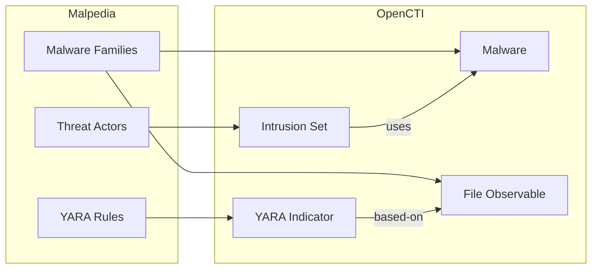

# OpenCTI Malpedia Connector

The Malpedia connector imports malware family information, threat actor associations, and YARA rules from Malpedia into OpenCTI.

| Status            | Date | Comment |
|-------------------|------|---------|
| Filigran Verified | -    | -       |

## Table of Contents

- [OpenCTI Malpedia Connector](#opencti-malpedia-connector)
  - [Table of Contents](#table-of-contents)
  - [Introduction](#introduction)
  - [Installation](#installation)
    - [Requirements](#requirements)
  - [Configuration variables](#configuration-variables)
    - [OpenCTI environment variables](#opencti-environment-variables)
    - [Base connector environment variables](#base-connector-environment-variables)
    - [Connector extra parameters environment variables](#connector-extra-parameters-environment-variables)
  - [Deployment](#deployment)
    - [Docker Deployment](#docker-deployment)
    - [Manual Deployment](#manual-deployment)
  - [Usage](#usage)
  - [Behavior](#behavior)
  - [Debugging](#debugging)
  - [Additional information](#additional-information)

## Introduction

Malpedia is a free resource from Fraunhofer FKIE that provides comprehensive information on malware families, including descriptions, aliases, references, and YARA detection rules. The platform is curated by security researchers and provides high-quality malware intelligence.

This connector imports malware families, associated threat actors (intrusion sets), and YARA rules from Malpedia into OpenCTI.

## Installation

### Requirements

- OpenCTI Platform >= 6.x
- Malpedia API key (optional for public data, required for YARA rules)

## Configuration variables

There are a number of configuration options, which are set either in `docker-compose.yml` (for Docker) or in `config.yml` (for manual deployment).

### OpenCTI environment variables

| Parameter     | config.yml | Docker environment variable | Mandatory | Description                                          |
|---------------|------------|-----------------------------|-----------|------------------------------------------------------|
| OpenCTI URL   | url        | `OPENCTI_URL`               | Yes       | The URL of the OpenCTI platform.                     |
| OpenCTI Token | token      | `OPENCTI_TOKEN`             | Yes       | The default admin token set in the OpenCTI platform. |

### Base connector environment variables

| Parameter         | config.yml      | Docker environment variable   | Default                            | Mandatory | Description                                                                 |
|-------------------|-----------------|-------------------------------|------------------------------------|-----------|-----------------------------------------------------------------------------|
| Connector ID      | id              | `CONNECTOR_ID`                | 8a277536-ca52-4d87-9f8e-4f77e3e6512c | No     | A unique `UUIDv4` identifier for this connector instance.                   |
| Connector Name    | name            | `CONNECTOR_NAME`              | Malpedia                           | No        | Name of the connector.                                                      |
| Connector Scope   | scope           | `CONNECTOR_SCOPE`             | malpedia                           | No        | The scope or type of data the connector is importing.                       |
| Log Level         | log_level       | `CONNECTOR_LOG_LEVEL`         | info                               | No        | Determines the verbosity of the logs: `debug`, `info`, `warn`, or `error`.  |
| Duration Period   | duration_period | `CONNECTOR_DURATION_PERIOD`   | PT24H                              | No        | Time interval between connector runs in ISO 8601 format.                    |

### Connector extra parameters environment variables

| Parameter             | config.yml                     | Docker environment variable       | Default | Mandatory | Description                                                                 |
|-----------------------|--------------------------------|----------------------------------|---------|-----------|-----------------------------------------------------------------------------|
| Auth Key              | malpedia.auth_key              | `MALPEDIA_AUTH_KEY`               |         | No        | Malpedia API key (required for YARA rules).                                 |
| Import Intrusion Sets | malpedia.import_intrusion_sets | `MALPEDIA_IMPORT_INTRUSION_SETS`  | true    | No        | Import threat actor associations.                                           |
| Import YARA           | malpedia.import_yara           | `MALPEDIA_IMPORT_YARA`            | true    | No        | Import YARA detection rules (requires API key).                             |
| Create Indicators     | malpedia.create_indicators     | `MALPEDIA_CREATE_INDICATORS`      | true    | No        | Create indicators from YARA rules.                                          |
| Create Observables    | malpedia.create_observables    | `MALPEDIA_CREATE_OBSERVABLES`     | true    | No        | Create observables from sample hashes.                                      |
| Default Marking       | malpedia.default_marking       | `MALPEDIA_DEFAULT_MARKING`        |         | No        | Default TLP marking for imported data.                                      |
| Interval (deprecated) | malpedia.interval_sec          | `MALPEDIA_INTERVAL_SEC`           |         | No        | **[DEPRECATED]** Interval in seconds. Use `CONNECTOR_DURATION_PERIOD`.      |

## Deployment

### Docker Deployment

Build the Docker image:

```bash
docker build -t opencti/connector-malpedia:latest .
```

Configure the connector in `docker-compose.yml`:

```yaml
  connector-malpedia:
    image: opencti/connector-malpedia:latest
    environment:
      - OPENCTI_URL=http://localhost
      - OPENCTI_TOKEN=ChangeMe
      - CONNECTOR_ID=8a277536-ca52-4d87-9f8e-4f77e3e6512c
      - CONNECTOR_NAME=Malpedia
      - CONNECTOR_SCOPE=malpedia
      - CONNECTOR_LOG_LEVEL=info
      - CONNECTOR_DURATION_PERIOD=PT24H
      - MALPEDIA_AUTH_KEY=
      - MALPEDIA_IMPORT_INTRUSION_SETS=true
      - MALPEDIA_IMPORT_YARA=true
      - MALPEDIA_CREATE_INDICATORS=true
      - MALPEDIA_CREATE_OBSERVABLES=true
    restart: always
```

Start the connector:

```bash
docker compose up -d
```

### Manual Deployment

1. Create `config.yml` based on `config.yml.sample`.

2. Install dependencies:

```bash
pip3 install -r requirements.txt
```

3. Start the connector from the `src` directory:

```bash
python3 main.py
```

## Usage

The connector runs automatically at the interval defined by `CONNECTOR_DURATION_PERIOD`. Malpedia updates infrequently; daily polling (`PT24H`) is sufficient.

To force an immediate run:

**Data Management → Ingestion → Connectors**

Find the connector and click the refresh button to reset the state and trigger a new sync.

## Behavior

The connector fetches malware family data, threat actor associations, and YARA rules from Malpedia.

### Data Flow



### Entity Mapping

| Malpedia Data        | OpenCTI Entity      | Description                                      |
|----------------------|---------------------|--------------------------------------------------|
| Malware Family       | Malware             | Malware family with aliases and description      |
| Actor                | Intrusion Set       | Threat actor group                               |
| YARA Rule            | Indicator (YARA)    | YARA detection rule                              |
| Sample Hash          | File Observable     | SHA-256 hash of malware sample                   |
| References           | External References | Links to analysis reports                        |

### Relationships Created

- Intrusion Set → `uses` → Malware
- YARA Indicator → `indicates` → Malware
- YARA Indicator → `based-on` → File Observable

### Data Categories

1. **Malware Families**:
   - Name and aliases
   - Description
   - External references
   - Labels (categories)

2. **Intrusion Sets** (if `import_intrusion_sets=true`):
   - Threat actor names
   - Associations with malware families

3. **YARA Rules** (if `import_yara=true`, requires API key):
   - Detection rules for malware families
   - Imported as YARA pattern indicators

## Debugging

Enable verbose logging:

```env
CONNECTOR_LOG_LEVEL=debug
```

## Additional information

- **API Key**: Optional for basic data; required for YARA rules
- **Registration**: Request API key at [Malpedia](https://malpedia.caad.fkie.fraunhofer.de/)
- **Quality**: Malpedia is curated by researchers; data quality is high
- **Update Frequency**: Malpedia updates less frequently; daily polling is sufficient
- **Reference**: [Malpedia](https://malpedia.caad.fkie.fraunhofer.de/)
