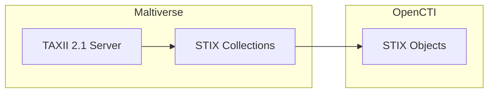

# OpenCTI Maltiverse Connector

| Status | Date | Comment |
|--------|------|---------|
| Community | -    | -       |

The Maltiverse connector imports threat intelligence data from the Maltiverse platform via TAXII 2.1 into OpenCTI.

## Table of Contents

- [OpenCTI Maltiverse Connector](#opencti-maltiverse-connector)
  - [Table of Contents](#table-of-contents)
  - [Introduction](#introduction)
  - [Installation](#installation)
    - [Requirements](#requirements)
  - [Configuration variables](#configuration-variables)
    - [OpenCTI environment variables](#opencti-environment-variables)
    - [Base connector environment variables](#base-connector-environment-variables)
    - [Connector extra parameters environment variables](#connector-extra-parameters-environment-variables)
  - [Deployment](#deployment)
    - [Docker Deployment](#docker-deployment)
    - [Manual Deployment](#manual-deployment)
  - [Usage](#usage)
  - [Behavior](#behavior)
  - [Debugging](#debugging)
  - [Additional information](#additional-information)

## Introduction

[Maltiverse](https://maltiverse.com) is a threat intelligence platform that aggregates and analyzes indicators of compromise from multiple sources. The platform provides access to curated threat feeds via a TAXII 2.1 server, making it compatible with STIX-based threat intelligence sharing.

This connector fetches STIX bundles from Maltiverse TAXII 2.1 collections and imports them directly into OpenCTI.

## Installation

### Requirements

- OpenCTI Platform >= 6.9.23
- Maltiverse account with feed access
- TAXII 2.1 client library (`taxii2client`)

## Configuration variables

There are a number of configuration options, which are set either in `docker-compose.yml` (for Docker) or in `config.yml` (for manual deployment).

### OpenCTI environment variables

| Parameter     | config.yml | Docker environment variable | Mandatory | Description                                          |
|---------------|------------|-----------------------------|-----------|------------------------------------------------------|
| OpenCTI URL   | url        | `OPENCTI_URL`               | Yes       | The URL of the OpenCTI platform.                     |
| OpenCTI Token | token      | `OPENCTI_TOKEN`             | Yes       | The default admin token set in the OpenCTI platform. |

### Base connector environment variables

| Parameter        | config.yml | Docker environment variable | Default    | Mandatory | Description                                                              |
|------------------|------------|-----------------------------|------------|-----------|--------------------------------------------------------------------------|
| Connector ID     | id         | `CONNECTOR_ID`              |            | Yes       | A unique `UUIDv4` identifier for this connector instance.                |
| Connector Name   | name       | `CONNECTOR_NAME`            | MALTIVERSE | Yes       | Name of the connector.                                                   |
| Connector Scope  | scope      | `CONNECTOR_SCOPE`           |            | Yes       | The scope or type of data the connector is importing (see below).        |
| Log Level        | log_level  | `CONNECTOR_LOG_LEVEL`       | info       | No        | Determines the verbosity of logs: `debug`, `info`, `warn`, or `error`.   |

**Recommended Scope**: `ipv4-addr,ipv6-addr,vulnerability,domain,url,file-sha256,file-md5,file-sha1`

### Connector extra parameters environment variables

| Parameter     | config.yml           | Docker environment variable   | Default | Mandatory | Description                                                    |
|---------------|----------------------|-------------------------------|---------|-----------|----------------------------------------------------------------|
| User          | maltiverse.user      | `MALTIVERSE_USER`             |         | Yes       | Maltiverse account username/email.                             |
| Password      | maltiverse.passwd    | `MALTIVERSE_PASSWD`           |         | Yes       | Maltiverse account password.                                   |
| Feeds         | maltiverse.feeds     | `MALTIVERSE_FEEDS`            |         | Yes       | Comma-separated list of feed/collection IDs to fetch.          |
| Poll Interval | maltiverse.poll_interval | `MALTIVERSE_POLL_INTERVAL`|         | Yes       | Polling interval in hours between connector runs.              |

## Deployment

### Docker Deployment

Build the Docker image:

```bash
docker build -t opencti/connector-maltiverse:latest .
```

Configure the connector in `docker-compose.yml`:

```yaml
  connector-maltiverse:
    image: opencti/connector-maltiverse:latest
    environment:
      - OPENCTI_URL=http://localhost
      - OPENCTI_TOKEN=ChangeMe
      - CONNECTOR_ID=ChangeMe
      - CONNECTOR_NAME=MALTIVERSE
      - CONNECTOR_SCOPE=ipv4-addr,ipv6-addr,vulnerability,domain,url,file-sha256,file-md5,file-sha1
      - CONNECTOR_LOG_LEVEL=info
      - MALTIVERSE_USER=your@email.com
      - MALTIVERSE_PASSWD=ChangeMe
      - MALTIVERSE_FEEDS=VdhZV34B4jHUXfKt_gDi,another_feed_id
      - MALTIVERSE_POLL_INTERVAL=4
    restart: always
```

Start the connector:

```bash
docker compose up -d
```

### Manual Deployment

1. Create `config.yml` based on `config.yml.sample`.

2. Install dependencies:

```bash
pip3 install -r requirements.txt
```

3. Start the connector from the `src` directory:

```bash
python3 main.py
```

## Usage

The connector runs automatically at the interval defined by `MALTIVERSE_POLL_INTERVAL`. To force an immediate run:

**Data Management → Ingestion → Connectors**

Find the connector and click the refresh button to reset the state and trigger a new data fetch.

## Behavior

The connector fetches STIX bundles from Maltiverse TAXII 2.1 collections and imports them into OpenCTI.

### Data Flow



### Entity Mapping

The connector imports native STIX objects from Maltiverse. Common entity types include:

| Maltiverse Data  | OpenCTI Entity      | Description                                      |
|------------------|---------------------|--------------------------------------------------|
| IPv4/IPv6        | IPv4-Addr/IPv6-Addr | IP address observables                           |
| Domain           | Domain-Name         | Domain name observables                          |
| URL              | URL                 | URL observables                                  |
| File Hashes      | File                | File observables with MD5, SHA-1, SHA-256        |
| Vulnerability    | Vulnerability       | CVE and vulnerability data                       |
| Indicators       | Indicator           | STIX pattern indicators                          |

### Processing Details

1. **TAXII 2.1 Connection**: Authenticates with Maltiverse TAXII server using username/password
2. **Collection Filtering**: Only fetches collections matching the configured feed IDs
3. **Native STIX Import**: STIX bundles are sent directly to OpenCTI without transformation
4. **State Management**: Tracks last run timestamp to avoid redundant polling

### TAXII Endpoint

The connector uses the Maltiverse TAXII 2.1 server:
- **Server URL**: `https://api.maltiverse.com/taxii2/`
- **Authentication**: Basic authentication (username/password)

## Debugging

Enable verbose logging:

```env
CONNECTOR_LOG_LEVEL=debug
```

Log output includes:
- Last run timestamp
- Collection processing status
- Error messages for failed collection imports
- Next run timing information

## Additional information

- **Feed IDs**: Obtain feed/collection IDs from your Maltiverse account dashboard
- **Multiple Feeds**: Separate multiple feed IDs with commas (no spaces)
- **TAXII 2.1**: Uses the `taxii2client` library for TAXII 2.1 protocol
- **Native STIX**: Data is provided in STIX format and imported directly
- **Reference**: [Maltiverse Platform](https://maltiverse.com) | [Maltiverse Documentation](https://maltiverse.com/docs)
