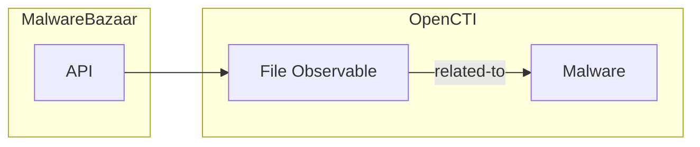

# OpenCTI MalwareBazaar Connector

| Status | Date | Comment |
|--------|------|---------|
| Community | -    | -       |

The MalwareBazaar connector imports malware samples and their hashes from abuse.ch MalwareBazaar into OpenCTI.

## Table of Contents

- [OpenCTI MalwareBazaar Connector](#opencti-malwarebazaar-connector)
  - [Table of Contents](#table-of-contents)
  - [Introduction](#introduction)
  - [Installation](#installation)
    - [Requirements](#requirements)
  - [Configuration variables](#configuration-variables)
    - [OpenCTI environment variables](#opencti-environment-variables)
    - [Base connector environment variables](#base-connector-environment-variables)
    - [Connector extra parameters environment variables](#connector-extra-parameters-environment-variables)
  - [Deployment](#deployment)
    - [Docker Deployment](#docker-deployment)
    - [Manual Deployment](#manual-deployment)
  - [Usage](#usage)
  - [Behavior](#behavior)
  - [Debugging](#debugging)
  - [Additional information](#additional-information)

## Introduction

MalwareBazaar is a project from abuse.ch with the goal of sharing malware samples with the infosec community, AV vendors, and threat intelligence providers. The platform collects malware samples submitted by security researchers and organizations.

This connector fetches recent malware sample metadata from MalwareBazaar API and imports them as File observables with associated hashes (MD5, SHA-1, SHA-256) into OpenCTI.

## Installation

### Requirements

- OpenCTI Platform >= 6.x
- MalwareBazaar API key (free registration at [MalwareBazaar](https://bazaar.abuse.ch/api/#auth_key))

## Configuration variables

There are a number of configuration options, which are set either in `docker-compose.yml` (for Docker) or in `config.yml` (for manual deployment).

### OpenCTI environment variables

| Parameter     | config.yml | Docker environment variable | Mandatory | Description                                          |
|---------------|------------|-----------------------------|-----------|------------------------------------------------------|
| OpenCTI URL   | url        | `OPENCTI_URL`               | Yes       | The URL of the OpenCTI platform.                     |
| OpenCTI Token | token      | `OPENCTI_TOKEN`             | Yes       | The default admin token set in the OpenCTI platform. |

### Base connector environment variables

| Parameter         | config.yml      | Docker environment variable   | Default         | Mandatory | Description                                                                 |
|-------------------|-----------------|-------------------------------|-----------------|-----------|-----------------------------------------------------------------------------|
| Connector ID      | id              | `CONNECTOR_ID`                |                 | Yes       | A unique `UUIDv4` identifier for this connector instance.                   |
| Connector Name    | name            | `CONNECTOR_NAME`              | MalwareBazaar   | No        | Name of the connector.                                                      |
| Connector Scope   | scope           | `CONNECTOR_SCOPE`             | StixFile        | No        | The scope or type of data the connector is importing.                       |
| Log Level         | log_level       | `CONNECTOR_LOG_LEVEL`         | info            | No        | Determines the verbosity of the logs: `debug`, `info`, `warn`, or `error`.  |
| Duration Period   | duration_period | `CONNECTOR_DURATION_PERIOD`   | PT50M           | No        | Time interval between connector runs in ISO 8601 format.                    |

### Connector extra parameters environment variables

| Parameter          | config.yml                    | Docker environment variable        | Default                             | Mandatory | Description                                                                 |
|--------------------|-------------------------------|-----------------------------------|-------------------------------------|-----------|-----------------------------------------------------------------------------|
| API Base URL       | malwarebazaar.api_base_url    | `MALWAREBAZAAR_API_BASE_URL`       | https://mb-api.abuse.ch/api/v1/     | No        | MalwareBazaar API endpoint.                                                 |
| API Key            | malwarebazaar.api_key         | `MALWAREBAZAAR_API_KEY`            |                                     | Yes       | Your MalwareBazaar API key.                                                 |
| TLP Level          | malwarebazaar.tlp_level       | `MALWAREBAZAAR_TLP_LEVEL`          | clear                               | No        | TLP marking for imported data.                                              |
| Score              | malwarebazaar.x_opencti_score | `MALWAREBAZAAR_X_OPENCTI_SCORE`    | 100                                 | No        | x_opencti_score for imported observables.                                   |
| Include Tags       | malwarebazaar.include_tags    | `MALWAREBAZAAR_INCLUDE_TAGS`       | exe,dll,docm,docx,doc,xls,xlsx,xlsm,js | No     | Comma-separated file tags to include (e.g., `exe,dll`).                     |
| Include Reporters  | malwarebazaar.include_reporters | `MALWAREBAZAAR_INCLUDE_REPORTERS` |                                     | No        | Comma-separated reporter names to filter by.                                |
| Labels             | malwarebazaar.labels          | `MALWAREBAZAAR_LABELS`             | malware-bazaar                      | No        | Labels to apply to imported observables.                                    |

## Deployment

### Docker Deployment

Build the Docker image:

```bash
docker build -t opencti/connector-malwarebazaar:latest .
```

Configure the connector in `docker-compose.yml`:

```yaml
  connector-malwarebazaar:
    image: opencti/connector-malwarebazaar:latest
    environment:
      - OPENCTI_URL=http://localhost
      - OPENCTI_TOKEN=ChangeMe
      - CONNECTOR_ID=ChangeMe
      - CONNECTOR_NAME=MalwareBazaar
      - CONNECTOR_SCOPE=StixFile
      - CONNECTOR_LOG_LEVEL=info
      - CONNECTOR_DURATION_PERIOD=PT50M
      - MALWAREBAZAAR_API_BASE_URL=https://mb-api.abuse.ch/api/v1/
      - MALWAREBAZAAR_API_KEY=ChangeMe
      - MALWAREBAZAAR_TLP_LEVEL=clear
      - MALWAREBAZAAR_X_OPENCTI_SCORE=100
      - MALWAREBAZAAR_INCLUDE_TAGS=exe,dll,docm,docx,doc,xls,xlsx,xlsm,js
      - MALWAREBAZAAR_INCLUDE_REPORTERS=
      - MALWAREBAZAAR_LABELS=malware-bazaar
    restart: always
```

Start the connector:

```bash
docker compose up -d
```

### Manual Deployment

1. Create `config.yml` based on `config.yml.sample`.

2. Install dependencies:

```bash
pip3 install -r requirements.txt
```

3. Start the connector from the `src` directory:

```bash
python3 main.py
```

## Usage

The connector runs automatically at the interval defined by `CONNECTOR_DURATION_PERIOD`. To force an immediate run:

**Data Management → Ingestion → Connectors**

Find the connector and click the refresh button to reset the state and trigger a new sync.

## Behavior

The connector queries the MalwareBazaar API for recent samples and imports them as File observables.

### Data Flow



### Entity Mapping

| MalwareBazaar Data   | OpenCTI Entity/Property | Description                                      |
|----------------------|-------------------------|--------------------------------------------------|
| sha256_hash          | File.hashes.SHA-256     | SHA-256 hash                                     |
| sha1_hash            | File.hashes.SHA-1       | SHA-1 hash                                       |
| md5_hash             | File.hashes.MD5         | MD5 hash                                         |
| file_name            | File.name               | Original filename                                |
| file_size            | File.size               | File size in bytes                               |
| file_type            | File.mime_type          | MIME type                                        |
| signature            | Malware                 | Detected malware family                          |
| tags                 | Labels                  | MalwareBazaar tags                               |
| reporter             | Description             | Sample submitter                                 |

### Processing Details

1. **File Observable**: Created with:
   - Multiple hashes (MD5, SHA-1, SHA-256)
   - `x_opencti_score`: Default 100 (high confidence)
   - Labels from configuration
   - TLP marking

2. **Malware Relationship**: If signature is available, creates relationship to malware family

### Filtering Options

- **By Tags**: Filter samples by file type tags (exe, dll, doc, etc.)
- **By Reporter**: Filter samples by submitter name

## Debugging

Enable verbose logging:

```env
CONNECTOR_LOG_LEVEL=debug
```

## Additional information

- **API Key Required**: Free registration at [MalwareBazaar API](https://bazaar.abuse.ch/api/#auth_key)
- **High Confidence**: Default score of 100 reflects confirmed malware samples
- **Sample Volume**: MalwareBazaar receives many samples daily; use tag filtering to manage volume
- **Reference**: [MalwareBazaar](https://bazaar.abuse.ch/)
