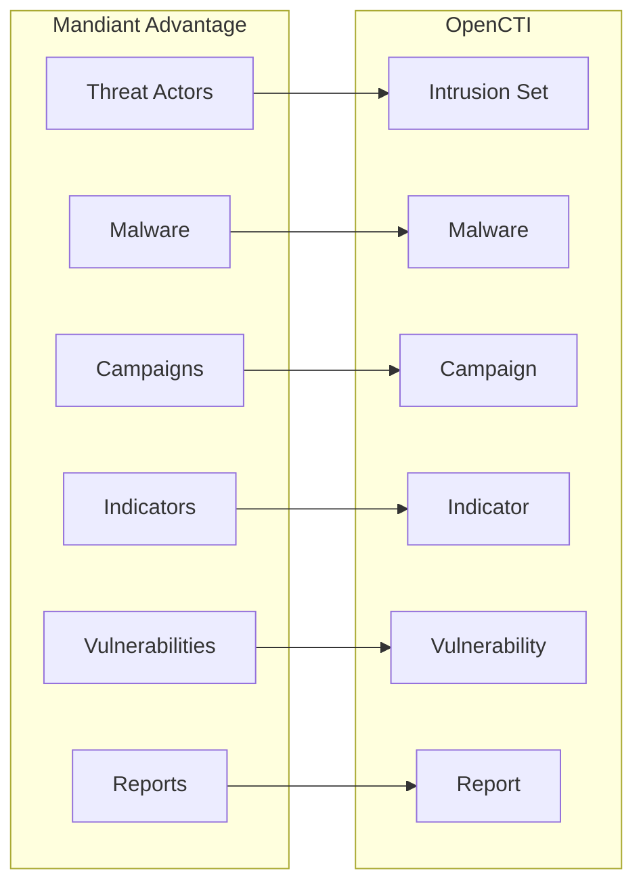

# OpenCTI Mandiant Connector

The Mandiant connector imports threat intelligence from Mandiant Advantage into OpenCTI.

| Status            | Date | Comment |
|-------------------|------|---------|
| Filigran Verified | -    | -       |

## Table of Contents

- [OpenCTI Mandiant Connector](#opencti-mandiant-connector)
  - [Table of Contents](#table-of-contents)
  - [Introduction](#introduction)
  - [Installation](#installation)
    - [Requirements](#requirements)
  - [Configuration variables](#configuration-variables)
    - [OpenCTI environment variables](#opencti-environment-variables)
    - [Base connector environment variables](#base-connector-environment-variables)
    - [Connector extra parameters environment variables](#connector-extra-parameters-environment-variables)
  - [Deployment](#deployment)
    - [Docker Deployment](#docker-deployment)
    - [Manual Deployment](#manual-deployment)
  - [Usage](#usage)
  - [Behavior](#behavior)
  - [Debugging](#debugging)
  - [Additional information](#additional-information)

## Introduction

Mandiant Advantage provides comprehensive threat intelligence based on Mandiant's frontline expertise in incident response and threat research. This connector imports threat actors, malware, campaigns, vulnerabilities, indicators, and detailed reports from Mandiant into OpenCTI.

## Installation

### Requirements

- OpenCTI Platform >= 6.x
- Mandiant Advantage account with API access
- Mandiant API v4 credentials (Key ID and Secret)

## Configuration variables

There are a number of configuration options, which are set either in `docker-compose.yml` (for Docker) or in `config.yml` (for manual deployment).

### OpenCTI environment variables

| Parameter     | config.yml | Docker environment variable | Mandatory | Description                                          |
|---------------|------------|-----------------------------|-----------|------------------------------------------------------|
| OpenCTI URL   | url        | `OPENCTI_URL`               | Yes       | The URL of the OpenCTI platform.                     |
| OpenCTI Token | token      | `OPENCTI_TOKEN`             | Yes       | The default admin token set in the OpenCTI platform. |

### Base connector environment variables

| Parameter         | config.yml      | Docker environment variable   | Default   | Mandatory | Description                                                                 |
|-------------------|-----------------|-------------------------------|-----------|-----------|-----------------------------------------------------------------------------|
| Connector ID      | id              | `CONNECTOR_ID`                |           | Yes       | A unique `UUIDv4` identifier for this connector instance.                   |
| Connector Name    | name            | `CONNECTOR_NAME`              | Mandiant  | No        | Name of the connector.                                                      |
| Connector Scope   | scope           | `CONNECTOR_SCOPE`             | mandiant  | No        | The scope or type of data the connector is importing.                       |
| Log Level         | log_level       | `CONNECTOR_LOG_LEVEL`         | error     | No        | Determines the verbosity of the logs: `debug`, `info`, `warn`, or `error`.  |
| Duration Period   | duration_period | `CONNECTOR_DURATION_PERIOD`   | PT5M      | No        | Time interval between connector runs in ISO 8601 format.                    |

### Connector extra parameters environment variables

| Parameter                              | config.yml                                      | Docker environment variable                               | Default                    | Mandatory | Description                                                                 |
|----------------------------------------|-------------------------------------------------|-----------------------------------------------------------|----------------------------|-----------|-----------------------------------------------------------------------------|
| API v4 Key ID                          | mandiant.api_v4_key_id                          | `MANDIANT_API_V4_KEY_ID`                                  |                            | Yes       | Mandiant API v4 Key ID.                                                     |
| API v4 Key Secret                      | mandiant.api_v4_key_secret                      | `MANDIANT_API_V4_KEY_SECRET`                              |                            | Yes       | Mandiant API v4 Key Secret.                                                 |
| Marking                                | mandiant.marking                                | `MANDIANT_MARKING`                                        | amber+strict               | No        | Default TLP marking.                                                        |
| Remove Statement Marking               | mandiant.remove_statement_marking               | `MANDIANT_REMOVE_STATEMENT_MARKING`                       | false                      | No        | Remove statement markings from objects.                                     |
| Create Notes                           | mandiant.create_notes                           | `MANDIANT_CREATE_NOTES`                                   | false                      | No        | Create notes from Mandiant data.                                            |
| Import Start Date                      | mandiant.import_start_date                      | `MANDIANT_IMPORT_START_DATE`                              | 30 days ago                | No        | Start date for importing data.                                              |
| Import Period                          | mandiant.import_period                          | `MANDIANT_IMPORT_PERIOD`                                  | 1                          | No        | Days to import per cycle.                                                   |
| **Indicators**                         |                                                 |                                                           |                            |           |                                                                             |
| Import Indicators                      | mandiant.import_indicators                      | `MANDIANT_IMPORT_INDICATORS`                              | true                       | No        | Import indicators.                                                          |
| Indicator Import Start Date            | mandiant.indicator_import_start_date            | `MANDIANT_INDICATOR_IMPORT_START_DATE`                    | 30 days ago                | No        | Start date for indicator import.                                            |
| Indicator Minimum Score                | mandiant.indicator_minimum_score                | `MANDIANT_INDICATOR_MINIMUM_SCORE`                        | 80                         | No        | Minimum score for indicator import.                                         |
| Import Indicators Interval             | mandiant.import_indicators_interval             | `MANDIANT_IMPORT_INDICATORS_INTERVAL`                     | 1                          | No        | Days between indicator imports.                                             |
| Import Indicators with Full Campaigns  | mandiant.import_indicators_with_full_campaigns  | `MANDIANT_IMPORT_INDICATORS_WITH_FULL_CAMPAIGNS`          | false                      | No        | Include full campaign data with indicators.                                 |
| **Actors**                             |                                                 |                                                           |                            |           |                                                                             |
| Import Actors                          | mandiant.import_actors                          | `MANDIANT_IMPORT_ACTORS`                                  | true                       | No        | Import threat actors.                                                       |
| Import Actors Interval                 | mandiant.import_actors_interval                 | `MANDIANT_IMPORT_ACTORS_INTERVAL`                         | 1                          | No        | Days between actor imports.                                                 |
| Import Actors Aliases                  | mandiant.import_actors_aliases                  | `MANDIANT_IMPORT_ACTORS_ALIASES`                          | false                      | No        | Include actor aliases.                                                      |
| **Malwares**                           |                                                 |                                                           |                            |           |                                                                             |
| Import Malwares                        | mandiant.import_malwares                        | `MANDIANT_IMPORT_MALWARES`                                | true                       | No        | Import malware families.                                                    |
| Import Malwares Interval               | mandiant.import_malwares_interval               | `MANDIANT_IMPORT_MALWARES_INTERVAL`                       | 1                          | No        | Days between malware imports.                                               |
| Import Malwares Aliases                | mandiant.import_malwares_aliases                | `MANDIANT_IMPORT_MALWARES_ALIASES`                        | false                      | No        | Include malware aliases.                                                    |
| **Campaigns**                          |                                                 |                                                           |                            |           |                                                                             |
| Import Campaigns                       | mandiant.import_campaigns                       | `MANDIANT_IMPORT_CAMPAIGNS`                               | true                       | No        | Import campaigns.                                                           |
| Import Campaigns Interval              | mandiant.import_campaigns_interval              | `MANDIANT_IMPORT_CAMPAIGNS_INTERVAL`                      | 1                          | No        | Days between campaign imports.                                              |
| **Vulnerabilities**                    |                                                 |                                                           |                            |           |                                                                             |
| Import Vulnerabilities                 | mandiant.import_vulnerabilities                 | `MANDIANT_IMPORT_VULNERABILITIES`                         | false                      | No        | Import vulnerabilities.                                                     |
| Import Vulnerabilities Interval        | mandiant.import_vulnerabilities_interval        | `MANDIANT_IMPORT_VULNERABILITIES_INTERVAL`                | 1                          | No        | Days between vulnerability imports.                                         |
| Import Software CPE                    | mandiant.vulnerability_import_software_cpe      | `MANDIANT_VULNERABILITY_IMPORT_SOFTWARE_CPE`              | true                       | No        | Import CPE data for vulnerabilities.                                        |
| Max CPE Relationships                  | mandiant.vulnerability_max_cpe_relationship     | `MANDIANT_VULNERABILITY_MAX_CPE_RELATIONSHIP`             | 200                        | No        | Maximum CPE relationships per vulnerability.                                |
| **Reports**                            |                                                 |                                                           |                            |           |                                                                             |
| Import Reports                         | mandiant.import_reports                         | `MANDIANT_IMPORT_REPORTS`                                 | true                       | No        | Import reports.                                                             |
| Import Reports Interval                | mandiant.import_reports_interval                | `MANDIANT_IMPORT_REPORTS_INTERVAL`                        | 1                          | No        | Days between report imports.                                                |
| Guess Relationships Reports            | mandiant.guess_relationships_reports            | `MANDIANT_GUESS_RELATIONSHIPS_REPORTS`                    |                            | No        | Report types for relationship inference.                                    |
| **Report Types**                       |                                                 |                                                           |                            |           |                                                                             |
| Actor Profile Report                   | mandiant.actor_profile_report                   | `MANDIANT_ACTOR_PROFILE_REPORT`                           | true                       | No        | Import actor profile reports.                                               |
| Actor Profile Report Type              | mandiant.actor_profile_report_type              | `MANDIANT_ACTOR_PROFILE_REPORT_TYPE`                      | actor-profile              | No        | Report type for actor profiles.                                             |
| Country Profile Report                 | mandiant.country_profile_report                 | `MANDIANT_COUNTRY_PROFILE_REPORT`                         | true                       | No        | Import country profile reports.                                             |
| Country Profile Report Type            | mandiant.country_profile_report_type            | `MANDIANT_COUNTRY_PROFILE_REPORT_TYPE`                    | country-profile            | No        | Report type for country profiles.                                           |
| Event Coverage Report                  | mandiant.event_coverage_implication_report      | `MANDIANT_EVENT_COVERAGE_IMPLICATION_REPORT`              | true                       | No        | Import event coverage reports.                                              |
| Event Coverage Report Type             | mandiant.event_coverage_implication_report_type | `MANDIANT_EVENT_COVERAGE_IMPLICATION_REPORT_TYPE`         | event-coverage             | No        | Report type for event coverage.                                             |
| Executive Perspective Report           | mandiant.executive_perspective_report           | `MANDIANT_EXECUTIVE_PERSPECTIVE_REPORT`                   | true                       | No        | Import executive perspective reports.                                       |
| Executive Perspective Report Type      | mandiant.executive_perspective_report_type      | `MANDIANT_EXECUTIVE_PERSPECTIVE_REPORT_TYPE`              | executive-perspective      | No        | Report type for executive perspectives.                                     |
| ICS Security Roundup Report            | mandiant.ics_security_roundup_report            | `MANDIANT_ICS_SECURITY_ROUNDUP_REPORT`                    | true                       | No        | Import ICS security reports.                                                |
| ICS Security Roundup Report Type       | mandiant.ics_security_roundup_report_type       | `MANDIANT_ICS_SECURITY_ROUNDUP_REPORT_TYPE`               | ics-security-roundup       | No        | Report type for ICS security.                                               |
| Industry Report                        | mandiant.industry_reporting_report              | `MANDIANT_INDUSTRY_REPORTING_REPORT`                      | true                       | No        | Import industry reports.                                                    |
| Industry Report Type                   | mandiant.industry_reporting_report_type         | `MANDIANT_INDUSTRY_REPORTING_REPORT_TYPE`                 | industry                   | No        | Report type for industry.                                                   |
| Malware Profile Report                 | mandiant.malware_profile_report                 | `MANDIANT_MALWARE_PROFILE_REPORT`                         | true                       | No        | Import malware profile reports.                                             |
| Malware Profile Report Type            | mandiant.malware_profile_report_type            | `MANDIANT_MALWARE_PROFILE_REPORT_TYPE`                    | malware-profile            | No        | Report type for malware profiles.                                           |
| Network Activity Report                | mandiant.network_activity_report                | `MANDIANT_NETWORK_ACTIVITY_REPORT`                        | true                       | No        | Import network activity reports.                                            |
| Network Activity Report Type           | mandiant.network_activity_report_type           | `MANDIANT_NETWORK_ACTIVITY_REPORT_TYPE`                   | network-activity           | No        | Report type for network activity.                                           |
| Patch Report                           | mandiant.patch_report                           | `MANDIANT_PATCH_REPORT`                                   | true                       | No        | Import patch reports.                                                       |
| Patch Report Type                      | mandiant.patch_report_type                      | `MANDIANT_PATCH_REPORT_TYPE`                              | patch                      | No        | Report type for patches.                                                    |
| TTP Deep Dive Report                   | mandiant.ttp_deep_dive_report                   | `MANDIANT_TTP_DEEP_DIVE_REPORT`                           | true                       | No        | Import TTP deep dive reports.                                               |
| TTP Deep Dive Report Type              | mandiant.ttp_deep_dive_report_type              | `MANDIANT_TTP_DEEP_DIVE_REPORT_TYPE`                      | ttp-deep-dive              | No        | Report type for TTP deep dives.                                             |
| Threat Activity Alert Report           | mandiant.threat_activity_alert_report           | `MANDIANT_THREAT_ACTIVITY_ALERT_REPORT`                   | true                       | No        | Import threat activity alert reports.                                       |
| Threat Activity Alert Report Type      | mandiant.threat_activity_alert_report_type      | `MANDIANT_THREAT_ACTIVITY_ALERT_REPORT_TYPE`              | threat-alert               | No        | Report type for threat activity alerts.                                     |
| Threat Activity Report                 | mandiant.threat_activity_report                 | `MANDIANT_THREAT_ACTIVITY_REPORT`                         | true                       | No        | Import threat activity reports.                                             |
| Threat Activity Report Type            | mandiant.threat_activity_report_type            | `MANDIANT_THREAT_ACTIVITY_REPORT_TYPE`                    | threat-activity            | No        | Report type for threat activity.                                            |
| Trends and Forecasting Report          | mandiant.trends_and_forecasting_report          | `MANDIANT_TRENDS_AND_FORECASTING_REPORT`                  | true                       | No        | Import trends and forecasting reports.                                      |
| Trends and Forecasting Report Type     | mandiant.trends_and_forecasting_report_type     | `MANDIANT_TRENDS_AND_FORECASTING_REPORT_TYPE`             | trends-forecasting         | No        | Report type for trends.                                                     |
| Vulnerability Report                   | mandiant.vulnerability_report                   | `MANDIANT_VULNERABILITY_REPORT`                           | true                       | No        | Import vulnerability reports.                                               |
| Vulnerability Report Type              | mandiant.vulnerability_report_type              | `MANDIANT_VULNERABILITY_REPORT_TYPE`                      | vulnerability              | No        | Report type for vulnerabilities.                                            |
| Weekly Vulnerability Exploitation Report | mandiant.weekly_vulnerability_exploitation_report | `MANDIANT_WEEKLY_VULNERABILITY_EXPLOITATION_REPORT`    | true                       | No        | Import weekly vulnerability exploitation reports.                           |
| Weekly Vulnerability Exploitation Type | mandiant.weekly_vulnerability_exploitation_type | `MANDIANT_WEEKLY_VULNERABILITY_EXPLOITATION_REPORT_TYPE`  | vulnerability-exploitation | No        | Report type for weekly vulnerability exploitation.                          |
| News Analysis Report                   | mandiant.news_analysis_report                   | `MANDIANT_NEWS_ANALYSIS_REPORT`                           | true                       | No        | Import news analysis reports.                                               |
| News Analysis Report Type              | mandiant.news_analysis_report_type              | `MANDIANT_NEWS_ANALYSIS_REPORT_TYPE`                      | news-analysis              | No        | Report type for news analysis.                                              |

## Deployment

### Docker Deployment

Build the Docker image:

```bash
docker build -t opencti/connector-mandiant:latest .
```

Configure the connector in `docker-compose.yml`:

```yaml
  connector-mandiant:
    image: opencti/connector-mandiant:latest
    environment:
      - OPENCTI_URL=http://localhost
      - OPENCTI_TOKEN=ChangeMe
      - MANDIANT_API_V4_KEY_ID=ChangeMe
      - MANDIANT_API_V4_KEY_SECRET=ChangeMe
      - MANDIANT_MARKING=amber+strict
      - MANDIANT_IMPORT_ACTORS=True
      - MANDIANT_IMPORT_MALWARES=True
      - MANDIANT_IMPORT_CAMPAIGNS=True
      - MANDIANT_IMPORT_INDICATORS=True
      - MANDIANT_IMPORT_REPORTS=True
    restart: always
```

Start the connector:

```bash
docker compose up -d
```

### Manual Deployment

1. Create `config.yml` based on `config.yml.sample`.

2. Install dependencies:

```bash
pip3 install -r requirements.txt
```

3. Start the connector:

```bash
python3 main.py
```

## Usage

The connector runs automatically at the interval defined by `CONNECTOR_DURATION_PERIOD`. To force an immediate run:

**Data Management → Ingestion → Connectors**

Find the connector and click the refresh button to reset the state and trigger a new sync.

## Behavior

The connector fetches threat intelligence from Mandiant's API and imports it as STIX 2.1 objects.

### Data Flow



### Entity Mapping

| Mandiant Data        | OpenCTI Entity      | Description                                      |
|----------------------|---------------------|--------------------------------------------------|
| Threat Actor         | Intrusion-Set       | Threat actor groups (APT/FIN/UNC)                |
| Malware Family       | Malware             | Malware families and tools                       |
| Campaign             | Campaign            | Attack campaigns                                 |
| Indicator            | Indicator           | IOCs with patterns                               |
| Vulnerability        | Vulnerability       | CVE data with Mandiant analysis                  |
| Report               | Report              | Intelligence reports of various types            |
| Attack Pattern       | Attack-Pattern      | MITRE ATT&CK techniques                          |
| Country              | Location            | Geographic locations                             |
| Industry             | Identity (Sector)   | Target sectors                                   |

### Report Types

| Report Type               | Description                                  |
|---------------------------|----------------------------------------------|
| Actor Profile             | Detailed threat actor analysis               |
| Country Profile           | Country-specific threat landscape            |
| Event Coverage            | Coverage of significant events               |
| Executive Perspective     | Strategic intelligence for executives        |
| ICS Security Roundup      | Industrial control systems security          |
| Industry                  | Sector-specific intelligence                 |
| Malware Profile           | Detailed malware analysis                    |
| Network Activity          | Network-based threat activity                |
| Patch                     | Patch and vulnerability management           |
| TTP Deep Dive             | In-depth technique analysis                  |
| Threat Alert              | Real-time threat alerts                      |
| Threat Activity           | Ongoing threat activity reports              |
| Trends and Forecasting    | Future threat predictions                    |
| Vulnerability             | Vulnerability analysis                       |
| Weekly Vulnerability      | Weekly vulnerability exploitation summary    |
| News Analysis             | Analysis of security news                    |

## Debugging

Enable verbose logging:

```env
CONNECTOR_LOG_LEVEL=debug
```

## Additional information

- **API v4**: Requires Mandiant API v4 credentials
- **Score Threshold**: Use `MANDIANT_INDICATOR_MINIMUM_SCORE` to filter low-confidence indicators
- **Aliases**: Enable alias import for comprehensive threat actor/malware coverage
- **Reference**: [Mandiant Advantage](https://www.mandiant.com/advantage)
