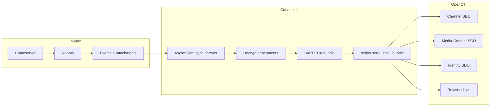

# OpenCTI Matrix Connector

| Status | Date | Comment |
|--------|------|---------|
| Community | -    | -       |

The Matrix connector listens to a Matrix server and forwards messages,
attachments, authors and thread relationships from every room the bot
account is a member of into OpenCTI.

Each Matrix room becomes a `channel` SDO; each event becomes a
`media-content` observable (with file attachments encoded as
`x_opencti_files`); message authors become `identity` SDOs
(class `individual`); and thread replies are emitted as `related-to`
relationships pointing to the root post.

End-to-end-encrypted rooms are supported through the
[`matrix-nio[e2e]`](https://pypi.org/project/matrix-nio/) library and
its `libolm` system dependency (which is compiled and shipped in the
Docker image).

## Table of Contents

- [OpenCTI Matrix Connector](#opencti-matrix-connector)
  - [Table of Contents](#table-of-contents)
  - [Introduction](#introduction)
  - [Installation](#installation)
    - [Requirements](#requirements)
  - [Configuration variables](#configuration-variables)
    - [OpenCTI environment variables](#opencti-environment-variables)
    - [Base connector environment variables](#base-connector-environment-variables)
    - [Matrix connector environment variables](#matrix-connector-environment-variables)
  - [Deployment](#deployment)
    - [Docker Deployment](#docker-deployment)
    - [Manual Deployment](#manual-deployment)
  - [Usage](#usage)
  - [Behavior](#behavior)
  - [Debugging](#debugging)
  - [Additional information](#additional-information)

## Introduction

The connector logs into a Matrix homeserver with a dedicated bot account,
joins (or stays in) the rooms the bot belongs to, and listens for new
events with `AsyncClient.sync_forever`. Every supported event is
translated into a STIX 2.1 bundle and pushed to OpenCTI in near real-time.

To use this connector you need:

* a Matrix bot account with read access to the rooms you want to import;
* the Matrix homeserver URL;
* a writable directory where the `matrix-nio` SQLite store (sync token,
  room state, device keys) can be persisted.

## Installation

### Requirements

- OpenCTI Platform >= 6.7.0 (matches the `pycti==7.260515.0` pin in
  `src/requirements.txt`; the `pycti` 7.x line targets the OpenCTI
  6.7+ API).
- `libolm` (compiled by the connector's Dockerfile; if running outside
  Docker you must install it from your distribution: `libolm-dev` on
  Debian/Ubuntu, `olm-devel` on Fedora, …).

## Configuration variables

There are a number of configuration options, which are set either in
`docker-compose.yml` (for Docker) or in `src/config.yml` (for manual
deployment). The provided `src/config.yml.sample` can be used as a
template.

### OpenCTI environment variables

| Parameter     | config.yml | Docker environment variable | Mandatory | Description                                          |
|---------------|------------|-----------------------------|-----------|------------------------------------------------------|
| OpenCTI URL   | url        | `OPENCTI_URL`               | Yes       | The URL of the OpenCTI platform.                     |
| OpenCTI Token | token      | `OPENCTI_TOKEN`             | Yes       | The default admin token set in the OpenCTI platform. |

### Base connector environment variables

| Parameter        | config.yml | Docker environment variable | Default              | Mandatory | Description                                                                                |
|------------------|------------|-----------------------------|----------------------|-----------|--------------------------------------------------------------------------------------------|
| Connector ID     | id         | `CONNECTOR_ID`              |                      | Yes       | A unique `UUIDv4` identifier for this connector instance.                                  |
| Connector Type   | type       | `CONNECTOR_TYPE`            | `EXTERNAL_IMPORT`    | Yes       | Must be `EXTERNAL_IMPORT`.                                                                 |
| Connector Name   | name       | `CONNECTOR_NAME`            | `Matrix`             | No        | Name of the connector as it appears in OpenCTI.                                            |
| Connector Scope  | scope      | `CONNECTOR_SCOPE`           | `matrix`             | No        | Connector scope (used by OpenCTI to dispatch work).                                        |
| Log Level        | log_level  | `CONNECTOR_LOG_LEVEL`       | `info`               | No        | Verbosity of the logs: `debug`, `info`, `warn`, or `error`.                                |

### Matrix connector environment variables

| Parameter        | config.yml          | Docker environment variable | Default                    | Mandatory | Description                                                                                                  |
|------------------|---------------------|-----------------------------|----------------------------|-----------|--------------------------------------------------------------------------------------------------------------|
| Server           | matrix.server       | `MATRIX_SERVER`             |                            | Yes       | Matrix homeserver URL, e.g. `https://matrix.example.org`.                                                    |
| User id          | matrix.user_id      | `MATRIX_USER_ID`            |                            | Yes       | Matrix user id of the bot account, e.g. `@octi-bot:matrix.example.org`.                                      |
| Password         | matrix.password     | `MATRIX_PASSWORD`           |                            | Yes       | Password of the bot account. Never echoed back to the logs.                                                  |
| Device name      | matrix.device_name  | `MATRIX_DEVICE_NAME`        | `octi_bot`                 | No        | Device label registered against the Matrix server when logging in.                                           |
| TLP marking      | matrix.tlp          | `MATRIX_TLP`                | `AMBER`                    | No        | Marking applied to created entities. One of `CLEAR`, `WHITE` (alias of `CLEAR`), `GREEN`, `AMBER`, `AMBER_STRICT` (also accepted as `AMBER+STRICT`, `AMBER STRICT`, `AMBER-STRICT`), `RED`. Case-insensitive.                |
| Store path       | matrix.store_path   | `MATRIX_STORE_PATH`         | `<src>/store`              | No        | Directory used by `matrix-nio` to persist its SQLite store (sync token, device keys).                        |
| Debug            | matrix.debug        | `MATRIX_DEBUG`              | `false`                    | No        | Enable very verbose logging from the HTTP/WebSocket layer. **Do not enable in production.**                  |

## Deployment

### Docker Deployment

Build the Docker image from this directory:

```bash
docker build -t opencti/connector-matrix:latest .
```

Two optional build arguments are available — pin them if you want a
fully reproducible build:

```bash
docker build \
  --build-arg PYTHON_VERSION=3.12 \
  --build-arg LIBOLM_VERSION=3.2.16 \
  -t opencti/connector-matrix:latest .
```

Configure the connector in `docker-compose.yml` and start it:

```bash
docker compose up -d
```

The provided compose file mounts a named volume on
`/opt/opencti-connector-matrix/store` so the bot does not re-download
history (and re-fetch device keys) on every restart.

### Manual Deployment

1. Install `libolm` on the host (for example on Debian/Ubuntu):

   ```bash
   sudo apt-get install -y libolm-dev
   ```

2. Create `src/config.yml` from `src/config.yml.sample` and fill in the
   OpenCTI and Matrix credentials.

3. Install the Python dependencies:

   ```bash
   pip3 install -r src/requirements.txt
   ```

4. Start the connector:

   ```bash
   python3 src/main.py
   ```

## Usage

Once running, the connector keeps a long-lived Matrix sync open: every
new message (or update / thread reply / file upload) is converted to a
STIX bundle and pushed to OpenCTI in near real-time. There is no
polling interval to configure.

To make the bot start ingesting a new room, invite the `MATRIX_USER_ID`
account into that room from any standard Matrix client (Element, …).

## Behavior



### Supported event types

| Matrix event class       | Outcome                                                                                |
|--------------------------|----------------------------------------------------------------------------------------|
| `RoomMessageText`        | `media-content` with the message body (and `[updated]` suffix for edits).              |
| `RoomMessageNotice`      | Same as text messages.                                                                 |
| `RoomMessageImage` / `RoomMessageFile` / `RoomMessageAudio` / `RoomMessageVideo` | `media-content` with the attachment encoded under `x_opencti_files`.  |
| `RoomEncryptedImage` / `RoomEncryptedFile` / `RoomEncryptedAudio` / `RoomEncryptedVideo` | Same as above, after decrypting the attachment with `matrix-nio`.     |
| `RoomMessageUnknown` / `UnknownEvent` | Logged at `debug` level and skipped.                                          |

### Marking enforcement

Every entity created by the connector carries the TLP marking configured
through `MATRIX_TLP`. The default is `AMBER`. Unknown values are
rejected at startup so that a misconfiguration cannot silently fall
back to `TLP_RED`.

## Debugging

Enable verbose connector logging by setting:

```env
CONNECTOR_LOG_LEVEL=debug
```

`MATRIX_DEBUG=true` additionally turns on `matrix-nio`'s very verbose
HTTP / WebSocket logging. **Do not enable `MATRIX_DEBUG` in production**
— it prints every request body, which can include sensitive content.

### Common issues

| Issue                                                | Solution                                                                                                              |
|------------------------------------------------------|-----------------------------------------------------------------------------------------------------------------------|
| `MATRIX_SERVER is required …`                        | Provide a non-empty Matrix homeserver URL (`https://…`).                                                              |
| `MATRIX_USER_ID is required …` / `MATRIX_PASSWORD …` | The bot needs both a fully-qualified Matrix id (`@bot:server`) and a password.                                        |
| `Unsupported MATRIX_TLP value …`                     | Use one of `CLEAR`, `WHITE`, `GREEN`, `AMBER`, `AMBER_STRICT` (or `AMBER+STRICT`), `RED` (case-insensitive).         |
| `Could not decrypt attachment for event …`           | The encrypted attachment is malformed or the bot lacks the room key (re-invite the bot or wait for keys to sync).     |

## Additional information

- **Channel deduplication**: each Matrix `room_id` is mapped to a
  Channel SDO whose `standard_id` is the deterministic
  `pycti.Channel.generate_id(room_id)` UUIDv5. The platform dedups
  on this id, so re-importing the same room (or running the connector
  multiple times) cannot create a duplicate Channel SDO. The Channel
  is also emitted into a bundle at most once per connector lifetime
  (an in-memory cache tracks the ids already sent), so a busy room
  does not republish the same Channel SDO with every event.
- **Author deduplication**: each Matrix sender is mapped to an
  Identity SDO whose `standard_id` is the deterministic
  `pycti.Identity.generate_id(sender, "individual")` UUIDv5. Same
  in-memory cache as for channels — emit-once-per-lifetime, dedup by
  `standard_id` on the platform side.
- **No per-event OpenCTI HTTP calls**: `_on_event` never makes a
  synchronous OpenCTI list / read call, so the asyncio loop driving
  `sync_forever` is not stalled on platform latency. Every flush of
  the buffered STIX objects runs in a thread executor.
- **Attachment encoding**: attachment payloads are base64-encoded as
  UTF-8 strings (not raw `bytes`) so STIX bundles serialise to valid
  JSON.
- **Edits**: an edit (`m.replace`) becomes its **own**
  `media-content` observable keyed by the edit's own Matrix event id,
  plus a `related-to` relationship back to the original post. This
  preserves the original message body in OpenCTI instead of
  overwriting it.
- **Timestamps**: all timestamps emitted by the connector are
  timezone-aware UTC values. The private
  `stix2.utils._TIMESTAMP_FORMAT_FRAC` constant is no longer referenced.
- **Credentials**: the bot password is never written to the logs, even
  at `debug` level.
