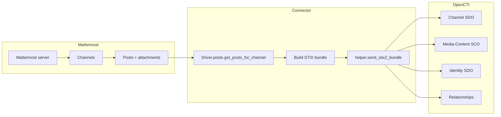

# OpenCTI Mattermost Connector

| Status | Date | Comment |
|--------|------|---------|
| Community | -    | -       |

The Mattermost connector imports messages, attachments, authors and
thread relationships from one or more Mattermost channels into OpenCTI.

Each Mattermost post is materialised as a `media-content` observable
linked to a `channel` SDO. Message authors are imported as
`identity` SDOs (class `individual`) and thread replies become
`related-to` relationships pointing to the root post.

## Table of Contents

- [OpenCTI Mattermost Connector](#opencti-mattermost-connector)
  - [Table of Contents](#table-of-contents)
  - [Introduction](#introduction)
  - [Installation](#installation)
    - [Requirements](#requirements)
  - [Configuration variables](#configuration-variables)
    - [OpenCTI environment variables](#opencti-environment-variables)
    - [Base connector environment variables](#base-connector-environment-variables)
    - [Mattermost connector environment variables](#mattermost-connector-environment-variables)
  - [Deployment](#deployment)
    - [Docker Deployment](#docker-deployment)
    - [Manual Deployment](#manual-deployment)
  - [Usage](#usage)
  - [Behavior](#behavior)
  - [Debugging](#debugging)
  - [Additional information](#additional-information)

## Introduction

The connector logs into a Mattermost instance with a personal access token,
periodically polls the configured channels for new posts and pushes the
result into OpenCTI as a STIX 2.1 bundle. Attachments are downloaded
through the Mattermost Files API and uploaded as `x_opencti_files` on the
matching `media-content` observable.

To use this connector you need:

* the Mattermost server hostname (no scheme, no port);
* the comma-separated list of channel ids to import;
* a personal-access-token belonging to a Mattermost account with **read**
  access to the configured channels.

## Installation

### Requirements

- OpenCTI Platform >= 6.4.3

## Configuration variables

There are a number of configuration options, which are set either in
`docker-compose.yml` (for Docker) or in `src/config.yml` (for manual
deployment). The provided `src/config.yml.sample` can be used as a
template.

### OpenCTI environment variables

| Parameter     | config.yml | Docker environment variable | Mandatory | Description                                          |
|---------------|------------|-----------------------------|-----------|------------------------------------------------------|
| OpenCTI URL   | url        | `OPENCTI_URL`               | Yes       | The URL of the OpenCTI platform.                     |
| OpenCTI Token | token      | `OPENCTI_TOKEN`             | Yes       | The default admin token set in the OpenCTI platform. |

### Base connector environment variables

| Parameter            | config.yml             | Docker environment variable      | Default              | Mandatory | Description                                                                                              |
|----------------------|------------------------|----------------------------------|----------------------|-----------|----------------------------------------------------------------------------------------------------------|
| Connector ID         | id                     | `CONNECTOR_ID`                   |                      | Yes       | A unique `UUIDv4` identifier for this connector instance.                                                |
| Connector Type       | type                   | `CONNECTOR_TYPE`                 | `EXTERNAL_IMPORT`    | Yes       | Must be `EXTERNAL_IMPORT`.                                                                               |
| Connector Name       | name                   | `CONNECTOR_NAME`                 | `Mattermost`         | No        | Name of the connector as it appears in OpenCTI.                                                          |
| Connector Scope      | scope                  | `CONNECTOR_SCOPE`                | `mattermost`         | No        | Connector scope (used by OpenCTI to dispatch work).                                                      |
| Log Level            | log_level              | `CONNECTOR_LOG_LEVEL`            | `info`               | No        | Verbosity of the logs: `debug`, `info`, `warn`, or `error`.                                              |
| Run Every            | run_every              | `CONNECTOR_RUN_EVERY`            |                      | Yes       | Polling interval in the form `<int><d\|h\|m\|s>` (e.g. `7d`, `12h`, `10m`, `30s`).                       |
| Update existing data | update_existing_data   | `CONNECTOR_UPDATE_EXISTING_DATA` | `false`              | No        | If `true`, allows updates of existing entities; otherwise the platform leaves them as-is.                |

### Mattermost connector environment variables

| Parameter         | config.yml               | Docker environment variable    | Default     | Mandatory | Description                                                                                                                                       |
|-------------------|--------------------------|--------------------------------|-------------|-----------|---------------------------------------------------------------------------------------------------------------------------------------------------|
| Domain            | mattermost.domain        | `MATTERMOST_DOMAIN`            |             | Yes       | Mattermost server hostname only (e.g. `mattermost.example.org`). Do not include the scheme or port.                                               |
| Port              | mattermost.port          | `MATTERMOST_PORT`              | `8065`      | No        | TCP port of the Mattermost API.                                                                                                                   |
| Protocol          | mattermost.protocol      | `MATTERMOST_PROTOCOL`          | `https`     | No        | `http` or `https`.                                                                                                                                |
| Base path         | mattermost.basepath      | `MATTERMOST_BASEPATH`          | `/api/v4`   | No        | API base path on the Mattermost server.                                                                                                           |
| Access token      | mattermost.token         | `MATTERMOST_TOKEN`             |             | Yes       | Personal-access-token of a Mattermost account allowed to read the configured channels.                                                            |
| Channel ids       | mattermost.channel_ids   | `MATTERMOST_CHANNEL_IDS`       |             | Yes       | Comma-separated list of channel ids to import (e.g. `5i5rip6zaf8qprwfi86iu9xsjy,ztu3g3f4upgjxezhsuqe5imzpr`).                                     |
| Start timestamp   | mattermost.start_timestamp | `MATTERMOST_START_TIMESTAMP` | `0`         | No        | Unix epoch (seconds) of the earliest message to import on the first run. Subsequent runs only fetch messages newer than the last successful run. |
| TLP marking       | mattermost.tlp           | `MATTERMOST_TLP`               | `AMBER`     | No        | Marking applied to created entities. One of `CLEAR`, `GREEN`, `AMBER`, `AMBER_STRICT`, `RED`.                                                     |
| Verify TLS        | mattermost.verify        | `MATTERMOST_VERIFY`            | `true`      | No        | Whether the Mattermost server TLS certificate must be verified.                                                                                   |
| Timeout           | mattermost.timeout       | `MATTERMOST_TIMEOUT`           | `30`        | No        | Web-socket keepalive timeout in seconds.                                                                                                          |
| Request timeout   | mattermost.request_timeout | `MATTERMOST_REQUEST_TIMEOUT` |             | No        | Optional per-request HTTP timeout in seconds.                                                                                                     |
| Keepalive         | mattermost.keepalive     | `MATTERMOST_KEEPALIVE`         | `false`     | No        | Re-open the web-socket connection when it drops.                                                                                                  |
| Keepalive delay   | mattermost.keepalive_delay | `MATTERMOST_KEEPALIVE_DELAY` | `5`         | No        | Seconds to wait before reconnecting the web-socket.                                                                                               |
| Debug             | mattermost.debug         | `MATTERMOST_DEBUG`             | `false`     | No        | Very verbose logging of every HTTP / web-socket call. **Should not be enabled in production** — it logs passwords and tokens.                     |

## Deployment

### Docker Deployment

Build the Docker image:

```bash
docker build -t opencti/connector-mattermost:latest .
```

Configure the connector in `docker-compose.yml` and start it:

```bash
docker compose up -d
```

### Manual Deployment

1. Create `src/config.yml` from `src/config.yml.sample` and fill in the
   OpenCTI and Mattermost credentials.

2. Install the Python dependencies:

   ```bash
   pip3 install -r src/requirements.txt
   ```

3. Start the connector:

   ```bash
   python3 src/main.py
   ```

## Usage

Once the connector is running, it polls each configured Mattermost channel
on the cadence set by `CONNECTOR_RUN_EVERY`. The first run imports every
post newer than `MATTERMOST_START_TIMESTAMP`; subsequent runs only import
the posts created after the previous successful run (stored as `last_run`
in the connector state).

You can force an immediate run from the OpenCTI UI:

**Data → Ingestion → Connectors → Mattermost → Refresh**

## Behavior



### Created entities

| Entity         | STIX type        | Description                                                                          |
|----------------|------------------|--------------------------------------------------------------------------------------|
| Channel        | `channel`        | One per imported Mattermost channel (deduplicated by name).                          |
| Media content  | `media-content`  | One per Mattermost post, with the post URL, message and timestamp.                   |
| Author         | `identity`       | One per Mattermost user (deduplicated by email).                                     |
| Relationship   | `relationship`   | `media-content related-to channel` and `media-content related-to <root media-content>` for thread replies. |

### Marking enforcement

Every entity created by the connector carries the TLP marking configured
through `MATTERMOST_TLP`. The default is `AMBER`. Unknown values are
rejected at startup so that an unexpected value does not silently fall
back to `TLP_RED`.

## Debugging

Enable verbose logging by setting:

```env
CONNECTOR_LOG_LEVEL=debug
```

Set `MATTERMOST_DEBUG=true` to also log every HTTP / web-socket call made
to Mattermost. **Do not enable `MATTERMOST_DEBUG` in production** — it
prints every request including authentication headers.

### Common issues

| Issue                                                       | Solution                                                                                                          |
|-------------------------------------------------------------|-------------------------------------------------------------------------------------------------------------------|
| `MATTERMOST_DOMAIN is required …`                           | The hostname is mandatory. Provide a value without scheme or port (the scheme goes in `MATTERMOST_PROTOCOL`).     |
| `MATTERMOST_CHANNEL_IDS must contain at least one channel id.` | Make sure the variable is set to a non-empty, comma-separated list of channel ids.                                |
| `Unsupported MATTERMOST_TLP value '<value>'.`               | Use one of `CLEAR`, `GREEN`, `AMBER`, `AMBER_STRICT`, `RED`.                                                       |
| `CONNECTOR_RUN_EVERY is required …`                         | Provide a value such as `7d`, `12h`, `10m`, `30s`.                                                                |

## Additional information

- **Channel deduplication**: the connector looks up channels by `name`
  before creating a new one, so re-importing the same channel does not
  duplicate the SDO.
- **Author deduplication**: identities are looked up by their email
  address before being created.
- **Attachment deduplication**: an attachment is uploaded only when the
  matching `media-content` observable does not already carry a file with
  the same `<id>_<name>` filename.
- **Timestamps**: all timestamps generated by the connector are
  timezone-aware UTC values; the previous reliance on the private
  `stix2.utils._TIMESTAMP_FORMAT_FRAC` constant is gone.
