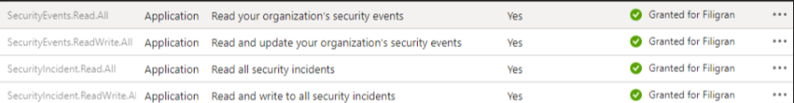

# OpenCTI Microsoft Defender Incidents Connector

| Status | Date | Comment |
|--------|------|---------|
| Filigran Verified | -    | -       |

## Table of Contents

- [OpenCTI Microsoft Defender Incidents Connector](#opencti-microsoft-defender-incidents-connector)
    - [Introduction](#introduction)
    - [Installation](#installation)
        - [Requirements](#requirements)
    - [Configuration variables](#configuration-variables)
    - [Deployment](#deployment)
        - [Docker Deployment](#docker-deployment)
        - [Manual Deployment](#manual-deployment)
    - [Usage](#usage)
    - [Behavior](#behavior)
    - [Debugging](#debugging)
    - [Additional information](#additional-information)

## Introduction

This OpenCTI connector allows to import indicators and observables from Microsoft Defender's incidents to your OpenCTI
platform.

## Installation

If you don't know how to get the `tenant_id`, `client_id`, and `client_secret` information, here's a screenshot to
help !


It's also important to define the necessary permissions in Defender for the connector to work.

In the Microsoft Entra portal, you need to set :  
Home > Application Registration > OpenCTI (your name) > API Permissions  
and enable the permissions named :

- "SecurityIncident.Read.All"
- "SecurityAlert.Read.All"
- "SecurityEvent.Read.All"



For more information, visit:

- [Microsoft Security-Authorization](https://learn.microsoft.com/en-us/graph/security-authorization)

Another interesting link:

- [Microsoft Defender-Threat-Intelligence](https://learn.microsoft.com/en-us/azure/architecture/example-scenario/data/defender-threat-intelligence#import-threat-indicators-with-the-platforms-data-connector)

### Requirements

- OpenCTI Platform >= 6.4

## Configuration variables

Find all the configuration variables available here: [Connector Configurations](./__metadata__/CONNECTOR_CONFIG_DOC.md)

_The `opencti` and `connector` options in the `docker-compose.yml` and `config.yml` are the same as for any other connector.
For more information regarding variables, please refer to [OpenCTI's documentation on connectors](https://docs.opencti.io/latest/deployment/connectors/)._


## Deployment

### Docker Deployment

Before building the Docker container, you need to set the version of pycti in `requirements.txt` equal to whatever
version of OpenCTI you're running. Example, `pycti==6.3.4`. If you don't, it will take the latest version, but
sometimes the OpenCTI SDK fails to initialize.

Build a Docker Image using the provided `Dockerfile`.

Example:

```shell
# Replace the IMAGE NAME with the appropriate value
docker build . -t [IMAGE NAME]:latest
```

Make sure to replace the environment variables in `docker-compose.yml` with the appropriate configurations for your
environment. Then, start the docker container with the provided docker-compose.yml

```shell
docker compose up -d
# -d for detached
```

### Manual Deployment

Create a file `config.yml` based on the provided `config.yml.sample`.

Replace the configuration variables (especially the "**ChangeMe**" variables) with the appropriate configurations for
you environment.

Install the required python dependencies (preferably in a virtual environment):

```shell
pip3 install -r requirements.txt
```

Then, start the connector from recorded-future/src:

```shell
python3 main.py
```

## Usage

After Installation, the connector should require minimal interaction to use, and should update automatically at a
regular interval specified in your `docker-compose.yml` or `config.yml` in `duration_period`.

However, if you would like to force an immediate download of a new batch of entities, navigate to:

`Data management` -> `Ingestion` -> `Connectors` in the OpenCTI platform.

Find the connector, and click on the refresh button to reset the connector's state and force a new
download of data by re-running the connector.

## Debugging

The connector can be debugged by setting the appropiate log level.
Note that logging messages can be added using `self.helper.connector_logger,{LOG_LEVEL}("Sample message")`, i.
e., `self.helper.connector_logger.error("An error message")`.
