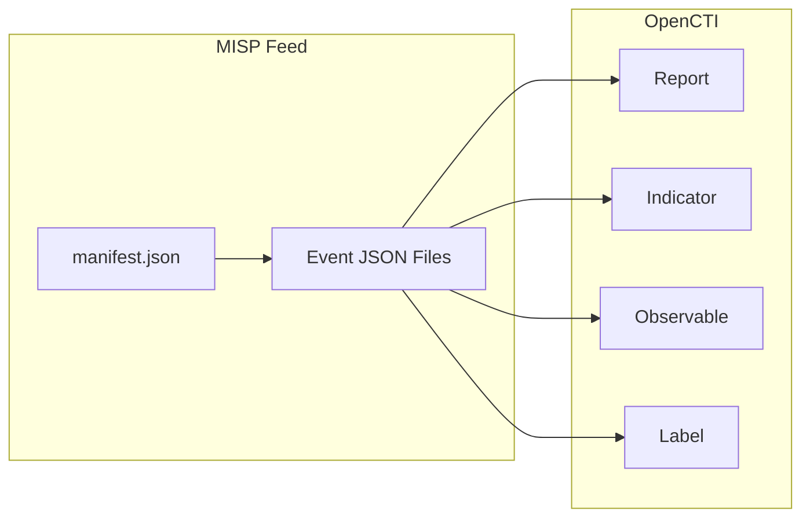

# OpenCTI MISP Feed Connector

| Status | Date | Comment |
|--------|------|---------|
| Filigran Verified | -    | -       |

The MISP Feed connector imports threat intelligence from MISP Feed formats (URL or S3 bucket) into OpenCTI.

## Table of Contents

- [OpenCTI MISP Feed Connector](#opencti-misp-feed-connector)
  - [Table of Contents](#table-of-contents)
  - [Introduction](#introduction)
  - [Installation](#installation)
    - [Requirements](#requirements)
  - [Configuration variables](#configuration-variables)
    - [OpenCTI environment variables](#opencti-environment-variables)
    - [Base connector environment variables](#base-connector-environment-variables)
    - [Connector extra parameters environment variables](#connector-extra-parameters-environment-variables)
  - [Deployment](#deployment)
    - [Docker Deployment](#docker-deployment)
    - [Manual Deployment](#manual-deployment)
  - [Usage](#usage)
  - [Behavior](#behavior)
  - [Debugging](#debugging)
  - [Additional information](#additional-information)

## Introduction

MISP Feeds are a standardized way to share threat intelligence in MISP format without requiring direct API access to a MISP instance. This connector can consume MISP feeds from HTTP/HTTPS URLs or AWS S3 buckets, converting MISP events to STIX 2.1 objects.

## Installation

### Requirements

- OpenCTI Platform >= 6.x
- Access to a MISP Feed URL or S3 bucket

## Configuration variables

There are a number of configuration options, which are set either in `docker-compose.yml` (for Docker) or in `config.yml` (for manual deployment).

### OpenCTI environment variables

| Parameter     | config.yml | Docker environment variable | Mandatory | Description                                          |
|---------------|------------|-----------------------------|-----------|------------------------------------------------------|
| OpenCTI URL   | url        | `OPENCTI_URL`               | Yes       | The URL of the OpenCTI platform.                     |
| OpenCTI Token | token      | `OPENCTI_TOKEN`             | Yes       | The default admin token set in the OpenCTI platform. |

### Base connector environment variables

| Parameter         | config.yml      | Docker environment variable   | Default    | Mandatory | Description                                                                 |
|-------------------|-----------------|-------------------------------|------------|-----------|-----------------------------------------------------------------------------|
| Connector ID      | id              | `CONNECTOR_ID`                |            | Yes       | A unique `UUIDv4` identifier for this connector instance.                   |
| Connector Name    | name            | `CONNECTOR_NAME`              | Misp Feed  | No        | Name of the connector.                                                      |
| Connector Scope   | scope           | `CONNECTOR_SCOPE`             | misp-feed  | No        | The scope or type of data the connector is importing.                       |
| Log Level         | log_level       | `CONNECTOR_LOG_LEVEL`         | error      | No        | Determines the verbosity of the logs: `debug`, `info`, `warn`, or `error`.  |
| Duration Period   | duration_period | `CONNECTOR_DURATION_PERIOD`   | PT5M       | No        | Time interval between connector runs in ISO 8601 format.                    |

### Connector extra parameters environment variables

| Parameter                              | config.yml                                        | Docker environment variable                                    | Default       | Mandatory | Description                                                                 |
|----------------------------------------|---------------------------------------------------|----------------------------------------------------------------|---------------|-----------|-----------------------------------------------------------------------------|
| Source Type                            | misp_feed.source_type                             | `MISP_FEED_SOURCE_TYPE`                                        | url           | No        | Feed source: `url` or `s3`.                                                 |
| Feed URL                               | misp_feed.url                                     | `MISP_FEED_URL`                                                |               | Cond.     | URL of the MISP feed (required if source_type is `url`).                    |
| SSL Verify                             | misp_feed.ssl_verify                              | `MISP_FEED_SSL_VERIFY`                                         | true          | No        | Verify SSL certificates.                                                    |
| S3 Bucket Name                         | misp_feed.bucket_name                             | `MISP_FEED_BUCKET_NAME`                                        |               | Cond.     | S3 bucket name (required if source_type is `s3`).                           |
| S3 Bucket Prefix                       | misp_feed.bucket_prefix                           | `MISP_FEED_BUCKET_PREFIX`                                      |               | Cond.     | S3 bucket prefix (required if source_type is `s3`).                         |
| Import from Date                       | misp_feed.import_from_date                        | `MISP_FEED_IMPORT_FROM_DATE`                                   |               | No        | Start date for importing events (YYYY-MM-DD).                               |
| Create Reports                         | misp_feed.create_reports                          | `MISP_FEED_CREATE_REPORTS`                                     | true          | No        | Create OpenCTI reports from MISP events.                                    |
| Report Type                            | misp_feed.report_type                             | `MISP_FEED_REPORT_TYPE`                                        | misp-event    | No        | Report type for imported events.                                            |
| Create Indicators                      | misp_feed.create_indicators                       | `MISP_FEED_CREATE_INDICATORS`                                  | false         | No        | Create indicators from attributes.                                          |
| Create Observables                     | misp_feed.create_observables                      | `MISP_FEED_CREATE_OBSERVABLES`                                 | false         | No        | Create observables from attributes.                                         |
| Create Object Observables              | misp_feed.create_object_observables               | `MISP_FEED_CREATE_OBJECT_OBSERVABLES`                          | false         | No        | Create observables from MISP objects.                                       |
| Create Tags as Labels                  | misp_feed.create_tags_as_labels                   | `MISP_FEED_CREATE_TAGS_AS_LABELS`                              | true          | No        | Convert MISP tags to OpenCTI labels.                                        |
| Guess Threats from Tags                | misp_feed.guess_threats_from_tags                 | `MISP_FEED_GUESS_THREATS_FROM_TAGS`                            | false         | No        | Infer threat actors from MISP tags.                                         |
| Author from Tags                       | misp_feed.author_from_tags                        | `MISP_FEED_AUTHOR_FROM_TAGS`                                   | false         | No        | Set report author from tags.                                                |
| Import to_ids No Score                 | misp_feed.import_to_ids_no_score                  | `MISP_FEED_IMPORT_TO_IDS_NO_SCORE`                             |               | No        | Score for attributes without to_ids flag.                                   |
| Import Unsupported as Text             | misp_feed.import_unsupported_observables_as_text  | `MISP_FEED_IMPORT_UNSUPPORTED_OBSERVABLES_AS_TEXT`             | false         | No        | Import unsupported types as text observables.                               |
| Unsupported Transparent                | misp_feed.import_unsupported_as_text_transparent  | `MISP_FEED_IMPORT_UNSUPPORTED_OBSERVABLES_AS_TEXT_TRANSPARENT` | true          | No        | Make unsupported text observables transparent.                              |
| Import with Attachments                | misp_feed.import_with_attachments                 | `MISP_FEED_IMPORT_WITH_ATTACHMENTS`                            | false         | No        | Include file attachments.                                                   |

## Deployment

### Docker Deployment

Build the Docker image:

```bash
docker build -t opencti/connector-misp-feed:latest .
```

Configure the connector in `docker-compose.yml`:

```yaml
  connector-misp-feed:
    image: opencti/connector-misp-feed:latest
    environment:
      - OPENCTI_URL=http://localhost
      - OPENCTI_TOKEN=ChangeMe
      - CONNECTOR_ID=ChangeMe
      - CONNECTOR_NAME=MISP Feed
      - CONNECTOR_SCOPE=misp-feed
      - CONNECTOR_LOG_LEVEL=error
      - CONNECTOR_DURATION_PERIOD=PT5M
      - MISP_FEED_SOURCE_TYPE=url
      - MISP_FEED_URL=https://example.com/misp-feed
      - MISP_FEED_SSL_VERIFY=true
      - MISP_FEED_IMPORT_FROM_DATE=2020-01-01
      - MISP_FEED_CREATE_REPORTS=true
      - MISP_FEED_REPORT_TYPE=misp-event
      - MISP_FEED_CREATE_INDICATORS=true
      - MISP_FEED_CREATE_OBSERVABLES=true
      - MISP_FEED_CREATE_OBJECT_OBSERVABLES=true
      - MISP_FEED_CREATE_TAGS_AS_LABELS=true
    restart: always
```

Start the connector:

```bash
docker compose up -d
```

### Manual Deployment

1. Create `config.yml` based on `config.yml.sample`.

2. Install dependencies:

```bash
pip3 install -r requirements.txt
```

3. Start the connector:

```bash
python3 main.py
```

## Usage

The connector runs automatically at the interval defined by `CONNECTOR_DURATION_PERIOD`. To force an immediate run:

**Data Management → Ingestion → Connectors**

Find the connector and click the refresh button to reset the state and trigger a new sync.

## Behavior

The connector fetches MISP events from the feed and converts them to STIX 2.1 objects in OpenCTI.

### Data Flow



### Entity Mapping

| MISP Feed Data       | OpenCTI Entity      | Description                                      |
|----------------------|---------------------|--------------------------------------------------|
| Event                | Report              | MISP event as report with object_refs            |
| Attribute (IP)       | IPv4-Addr/IPv6-Addr | IP address observables                           |
| Attribute (Domain)   | Domain-Name         | Domain observables                               |
| Attribute (Hash)     | File                | File hash observables                            |
| Attribute (URL)      | URL                 | URL observables                                  |
| Object               | Observable          | Complex MISP objects                             |
| Tag (TLP)            | Marking             | TLP markings                                     |
| Tag (Other)          | Label               | Generic labels                                   |

### Source Types

| Type | Description                              |
|------|------------------------------------------|
| url  | HTTP/HTTPS URL pointing to MISP feed     |
| s3   | AWS S3 bucket containing MISP feed files |

## Debugging

Enable verbose logging:

```env
CONNECTOR_LOG_LEVEL=debug
```

## Additional information

- **Feed Format**: MISP feeds follow a standard structure with `manifest.json` and event JSON files
- **Public Feeds**: Many public MISP feeds are available (CIRCL, Botvrij, etc.)
- **S3 Authentication**: AWS credentials should be configured via environment variables or IAM roles
- **Reference**: [MISP Feeds Documentation](https://www.misp-project.org/feeds/)
