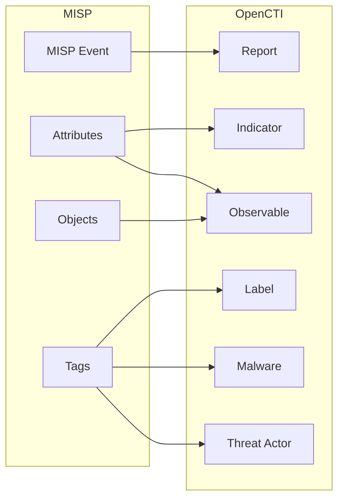

# OpenCTI MISP Connector

| Status            | Date | Comment |
| ----------------- | ---- | ------- |
| Filigran Verified | -    | -       |

The MISP connector imports threat intelligence events and attributes from a MISP (Malware Information Sharing Platform) instance into OpenCTI.

## Table of Contents

- [OpenCTI MISP Connector](#opencti-misp-connector)
  - [Table of Contents](#table-of-contents)
  - [Introduction](#introduction)
  - [Installation](#installation)
    - [Requirements](#requirements)
  - [Configuration variables](#configuration-variables)
    - [OpenCTI environment variables](#opencti-environment-variables)
    - [Base connector environment variables](#base-connector-environment-variables)
    - [Connector extra parameters environment variables](#connector-extra-parameters-environment-variables)
  - [Deployment](#deployment)
    - [Docker Deployment](#docker-deployment)
    - [Manual Deployment](#manual-deployment)
  - [Usage](#usage)
  - [Behavior](#behavior)
  - [Debugging](#debugging)
  - [Additional information](#additional-information)

## Introduction

MISP (Malware Information Sharing Platform & Threat Sharing) is an open-source threat intelligence platform for gathering, sharing, storing, and correlating indicators of compromise. This connector synchronizes MISP events with OpenCTI, converting MISP events and attributes to STIX 2.1 objects.

## Installation

### Requirements

- OpenCTI Platform >= 6.x
- MISP instance with API access
- MISP API key with read permissions

## Configuration variables

Find all the configuration variables available here: [Connector Configurations](./__metadata__/CONNECTOR_CONFIG_DOC.md)

_The `opencti` and `connector` options in the `docker-compose.yml` and `config.yml` are the same as for any other connector.
For more information regarding variables, please refer to [OpenCTI's documentation on connectors](https://docs.opencti.io/latest/deployment/connectors/)._

## Deployment

### Docker Deployment

Build the Docker image:

```bash
docker build -t opencti/connector-misp:latest .
```

Configure the connector in `docker-compose.yml`:

```yaml
connector-misp:
  image: opencti/connector-misp:latest
  environment:
    - OPENCTI_URL=http://localhost
    - OPENCTI_TOKEN=ChangeMe
    - CONNECTOR_ID=ChangeMe
    - CONNECTOR_NAME=MISP
    - CONNECTOR_SCOPE=misp
    - CONNECTOR_LOG_LEVEL=info
    - CONNECTOR_DURATION_PERIOD=PT5M
    - MISP_URL=http://example.com
    - MISP_KEY=ChangeMe
    - MISP_SSL_VERIFY=true
    - MISP_CREATE_REPORTS=true
    - MISP_CREATE_INDICATORS=true
    - MISP_CREATE_OBSERVABLES=true
    - MISP_CREATE_OBJECT_OBSERVABLES=true
    - MISP_CREATE_TAGS_AS_LABELS=true
    - MISP_REPORT_TYPE=misp-event
    - MISP_IMPORT_FROM_DATE=2010-01-01
    - MISP_IMPORT_DISTRIBUTION_LEVELS=0,1,2,3
    - MISP_IMPORT_THREAT_LEVELS=1,2,3,4
  restart: always
```

Start the connector:

```bash
docker compose up -d
```

### Manual Deployment

1. Create `config.yml` based on `config.yml.sample`.

2. Install dependencies:

```bash
pip3 install -r requirements.txt
```

3. Start the connector:

```bash
python3 main.py
```

## Usage

The connector runs automatically at the interval defined by `CONNECTOR_DURATION_PERIOD`. To force an immediate run:

**Data Management → Ingestion → Connectors**

Find the connector and click the refresh button to reset the state and trigger a new sync.

## Behavior

The connector fetches MISP events and converts them to STIX 2.1 objects in OpenCTI.

The MISP events can be retrieved either by:

- their creation date → by setting `MISP_DATE_FIELD_FILTER` to `date_from` and `MISP_DATETIME_ATTRIBUTE` to `date`
- their last update timestamp → by setting both `MISP_DATE_FIELD_FILTER` and `MISP_DATETIME_ATTRIBUTE` to `timestamp`

For instance, the connector can be run once (`CONNECTOR_RUN_AND_TERMINATE` set to `true`) to import all the MISP events by their creation date.
Then, the connector can be reset and re-started in order to import periodically (`CONNECTOR_DURATION_PERIOD` set to any valid ISO-8601 duration) the events by their last update datetime, and so keeping OpenCTI data up-to-date.

### Batch Processing

The connector uses a batch processing system to efficiently handle large volumes of STIX objects. Objects are collected and processed in batches of up to 9,999 items before being sent to OpenCTI.

For detailed information about the batch processing system, see the [Batch Processors documentation](src/utils/batch_processors/README.md).

**NOTE**: For MISP events containing more than 10,000 attributes and objects combined, all entities are still converted to STIX 2.1 objects, but relationships between objects are not created to optimize performance and reduce processing time.

### Data Flow



### Entity Mapping

| MISP Data          | OpenCTI Entity       | Description                           |
| ------------------ | -------------------- | ------------------------------------- |
| Event              | Report               | MISP event as report with object_refs |
| Attribute (IP)     | IPv4-Addr/IPv6-Addr  | IP address observables                |
| Attribute (Domain) | Domain-Name          | Domain observables                    |
| Attribute (Hash)   | File                 | File hash observables                 |
| Attribute (URL)    | URL                  | URL observables                       |
| Attribute (Email)  | Email-Addr           | Email observables                     |
| Object             | Observable           | Complex MISP objects                  |
| Galaxy/Cluster     | Malware/Threat Actor | Threat entities from galaxies         |
| Tag (TLP)          | Marking              | TLP markings                          |
| Tag (Other)        | Label                | Generic labels                        |

### Filtering Options

The connector supports extensive filtering:

- **By Date**: `MISP_IMPORT_FROM_DATE`
- **By Tags**: Include/exclude specific tags
- **By Organization**: Filter by creator or owner org
- **By Distribution**: Filter by MISP distribution level (0-3)
- **By Threat Level**: Filter by threat level (1-4)
- **By Publication Status**: Only published events

## Debugging

Enable verbose logging:

```env
CONNECTOR_LOG_LEVEL=debug
```

## Additional information

- **PyMISP**: The connector uses the PyMISP library for API interaction
- **Two-Way Sync**: This connector is one-way (MISP → OpenCTI). For bidirectional sync, use the MISP internal enrichment connector
- **Performance**: Large MISP instances may require filtering to manage data volume
- **Reference**: [MISP Project](https://www.misp-project.org/)
