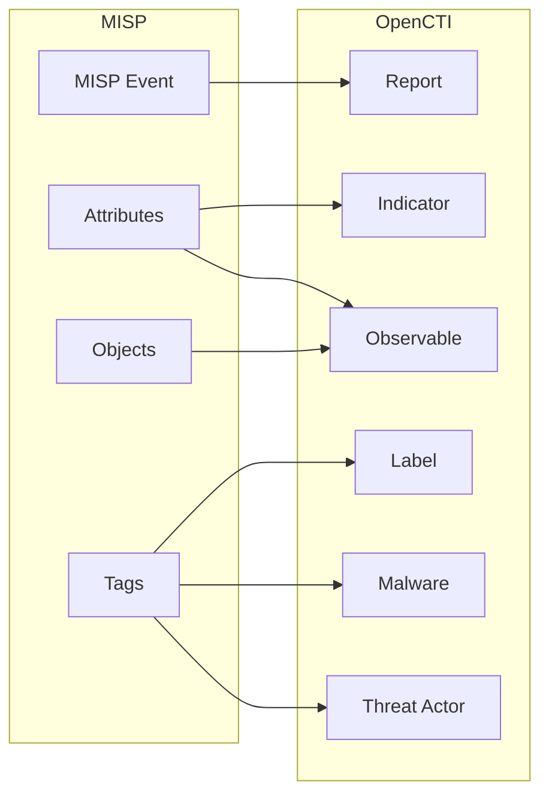

# OpenCTI MISP Connector

The MISP connector imports threat intelligence events and attributes from a MISP (Malware Information Sharing Platform) instance into OpenCTI.

| Status            | Date | Comment |
|-------------------|------|---------|
| Filigran Verified | -    | -       |

## Table of Contents

- [OpenCTI MISP Connector](#opencti-misp-connector)
  - [Table of Contents](#table-of-contents)
  - [Introduction](#introduction)
  - [Installation](#installation)
    - [Requirements](#requirements)
  - [Configuration variables](#configuration-variables)
    - [OpenCTI environment variables](#opencti-environment-variables)
    - [Base connector environment variables](#base-connector-environment-variables)
    - [Connector extra parameters environment variables](#connector-extra-parameters-environment-variables)
  - [Deployment](#deployment)
    - [Docker Deployment](#docker-deployment)
    - [Manual Deployment](#manual-deployment)
  - [Usage](#usage)
  - [Behavior](#behavior)
  - [Debugging](#debugging)
  - [Additional information](#additional-information)

## Introduction

MISP (Malware Information Sharing Platform & Threat Sharing) is an open-source threat intelligence platform for gathering, sharing, storing, and correlating indicators of compromise. This connector synchronizes MISP events with OpenCTI, converting MISP events and attributes to STIX 2.1 objects.

## Installation

### Requirements

- OpenCTI Platform >= 6.x
- MISP instance with API access
- MISP API key with read permissions

## Configuration variables

There are a number of configuration options, which are set either in `docker-compose.yml` (for Docker) or in `config.yml` (for manual deployment).

### OpenCTI environment variables

| Parameter     | config.yml | Docker environment variable | Mandatory | Description                                          |
|---------------|------------|-----------------------------|-----------|------------------------------------------------------|
| OpenCTI URL   | url        | `OPENCTI_URL`               | Yes       | The URL of the OpenCTI platform.                     |
| OpenCTI Token | token      | `OPENCTI_TOKEN`             | Yes       | The default admin token set in the OpenCTI platform. |

### Base connector environment variables

| Parameter         | config.yml      | Docker environment variable   | Default | Mandatory | Description                                                                 |
|-------------------|-----------------|-------------------------------|---------|-----------|-----------------------------------------------------------------------------|
| Connector ID      | id              | `CONNECTOR_ID`                |         | Yes       | A unique `UUIDv4` identifier for this connector instance.                   |
| Connector Name    | name            | `CONNECTOR_NAME`              | MISP    | No        | Name of the connector.                                                      |
| Connector Scope   | scope           | `CONNECTOR_SCOPE`             | misp    | No        | The scope or type of data the connector is importing.                       |
| Log Level         | log_level       | `CONNECTOR_LOG_LEVEL`         | info    | No        | Determines the verbosity of the logs: `debug`, `info`, `warn`, or `error`.  |
| Duration Period   | duration_period | `CONNECTOR_DURATION_PERIOD`   | PT5M    | No        | Time interval between connector runs in ISO 8601 format.                    |

### Connector extra parameters environment variables

| Parameter                              | config.yml                                  | Docker environment variable                          | Default        | Mandatory | Description                                                                 |
|----------------------------------------|---------------------------------------------|------------------------------------------------------|----------------|-----------|-----------------------------------------------------------------------------|
| MISP URL                               | misp.url                                    | `MISP_URL`                                           |                | Yes       | URL of the MISP instance.                                                   |
| MISP Key                               | misp.key                                    | `MISP_KEY`                                           |                | Yes       | MISP API key.                                                               |
| SSL Verify                             | misp.ssl_verify                             | `MISP_SSL_VERIFY`                                    | true           | No        | Verify SSL certificate.                                                     |
| Client Cert                            | misp.client_cert                            | `MISP_CLIENT_CERT`                                   |                | No        | Path to client certificate for mTLS.                                        |
| Reference URL                          | misp.reference_url                          | `MISP_REFERENCE_URL`                                 |                | No        | Custom URL for external references (default: MISP URL).                     |
| Date Filter Field                      | misp.date_filter_field                      | `MISP_DATE_FILTER_FIELD`                             | date_from      | No        | Date field to filter events: `date_from` or `timestamp`.                    |
| Datetime Attribute                     | misp.datetime_attribute                     | `MISP_DATETIME_ATTRIBUTE`                            | date           | No        | Attribute used for datetime: `date` or `timestamp`.                         |
| Create Reports                         | misp.create_reports                         | `MISP_CREATE_REPORTS`                                | true           | No        | Create OpenCTI reports from MISP events.                                    |
| Create Indicators                      | misp.create_indicators                      | `MISP_CREATE_INDICATORS`                             | true           | No        | Create indicators from attributes.                                          |
| Create Observables                     | misp.create_observables                     | `MISP_CREATE_OBSERVABLES`                            | true           | No        | Create observables from attributes.                                         |
| Create Object Observables              | misp.create_object_observables              | `MISP_CREATE_OBJECT_OBSERVABLES`                     | true           | No        | Create observables from MISP objects.                                       |
| Report Description Attribute Filter    | misp.report_description_attribute_filter    | `MISP_REPORT_DESCRIPTION_ATTRIBUTE_FILTER`           |                | No        | Attribute type to use for report description.                               |
| Create Tags as Labels                  | misp.create_tags_as_labels                  | `MISP_CREATE_TAGS_AS_LABELS`                         | true           | No        | Convert MISP tags to OpenCTI labels.                                        |
| Guess Threats from Tags                | misp.guess_threats_from_tags                | `MISP_GUESS_THREATS_FROM_TAGS`                       | false          | No        | Infer threat actors from MISP tags.                                         |
| Author from Tags                       | misp.author_from_tags                       | `MISP_AUTHOR_FROM_TAGS`                              | false          | No        | Set report author from tags.                                                |
| Markings from Tags                     | misp.markings_from_tags                     | `MISP_MARKINGS_FROM_TAGS`                            | false          | No        | Set TLP markings from tags.                                                 |
| Keep Original Tags as Label            | misp.keep_original_tags_as_label            | `MISP_KEEP_ORIGINAL_TAGS_AS_LABEL`                   |                | No        | Keep original tags as labels.                                               |
| Enforce Warning List                   | misp.enforce_warning_list                   | `MISP_ENFORCE_WARNING_LIST`                          | false          | No        | Use MISP warning lists.                                                     |
| Report Type                            | misp.report_type                            | `MISP_REPORT_TYPE`                                   | misp-event     | No        | Report type for imported events.                                            |
| Import from Date                       | misp.import_from_date                       | `MISP_IMPORT_FROM_DATE`                              | 2010-01-01     | No        | Start date for importing events.                                            |
| Import Tags                            | misp.import_tags                            | `MISP_IMPORT_TAGS`                                   |                | No        | Only import events with these tags.                                         |
| Import Tags Not                        | misp.import_tags_not                        | `MISP_IMPORT_TAGS_NOT`                               |                | No        | Exclude events with these tags.                                             |
| Import Creator Orgs                    | misp.import_creator_orgs                    | `MISP_IMPORT_CREATOR_ORGS`                           |                | No        | Only import events from these creator orgs.                                 |
| Import Creator Orgs Not                | misp.import_creator_orgs_not                | `MISP_IMPORT_CREATOR_ORGS_NOT`                       |                | No        | Exclude events from these creator orgs.                                     |
| Import Owner Orgs                      | misp.import_owner_orgs                      | `MISP_IMPORT_OWNER_ORGS`                             |                | No        | Only import events owned by these orgs.                                     |
| Import Owner Orgs Not                  | misp.import_owner_orgs_not                  | `MISP_IMPORT_OWNER_ORGS_NOT`                         |                | No        | Exclude events owned by these orgs.                                         |
| Import Keyword                         | misp.import_keyword                         | `MISP_IMPORT_KEYWORD`                                |                | No        | Keyword filter for event search.                                            |
| Import Distribution Levels             | misp.import_distribution_levels             | `MISP_IMPORT_DISTRIBUTION_LEVELS`                    | 0,1,2,3        | No        | Distribution levels to import.                                              |
| Import Threat Levels                   | misp.import_threat_levels                   | `MISP_IMPORT_THREAT_LEVELS`                          | 1,2,3,4        | No        | Threat levels to import.                                                    |
| Import Only Published                  | misp.import_only_published                  | `MISP_IMPORT_ONLY_PUBLISHED`                         | false          | No        | Only import published events.                                               |
| Import with Attachments                | misp.import_with_attachments                | `MISP_IMPORT_WITH_ATTACHMENTS`                       | false          | No        | Include file attachments.                                                   |
| Import to_ids No Score                 | misp.import_to_ids_no_score                 | `MISP_IMPORT_TO_IDS_NO_SCORE`                        | 40             | No        | Score for attributes without to_ids flag.                                   |
| Import Unsupported Observables as Text | misp.import_unsupported_observables_as_text | `MISP_IMPORT_UNSUPPORTED_OBSERVABLES_AS_TEXT`        | false          | No        | Import unsupported types as text observables.                               |
| Unsupported Observables Transparent    | misp.import_unsupported_observables_as_text_transparent | `MISP_IMPORT_UNSUPPORTED_OBSERVABLES_AS_TEXT_TRANSPARENT` | true  | No        | Make unsupported text observables transparent.                              |
| Propagate Labels                       | misp.propagate_labels                       | `MISP_PROPAGATE_LABELS`                              | false          | No        | Propagate labels to related entities.                                       |

## Deployment

### Docker Deployment

Build the Docker image:

```bash
docker build -t opencti/connector-misp:latest .
```

Configure the connector in `docker-compose.yml`:

```yaml
  connector-misp:
    image: opencti/connector-misp:latest
    environment:
      - OPENCTI_URL=http://localhost
      - OPENCTI_TOKEN=ChangeMe
      - CONNECTOR_ID=ChangeMe
      - CONNECTOR_NAME=MISP
      - CONNECTOR_SCOPE=misp
      - CONNECTOR_LOG_LEVEL=info
      - CONNECTOR_DURATION_PERIOD=PT5M
      - MISP_URL=http://example.com
      - MISP_KEY=ChangeMe
      - MISP_SSL_VERIFY=true
      - MISP_CREATE_REPORTS=true
      - MISP_CREATE_INDICATORS=true
      - MISP_CREATE_OBSERVABLES=true
      - MISP_CREATE_OBJECT_OBSERVABLES=true
      - MISP_CREATE_TAGS_AS_LABELS=true
      - MISP_REPORT_TYPE=misp-event
      - MISP_IMPORT_FROM_DATE=2010-01-01
      - MISP_IMPORT_DISTRIBUTION_LEVELS=0,1,2,3
      - MISP_IMPORT_THREAT_LEVELS=1,2,3,4
    restart: always
```

Start the connector:

```bash
docker compose up -d
```

### Manual Deployment

1. Create `config.yml` based on `config.yml.sample`.

2. Install dependencies:

```bash
pip3 install -r requirements.txt
```

3. Start the connector:

```bash
python3 main.py
```

## Usage

The connector runs automatically at the interval defined by `CONNECTOR_DURATION_PERIOD`. To force an immediate run:

**Data Management → Ingestion → Connectors**

Find the connector and click the refresh button to reset the state and trigger a new sync.

## Behavior

The connector fetches MISP events and converts them to STIX 2.1 objects in OpenCTI.

### Data Flow



### Entity Mapping

| MISP Data            | OpenCTI Entity      | Description                                      |
|----------------------|---------------------|--------------------------------------------------|
| Event                | Report              | MISP event as report with object_refs            |
| Attribute (IP)       | IPv4-Addr/IPv6-Addr | IP address observables                           |
| Attribute (Domain)   | Domain-Name         | Domain observables                               |
| Attribute (Hash)     | File                | File hash observables                            |
| Attribute (URL)      | URL                 | URL observables                                  |
| Attribute (Email)    | Email-Addr          | Email observables                                |
| Object               | Observable          | Complex MISP objects                             |
| Galaxy/Cluster       | Malware/Threat Actor| Threat entities from galaxies                    |
| Tag (TLP)            | Marking             | TLP markings                                     |
| Tag (Other)          | Label               | Generic labels                                   |

### Filtering Options

The connector supports extensive filtering:

- **By Date**: `MISP_IMPORT_FROM_DATE`
- **By Tags**: Include/exclude specific tags
- **By Organization**: Filter by creator or owner org
- **By Distribution**: Filter by MISP distribution level (0-3)
- **By Threat Level**: Filter by threat level (1-4)
- **By Publication Status**: Only published events

## Debugging

Enable verbose logging:

```env
CONNECTOR_LOG_LEVEL=debug
```

## Additional information

- **PyMISP**: The connector uses the PyMISP library for API interaction
- **Two-Way Sync**: This connector is one-way (MISP → OpenCTI). For bidirectional sync, use the MISP internal enrichment connector
- **Performance**: Large MISP instances may require filtering to manage data volume
- **Reference**: [MISP Project](https://www.misp-project.org/)
