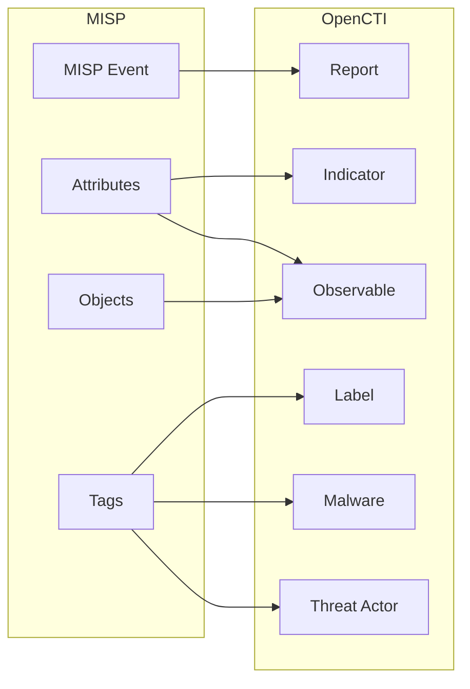

# OpenCTI MISP Connector

| Status            | Date | Comment |
| ----------------- | ---- | ------- |
| Filigran Verified | -    | -       |

The MISP connector imports threat intelligence events and attributes from a MISP (Malware Information Sharing Platform) instance into OpenCTI.

## Table of Contents

- [OpenCTI MISP Connector](#opencti-misp-connector)
  - [Table of Contents](#table-of-contents)
  - [Introduction](#introduction)
  - [Installation](#installation)
    - [Requirements](#requirements)
  - [Configuration variables](#configuration-variables)
  - [Deployment](#deployment)
    - [Docker Deployment](#docker-deployment)
    - [Manual Deployment](#manual-deployment)
  - [Usage](#usage)
  - [Behavior](#behavior)
  - [Debugging](#debugging)
  - [Additional information](#additional-information)

## Introduction

MISP (Malware Information Sharing Platform & Threat Sharing) is an open-source threat intelligence platform for gathering, sharing, storing, and correlating indicators of compromise. This connector synchronizes MISP events with OpenCTI, converting MISP events and attributes to STIX 2.1 objects.

## Installation

### Requirements

- OpenCTI Platform >= 6.x
- MISP instance with API access
- MISP API key with read permissions

## Configuration variables

Find all the configuration variables available here: [Connector Configurations](./__metadata__/CONNECTOR_CONFIG_DOC.md)

_The `opencti` and `connector` options in the `docker-compose.yml` and `config.yml` are the same as for any other connector.
For more information regarding variables, please refer to [OpenCTI's documentation on connectors](https://docs.opencti.io/latest/deployment/connectors/)._

## Deployment

### Docker Deployment

Build the Docker image:

```bash
docker build -t opencti/connector-misp:latest .
```

Configure the connector in `docker-compose.yml`:

```yaml
connector-misp:
  image: opencti/connector-misp:latest
  environment:
    - OPENCTI_URL=http://localhost
    - OPENCTI_TOKEN=ChangeMe
    - CONNECTOR_ID=ChangeMe
    - CONNECTOR_NAME=MISP
    - CONNECTOR_SCOPE=misp
    - CONNECTOR_LOG_LEVEL=info
    - CONNECTOR_DURATION_PERIOD=PT5M
    - MISP_URL=http://example.com
    - MISP_KEY=ChangeMe
    - MISP_SSL_VERIFY=true
    - MISP_CREATE_REPORTS=true
    - MISP_CREATE_INDICATORS=true
    - MISP_CREATE_OBSERVABLES=true
    - MISP_CREATE_OBJECT_OBSERVABLES=true
    - MISP_CREATE_TAGS_AS_LABELS=true
    - MISP_REPORT_TYPE=misp-event
    - MISP_IMPORT_FROM_DATE=2010-01-01
    - MISP_IMPORT_DISTRIBUTION_LEVELS=0,1,2,3
    - MISP_IMPORT_THREAT_LEVELS=1,2,3,4
    - MISP_THREAT_LEVEL_SCORE_MAPPING=1:90;2:60;3:30;4:50
  restart: always
```

Start the connector:

```bash
docker compose up -d
```

### Manual Deployment

1. Create `config.yml` based on `config.yml.sample`.

2. Install dependencies:

```bash
pip3 install -r requirements.txt
```

3. Start the connector:

```bash
python3 main.py
```

## Usage

The connector runs automatically at the interval defined by `CONNECTOR_DURATION_PERIOD`. To force an immediate run:

**Data Management → Ingestion → Connectors**

Find the connector and click the refresh button to reset the state and trigger a new sync.

## Behavior

The connector fetches MISP events and converts them to STIX 2.1 objects in OpenCTI.

The MISP events can be retrieved either by:

- their creation date → by setting `MISP_DATE_FIELD_FILTER` to `date_from` and `MISP_DATETIME_ATTRIBUTE` to `date`
- their last update timestamp → by setting both `MISP_DATE_FIELD_FILTER` and `MISP_DATETIME_ATTRIBUTE` to `timestamp`

For instance, the connector can be run once (`CONNECTOR_RUN_AND_TERMINATE` set to `true`) to import all the MISP events by their creation date.
Then, the connector can be reset and re-started in order to import periodically (`CONNECTOR_DURATION_PERIOD` set to any valid ISO-8601 duration) the events by their last update datetime, and so keeping OpenCTI data up-to-date.

### Batch Processing

The connector uses a batch processing system to efficiently handle large volumes of STIX objects. Objects are collected and processed in batches of up to 9,999 items before being sent to OpenCTI.

For detailed information about the batch processing system, see the [Batch Processors documentation](src/utils/batch_processors/README.md).

**NOTE**: For MISP events containing more than 10,000 attributes and objects combined, all entities are still converted to STIX 2.1 objects, but relationships between objects are not created to optimize performance and reduce processing time.

### Data Flow


```mermaid
graph LR
    subgraph MISP
        direction TB
        Event[MISP Event]
        Attribute[Attributes]
        Object[Objects]
        Tag[Tags]
    end

    subgraph OpenCTI
        direction LR
        Report[Report]
        Indicator[Indicator]
        Observable[Observable]
        Label[Label]
        Malware[Malware]
        ThreatActor[Threat Actor]
    end

    Event --> Report
    Attribute --> Indicator
    Attribute --> Observable
    Object --> Observable
    Tag --> Label
    Tag --> Malware
    Tag --> ThreatActor
```

### Entity Mapping

| MISP Data          | OpenCTI Entity       | Description                           |
| ------------------ | -------------------- | ------------------------------------- |
| Event              | Report               | MISP event as report with object_refs |
| Attribute (IP)     | IPv4-Addr/IPv6-Addr  | IP address observables                |
| Attribute (Domain) | Domain-Name          | Domain observables                    |
| Attribute (Hash)   | File                 | File hash observables                 |
| Attribute (URL)    | URL                  | URL observables                       |
| Attribute (Email)  | Email-Addr           | Email observables                     |
| Object             | Observable           | Complex MISP objects                  |
| Galaxy/Cluster     | Malware/Threat Actor | Threat entities from galaxies         |
| Tag (TLP)          | Marking              | TLP markings                          |
| Tag (Other)        | Label                | Generic labels                        |

### Filtering Options

The connector supports extensive filtering:

- **By Date**: `MISP_IMPORT_FROM_DATE`
- **By Tags**: Include/exclude specific tags
- **By Organization**: Filter by creator or owner org
- **By Distribution**: Filter by MISP distribution level (0-3)
- **By Threat Level**: Filter by threat level (1-4)
- **By Publication Status**: Only published events

### Attribute-Level Timestamp Filtering

When `MISP_ATTRIBUTE_TIMESTAMP_FILTERING` is enabled (`true`), the connector only processes attributes that have been modified since the last successful run. This is a **client-side** filter applied after events are fetched from MISP.

**Why is this useful?** When a single attribute is added or modified in a large MISP event, the API returns the entire event with all its attributes. Without this filter, the connector would re-process and re-push all (potentially thousands of) unchanged attributes to OpenCTI on every run.

**How it works:**

1. The connector tracks the highest attribute `timestamp` seen across all processed events (`last_attribute_timestamp` in the connector state).
2. On subsequent runs, only attributes with a `timestamp >= last_attribute_timestamp` are kept; older attributes are filtered out before conversion.
3. Objects (MISP composite objects) whose attributes are all filtered out are removed entirely to avoid converter errors.
4. If **all** attributes in an event are filtered out, the first original attribute is kept as a fallback so the converter can produce a valid report with a real `object_ref`. Since this attribute was already sent to OpenCTI in a previous run, the resulting upsert is a no-op.
5. Event-level metadata (galaxies, tags, threat level, markings) is **always** re-extracted and sent, even when no attributes passed the filter. This ensures changes to galaxies or tags are propagated to OpenCTI without resending all observables.

**Migration behavior:** If the connector was already running and this option is enabled for the first time (i.e. `last_attribute_timestamp` does not exist in state but `last_event_date` does), the connector uses `last_event_date` as the initial filter threshold to avoid reprocessing all attributes from returned events.

```yaml
- MISP_ATTRIBUTE_TIMESTAMP_FILTERING=true
```

### Threat Level Score Mapping

MISP exposes four threat levels (`1=High`, `2=Medium`, `3=Low`, `4=Undefined`) which the connector converts into an OpenCTI score on the generated report, indicators and observables. The mapping is configurable through `MISP_THREAT_LEVEL_SCORE_MAPPING` and defaults to `1:90;2:60;3:30;4:50`, which preserves the historical behavior.

Format and rules:

- Pairs are separated by `;` and each pair uses `<level>:<score>`.
- `<level>` must be one of `1`, `2`, `3`, `4` and `<score>` must be an integer between `0` and `100`.
- Level `4` must always be defined: it is also used as the fallback score for events that report an unrecognized threat level.
- Invalid input (missing `4`, score out of range, malformed pair, etc.) causes the connector to fail fast at startup with a clear error message.

Example - importing High-severity MISP events with the platform's "high" score:

```yaml
- MISP_THREAT_LEVEL_SCORE_MAPPING=1:100;2:70;3:40;4:50
```

## Debugging

Enable verbose logging:

```env
CONNECTOR_LOG_LEVEL=debug
```

## Additional information

- **PyMISP**: The connector uses the PyMISP library for API interaction
- **Two-Way Sync**: This connector is one-way (MISP → OpenCTI). For bidirectional sync, use the MISP internal enrichment connector
- **Performance**: Large MISP instances may require filtering to manage data volume
- **Reference**: [MISP Project](https://www.misp-project.org/)
