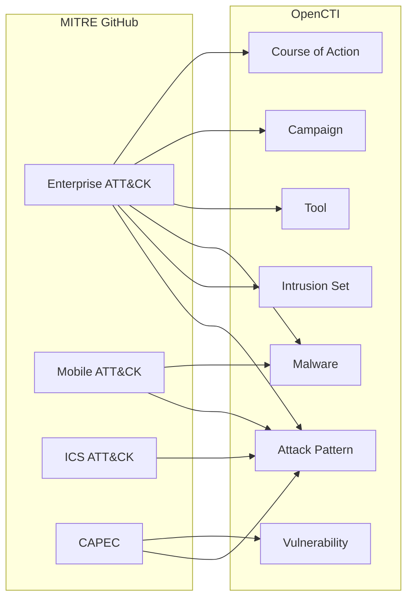

# OpenCTI MITRE ATT&CK Connector

The MITRE connector imports the complete MITRE ATT&CK framework datasets (Enterprise, Mobile, ICS, and CAPEC) into OpenCTI.

| Status            | Date | Comment |
|-------------------|------|---------|
| Filigran Verified | -    | -       |

## Table of Contents

- [OpenCTI MITRE ATT&CK Connector](#opencti-mitre-attck-connector)
  - [Table of Contents](#table-of-contents)
  - [Introduction](#introduction)
  - [Installation](#installation)
    - [Requirements](#requirements)
  - [Configuration variables](#configuration-variables)
    - [OpenCTI environment variables](#opencti-environment-variables)
    - [Base connector environment variables](#base-connector-environment-variables)
    - [Connector extra parameters environment variables](#connector-extra-parameters-environment-variables)
  - [Deployment](#deployment)
    - [Docker Deployment](#docker-deployment)
    - [Manual Deployment](#manual-deployment)
  - [Usage](#usage)
  - [Behavior](#behavior)
  - [Debugging](#debugging)
  - [Additional information](#additional-information)

## Introduction

MITRE ATT&CK® is a globally-accessible knowledge base of adversary tactics and techniques based on real-world observations. ATT&CK is used as a foundation for threat models and methodologies in the private sector, government, and the cybersecurity product and service community.

This connector imports the complete MITRE ATT&CK framework including:
- **Enterprise ATT&CK**: Tactics, techniques, and procedures for enterprise environments
- **Mobile ATT&CK**: Mobile-specific attack techniques
- **ICS ATT&CK**: Industrial Control Systems attack techniques
- **CAPEC**: Common Attack Pattern Enumeration and Classification

All data is imported in native STIX 2.1 format from MITRE's official GitHub repository.

## Installation

### Requirements

- OpenCTI Platform >= 6.x
- Internet access to GitHub raw content

## Configuration variables

There are a number of configuration options, which are set either in `docker-compose.yml` (for Docker) or in `config.yml` (for manual deployment).

### OpenCTI environment variables

| Parameter     | config.yml | Docker environment variable | Mandatory | Description                                          |
|---------------|------------|-----------------------------|-----------|------------------------------------------------------|
| OpenCTI URL   | url        | `OPENCTI_URL`               | Yes       | The URL of the OpenCTI platform.                     |
| OpenCTI Token | token      | `OPENCTI_TOKEN`             | Yes       | The default admin token set in the OpenCTI platform. |

### Base connector environment variables

| Parameter         | config.yml      | Docker environment variable   | Default         | Mandatory | Description                                                                 |
|-------------------|-----------------|-------------------------------|-----------------|-----------|-----------------------------------------------------------------------------|
| Connector ID      | id              | `CONNECTOR_ID`                |                 | Yes       | A unique `UUIDv4` identifier for this connector instance.                   |
| Connector Name    | name            | `CONNECTOR_NAME`              | MITRE ATT&CK    | No        | Name of the connector.                                                      |
| Connector Scope   | scope           | `CONNECTOR_SCOPE`             | mitre           | No        | The scope or type of data the connector is importing.                       |
| Log Level         | log_level       | `CONNECTOR_LOG_LEVEL`         | error           | No        | Determines the verbosity of the logs: `debug`, `info`, `warn`, or `error`.  |
| Duration Period   | duration_period | `CONNECTOR_DURATION_PERIOD`   | P7D             | No        | Time interval between connector runs in ISO 8601 format.                    |

### Connector extra parameters environment variables

| Parameter                | config.yml                   | Docker environment variable      | Default                                                                              | Mandatory | Description                                                    |
|--------------------------|------------------------------|----------------------------------|--------------------------------------------------------------------------------------|-----------|----------------------------------------------------------------|
| Remove Statement Marking | mitre.remove_statement_marking | `MITRE_REMOVE_STATEMENT_MARKING` | false                                                                              | No        | Remove statement markings from ingested MITRE data.            |
| Interval (deprecated)    | mitre.interval               | `MITRE_INTERVAL`                 | 7                                                                                    | No        | **[DEPRECATED]** Interval in days. Use `CONNECTOR_DURATION_PERIOD`. |
| Enterprise File URL      | mitre.enterprise_file_url    | `MITRE_ENTERPRISE_FILE_URL`      | https://raw.githubusercontent.com/mitre-attack/attack-stix-data/master/enterprise-attack/enterprise-attack.json | No | URL to MITRE Enterprise ATT&CK JSON. |
| Mobile File URL          | mitre.mobile_attack_file_url | `MITRE_MOBILE_ATTACK_FILE_URL`   | https://raw.githubusercontent.com/mitre-attack/attack-stix-data/master/mobile-attack/mobile-attack.json | No | URL to MITRE Mobile ATT&CK JSON. |
| ICS File URL             | mitre.ics_attack_file_url    | `MITRE_ICS_ATTACK_FILE_URL`      | https://raw.githubusercontent.com/mitre-attack/attack-stix-data/master/ics-attack/ics-attack.json | No | URL to MITRE ICS ATT&CK JSON. |
| CAPEC File URL           | mitre.capec_file_url         | `MITRE_CAPEC_FILE_URL`           | https://raw.githubusercontent.com/mitre/cti/master/capec/2.1/stix-capec.json         | No        | URL to CAPEC JSON.                                             |

## Deployment

### Docker Deployment

Build the Docker image:

```bash
docker build -t opencti/connector-mitre:latest .
```

Configure the connector in `docker-compose.yml`:

```yaml
  connector-mitre:
    image: opencti/connector-mitre:latest
    environment:
      - OPENCTI_URL=http://localhost
      - OPENCTI_TOKEN=ChangeMe
      - CONNECTOR_ID=ChangeMe
      - CONNECTOR_NAME=MITRE ATT&CK
      - CONNECTOR_SCOPE=mitre
      - CONNECTOR_LOG_LEVEL=error
      - CONNECTOR_DURATION_PERIOD=P7D
      # - MITRE_REMOVE_STATEMENT_MARKING=true
    restart: always
```

Start the connector:

```bash
docker compose up -d
```

### Manual Deployment

1. Create `config.yml` based on `config.yml.sample`.

2. Install dependencies:

```bash
pip3 install -r requirements.txt
```

3. Start the connector from the `src` directory:

```bash
python3 -m __main__
```

## Usage

The connector runs automatically at the interval defined by `CONNECTOR_DURATION_PERIOD`. MITRE updates ATT&CK quarterly; weekly polling (`P7D`) is recommended.

To force an immediate run:

**Data Management → Ingestion → Connectors**

Find the connector and click the refresh button to reset the state and trigger a new sync.

## Behavior

The connector fetches STIX 2.1 bundles from MITRE's GitHub repositories and imports them directly into OpenCTI.

### Data Flow



### Entity Mapping

| MITRE Data Type      | OpenCTI Entity      | Description                                      |
|----------------------|---------------------|--------------------------------------------------|
| attack-pattern       | Attack Pattern      | Tactics and techniques                           |
| intrusion-set        | Intrusion Set       | Threat actor groups                              |
| malware              | Malware             | Malware families and samples                     |
| tool                 | Tool                | Legitimate tools used by adversaries             |
| campaign             | Campaign            | Attack campaigns                                 |
| course-of-action     | Course of Action    | Mitigations and defensive measures               |
| x-mitre-tactic       | -                   | Converted to kill chain phases                   |
| x-mitre-matrix       | -                   | ATT&CK matrix metadata                           |
| x-mitre-data-source  | -                   | Data sources for detection                       |

### ATT&CK Matrices Imported

1. **Enterprise ATT&CK**: Windows, macOS, Linux, Cloud, Network, Containers
2. **Mobile ATT&CK**: Android, iOS
3. **ICS ATT&CK**: Industrial Control Systems
4. **CAPEC**: Attack patterns with CWE/CVE relationships

### Processing Details

- **Native STIX Import**: All data is in native STIX 2.1 format
- **Relationships**: All MITRE relationships (uses, mitigates, subtechnique-of) are preserved
- **Kill Chain**: ATT&CK tactics are mapped to kill chain phases
- **External References**: MITRE IDs and documentation links are preserved

## Debugging

Enable verbose logging:

```env
CONNECTOR_LOG_LEVEL=debug
```

## Additional information

- **Update Frequency**: MITRE releases ATT&CK updates quarterly; weekly polling is sufficient
- **Large Dataset**: Initial import may take several minutes due to the size of ATT&CK
- **Custom URLs**: You can point to custom or mirrored ATT&CK files if needed
- **Statement Marking**: Use `MITRE_REMOVE_STATEMENT_MARKING=true` if statement markings interfere with your workflows
- **Reference**: [MITRE ATT&CK](https://attack.mitre.org/) | [CAPEC](https://capec.mitre.org/)
