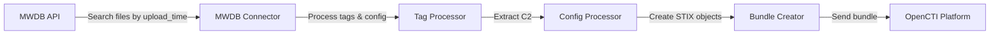
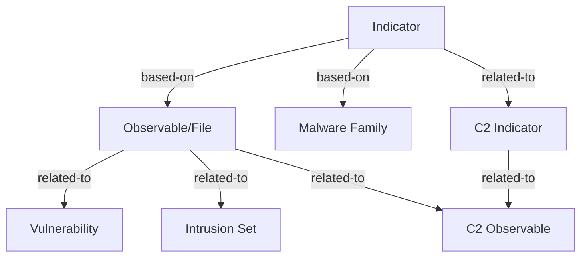

# OpenCTI MWDB Connector

| Status    | Date       | Comment                         |
|-----------|------------|---------------------------------|
| Community | 2025-01-05 | External import connector       |

## Introduction

MWDB (Malware Database) is an open-source malware repository maintained by CERT Polska that allows security teams to store, share, and analyze malware samples along with their extracted configurations. This connector imports malware samples, indicators, observables, and extracted C2 infrastructure into OpenCTI.

### Key Features

- **Malware Sample Import**: Imports malware files with SHA256 hashes and metadata
- **Configuration Extraction**: Extracts C2 infrastructure from malware configurations
- **Tag Processing**: Processes MWDB taxonomies (YARA, family, runnable tags)
- **Relationship Creation**: Links malware to CVEs, intrusion sets, and other entities
- **Incremental Updates**: State management for efficient polling

### Useful Links

- MWDB Documentation: https://mwdb.readthedocs.io/en/latest/
- MWDB Repository: https://github.com/CERT-Polska/mwdb-core
- OpenCTI Documentation: https://docs.opencti.io

---

## Installation

### Requirements

| Requirement          | Description                                                |
|----------------------|------------------------------------------------------------|
| OpenCTI Platform     | Version 6.x or higher                                      |
| MWDB Instance        | Access to a MWDB server (self-hosted or public)           |
| API Token            | MWDB user token with API read access                       |
| RabbitMQ Connection  | Network access to OpenCTI's RabbitMQ instance             |

---

## Configuration variables

Below are the parameters you'll need to set for OpenCTI, the connector, and MWDB-specific settings.

### OpenCTI API Connection

| Parameter      | config.yml | Docker Environment Variable | Mandatory | Description                                           |
|----------------|------------|----------------------------|-----------|-------------------------------------------------------|
| OpenCTI URL    | url        | `OPENCTI_URL`              | Yes       | URL of the OpenCTI platform                          |
| OpenCTI Token  | token      | `OPENCTI_TOKEN`            | Yes       | API token for the OpenCTI platform                   |

### Base Connector Configuration

| Parameter              | config.yml                | Docker Environment Variable        | Mandatory | Description                                       |
|------------------------|---------------------------|-----------------------------------|-----------|---------------------------------------------------|
| Connector ID           | id                        | `CONNECTOR_ID`                    | Yes       | Unique identifier for this connector (UUIDv4)   |
| Connector Name         | name                      | `CONNECTOR_NAME`                  | Yes       | Name of the connector instance                   |
| Connector Scope        | scope                     | `CONNECTOR_SCOPE`                 | Yes       | Connector scope (should be `mwdb`)              |
| Log Level              | log_level                 | `CONNECTOR_LOG_LEVEL`             | No        | Log verbosity: `debug`, `info`, `warn`, `error` |

### MWDB Connector Configuration

| Parameter              | config.yml          | Docker Environment Variable     | Mandatory | Description                                                              |
|------------------------|--------------------|---------------------------------|-----------|--------------------------------------------------------------------------|
| MWDB URL               | url                | `MWDB_URL`                      | Yes       | MWDB API endpoint URL                                                    |
| MWDB Token             | token              | `MWDB_TOKEN`                    | Yes       | MWDB user API token                                                      |
| Interval               | interval           | `MWDB_INTERVAL`                 | Yes       | Polling interval in days (must be ≥1)                                   |
| Confidence Level       | confidence_level   | `MWDB_CONFIDENCE_LEVEL`         | No        | Confidence score for imported data (0-100), default: `50`               |
| Import Config          | import_config      | `MWDB_IMPORT_CONFIG`            | No        | Import malware configurations (C2 extraction), default: `False`          |
| Create Indicators      | create_indicators  | `MWDB_CREATE_INDICATORS`        | No        | Create STIX Indicators, default: `True`                                  |
| Create Observables     | create_observables | `MWDB_CREATE_OBSERVABLES`       | No        | Create STIX Observables, default: `True`                                 |
| Update Existing Data   | update_existing_data| `MWDB_UPDATE_EXISTING_DATA`    | No        | Update existing data in OpenCTI, default: `True`                         |
| Organization Name      | org_name           | `MWDB_ORG_NAME`                 | Yes       | Name of the organization authoring the data                              |
| Organization Desc      | org_description    | `MWDB_ORG_DESCRIPTION`          | Yes       | Description of the authoring organization                                |
| Start Date             | start_date         | `MWDB_START_DATE`               | No        | Initial import date (ISO 8601), e.g., `2022-06-27T00:00:00.000Z`        |
| Tag Filter             | tag_filter         | `MWDB_TAG_FILTER`               | No        | Regex to filter unwanted tags, e.g., `virusshare.*\|bazaar-.*`          |
| Max Start Retention    | max_start_retention| `MWDB_MAX_START_RETENTION`      | No        | Months to look back if no start date, default: `6`                       |
| SSL Verify             | ssl_verify         | `MWDB_SSL_VERIFY`               | No        | Enable SSL certificate verification, default: `True`                     |

---

## Deployment

### Docker Deployment

Build a Docker image using the provided Dockerfile:

```bash
docker build -t opencti/connector-mwdb:latest .
```

Example `docker-compose.yml`:

```yaml
version: '3'
services:
  connector-mwdb:
    image: opencti/connector-mwdb:latest
    environment:
      - OPENCTI_URL=http://localhost:8080
      - OPENCTI_TOKEN=ChangeMe
      - CONNECTOR_ID=ChangeMe
      - CONNECTOR_NAME=MWDB
      - CONNECTOR_SCOPE=mwdb
      - CONNECTOR_LOG_LEVEL=info
      - MWDB_URL=https://mwdb.example.com
      - MWDB_TOKEN=ChangeMe
      - MWDB_INTERVAL=3
      - MWDB_CONFIDENCE_LEVEL=50
      - MWDB_IMPORT_CONFIG=true
      - MWDB_CREATE_INDICATORS=true
      - MWDB_CREATE_OBSERVABLES=true
      - MWDB_UPDATE_EXISTING_DATA=true
      - MWDB_ORG_NAME=My Organization
      - MWDB_ORG_DESCRIPTION=Organization description
      - MWDB_START_DATE=2024-01-01T00:00:00.000Z
      - MWDB_TAG_FILTER=virusshare.*|bazaar-.*
      - MWDB_MAX_START_RETENTION=6
      - MWDB_SSL_VERIFY=true
    restart: always
```

### Manual Deployment

1. Clone the connector repository
2. Navigate to the connector directory:

```bash
cd external-import/mwdb
```

3. Create a virtual environment and install dependencies:

```bash
python3 -m venv venv
source venv/bin/activate
pip3 install -r requirements.txt
```

4. Create a `config.yml` from `config.yml.sample` and configure variables
5. Run the connector:

```bash
python3 src/mwdb.py
```

---

## Usage

After installation, the connector runs automatically at the configured interval. To force an immediate sync:

1. Navigate to **Data management → Connectors and Workers** in OpenCTI
2. Find the **MWDB** connector
3. Click the refresh button to reset state and trigger a new poll

> **Note**: Resetting the connector state will use `MWDB_START_DATE` or the retention period for the initial import.

---

## Behavior

### Data Flow



### Entity Mapping

| MWDB Data                | OpenCTI Entity Type  | Notes                                               |
|--------------------------|---------------------|-----------------------------------------------------|
| Malware File             | StixFile            | SHA256 hash, file metadata, YARA labels            |
| Malware Family           | Malware             | Extracted from `family:` tags                       |
| File SHA256 Pattern      | Indicator           | STIX pattern for file hash detection               |
| C2 IP Address            | IPv4Address         | Extracted from malware configuration               |
| C2 URL                   | URL                 | Extracted from malware configuration               |
| YARA Tags                | Labels              | Applied to indicators and observables              |
| CVE Tags                 | Vulnerability       | Related to observables when CVE-* tags found       |
| Extra Tags               | Intrusion Set       | Linked when matching existing intrusion sets       |

### Processing Details

#### Tag Taxonomy Processing

The connector processes MWDB tags according to CERT Polska's taxonomy:

| Tag Prefix   | Processing Action                              |
|--------------|-----------------------------------------------|
| `yara:`      | Extracted as labels, applied to indicators   |
| `family:`    | Used to create Malware entity                 |
| `runnable:`  | Stored as metadata                            |
| `CVE-*`      | Links to existing Vulnerability entities      |
| Other tags   | Searched against Malware and Intrusion Sets  |

#### Configuration Extraction

When `MWDB_IMPORT_CONFIG=true`, the connector extracts C2 infrastructure:

| Config Key      | Observable Type | Relationship                    |
|-----------------|----------------|--------------------------------|
| `c2` (IP)       | IPv4Address    | Indicator → related-to → IPv4  |
| `c2` (URL)      | URL            | Indicator → related-to → URL   |
| `url4cnc`       | URL            | URL reference list for C2      |

### Relationships Created



| Source Entity     | Relationship Type | Target Entity        | Description                           |
|-------------------|------------------|---------------------|---------------------------------------|
| Indicator         | based-on         | Observable (File)   | Indicator based on file hash          |
| Indicator         | based-on         | Malware             | Indicator linked to malware family    |
| File Observable   | related-to       | Vulnerability       | File related to exploited CVE         |
| File Observable   | related-to       | Intrusion Set       | File related to threat actor          |
| Indicator         | related-to       | C2 Indicator        | Malware indicator to C2 indicator     |
| Observable        | related-to       | C2 Observable       | File to C2 infrastructure             |

### State Management

The connector maintains state for incremental imports:

- **First Run**: Uses `MWDB_START_DATE` or falls back to `MAX_START_RETENTION` months ago
- **Subsequent Runs**: Queries only files uploaded since `last_run` timestamp
- **Query Format**: `upload_time:[{last_date} TO *]`

### Labels Created

The connector automatically creates the following labels in OpenCTI:

| Label     | Description                          |
|-----------|--------------------------------------|
| `C2`      | Marks C2 IP addresses and URLs      |
| `C2 LIST` | Marks URLs containing C2 references |

---

## Debugging

### Common Issues

| Issue                          | Solution                                               |
|--------------------------------|-------------------------------------------------------|
| Authentication failed          | Verify `MWDB_TOKEN` is valid and has API access       |
| No data imported               | Check `MWDB_START_DATE` is not in the future          |
| SSL errors                     | Set `MWDB_SSL_VERIFY=false` for self-signed certs     |
| Missing malware families       | Ensure samples have `family:` tags in MWDB            |
| C2 not extracted               | Enable `MWDB_IMPORT_CONFIG=true`                      |
| Too many tags imported         | Configure `MWDB_TAG_FILTER` regex to exclude unwanted |

### Logging

To enable detailed logging, set `CONNECTOR_LOG_LEVEL=debug` in your configuration.

### Verify Import

1. Navigate to **Data → Data Curation** in OpenCTI
2. Filter by source to see imported MWDB data
3. Check **Connectors** page for error messages and work progress

---

## Additional Information

### Resources

- [MWDB User Guide](https://mwdb.readthedocs.io/en/latest/user-guide/1-Introduction-to-MWDB.html)
- [CERT Polska MWDB](https://mwdb.cert.pl/) - Public instance
- [OpenCTI Connectors Documentation](https://docs.opencti.io/latest/deployment/connectors/)
- [STIX 2.1 Specification](https://docs.oasis-open.org/cti/stix/v2.1/stix-v2.1.html)

### Version History

- **6.9.5**: Current version with full STIX 2.1 support
