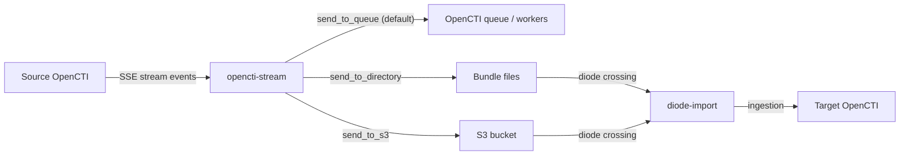

# OpenCTI Stream Connector

| Status            | Date | Comment |
|-------------------|------|---------|
| Filigran Verified | -    | -       |

The OpenCTI Stream connector subscribes to an OpenCTI live stream and forwards each
create/update event as a single STIX 2.1 bundle. The output destination is selected via
the standard connector helper settings, so the same connector can be used to:

- **Queue mode** (default): re-emit stream events as bundles on the connector's RabbitMQ
  queue, where workers ingest them. Useful for fan-out, replay, or running a stream
  through workers as a different applicant (impersonation).
- **Diode mode (directory)**: write each bundle as a JSON file in a local directory,
  consumed on the target side by the [`diode-import`](../diode-import/) connector.
- **Diode mode (S3)**: upload each bundle to an S3 bucket, consumed on the target side by
  the [`diode-import`](../diode-import/) connector.

The originating user (`origin.user_id` of each stream event) is propagated as the bundle
`applicant_id`. In queue mode this drives worker impersonation; in diode mode it is
written into the bundle file and remapped on the target instance via
`DIODE_IMPORT_APPLICANT_MAPPINGS`.

## Table of Contents

- [OpenCTI Stream Connector](#opencti-stream-connector)
  - [Table of Contents](#table-of-contents)
  - [Introduction](#introduction)
  - [Installation](#installation)
    - [Requirements](#requirements)
  - [Configuration variables](#configuration-variables)
    - [OpenCTI environment variables](#opencti-environment-variables)
    - [Base connector environment variables](#base-connector-environment-variables)
    - [Live stream parameters](#live-stream-parameters)
    - [Output mode parameters](#output-mode-parameters)
  - [Deployment](#deployment)
    - [Docker Deployment](#docker-deployment)
    - [Manual Deployment](#manual-deployment)
  - [Behavior](#behavior)
    - [Data flow](#data-flow)
    - [Event handling](#event-handling)
    - [Applicant propagation](#applicant-propagation)
  - [Debugging](#debugging)
  - [Additional information](#additional-information)

## Introduction

The connector consumes an OpenCTI live stream (Server-Sent Events) on the source
platform it is registered with, builds a one-object STIX 2.1 bundle from each
create/update event, and dispatches it via `OpenCTIConnectorHelper.send_stix2_bundle()`.
Because all output modes are inherited from the helper, the connector itself remains
deliberately small.

Typical use cases:

- Replicating data between OpenCTI instances over a unidirectional diode (paired with
  `diode-import` on the target instance).
- Cross-region or air-gapped synchronization through S3 as an intermediate buffer.
- In-platform fan-out or republishing of a stream via the queue, with proper applicant
  attribution.

## Installation

### Requirements

- OpenCTI Platform >= 6.8.12
- Python >= 3.11 (the container uses Python 3.12)
- A live stream configured on the source OpenCTI instance (or one of the built-in
  `live` / `raw` streams)
- Optionally, the [`diode-import`](../diode-import/) connector deployed on the target
  instance for directory or S3 modes

## Configuration variables

There are a number of configuration options, which are set either in `docker-compose.yml`
(for Docker) or in `config.yml` (for manual deployment).

### OpenCTI environment variables

| Parameter     | config.yml | Docker environment variable | Mandatory | Description                                          |
|---------------|------------|-----------------------------|-----------|------------------------------------------------------|
| OpenCTI URL   | url        | `OPENCTI_URL`               | Yes       | The URL of the OpenCTI platform.                     |
| OpenCTI Token | token      | `OPENCTI_TOKEN`             | Yes       | The default admin token set in the OpenCTI platform. |

### Base connector environment variables

| Parameter       | config.yml | Docker environment variable | Default          | Mandatory | Description                                                              |
|-----------------|------------|-----------------------------|------------------|-----------|--------------------------------------------------------------------------|
| Connector ID    | id         | `CONNECTOR_ID`              |                  | Yes       | A unique `UUIDv4` identifier for this connector instance.                |
| Connector Name  | name       | `CONNECTOR_NAME`            | OpenCTI Stream   | No        | Name of the connector.                                                   |
| Connector Scope | scope      | `CONNECTOR_SCOPE`           | opencti-stream   | No        | The scope of the connector.                                              |
| Log Level       | log_level  | `CONNECTOR_LOG_LEVEL`       | error            | No        | Determines the verbosity of logs: `debug`, `info`, `warn`, or `error`.   |

### Live stream parameters

| Parameter                       | config.yml                  | Docker environment variable             | Default | Mandatory | Description                                                                                   |
|---------------------------------|-----------------------------|-----------------------------------------|---------|-----------|-----------------------------------------------------------------------------------------------|
| Live Stream ID                  | live_stream_id              | `CONNECTOR_LIVE_STREAM_ID`              |         | Yes       | The OpenCTI live stream to subscribe to: `live`, `raw`, or a stream collection UUID.          |
| Live Stream Listen Delete       | live_stream_listen_delete   | `CONNECTOR_LIVE_STREAM_LISTEN_DELETE`   | false   | No        | Whether to subscribe to delete events. Disabled by default (this connector forwards upserts). |
| Live Stream No Dependencies     | live_stream_no_dependencies | `CONNECTOR_LIVE_STREAM_NO_DEPENDENCIES` | false   | No        | Whether to receive only the event's own object (no dependent objects). Disabled by default so dependencies are included. |

### Output mode parameters

These are standard `OpenCTIConnectorHelper` parameters. Pick one of the three modes by
toggling the matching flag(s).

| Parameter                  | config.yml                   | Docker environment variable          | Default     | Description                                                                       |
|----------------------------|------------------------------|--------------------------------------|-------------|-----------------------------------------------------------------------------------|
| Send to Queue              | send_to_queue                | `CONNECTOR_SEND_TO_QUEUE`            | true        | Push each bundle to the connector's RabbitMQ queue.                               |
| Send to Directory          | send_to_directory            | `CONNECTOR_SEND_TO_DIRECTORY`        | false       | Write each bundle as a JSON file in `send_to_directory_path`.                     |
| Send to Directory Path     | send_to_directory_path       | `CONNECTOR_SEND_TO_DIRECTORY_PATH`   |             | Target directory for bundle files (required when directory mode is enabled).      |
| Send to Directory Retention| send_to_directory_retention  | `CONNECTOR_SEND_TO_DIRECTORY_RETENTION` | 7         | Days to retain bundle files before automatic cleanup (0 disables cleanup).        |
| Send to S3                 | send_to_s3                   | `CONNECTOR_SEND_TO_S3`               | false       | Upload each bundle as a JSON object in `send_to_s3_bucket`.                       |
| Send to S3 Bucket          | send_to_s3_bucket            | `CONNECTOR_SEND_TO_S3_BUCKET`        |             | Target S3 bucket. If empty, the OpenCTI bucket is used.                           |
| Send to S3 Folder          | send_to_s3_folder            | `CONNECTOR_SEND_TO_S3_FOLDER`        | connectors  | Folder/prefix in the bucket. Use `/` or `.` for the bucket root.                  |
| Send to S3 Retention       | send_to_s3_retention         | `CONNECTOR_SEND_TO_S3_RETENTION`     | 7           | Days to retain objects before automatic cleanup (0 disables cleanup).             |

For S3 credentials and endpoint, the connector reuses the OpenCTI platform's S3
configuration by default. To override, set the standard `S3_ENDPOINT`, `S3_PORT`,
`S3_ACCESS_KEY`, `S3_SECRET_KEY`, `S3_USE_SSL` and `S3_BUCKET_REGION` variables.

## Deployment

### Docker Deployment

Build the Docker image:

```bash
docker build -t opencti/connector-opencti-stream:latest .
```

#### Example: Queue mode (default)

```yaml
  connector-opencti-stream:
    image: opencti/connector-opencti-stream:latest
    environment:
      - OPENCTI_URL=http://localhost
      - OPENCTI_TOKEN=ChangeMe
      - CONNECTOR_ID=ChangeMe
      - CONNECTOR_NAME=OpenCTI Stream
      - CONNECTOR_LOG_LEVEL=info
      - CONNECTOR_LIVE_STREAM_ID=live
      - CONNECTOR_LIVE_STREAM_LISTEN_DELETE=false
      - CONNECTOR_LIVE_STREAM_NO_DEPENDENCIES=false
      - CONNECTOR_SEND_TO_QUEUE=true
    restart: always
```

#### Example: Diode mode (directory)

```yaml
  connector-opencti-stream:
    image: opencti/connector-opencti-stream:latest
    environment:
      - OPENCTI_URL=http://localhost
      - OPENCTI_TOKEN=ChangeMe
      - CONNECTOR_ID=ChangeMe
      - CONNECTOR_NAME=OpenCTI Stream
      - CONNECTOR_LOG_LEVEL=info
      - CONNECTOR_LIVE_STREAM_ID=ChangeMeStreamUUID
      - CONNECTOR_LIVE_STREAM_LISTEN_DELETE=false
      - CONNECTOR_LIVE_STREAM_NO_DEPENDENCIES=false
      - CONNECTOR_SEND_TO_QUEUE=false
      - CONNECTOR_SEND_TO_DIRECTORY=true
      - CONNECTOR_SEND_TO_DIRECTORY_PATH=/data/diode
      - CONNECTOR_SEND_TO_DIRECTORY_RETENTION=7
    volumes:
      - /path/to/shared/directory:/data/diode
    restart: always
```

#### Example: Diode mode (S3, using OpenCTI credentials)

```yaml
  connector-opencti-stream:
    image: opencti/connector-opencti-stream:latest
    environment:
      - OPENCTI_URL=http://localhost
      - OPENCTI_TOKEN=ChangeMe
      - CONNECTOR_ID=ChangeMe
      - CONNECTOR_NAME=OpenCTI Stream
      - CONNECTOR_LOG_LEVEL=info
      - CONNECTOR_LIVE_STREAM_ID=ChangeMeStreamUUID
      - CONNECTOR_LIVE_STREAM_LISTEN_DELETE=false
      - CONNECTOR_LIVE_STREAM_NO_DEPENDENCIES=false
      - CONNECTOR_SEND_TO_QUEUE=false
      - CONNECTOR_SEND_TO_S3=true
      - CONNECTOR_SEND_TO_S3_FOLDER=connectors
      - CONNECTOR_SEND_TO_S3_RETENTION=7
    restart: always
```

Start the connector:

```bash
docker compose up -d
```

### Manual Deployment

1. Create `config.yml` based on `src/config.yml.sample`.
2. Install dependencies:

   ```bash
   pip3 install -r src/requirements.txt
   ```

3. Start the connector:

   ```bash
   cd src && python3 main.py
   ```

## Behavior

### Data flow



### Event handling

| Event type | Action                                                                                        |
|------------|-----------------------------------------------------------------------------------------------|
| `create`   | Forwarded as a one-object STIX 2.1 bundle.                                                    |
| `update`   | Forwarded as a one-object STIX 2.1 bundle.                                                    |
| `delete`   | Ignored. `live_stream_listen_delete` defaults to `false` so the SSE server does not send them.|
| Other      | Ignored (heartbeat/connected events handled internally by the helper).                        |

Each bundle is sent with `no_split=True`, so the helper does not run the STIX splitter
on a single object that does not need it.

### Applicant propagation

Before sending the bundle, the connector reads `origin.user_id` from the stream event and
sets `helper.applicant_id` accordingly. The helper then embeds it into the dispatched
payload:

- **Queue mode**: `applicant_id` becomes the operating user for the bundle on the worker
  side (impersonation).
- **Directory / S3 mode**: `applicant_id` is written into the JSON bundle file. On the
  target instance, [`diode-import`](../diode-import/) maps it through
  `DIODE_IMPORT_APPLICANT_MAPPINGS` to the matching local user.

If `origin.user_id` is missing (e.g. system-generated events), the connector's
registration user is used.

## Debugging

Enable verbose logging:

```env
CONNECTOR_LOG_LEVEL=debug
```

Common issues:

- **No events received**: verify `CONNECTOR_LIVE_STREAM_ID` exists on the source OpenCTI
  and that the connector token has access to it.
- **Events not appearing on the target instance (diode mode)**: check that the bundle
  files reach the target's `diode-import` directory or S3 bucket and that
  `DIODE_IMPORT_APPLICANT_MAPPINGS` covers the source user IDs you care about.
- **Bundles bypass the queue**: when `send_to_directory` or `send_to_s3` is enabled,
  remember to also set `send_to_queue=false` if you do not want the queue to receive
  copies in addition.

## Additional information

### Use cases

| Scenario              | Description                                                                          |
|-----------------------|--------------------------------------------------------------------------------------|
| Air-gapped transfer   | Diode pattern: stream events on the source side, transfer files via removable media. |
| Cross-region sync     | Use S3 as an intermediate buffer between two OpenCTI instances.                      |
| In-platform fan-out   | Republish a stream to the queue with proper applicant attribution.                   |

### Pairing with `diode-import`

For directory or S3 mode, deploy the [`diode-import`](../diode-import/) connector on the
target OpenCTI instance and configure `DIODE_IMPORT_APPLICANT_MAPPINGS` to map source
user UUIDs to local user UUIDs:

```env
DIODE_IMPORT_APPLICANT_MAPPINGS=source-user-uuid-1:target-user-uuid-1,source-user-uuid-2:target-user-uuid-2
```
