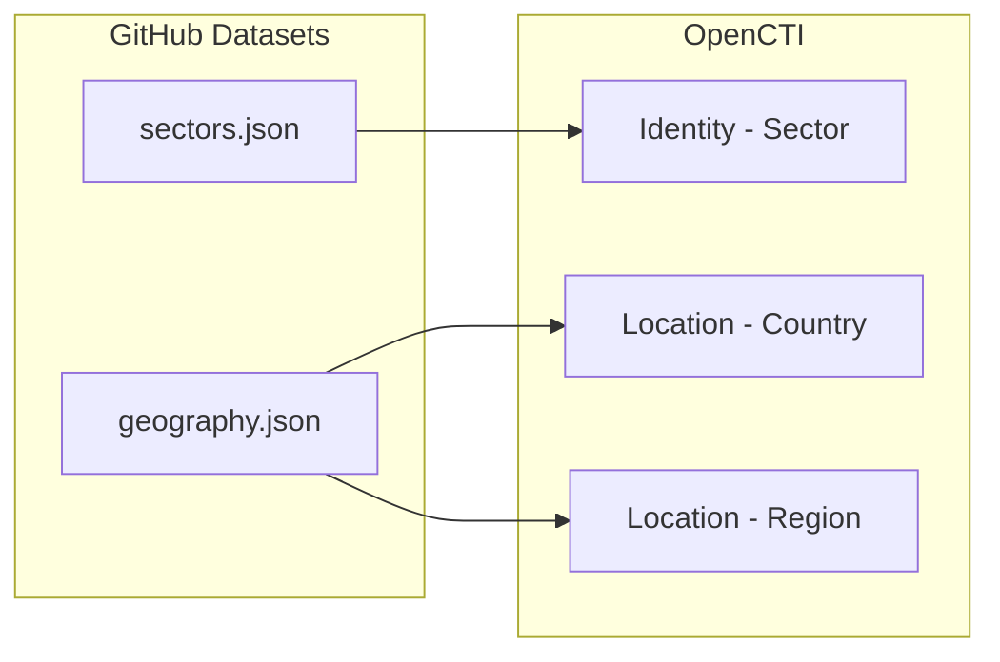

# OpenCTI Datasets Connector

| Status | Date | Comment |
|--------|------|---------|
| Filigran Verified | -    | -       |

The OpenCTI Datasets connector imports reference data from the OpenCTI datasets repository to pre-populate your OpenCTI instance with foundational entities.

## Table of Contents

- [OpenCTI Datasets Connector](#opencti-datasets-connector)
  - [Table of Contents](#table-of-contents)
  - [Introduction](#introduction)
  - [Installation](#installation)
    - [Requirements](#requirements)
  - [Configuration variables](#configuration-variables)
    - [OpenCTI environment variables](#opencti-environment-variables)
    - [Base connector environment variables](#base-connector-environment-variables)
    - [Connector extra parameters environment variables](#connector-extra-parameters-environment-variables)
  - [Deployment](#deployment)
    - [Docker Deployment](#docker-deployment)
    - [Manual Deployment](#manual-deployment)
  - [Usage](#usage)
  - [Behavior](#behavior)
  - [Debugging](#debugging)
  - [Additional information](#additional-information)

## Introduction

This connector collects foundational reference data from the OpenCTI datasets repository to pre-populate your OpenCTI instance with essential entities:

- **Companies**: Organization identity objects
- **Industry Sectors**: Sector identity objects for targeting analysis
- **Countries and Regions**: Geographic location objects

These datasets provide the baseline reference data that other connectors and analysts can use to enrich and contextualize threat intelligence.

## Installation

### Requirements

- OpenCTI Platform >= 6.x
- Internet access to GitHub raw content

## Configuration variables

There are a number of configuration options, which are set either in `docker-compose.yml` (for Docker) or in `config.yml` (for manual deployment).

### OpenCTI environment variables

| Parameter     | config.yml | Docker environment variable | Mandatory | Description                                          |
|---------------|------------|-----------------------------|-----------|------------------------------------------------------|
| OpenCTI URL   | url        | `OPENCTI_URL`               | Yes       | The URL of the OpenCTI platform.                     |
| OpenCTI Token | token      | `OPENCTI_TOKEN`             | Yes       | The default admin token set in the OpenCTI platform. |

### Base connector environment variables

| Parameter         | config.yml      | Docker environment variable   | Default          | Mandatory | Description                                                                 |
|-------------------|-----------------|-------------------------------|------------------|-----------|-----------------------------------------------------------------------------|
| Connector ID      | id              | `CONNECTOR_ID`                |                  | Yes       | A unique `UUIDv4` identifier for this connector instance.                   |
| Connector Name    | name            | `CONNECTOR_NAME`              | OpenCTI Datasets | No        | Name of the connector.                                                      |
| Connector Scope   | scope           | `CONNECTOR_SCOPE`             | opencti          | No        | The scope or type of data the connector is importing.                       |
| Log Level         | log_level       | `CONNECTOR_LOG_LEVEL`         | info             | No        | Determines the verbosity of the logs: `debug`, `info`, `warn`, or `error`.  |

### Connector extra parameters environment variables

| Parameter              | config.yml             | Docker environment variable   | Default                                                                                  | Mandatory | Description                                      |
|------------------------|------------------------|-------------------------------|------------------------------------------------------------------------------------------|-----------|--------------------------------------------------|
| Interval               | config.interval        | `CONFIG_INTERVAL`             | 7                                                                                        | Yes       | Interval in days between connector runs.         |
| Remove Creator         | config.remove_creator  | `CONFIG_REMOVE_CREATOR`       | true                                                                                     | No        | Remove creator identity from imported objects.   |
| Sectors File URL       | config.sectors_file_url| `CONFIG_SECTORS_FILE_URL`     | https://raw.githubusercontent.com/OpenCTI-Platform/datasets/master/data/sectors.json    | No        | URL to sectors dataset (set to `false` to disable). |
| Geography File URL     | config.geography_file_url | `CONFIG_GEOGRAPHY_FILE_URL` | https://raw.githubusercontent.com/OpenCTI-Platform/datasets/master/data/geography.json  | No        | URL to geography dataset (set to `false` to disable). |

## Deployment

### Docker Deployment

Build the Docker image:

```bash
docker build -t opencti/connector-opencti:latest .
```

Configure the connector in `docker-compose.yml`:

```yaml
  connector-opencti:
    image: opencti/connector-opencti:latest
    environment:
      - OPENCTI_URL=http://localhost
      - OPENCTI_TOKEN=ChangeMe
      - CONNECTOR_ID=ChangeMe
      - CONNECTOR_NAME=OpenCTI Datasets
      - CONNECTOR_SCOPE=opencti
      - CONNECTOR_LOG_LEVEL=info
      - CONFIG_INTERVAL=7 # In days
      - CONFIG_REMOVE_CREATOR=true
      - CONFIG_SECTORS_FILE_URL=https://raw.githubusercontent.com/OpenCTI-Platform/datasets/master/data/sectors.json
      - CONFIG_GEOGRAPHY_FILE_URL=https://raw.githubusercontent.com/OpenCTI-Platform/datasets/master/data/geography.json
    restart: always
```

Start the connector:

```bash
docker compose up -d
```

### Manual Deployment

1. Create `config.yml` based on the provided sample.

2. Install dependencies:

```bash
pip3 install -r requirements.txt
```

3. Start the connector:

```bash
python3 main.py
```

## Usage

The connector runs automatically at the interval defined by `CONFIG_INTERVAL`. Dataset updates are infrequent; weekly polling (7 days) is recommended.

To force an immediate run:

**Data Management → Ingestion → Connectors**

Find the connector and click the refresh button to reset the state and trigger a new data fetch.

## Behavior

The connector fetches reference datasets from GitHub and imports them as STIX 2.1 objects.

### Data Flow



### Entity Mapping

| Dataset          | OpenCTI Entity      | Description                                      |
|------------------|---------------------|--------------------------------------------------|
| Sectors          | Identity (Sector)   | Industry sectors for targeting analysis          |
| Geography        | Location (Country)  | Country entities with ISO codes                  |
| Geography        | Location (Region)   | Geographic regions                               |

### Datasets Included

1. **Sectors Dataset** (`sectors.json`):
   - Industry sectors (Finance, Healthcare, Energy, etc.)
   - Used for target analysis and victim profiling

2. **Geography Dataset** (`geography.json`):
   - Countries with ISO codes and aliases
   - Geographic regions
   - Used for geographic attribution and targeting

## Debugging

Enable verbose logging:

```env
CONNECTOR_LOG_LEVEL=debug
```

## Additional information

- **Disabling Datasets**: Set dataset URL to `false` to skip (e.g., `CONFIG_SECTORS_FILE_URL=false`)
- **Update Frequency**: Datasets are updated infrequently; weekly polling is sufficient
- **Foundation Data**: This connector provides reference data used by other connectors
- **Reference**: [OpenCTI Datasets Repository](https://github.com/OpenCTI-Platform/datasets)
