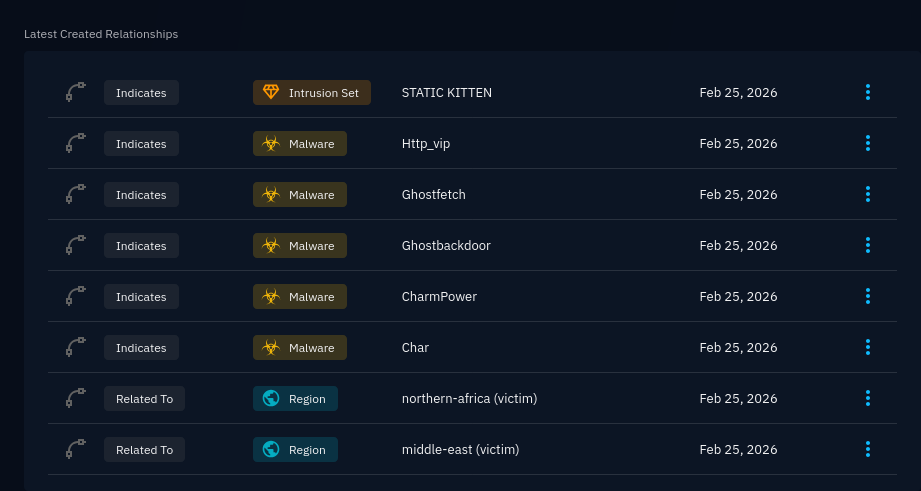
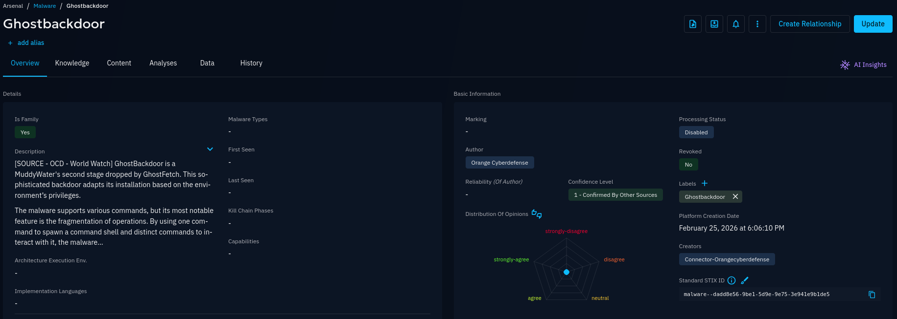
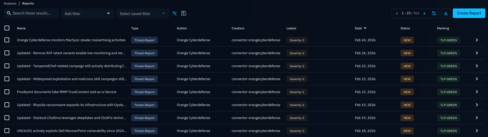

# CERT Orange Cyberdefense CTI Connector

| Status | Date | Comment |
|--------|------|---------|
| Partner | -    | -       |

## Summary

This connector allows you to ingest Orange Cyberdefense Datalake indicators to OpenCTI. Datalake is a subscription based CTI platform powered by [Orange Cyberdefense](https://www.orangecyberdefense.com).

## Supported entities

### OpenCTI entities

Depending on your configuration, the following OpenCTI entities might be imported:
- Observable
- Indicator
- Sighting
- Note
- Report
- _Attack Pattern, Campaign, Malware, Location, etc. Each of them corresponds to a Datalake Threat Library object._


### OpenCTI indicator types

When using `Datalake` or `World Watch` imports, the following indicator and observable types might be created.

| OpenCTI indicator type  | Datalake threat type |
| ----------------------- | -------------------- |
| Autonomous-System       | as                   |
| X509-Certificate        | certificate          |
| Cryptocurrency-Wallet   | crypto               |
| Domain-Name             | domain               |
| Email-Addr              | email                |
| StixFile                | file                 |
| IPv4-Addr               | ip, ip_range         |
| IPv6-Addr               | ip, ip_range         |
| Phone-Number            | phone_number         |
| URL                     | url                  |

## Installation

### Prerequisites

In order to install this connector, a subscription to [Orange Cyberdefense Datalake](https://datalake.cert.orangecyberdefense.com/) is **mandatory**. If you would like to try it, please contact us: [info.cert@fr.orangecyberdefense.com](mailto:info.cert@fr.orangecyberdefense.com).

Other prerequisites for using this connector includes:
- An operational OpenCTI on-prem or SaaS instance.
- An OpenCTI API token with write permissions.
  - As highlighted [in the official documentation regarding connectors](https://docs.opencti.io/latest/deployment/connectors/), a **dedicated** user account for each connector is recommended.
  - Make sure to understand OpenCTI's documentation page about [reliability and confidence](https://docs.opencti.io/latest/usage/reliability-confidence/) and choose a confidence level according to your needs.
  - With sufficient permissions, an user's API Token can be found in: _Gear Icon_ > Security > Users > _User details_.
- An active **Managed Threat Intelligence** (Datalake) subscription.
- A valid Datalake API "long term" token.
  - See [Creating a Datalake LongTerm Token](https://datalake.cert.orangecyberdefense.com/gui/my-account) to generate one.
- A valid World Watch API token.
  - Use `POST /api/auth/login/` to generate a login token.
  - Then, use `POST /api/api_keys/` to generate an API token.
  - API Documentation: [https://api-ww.cert.orangecyberdefense.com/api/docs](https://api-ww.cert.orangecyberdefense.com/api/docs)

### Installation

1. Copy the content under the `services:` section of the `docker-compose.yml` example file into your main OpenCTI docker configuration.
2. Replace the value of `OPENCTI_URL` with the OpenCTI container URL, usually `http://opencti:8080`.
3. Replace the value of `OPENCTI_TOKEN` with the token of the dedicated OpenCTI user you created for this integration (see [prerequisites](#prerequisites)).
4. Replace the value of `CONNECTOR_ID` with a randomly generated UUIDv4 (you can find UUID generators online).
5. Replace the value of `OCD_IMPORT_DATALAKE`, `OCD_IMPORT_THREAT_LIBRARY` and `OCD_IMPORT_WORLDWATCH` to enable the modules you want. Each one of these import types are detailed below.
6. If required by enabled modules, replace the value of `OCD_DATALAKE_TOKEN` with your Datalake API token. The account must have the Datalake `bulk_search` permission.
7. If required by enabled modules, replace the value of `OCD_WORLDWATCH_TOKEN` with your Datalake API token.
8. Replace or add other variables to customize the behavior of this connector according to your needs. See [this section below](#environment-variables) for a full list of supported environment variable.
9. Reload the connector's container configuration. If using Docker compose, this can be done using the `docker compose up -d` command.

### Troubleshooting

- Go to the connector's status page in OpenCTI: _Database Icon_ > Ingestion > Connectors > Orange Cyberdefense Cyber Threat Intelligence.
  - If it does not exists, there is probably an issue with your docker configuration.
  - Check that connector is marked as "Active".
- Check whether the connector's container exists and it's uptime.
  - `docker ps` if using Docker.
  - `kubectl get pod -n <namespace>` if using Kubernetes.
- Check the logs of the container running the connector.
  - `docker logs -f <container_id>` if using Docker.
  - `kubectl logs <pod_name> -n <namespace>` if using Kubernetes.
- Contact us, we're here to help!

## Usage

### Environment variables

| Parameter / Docker environment variables                                                      | Mandatory | Description |
|-----------------------------------------------------------------------------------------------|-----------|-------------|
| `opencti.url`<br/>`OPENCTI_URL`                                                               | Yes       | The URL of the OpenCTI platform. |
| `opencti.token`<br/>`OPENCTI_TOKEN`                                                           | Yes       | The default admin token configured in the OpenCTI platform parameters file. |
| `connector.id`<br/>`CONNECTOR_ID`                                                             | Yes       | A valid arbitrary `UUIDv4` that must be unique for this connector. |
| `connector.name`<br/>`CONNECTOR_NAME`                                                         | Yes       | `Orange Cyberdefense Cyber Threat Intelligence` |
| `connector.log_level`<br/>`CONNECTOR_LOG_LEVEL`                                               | No        | Log output for the connector. Defaults to `INFO`. |
| `ocd.import_datalake`<br/>`OCD_IMPORT_DATALAKE`                                               | Yes       | Set if you want to ingest indicators collections from the Datalake. Defaults to `true`. |
| `ocd.import_threat_library`<br/>`OCD_IMPORT_THREAT_LIBRARY`                                   | Yes       | If `true`, at each run the latest 500 entries (Malware, Intrusion Set, Tools, Attack Patterns, Vulnerabilities, ...) from the [Datalake Threat Library](https://datalake.cert.orangecyberdefense.com/gui/threats-library) will be ingested. Defaults to `true`. |
| `ocd.import_worldwatch`<br/>`OCD_IMPORT_WORLDWATCH`                                           | Yes       | If `true`, World Watch reports will be ingested into OpenCTI. Defaults to `true`. |
| `ocd.datalake_env`<br/>`OCD_DATALAKE_ENV`                                                     | No        | ⚠️ Advanced setting* - Datalake environment to use: `prod` or `preprod`. Defaults to `prod`. |
| `ocd.datalake_token`<br/>`OCD_DATALAKE_TOKEN`                                                 | No        | Long Term Token used to access Datalake API. Mandatory if `OCD_IMPORT_DATALAKE` or `OCD_IMPORT_THREAT_LIBRARY` set to `true`. |
| `ocd.datalake_queries`<br/>`OCD_DATALAKE_QUERIES`                                             | No        | List of search `query_hash` for indicator's collection you want to ingest. Mandatory if `OCD_IMPORT_DATALAKE` set to `true`. |
| ~~`ocd.create_observables`~~<br/>~~`OCD_CREATE_OBSERVABLES`~~                                 | No        | 🛑 Deprecated - Use `OCD_WORLDWATCH_START_DATE` instead. |
| `ocd.datalake_create_observables`<br/>`OCD_DATALAKE_CREATE_OBSERVABLES`                       | No        | Create observables from indicators. Defaults to `true`. |
| ~~`ocd.ignore_unscored_indicators`~~<br/>~~`OCD_IGNORE_UNSCORED_INDICATORS`~~                 | No        | 🛑 Deprecated - Use `OCD_DATALAKE_IGNORE_UNSCORED_INDICATORS` instead. |
| `ocd.datalake_ignore_unscored_indicators`<br/>`OCD_DATALAKE_IGNORE_UNSCORED_INDICATORS`       | No        | If `true`, Datalake indicators that do not have any score will NOT be imported into OpenCTI. Defaults to `true`. |
| ~~`ocd.ignore_whitelisted_indicators`~~<br/>~~`OCD_IGNORE_WHITELISTED_INDICATORS`~~           | No        | 🛑 Deprecated - Use `OCD_DATALAKE_IGNORE_WHITELISTED_INDICATORS` instead. |
| `ocd.datalake_ignore_whitelisted_indicators`<br/>`OCD_DATALAKE_IGNORE_WHITELISTED_INDICATORS` | No        | If `true`, Datalake indicators that are whitelisted NOT be imported into OpenCTI. Defaults to `true`. |
| ~~`ocd.fallback_score`~~<br/>~~`OCD_FALLBACK_SCORE`~~                                         | No        | 🛑 Deprecated - Use `OCD_DATALAKE_FALLBACK_SCORE` instead. |
| `ocd.datalake_fallback_score`<br/>`OCD_DATALAKE_FALLBACK_SCORE`                               | No        | If `OCD_DATALAKE_IGNORE_UNSCORED_INDICATORS` is set to `false`, this value will be used as a default for Datalake indicators without any score. Defaults to `0`. |
| `ocd.datalake_add_tags_as_labels`<br/>`OCD_DATALAKE_ADD_TAGS_AS_LABELS`                       | No        | Whether to add Datalake tags as labels to the imported indicators. Defaults to `true`. |
| `ocd.datalake_add_scores_as_labels`<br/>`OCD_DATALAKE_ADD_SCORES_AS_LABELS`                   | No        | Whether to add Datalake threat scores as labels to the imported indicators. Full explanation in [this section below](#about-scoring). Defaults to `true`. |
| `ocd.datalake_add_score`<br/>`OCD_DATALAKE_ADD_SCORE`                                         | No        | Whether to add score to the imported indicators (overwrite existing). Full explanation in [this section below](#about-scoring). Defaults to `true`. |
| `ocd.datalake_add_tlp`<br/>`OCD_DATALAKE_ADD_TLP`                                             | No        | Whether to add a TLP marking to the imported indicators (overwrite existing). Defaults to `true`. |
| `ocd.datalake_add_extref`<br/>`OCD_DATALAKE_ADD_EXTREF`                                       | No        | Whether to add external references to the imported indicators. This typically adds a direct link to the matching Datalake threat and other external references stored in Datalake. Defaults to `true`. |
| `ocd.datalake_add_summary`<br/>`OCD_DATALAKE_ADD_SUMMARY`                                     | No        | Whether to add a threat summary as a note to the imported indicators. It contains a breakdown of the score by threat categories, and a list of sources. Defaults to `true`. |
| `ocd.datalake_add_related`<br/>`OCD_DATALAKE_ADD_RELATED`                                     | No        | Whether to import objects from the Threat Library related to imported indicators, such as malwares, campaigns, etc. Full explanation in [this section below](#about-related-entities). Defaults to `true`. |
| `ocd.datalake_add_sightings`<br/>`OCD_DATALAKE_ADD_SIGHTINGS`                                 | No        | Whether to import positive sightings from Datalake. Full explanation in [this section below](#about-sightings). Defaults to `true`. |
| `ocd.datalake_add_createdby`<br/>`OCD_DATALAKE_ADD_CREATEDBY`                                 | No        | Whether to add a reference to "Orange Cyberdefense" organization as author of OpenCTI objects. Defaults to `true`. |
| `ocd.datalake_zip_file_path`<br/>`OCD_DATALAKE_ZIP_FILE_PATH`                                 | No        | ⚠️ Advanced setting* - Path were temporary ZIP files will be saved. Defaults to `/opt/opencti-connector-orange-cyberdefense/data`. |
| `ocd.datalake_zip_file_delete`<br/>`OCD_DATALAKE_ZIP_FILE_DELETE`                             | No        | ⚠️ Advanced setting* - If `true`, temporary ZIP files will be deleted after processing. Defaults to `true`. |
| ~~`ocd.curate_labels`~~<br/>~~`OCD_CURATE_LABELS`~~                                           | No        | 🛑 Deprecated - Use `OCD_DATALAKE_CURATE_LABELS` instead. |
| `ocd.datalake_curate_labels`<br/>`OCD_DATALAKE_CURATE_LABELS`                                 | No        | ⚠️ Advanced setting* - Adapt Datalake CTI tags as STIX labels. Defaults to `true`. |
| ~~`ocd.threat_actor_as_intrusion_set`~~<br/>~~`OCD_THREAT_ACTOR_AS_INTRUSION_SET`~~           | No        | 🛑 Deprecated - Use `OCD_DATALAKE_THREAT_ACTOR_AS_INTRUSION_SET` instead. |
| `ocd.datalake_threat_actor_as_intrusion_set`<br/>`OCD_DATALAKE_THREAT_ACTOR_AS_INTRUSION_SET` | No        | ⚠️ Advanced setting* - Transform Threat Actor objects from Datalake to Intrusion Set objects. Defaults to `true`. |
| ~~`ocd.import_worldwatch_api_key`~~<br/>~~`OCD_IMPORT_WORLDWATCH_API_KEY`~~                   | No        | 🛑 Deprecated - Use `OCD_WORLDWATCH_API_KEY` instead. |
| `ocd.worldwatch_api_key`<br/>`OCD_WORLDWATCH_API_KEY`                                         | No        | WorldWatch API Key. Mandatory if `OCD_IMPORT_WORLDWATCH` set to `true`. |
| ~~`ocd.import_worldwatch_start_date`~~<br/>~~`OCD_IMPORT_WORLDWATCH_START_DATE`~~             | No        | 🛑 Deprecated - Use `OCD_WORLDWATCH_START_DATE` instead. |
| `ocd.worldwatch_start_date`<br/>`OCD_WORLDWATCH_START_DATE`                                   | No        | Start date for import of World Watch reports. Defaults to `2026-01-01`. Mandatory if `OCD_IMPORT_WORLDWATCH` set to `true`. |
| `ocd.worldwatch_import_indicators`<br/>`OCD_WORLDWATCH_IMPORT_INDICATORS`                     | No        | Whether to import indicators from Datalake related to imported reports. Full explanation in [this section below](#related-indicators-and-entities). Defaults to `true`. |
| `ocd.worldwatch_import_indicators_lookback`<br/>`OCD_WORLDWATCH_IMPORT_INDICATORS_LOOKBACK`   | No        | ⚠️ Advanced setting* - How far (in seconds) to look back for indicators related to imported reports, based on their update time. Defaults to `2592000` (30 days). |
| `ocd.worldwatch_import_threat_entities`<br/>`OCD_WORLDWATCH_IMPORT_THREAT_ENTITIES`           | No        | Whether to import objects from the Threat Library related to imported reports, such as malwares, campaigns, etc. Full explanation in [this section below](#related-indicators-and-entities). Defaults to `true`. |
| `ocd.interval`<br/>`OCD_INTERVAL`                                                             | No        | Time interval in minutes defining the frequency of the data ingestion process. Minimum recommended `30`. Defaults to `30`. |
| `ocd.reset_state`<br/>`OCD_RESET_STATE`                                                       | No        | ⚠️ Advanced setting* - Force the use of the start date from the config instead of getting the state saved in OpenCTI. Full explanation in [this section below](#about-connector-state). Defaults to `false`. |

Parameters prefixed by "⚠️ Advanced setting" are intended for users with very specific needs or developers. Do not edit these values if you're not 100% sure to understand the implications. Most of the time, default values will work just fine, so we recommend you omit these values from your configuration.

### Datalake import

Enabled by the environment variable `OCD_IMPORT_DATALAKE`, this import type import indicators from Datalake based on predefined queries.

Notes:
- When enabling this import type, the variables `OCD_DATALAKE_TOKEN` and `OCD_DATALAKE_QUERIES` are also required.
- Although the import is based on a query hash, an additional filter is added to prevent overloaded queries and duplicate imports. This results in the exclusion of indicators older than n seconds, where `n = OCD_INTERVAL + 15 * 60`.
  - Because of this, it make take a few days for the data to be representative.
  - This additional time constraint is only applied when the main query operator is 'AND', which is the default.
- Parameters related to this import type (starting with `OCD_DATALAKE_`) also applies for indicators ingested by World Watch imports (see below in [this section dedicated to World Watch imports](#world-watch-import)).

#### About scoring

For each unique IOC, Orange Cyberdefense Datalake currently defines a total of 9 threat scores between 0 and 100. Each of these scores correspond to one of these threat types: `DDoS,Fraud,Hack,Leak,Malware,Phishing,Scam,Scan,Spam`. On the other hand, OpenCTI only defines one score per observable/indicator.

To handle this, when a match is found:
- When the `OCD_DATALAKE_ADD_SCORE` flag is set to `true`:
  - We set the OpenCTI indicator's score to the **highest** score among Datalake threat scores.
  - For a given threat, **if every Datalake threat score is empty**, the OpenCTI indicator's **score is left unchanged**.
- When the `OCD_DATALAKE_ADD_SCORES_AS_LABELS` flag is set to `true`:
  - For a given threat, **for each threat score that is not empty** in Datalake, we add a label corresponding to **the score range of that type**. These labels operates **using a step of 10** rather than displaying the exact score.
  - Example: If a given threat has a score of `87` in `Malware`, `40` in `Spam` and nothing in the others, labels `dtl_malware_80` and `dtl_spam_40` will be added.
- When the `OCD_DATALAKE_ADD_SUMMARY` flag is set to `true`:
  - The full list of threat scores is also available as a table in a note attached to the OpenCTI indicator.

#### About query hashes

On Datalake, you might want to run different queries depending on your needs. Every time new a search is run, the full query body is saved and the corresponding query hash is returned along the result. This way, sophisticated queries can be saved and re-used easily.

The `OCD_DATALAKE_QUERIES` environment variable expects a json array containing query hashes, as illustrated below.

```json
// Minified version (should be used in the env variable)
[{"query_hash":"bb08a750538baea3e1c8cda0ae5b3aca","label":"high_confidence_network_iocs"},{"query_hash":"1ac760cbaec854a6c463d92c8f862c98","label":"ocd_peerpressure_c2_tracker"}]

// Beautified version
[
    {
        "query_hash": "bb08a750538baea3e1c8cda0ae5b3aca",
        "label": "high_confidence_network_iocs"
    },
    {
        "query_hash": "1ac760cbaec854a6c463d92c8f862c98",
        "label": "ocd_peerpressure_c2_tracker"
    }
]
```

#### About related entities

Orange Cyberdefense Datalake, through the use of it's Threat Library, is often able to make a connection between a given IOC and it's related entities, such as attack pattern, malware, vulnerability, etc.

When the `OCD_DATALAKE_ADD_RELATED` flag is set to `true`, the following will happen:
- If an imported indicator has a match in Datalake with the following threat entities, a corresponding entity will be created in OpenCTI.
  - `Attack Pattern`
  - `Campaign`
  - `Infrastructure`
  - `Intrusion Set*`
  - `Malware`
  - `Threat Actor*`
  - `Tool`
- These threat entities will be linked to the `Indicator` entity through a relationship.

*If `OCD_DATALAKE_THREAT_ACTOR_AS_INTRUSION_SET` is `true`, an `Intrusion Set` instead of a `Threat Actor` will be created when a `Threat Actor` threat entity is found on Datalake. This is the default as it makes more sense from a STIX and OpenCTI point of view.

If you rather want to import every threat entities, you should use the [Threat Library import](#threat-library-import) instead.

#### About sightings

Not only Datalake, but OpenCTI and the STIX standard all supports the concept of "sightings", but all three of them have their specificities.

- Datalake sightings
  - Are linked to a threat/atom
  - Are positive, negative or neutral
  - Can have 2 different sightings for the same source/target
  - Supports multiple "where_sighted_refs" targets
- OpenCTI sightings
  - Are linked to an indicator or an observable
  - Are positive or negative (STIX custom property "x_opencti_negative")
  - Cannot have 2 different sightings for the same source/target
  - Does not support multiple "where_sighted_refs" targets
- STIX sightings
  - The most basic one, the other two must AT LEAST be compliant with the standard
  - Has no concept of positive/negative
  - Supports multiple "where_sighted_refs" targets

Therefore, what can be seen as multiple positive sightings for a single indicator on Datalake might appear as one sighting with a longer observation period. Please also note that currently, only positive sightings are exported to OpenCTI.

### Threat Library import

Enabled by the `OCD_IMPORT_THREAT_LIBRARY` environment variable, this import type ingests Datalake Threat Libraries items, such as Attack Pattern, Campaign, Malware, etc.

Notes:
- Only the 500 most recently updated entities are imported to prevent overloaded queries.
  - Because of this, it make take a few days for the data to be representative.
- Even when this import type is disabled, Threat Library entities can still be imported when they are related to an indicator imported by Datalake or World Watch import types, if the `OCD_DATALAKE_ADD_RELATED` environment variable is enabled.
- Most items of the Threat Library have a direct equivalent in OpenCTI, but some can be been translated.
  - If `OCD_DATALAKE_THREAT_ACTOR_AS_INTRUSION_SET` is enabled, every `Threat Actor` from Datalake will be imported as an `Intrusion Set` instead. This is the default as it makes more sense from a STIX and OpenCTI point of view.


If you rather want to import only threat entities linked to specific indicators, you should use the [Datalake import with related entities import](#about-related-entities) instead.

### World Watch import

Enabled by the `OCD_IMPORT_WORLDWATCH` environment variable, this import type ingests [World Watch](https://www.orangecyberdefense.com/global/offering/managed-services/threat-intelligence/world-watch) Threat Intelligence reports. Each report is tagged with a severity level between 0 and 5, and is directly readable inside the OpenCTI platform.

When enabling this import type, the variable `OCD_WORLDWATCH_TOKEN` is also required. The date from which to import reports can be controlled with the environment variable `OCD_WORLDWATCH_START_DATE`.

#### Related indicators and entities

World Watch reports sometimes references Datalake queries in relation to the investigation topics. Depending on the value of the `OCD_WORLDWATCH_IMPORT_INDICATORS` environment variable, indicators from these queries can be imported. **This operation may take a long time, especially the first time you're using this connector.**

Likewise, those reports may also references threat entities that can be fetched from the Threat Library. This can be controlled with the `OCD_WORLDWATCH_IMPORT_INDICATORS` environment variable.

Both of those variables are enabled by default. **If using at least one of them, the variable `OCD_DATALAKE_TOKEN` must also be set.**

## About connector state

In OpenCTI, the connector state is a way for connectors to persist some data between executions. In this connector, the state is used to save the date of the last execution of each of the import types. This improves performance as older information is not imported again.

In some cases, you might want to reset the state and import data from scratch again. To achieve this, you can either reset the state from the connector's page in OpenCTI or use the `OCD_RESET_STATE` parameter.

This is an example of what the state could looks like:
```json
{
  "worldwatch": "2024-11-29T13:52:50+01:00", // latest World Watch report ingested
  "datalake": "2024-12-17T09:28:11.206244+01:00", // latest refresh of the indicators ingested from "datalake_queries"
  "threat_library": "2024-12-17T09:28:11.206811+01:00", // latest ingest of the threat library entities
}
```

## Screenshots

### Indicators




### Malwares


### Intrusion Sets


### World Watch reports
