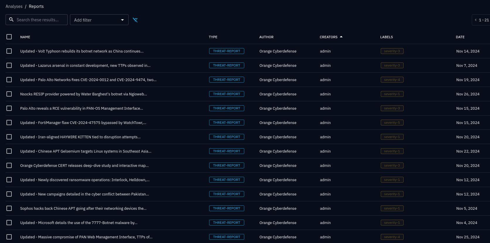
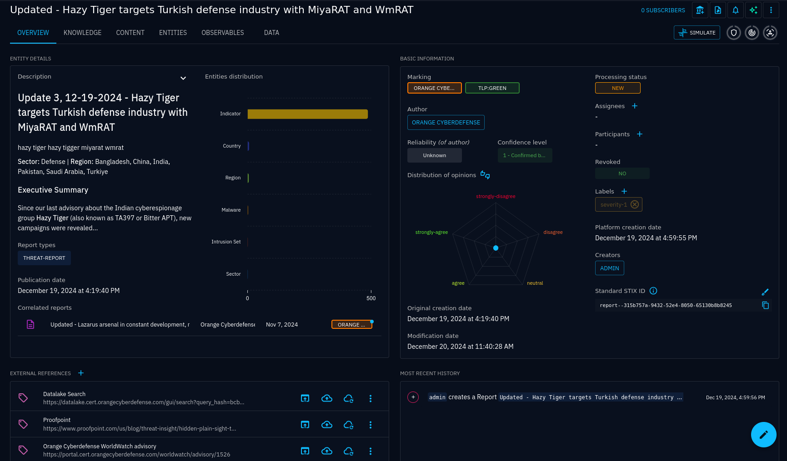
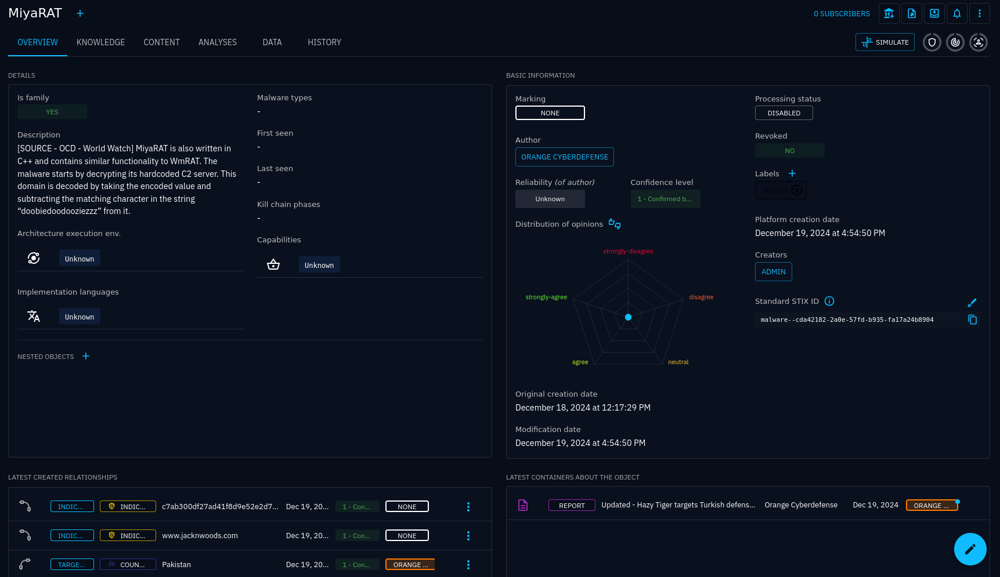
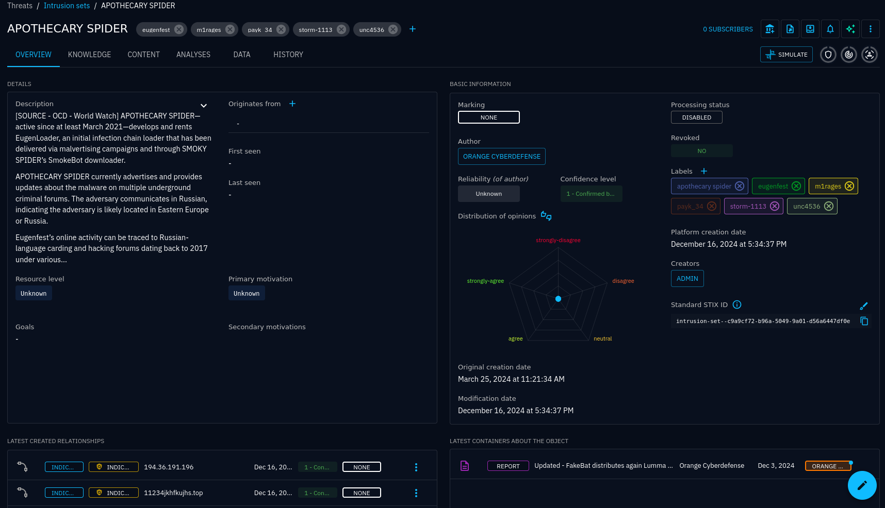
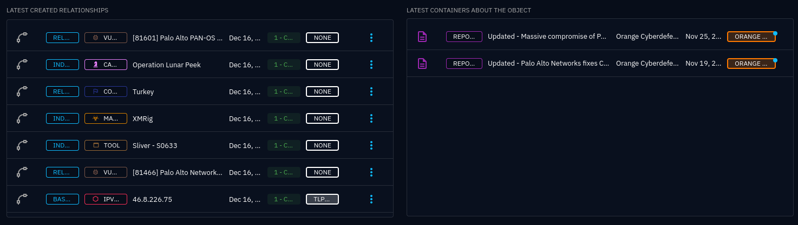
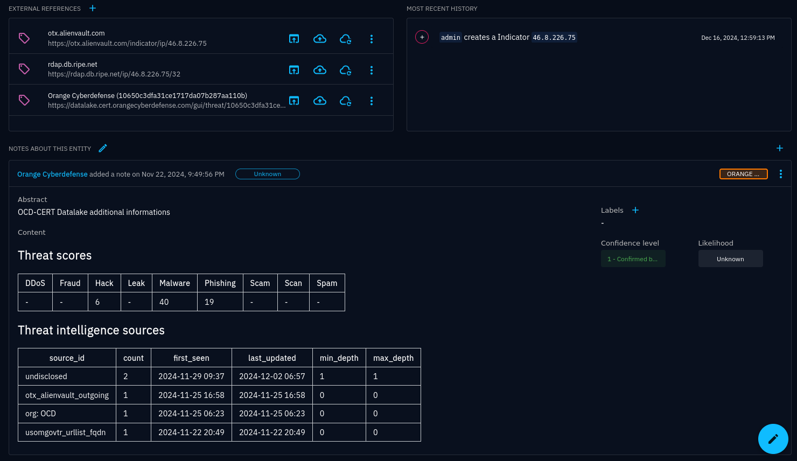

# CERT Orange Cyberdefense CTI Connector

## Objective

This connector allows to ingest into OpenCTI the Cyber Threat Intelligence provided by the ***CERT Orange Cybderdefense***.

Depending on its configuration and your subscription level it will ingest **Indicators**, **Reports**, **Vulnerabilities**, **Intrusion Set**, **Malwares**, ...

## Prerequisites
- An operational OpenCTI on-prem instance with administrator privileges or an OpenCTI Saas version
- An active **Managed Threat Intelligence** subscription (Datalake) : https://datalake.cert.orangecyberdefense.com/. If you want to test Datalake CTI please contact : info.cert@fr.orangecyberdefense.com 
  - [Creating a Datalake LongTerm Token](https://datalake.cert.orangecyberdefense.com/gui/my-account) for accessing Datalake API
  - [Getting a WorldWatch API key](https://api-ww.cert.orangecyberdefense.com/api/docs) to ingest WorldWatch reports

## Configuration

| Parameter                       | Docker envvar                       | Mandatory | Description                                                                                                                                                                                                                                                     |
|---------------------------------|-------------------------------------|-----------|-----------------------------------------------------------------------------------------------------------------------------------------------------------------------------------------------------------------------------------------------------------------|
| `opencti_url`                   | `OPENCTI_URL`                       | Yes       | The URL of the OpenCTI platform.                                                                                                                                                                                                                                |
| `opencti_token`                 | `OPENCTI_TOKEN`                     | Yes       | The default admin token configured in the OpenCTI platform parameters file.                                                                                                                                                                                     |
| `connector_id`                  | `CONNECTOR_ID`                      | Yes       | A valid arbitrary `UUIDv4` that must be unique for this connector.                                                                                                                                                                                              |
| `connector_name`                | `CONNECTOR_NAME`                    | Yes       | `Orange Cyberdefense Cyber Threat Intelligence`                                                                                                                                                                                                                 |
| `connector_scope`               | `CONNECTOR_SCOPE`                   | Yes       | `ocd`                                                                                                                                                                                                                                                           |
| `update_existing_data`          | `CONNECTOR_UPDATE_EXISTING_DATA`    | Yes       | Update data already ingested into the platform.                                                                                                                                                                                                                 |
| `log_level`                     | `CONNECTOR_LOG_LEVEL`               | No        | Log output for the connector. Defaults to `INFO`.                                                                                                                                                                                                               |
| `import_datalake`               | `OCD_IMPORT_DATALAKE`               | Yes       | Set if you want to ingest indicators collections from the Datalake. Defaults to `True`.                                                                                                                                                                         |
| `datalake_token`                | `OCD_DATALAKE_TOKEN`                | No        | Long Term Token used to access Datalake API. Mandatory if `OCD_IMPORT_DATALAKE` or `OCD_IMPORT_THREAT_LIBRARY` set to `True`.                                                                                                                                                                  |
| `datalake_zip_file_path`        | `OCD_DATALAKE_ZIP_FILE_PATH`        | No        | Path were temporary ZIP files will be saved. Defaults to `/opt/opencti-connector-orange-cyberdefense`.                                                                                                                                                          |
| `datalake_queries`              | `OCD_DATALAKE_QUERIES`              | No        | List of search `query_hash` for indicator's collection you want to ingest. Mandatory if `OCD_IMPORT_DATALAKE` set to `True`.                                                                                                                                    |
| `import_threat_library`         | `OCD_IMPORT_THREAT_LIBRARY`         | Yes       | If `True`, at each run the latest 500 entries (Malware, Intrusion Set, Tools, Attack Patterns, Vulnerabilities, ...) from the [Datalake Threat Library](https://datalake.cert.orangecyberdefense.com/gui/threats-library) will be ingested. Defaults to `True`. |
| `import_worldwatch`             | `OCD_IMPORT_WORLDWATCH`             | Yes       | If `True`, World Watch reports will be ingested into OpenCTI. Defaults to `True`.                                                                                                                                                                               |
| `import_worldwatch_start_date`  | `OCD_IMPORT_WORLDWATCH_START_DATE`  | No        | Start date for import of World Watch reports. Defaults to `2022-01-01`. Mandatory if `OCD_IMPORT_WORLDWATCH` set to `True`.                                                                                                                                     |
| `import_worldwatch_api_key`     | `OCD_IMPORT_WORLDWATCH_API_KEY`     | No        | WorldWatch API Key. Mandatory if `OCD_IMPORT_WORLDWATCH` set to `True`.                                                                                                                                                                                         |
| `interval`                      | `OCD_INTERVAL`                      | Yes       | Time interval in minutes defining the frequency of the data ingestion process. Minimum recommended `30`. Defaults to `30`.                                                                                                                                      |
| `create_observables`            | `OCD_CREATE_OBSERVABLES`            | No        | Create observables from indicators. Defaults to `True`.                                                                                                                                                                                                         |
| `curate_labels`                 | `OCD_CURATE_LABELS`                 | No        | Adapt Datalake CTI tags as STIX labels. Defaults to `True`.                                                                                                                                                                                                     |
| `threat_actor_as_intrusion_set` | `OCD_THREAT_ACTOR_AS_INTRUSION_SET` | No        | Transform Threat Actor objects from Datalake to Intrusion Set objects. Defaults to `True`.                                                                                                                                                                      |
| `reset_state`                   | `OCD_RESET_STATE`                   | No        | Force the use of the start date from the config instead of getting the state saved in OpenCTI. Defaults to `False`.                                                                                                                                             |

## Orange Cyberdefense Intelligence in OpenCTI

First of all, check if the connector is running and up to date.
Go to Data > Ingestion > Connectors > Orange Cyberdefense Cyber Threat Intelligence
On this page, you can find the following information:
- Basic information > Last update: last update date of the connector in OpenCTI
- Details > State: provides information about the latest update of data for each category
```json
{
  "worldwatch": "2024-11-29T13:52:50Z", #latest World Watch report ingested
  "datalake": "2024-12-17T09:28:11.206244+01:00", #latest refresh of the indicators ingested from "datalake_queries"
  "threat_library": "2024-12-17T09:28:11.206811+01:00", #latest ingest of the threat library entities
}
```
### WorldWatch reports in OpenCTI



### Malware in OpenCTI


### Intrusion Set in OpenCTI


### Indicators in OpenCTI


