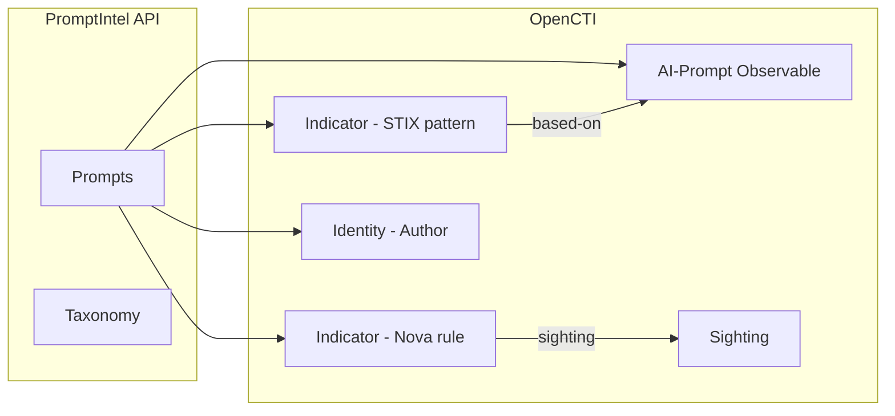

# OpenCTI PromptIntel Connector

| Status    | Date | Comment |
|-----------|------|---------|
| Community | -    | -       |

The PromptIntel connector imports adversarial AI prompt intelligence — Indicators of Prompt Compromise (IoPC) — from the [PromptIntel](https://promptintel.novahunting.ai) platform into OpenCTI.

## Table of Contents

- [OpenCTI PromptIntel Connector](#opencti-promptintel-connector)
  - [Table of Contents](#table-of-contents)
  - [Introduction](#introduction)
  - [Installation](#installation)
    - [Requirements](#requirements)
  - [Configuration variables](#configuration-variables)
    - [OpenCTI environment variables](#opencti-environment-variables)
    - [Base connector environment variables](#base-connector-environment-variables)
    - [Connector extra parameters environment variables](#connector-extra-parameters-environment-variables)
  - [Deployment](#deployment)
    - [Docker Deployment](#docker-deployment)
    - [Manual Deployment](#manual-deployment)
  - [Usage](#usage)
  - [Behavior](#behavior)
  - [Debugging](#debugging)
  - [Additional information](#additional-information)

## Introduction

[PromptIntel](https://promptintel.novahunting.ai) is a collaborative threat intelligence platform for tracking and defending against adversarial AI prompts. It maintains a registry of Indicators of Prompt Compromise (IoPC) — real-world prompt injections, jailbreaks, and other LLM attacks collected from security researchers and open-source intelligence.

This connector imports prompts from the PromptIntel API and models them in OpenCTI as:

- **AI-Prompt observables** containing the raw adversarial prompt text.
- **STIX Indicators** with `pattern_type=stix` and a pattern of the form `[ai-prompt:value = '...']`.
- **Relationships** (`based-on`) linking each indicator to its observable.
- **Nova Indicators** (`pattern_type=nova`) when a Nova detection rule is available, together with a **Sighting** at the PromptIntel organization.

Each prompt is enriched with:

- **Labels** derived from PromptIntel categories (`manipulation`, `abuse`, `patterns`, `outputs`), threat types (e.g. `Jailbreak`, `Direct prompt injection`), and free-form tags.
- **Score** (0–100) computed from the severity level and the community rating.
- **External references** linking back to the PromptIntel page and any reference URLs provided by the author.
- **Author identity** — classified as an individual (when the name clearly matches a "Firstname Lastname" pattern) or an organization otherwise.

## Installation

### Requirements

- OpenCTI Platform >= 6.6.2
- A PromptIntel API key (obtain one at <https://promptintel.novahunting.ai>)

## Configuration variables

There are a number of configuration options, which are set either in `docker-compose.yml` (for Docker) or in `config.yml` (for manual deployment).

### OpenCTI environment variables

| Parameter     | config.yml | Docker environment variable | Mandatory | Description                                          |
|---------------|------------|-----------------------------|-----------|------------------------------------------------------|
| OpenCTI URL   | `url`      | `OPENCTI_URL`               | Yes       | The URL of the OpenCTI platform.                     |
| OpenCTI Token | `token`    | `OPENCTI_TOKEN`             | Yes       | The default admin token set in the OpenCTI platform. |

### Base connector environment variables

| Parameter       | config.yml        | Docker environment variable | Default       | Mandatory | Description                                                                |
|-----------------|-------------------|-----------------------------|---------------|-----------|----------------------------------------------------------------------------|
| Connector ID    | `id`              | `CONNECTOR_ID`              |               | Yes       | A unique `UUIDv4` identifier for this connector instance.                  |
| Connector Name  | `name`            | `CONNECTOR_NAME`            | PromptIntel   | No        | Name of the connector.                                                     |
| Connector Scope | `scope`           | `CONNECTOR_SCOPE`           | promptintel   | No        | The scope or type of data the connector is importing.                      |
| Log Level       | `log_level`       | `CONNECTOR_LOG_LEVEL`       | info          | No        | Determines the verbosity of the logs: `debug`, `info`, `warn`, or `error`. |
| Duration Period | `duration_period` | `CONNECTOR_DURATION_PERIOD` | PT1H          | No        | Time interval between connector runs in ISO 8601 format.                   |

### Connector extra parameters environment variables

| Parameter          | config.yml                     | Docker environment variable        | Default                                              | Mandatory | Description                                                                          |
|--------------------|--------------------------------|------------------------------------|------------------------------------------------------|-----------|--------------------------------------------------------------------------------------|
| API URL            | `promptintel.api_url`          | `PROMPTINTEL_API_URL`              | `https://api.promptintel.novahunting.ai/api/v1`      | No        | Base URL for the PromptIntel API.                                                    |
| API Key            | `promptintel.api_key`          | `PROMPTINTEL_API_KEY`              |                                                      | Yes       | API key for authenticating with PromptIntel.                                         |
| TLP Level          | `promptintel.tlp_level`        | `PROMPTINTEL_TLP_LEVEL`            | clear                                                | No        | TLP marking: `clear`, `green`, `amber`, `amber+strict`, `red`.                      |
| Severity Filter    | `promptintel.severity_filter`  | `PROMPTINTEL_SEVERITY_FILTER`      |                                                      | No        | Filter prompts by severity: `critical`, `high`, `medium`, `low`. Empty for all.      |
| Category Filter    | `promptintel.category_filter`  | `PROMPTINTEL_CATEGORY_FILTER`      |                                                      | No        | Filter by category: `manipulation`, `abuse`, `patterns`, `outputs`. Empty for all.   |
| Import Start Limit | `promptintel.import_start_limit` | `PROMPTINTEL_IMPORT_START_LIMIT` | 5000                                                 | No        | Maximum number of prompts to fetch on the very first run (historical backfill).       |
| Import Limit       | `promptintel.import_limit`     | `PROMPTINTEL_IMPORT_LIMIT`         | 1000                                                 | No        | Maximum number of prompts to fetch on each subsequent hourly run.                     |

## Deployment

### Docker Deployment

Build the Docker image:

```bash
docker build -t opencti/connector-promptintel:latest .
```

Configure the connector in `docker-compose.yml`:

```yaml
  connector-promptintel:
    image: opencti/connector-promptintel:latest
    environment:
      - OPENCTI_URL=http://localhost
      - OPENCTI_TOKEN=ChangeMe
      - CONNECTOR_ID=ChangeMe
      - CONNECTOR_NAME=PromptIntel
      - CONNECTOR_SCOPE=promptintel
      - CONNECTOR_LOG_LEVEL=info
      - CONNECTOR_DURATION_PERIOD=PT1H
      - PROMPTINTEL_API_URL=https://api.promptintel.novahunting.ai/api/v1
      - PROMPTINTEL_API_KEY=ChangeMe
      - PROMPTINTEL_TLP_LEVEL=clear
      - PROMPTINTEL_IMPORT_START_LIMIT=5000
      - PROMPTINTEL_IMPORT_LIMIT=1000
    restart: always
```

Start the connector:

```bash
docker compose up -d
```

### Manual Deployment

1. Create `config.yml` based on `config.yml.sample`.

2. Install dependencies:

```bash
pip3 install -r requirements.txt
```

3. Start the connector from the `src` directory:

```bash
python3 main.py
```

## Usage

The connector runs automatically at the interval defined by `CONNECTOR_DURATION_PERIOD` (default: every hour). To force an immediate run:

**Data Management → Ingestion → Connectors**

Find the connector and click the refresh button to reset the state and trigger a new data fetch.

## Behavior

The connector fetches adversarial AI prompts from the PromptIntel API and imports them as STIX 2.1 objects.

### Import Strategy

The PromptIntel API does not support date-based filtering. To handle this efficiently:

- **First run**: the connector fetches up to `PROMPTINTEL_IMPORT_START_LIMIT` prompts (default 5 000) as a historical backfill.
- **Subsequent runs** (hourly): it fetches up to `PROMPTINTEL_IMPORT_LIMIT` prompts (default 1 000), stopping pagination early when it encounters already-imported IDs — the API returns the most recent prompts first, so hitting known IDs means the connector has caught up.

Imported prompt IDs are tracked in the connector state to avoid duplicates.

### Data Flow



### Entity Mapping

| PromptIntel Data          | OpenCTI Entity           | Description                                                   |
|---------------------------|--------------------------|---------------------------------------------------------------|
| Prompt text               | AI-Prompt (Observable)   | The raw adversarial prompt as a STIX Cyber Observable.        |
| Prompt metadata           | Indicator (`stix`)       | STIX Indicator with pattern `[ai-prompt:value = '...']`.      |
| Nova rule (when present)  | Indicator (`nova`)       | Detection rule indicator with `pattern_type=nova`.            |
| Author                    | Identity                 | Individual or Organization depending on the author name.      |
| Nova indicator + platform | Sighting                 | Sighting of the Nova indicator at the PromptIntel organization. |
| Indicator → Observable    | Relationship             | `based-on` relationship from indicator to observable.         |

### Score Computation

The OpenCTI score (0–100) is derived from two PromptIntel fields:

| Severity   | Base Score |
|------------|------------|
| Critical   | 85         |
| High       | 65         |
| Medium     | 45         |
| Low        | 25         |

A bonus of `average_score × 3` (community rating on a 0–5 scale, contributing 0–15 points) is added, capped at 100. For example:

| Severity | Community Rating | Final Score |
|----------|------------------|-------------|
| Critical | 5.0              | 100         |
| High     | 5.0              | 80          |
| High     | 0.0              | 65          |
| Medium   | 3.0              | 54          |
| Low      | 0.0              | 25          |

### Labels

Labels are built from three PromptIntel fields, all merged into a single flat list:

- **Categories**: `manipulation`, `abuse`, `patterns`, `outputs`
- **Threats**: e.g. `Jailbreak`, `Direct prompt injection`, `Encoding and obfuscation`, `Unicode tricks`
- **Tags**: free-form tags set by the author

### Author Classification

Authors are modeled as STIX Identities. A strict pattern-matching heuristic determines the identity class:

| Pattern                             | Identity Class | Examples                                      |
|-------------------------------------|----------------|-----------------------------------------------|
| `Firstname Lastname` (2 words, capitalized, alphabetic) | Individual     | Marco Pedrinazzi, Thomas Roccia               |
| `Firstname particle Lastname` (3 words, known particle) | Individual     | Jean de Vries                                 |
| Everything else                     | Organization   | trail of bits, 6mile, ewoodward, miggo security |

When in doubt the connector defaults to Organization to avoid false individuals.

### TLP Marking

All imported data is marked with the configured TLP level:

| TLP Level    | Description                                      |
|--------------|--------------------------------------------------|
| clear/white  | Publicly available information (default)         |
| green        | Limited disclosure to community                  |
| amber        | Limited disclosure, need-to-know basis           |
| amber+strict | Strict need-to-know within organization          |
| red          | Personal for named recipients only               |

## Debugging

Enable verbose logging:

```env
CONNECTOR_LOG_LEVEL=debug
```

Log output includes:

- API pagination progress and prompt counts
- STIX object creation per prompt
- Bundle sending status
- Errors for individual prompts (the connector continues processing the rest)

## Additional information

- **No authentication required for health check**: the `/health` endpoint is public.
- **API returns most-recent first**: the connector leverages this for efficient incremental imports.
- **Long prompt values**: some adversarial prompts are thousands of characters long — the full text is stored in both the observable value and the indicator pattern.
- **Nova rules**: when a prompt includes a `nova_rule`, an additional indicator with `pattern_type=nova` is created alongside a sighting at the PromptIntel organization.
- **Reference**: [PromptIntel Platform](https://promptintel.novahunting.ai)
