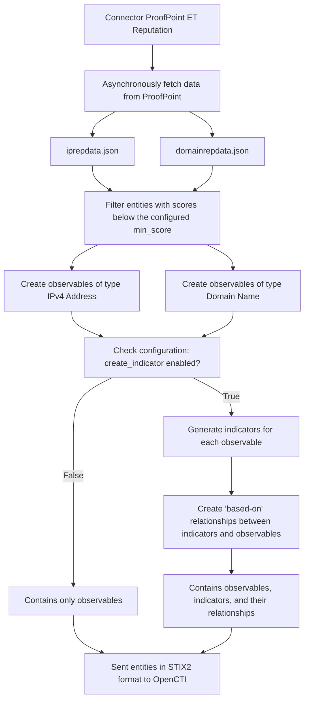
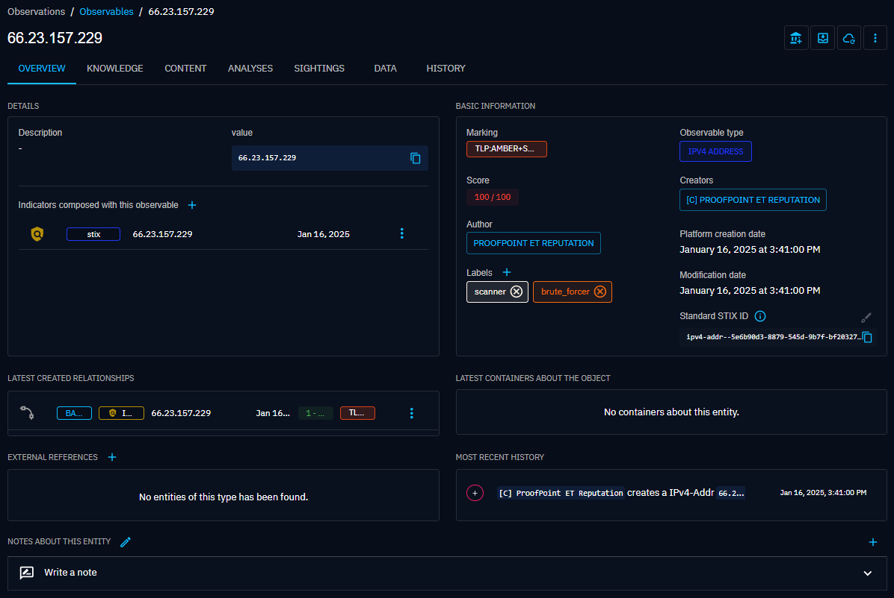
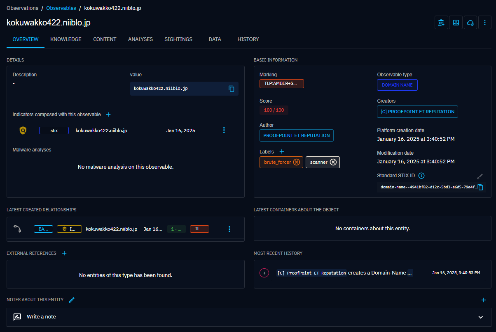
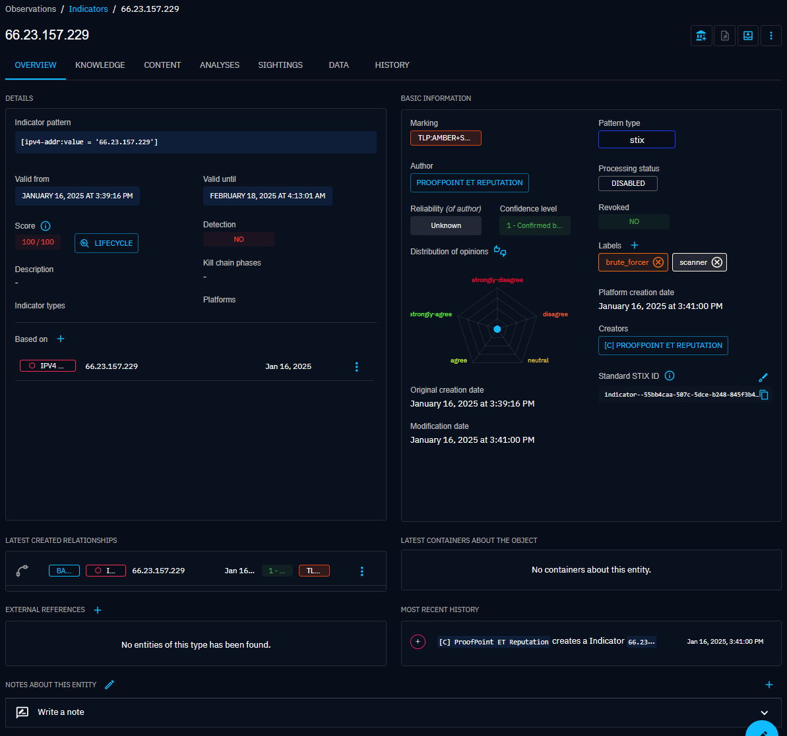
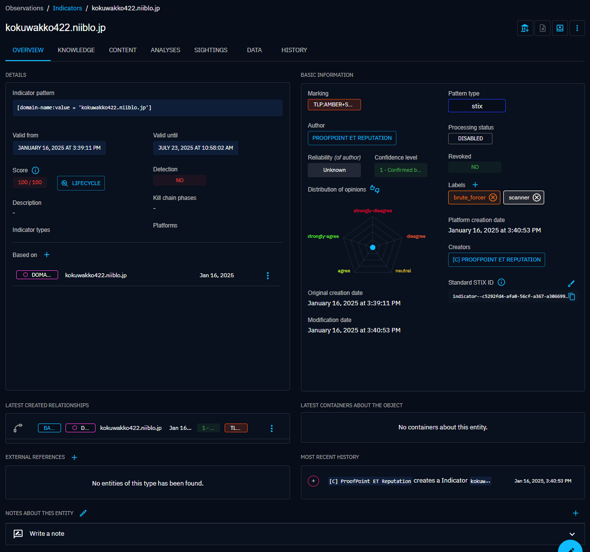
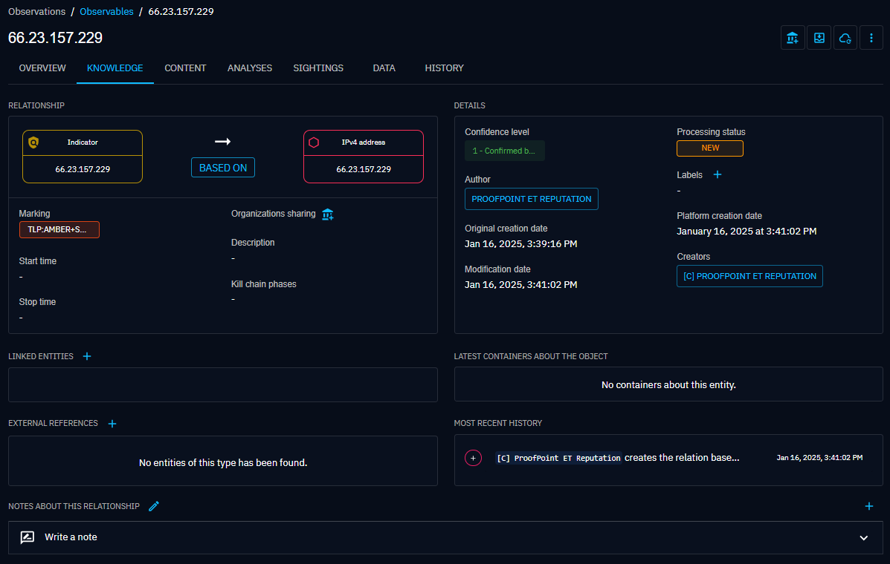
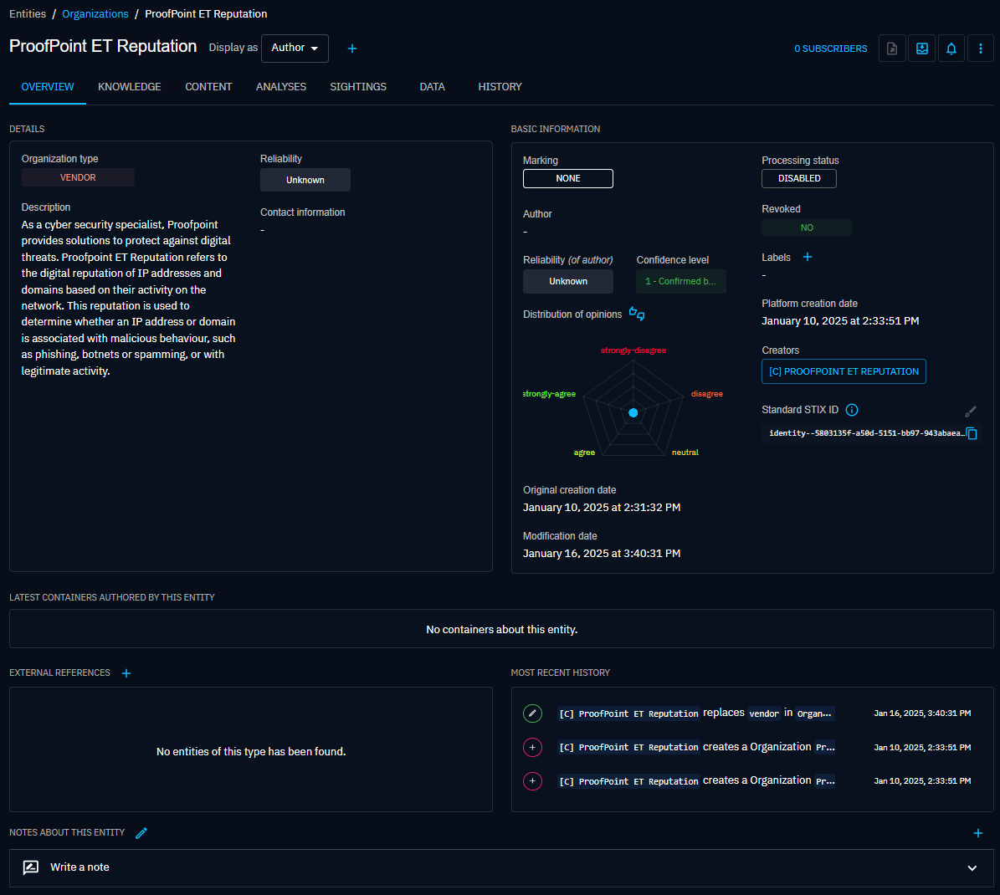

# OpenCTI External Import Connector - ProofPoint ET Reputation

Table of Contents

- [OpenCTI External Import Connector - ProofPoint ET Reputation](#opencti-external-import-connector---proofpoint-et-reputation)
  - [Introduction](#introduction)
  - [Installation](#installation)
    - [Requirements](#requirements)
  - [Configuration variables](#configuration-variables)
    - [OpenCTI environment variables](#opencti-environment-variables)
    - [Base connector environment variables](#base-connector-environment-variables)
    - [Connector extra parameters environment variables](#connector-extra-parameters-environment-variables)
  - [Deployment](#deployment)
    - [Docker Deployment](#docker-deployment)
    - [Manual Deployment](#manual-deployment)
  - [Usage](#usage)
  - [Behavior](#behavior)
    - [Workflow](#workflow)
  - [Additional information](#additional-information)
  - [Connector Run Metrics](#connector-run-metrics)
    - [Notes dated 2025-01-26](#notes-dated-2025-01-23)
    - [Use Cases](#use-cases)
  - [Debugging](#debugging)
  - [Examples in OpenCTI](#examples-in-opencti)


## Introduction

**Introducing ProofPoint**

ProofPoint is a cybersecurity company that specialises in protecting organisations from digital threats that primarily target their employees. 
The company offers an all-in-one security platform that integrates threat detection, information protection and user education solutions. 
This multi-layered, adaptive approach secures email communications, prevents data loss and builds user resilience against cyber-attacks.

**Emerging Threats (ET) Intelligence Rep List**

One of ProofPoint's offerings is the Emerging Threats (ET) Intelligence Rep List, an essential threat detection tool. 
This list consists of two separate files (JSON): one listing IP addresses and the other listing domain names associated with malicious activity. 
Updated hourly, these lists contain hundreds of thousands of entries based on real-world observations gathered from sensors deployed around the world and a proprietary system called Malware Sandnet. 
Each entry is categorised according to the type of behaviour detected and given a reputation score from 0 to 127 (Only entries with a score above 20 are published in ProofPoint ET Reputation), reflecting the level of confidence in the assessment of its malicious nature.

Please refer to the PDF document available at the following address for more details: 

https://www.proofpoint.com/sites/default/files/technical-briefs/pfpt-us-tb-emerging-threats-intellience-replist.pdf

## Installation

### Requirements

- Python = 3.11.X (not compatible with 3.12 and above for now)
- OpenCTI Platform >= 6.4.X
- pycti==6.4.4
- validators==0.33.0
- pydantic>=2.8.2, <3
- requests~=2.32.3
- stix2~=3.0.1
- PyYAML==6.0.2

## Configuration variables

There are a number of configuration options, which are set either in `docker-compose.yml` (for Docker) or
in `config.yml` (for manual deployment).

### OpenCTI environment variables

Below are the parameters you'll need to set for OpenCTI:

| Parameter     | config.yml   | Docker environment variable | Default | Mandatory | Description                                          |
|---------------|--------------|-----------------------------|---------|-----------|------------------------------------------------------|
| OpenCTI URL   | `url`        | `OPENCTI_URL`               | /       | Yes       | The URL of the OpenCTI platform.                     |
| OpenCTI Token | `token`      | `OPENCTI_TOKEN`             | /       | Yes       | The default admin token set in the OpenCTI platform. |

### Base connector environment variables

Below are the parameters you'll need to set for running the connector properly:

| Parameter `Connector` | config.yml          | Docker environment variable   | Default | Mandatory | Example                    | Description                                                                                      |
|-----------------------|---------------------|-------------------------------|---------|-----------|----------------------------|--------------------------------------------------------------------------------------------------|
| ID                    | `id`                | `CONNECTOR_ID`                | /       | Yes       | A unique `UUIDv4`          | A unique `UUIDv4` identifier for this connector instance.                                        |
| Name                  | `name`              | `CONNECTOR_NAME`              | /       | Yes       | `ProofPoint ET Reputation` | Full name of the connector : `CrowdStrike`.                                                      |
| Scope                 | `scope`             | `CONNECTOR_SCOPE`             | /       | Yes       | `IPv4-Addr,Domain-Name`    | Must be `IPv4-Addr,Domain-Name`, not used in this connector.                                     |
| Run and Terminate     | `run_and_terminate` | `CONNECTOR_RUN_AND_TERMINATE` | `False` | No        | /                          | Launch the connector once if set to True. Takes 2 available values: `True` or `False`.           |
| Duration Period       | `duration_period`   | `CONNECTOR_DURATION_PERIOD`   | `PT24H` | No        | /                          | Determines the time interval between each launch of the connector in ISO 8601, ex: .             |
| Queue Threshold       | `queue_threshold`   | `CONNECTOR_QUEUE_THRESHOLD`   | `500`   | No        | /                          | Used to determine the limit (RabbitMQ) in MB at which the connector must go into buffering mode. |
| Log Level             | `log_level`         | `CONNECTOR_LOG_LEVEL`         | /       | Yes       | `error`                    | Determines the verbosity of the logs. Options are `debug`, `info`, `warn`, or `error`.           |

### Connector extra parameters environment variables

Below are the parameters you'll need to set for the connector:

| Parameter `ProofPoint ET Reputation` | config.yml          | Docker environment variable                 | Default  | Mandatory | Example            | Description                                                   |
|--------------------------------------|---------------------|---------------------------------------------|----------|-----------|--------------------|---------------------------------------------------------------|
| API Token                            | `api_token`         | `PROOFPOINT_ET_REPUTATION_API_TOKEN`        | /        | Yes       | `0123456789123456` | Token for ProofPoint ET Reputation files access.              |
| Create Indicator                     | `create_indicator`  | `PROOFPOINT_ET_REPUTATION_CREATE_INDICATOR` | `True`   | No        | /                  | Allows you to create indicators or not.                       |
| Min Score                            | `min_score`         | `PROOFPOINT_ET_REPUTATION_MIN_SCORE`        | `20`     | No        | `20`-`100`         | Minimum score required to import from collections to OpenCTI. | 

## Deployment

### Docker Deployment

Before building the Docker container, you need to set the version of pycti in `requirements.txt` equal to whatever
version of OpenCTI you're running. Example, `pycti==6.4.4`. If you don't, it will take the latest version, but
sometimes the OpenCTI SDK fails to initialize.

Build a Docker Image using the provided `Dockerfile`.

Example:

```shell
# Replace the IMAGE NAME with the appropriate value
docker build . -t [IMAGE NAME]:latest
```

Make sure to replace the environment variables in `docker-compose.yml` with the appropriate configurations for your
environment. Then, start the docker container with the provided docker-compose.yml

```shell
docker compose up -d
# -d for detached
```

### Manual Deployment

Create a file `config.yml` based on the provided `config.yml.sample`.

Replace the configuration variables (especially the "**ChangeMe**" variables) with the appropriate configurations for
you environment.

Install the required python dependencies (preferably in a virtual environment):

```shell
pip3 install -r requirements.txt
```

Then, start the connector from recorded-future/src:

```shell
python3 main.py
```

## Usage

After Installation, the connector should require minimal interaction to use, and should update automatically at a regular interval specified in your `docker-compose.yml` or `config.yml` in `duration_period`.

However, if you would like to force an immediate download of a new batch of entities, navigate to:

`Data management` -> `Ingestion` -> `Connectors` in the OpenCTI platform.

Find the connector, and click on the refresh button to reset the connector's state and force a new
download of data by re-running the connector.


## Behavior

- STIX objects Ingestion into OpenCTI:
  - Author: `ProofPoint ET Reputation` (Organization)
  - Marking Definition: `TLP:AMBER+STRICT`
  - Observables: Observable `IPv4-Addr` or `Domain-Name` in STIX 2.1 format
  - Indicators: Indicator in STIX 2.1 format
  - Relationships: The type of relationship created between the indicator and the observable is `based-on` in STIX 2.1 format

The ProofPoint ET Reputation Connector workflow begins by asynchronously fetching two datasets from ProofPoint: `iprepdata.json` and `domainrepdata.json`. These datasets are processed to filter out entities with scores below the configured minimum score (`min_score`). The remaining entities are used to create observables of type `IPv4 Address` and `Domain Name`.

If the configuration parameter `create_indicator` is enabled, the connector generates indicators for each observable. It also establishes `based-on` relationships between the indicators and their corresponding observables. If create_indicator is disabled, the workflow proceeds with observables only.

The final step involves sending the generated data—including **observables**, and optionally **indicators** and their **relationships** in STIX2 format to OpenCTI, where it is integrated into the platform for further analysis and use.

### Workflow



## Additional information

- **Token Location:** The ProofPoint ET Reputation API token is obtained from the ProofPoint platform and must be configured in the config.yml file under `api_token`, or defined as the `PROOFPOINT_ET_REPUTATION_API_TOKEN` environment variable in the Docker configuration. This information is available at the following address once the user is logged in: https://etadmin.proofpoint.com/iqrisk-list


- **Duration Period:** The duration_period parameter is set to 24 hours by default. This value represents the interval between successive runs of the connector, allowing sufficient time for data to be ingested into OpenCTI after each collection. This period allows a balance to be struck between the ingest and update cycles of data from ProofPoint, while avoiding redundant collection processes. In addition, ProofPoint's documentation states that `on average, approximately 30% of the list is refreshed every three to four weeks`.


- **Asynchronous fetch data:** The connector uses the ThreadPoolExecutor for asynchronous execution of GET requests. Performance is improved by simultaneously retrieving data from the ProofPoint endpoints for the `iprepdata.json` and `domainrepdata.json` collections.


- **Model Validation:** Data ingested by ProofPoint is validated against defined models to ensure compliance and consistency. Any data that does not conform to these models is logged and ignored to maintain data quality. 


- **Min Score Filtering:** The connector applies a filtering mechanism based on the min_score parameter. Entities with scores below the configured threshold are excluded from processing, allowing users to control the granularity and relevance of the ingested data.


- **Marking Definition:** By default, all observables, indicators and their relationships are generated with a `TLP:AMBER+STRICT` marking

## Connector Run Metrics

### Notes dated 2025-01-23

- **Data Ingested:** The values shown in the tables below were collected at a specific time and are based on the data available at that time. It is important to note that the amount of data collected may vary depending on updates to the ProofPoint ET Reputation lists, and the specific conditions associated with each connector run. These figures are therefore indicative and may change over time.


- **Ingestion Time:** The ingestion time is indicative and may vary depending on a number of factors, such as the size of the data collected, network performance, current connector load, and specific user-defined configurations, such as minimum score thresholds or options for generating indicators and relationships. These elements can have a significant impact on the overall duration of the process.


- **Environment for Ingestion:** The metrics presented were collected in a controlled development environment (Windows) under the following conditions: 

  - Only one worker was active
  - Only the ProofPoint ET Reputation connector was running on the OpenCTI platform
  - No other tasks such as playbooks or automated processes were running simultaneously

  These conditions were used to evaluate the performance of the connector. However, in a production environment, results may vary due to the simultaneous execution of multiple tasks and connectors. OpenCTI performance and response times will also depend on the hosting environment and resources available.

### Use cases

For the tests, we will provide a range based on an ingestion speed of between `450` and `550` entities per minute.
The tables below summarise ingestion metrics based on different configurations (use cases).

---
**Use case 1:**
- create_indicator: `True` (Observable + Indicator + Relationship)
- min_score: `20` (Minimum)

| **Collections**      | **Generated Entities**                     | **Data Ingested**  | **Ingestion Time**  |
|----------------------|--------------------------------------------|--------------------|---------------------|
| `iprepdata.json`     | `IPv4-Addr` + Indicators + Relationships   | ~415,000 Entities  | ~12h 35m / ~15h 20m |
| `domainrepdata.json` | `Domain-Name` + Indicators + Relationships | ~85,500 Entities   | ~2h 35m / ~3h 10m   |

---
**Use case 2:**
- create_indicator: `False` (Observable only)
- min_score: `20` (Minimum)

| **Collections**      | **Generated Entities** | **Data Ingested** | **Ingestion Time** |
|----------------------|------------------------|-------------------|--------------------|
| `iprepdata.json`     | `IPv4-Addr`            | ~138,000 Entities | ~4h 10m / ~5h      |
| `domainrepdata.json` | `Domain-Name`          | ~28,500 Entities  | ~50m / ~1h         |

---
**Use case 3:**
- create_indicator: `True` (Observable + Indicator + Relationship)
- min_score: `100` (Maximum)

| **Collections**      | **Generated Entities**                     | **Data Ingested** | **Ingestion Time** |
|----------------------|--------------------------------------------|-------------------|--------------------|
| `iprepdata.json`     | `IPv4-Addr` + Indicators + Relationships   | ~179,000 Entities | ~5h 25m / ~6h 35m  |
| `domainrepdata.json` | `Domain-Name` + Indicators + Relationships | ~16,000 Entities  | ~30m / ~35m        |

---
**Use case 4:**
- create_indicator: `False` (Observable only)
- min_score: `100` (Maximum)

| **Collections**      | **Generated Entities** | **Data Ingested** | **Ingestion Time** |
|----------------------|------------------------|-------------------|--------------------|
| `iprepdata.json`     | `IPv4-Addr`            | ~58,000 Entities  | ~1h 45m / ~2h 10m  |
| `domainrepdata.json` | `Domain-Name`          | ~5,000 Entities   | ~10m / ~15m        |

---

## Debugging

The connector can be debugged by setting the appropriate log level through the `CONNECTOR_LOG_LEVEL` environment variable. 
Setting this variable to debug (`CONNECTOR_LOG_LEVEL=debug`) enables detailed debugging logs, allowing you to gain deeper insight into the operation and behaviour of the connector.

Here are some examples of the debug logs you can expect to see when debugging is enabled:

- Entity Ignored Due Model Validation Error
  - `"message": "[CONNECTOR] Model validation: The entity or reputation score does not conform to the schema. The entity has been ignored.", "attributes": {"collection": "Domain-Name", "entity": "::example0.info", "category_and_score": {"VPN": "100"}`


- Entity Ignored Due to Minimum Score Configuration
  - `"message": "[CONNECTOR] The creation of the entity was ignored due to your configuration of the min_score variable", "attributes": {"collection": "Domain-Name", "min_score_config": 70, "entity": "example1-domain.com", "entity_score": 30}`


- Observable Generation Success
  - `"message": "[CONNECTOR] The generation of observable in stix2 format from reputation data has been a success.", "attributes": {"observable_id": "domain-name--UUID", "observable_value": "example2-domain.com"}`


- Indicator Generation Success
  - `"message": "[CONNECTOR] The generation of indicator in stix2 format from reputation data has been a success.", "attributes": {"indicator_id": "indicator--UUID", "indicator_name": "example2-domain.com"}`


- Relationship Generation Success
  - `"message": "[CONNECTOR] The generation of the relationship between the observable and the indicator was a success.", "attributes": {"relationship_id": "relationship--UUID", "source_ref": "indicator--UUID", "relationship_type": "based-on", "target_ref": "domain-name--UUID"}`


## Examples in OpenCTI

Examples Observables:

- Observable IPv4-Addr



- Observable Domain-Name



Examples Indicators:

- Indicator IPv4-Addr



- Indicator Domain-Name



Examples Relationships:

- Relationship IPv4-Addr



- Relationship Domain-Name


Example Author:

- Author Organization




