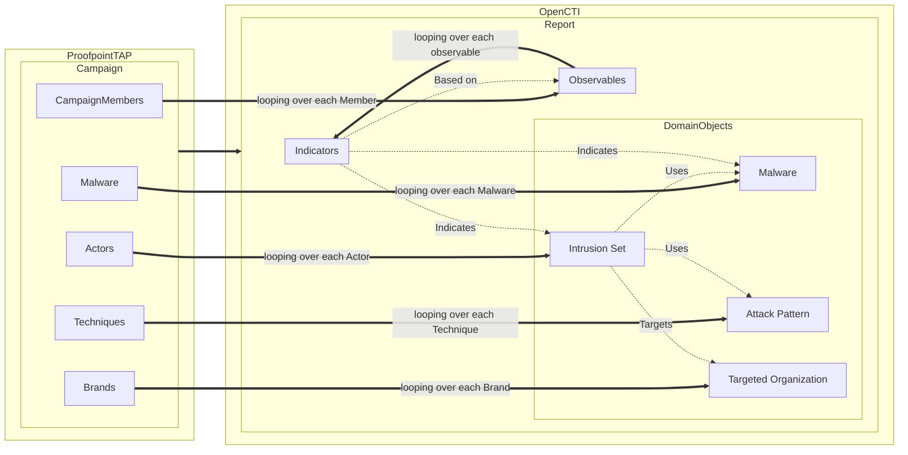
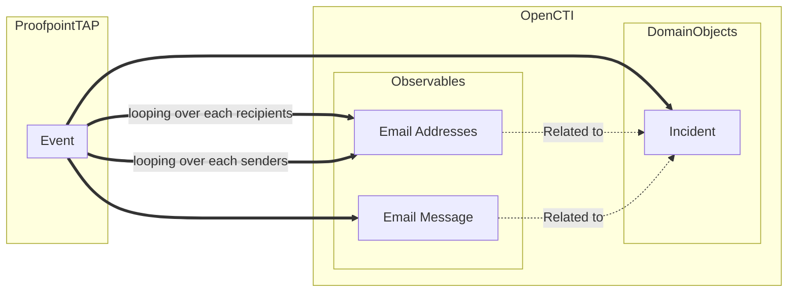

# Proofpoint TAP Connector

The Proofpoint TAP connector imports phishing campaign data, events, and threat intelligence from Proofpoint Targeted Attack Protection (TAP) into OpenCTI.
See: https://www.proofpoint.com/us/products/threat-defense

## Table of Contents

- [Proofpoint TAP Connector](#proofpoint-tap-connector)
  - [Introduction](#introduction)
  - [Installation](#installation)
  - [Configuration](#configuration)
  - [Deployment](#deployment)
  - [Usage](#usage)
  - [Behavior](#behavior)
  - [Development](#development)
  - [Additional information](#additional-information)

## Introduction

This connector fetches data such as campaign and their members, and integrates them 
into OpenCTI for further analysis and correlation with other threat intelligence data.

## Installation

### Requirements

- OpenCTI Platform >= 6.4
- Proofpoint TAP API access

## Configuration

Configuration parameters can be provided in either **`config.yml`** file, **`.env`** file or directly as **environment variables** (e.g. from **`docker-compose.yml`** for Docker deployments).

Priority: **YAML > .env > environment > defaults**

For instance using `shell` directly
```shell
export ENV_VAR_NAME="..."
```

with a .env file
```shell
export $(grep -v '^#' .env | xargs -d '\n')
```

with a config.yaml file (dev purposes):
```yaml
connector: 
  id: "..."
```

### Configuration variables

Find all the configuration variables available here: [Connector Configurations](./__metadata__)

## Deployment

### Docker Deployment

Build a Docker Image using the provided `Dockerfile`.

Example:

```shell
# Replace the IMAGE NAME with the appropriate value
docker build . -t [IMAGE NAME]:latest
```

Make sure to replace the environment variables in `docker-compose.yml` or provide a `.env` file with the appropriate configurations for your
environment (see `.env.sample` file). Then, start the docker container with the provided `docker-compose.yml` file.

```shell
docker compose up -d
```

### Source code Deployment

Install the required package (preferably in a virtual environment):

```shell
python -m venv .venv
source .venv/bin/activate
pip install .
```

Then, start the connector:

```shell
python src/main.py
```

## Usage

After Installation, the connector should require minimal interaction to use, and should update automatically at a regular interval specified in your `docker-compose.yml` in `duration_period`.

However, if you would like to force an immediate download of a new batch of entities, navigate to:

`Data management` -> `Ingestion` -> `Connectors` in the OpenCTI platform.

Find the connector, and click on the refresh button to reset the connector's state and force a new
download of data by re-running the connector.

## Behavior

### Mapping details
The retrieved data are mapped as follows:




## Development
To develop on the connector source code, you can install the provided package in `editable` mode with the dev dependencies using :

```shell
pip install -e .[all]
``` 

### Linting and typing
To format, lint and validate the source code, you can use the isort, black, ruff and mypy configurations:

```shell
python -m isort . ; python -m black . --check ; python -m ruff check . ; python -m mypy . ; python -m pip_audit .
```

### Testing
To run the tests, you can use the following command:

```shell
python -m pytest -vv
```

## Additional information
N.A.
