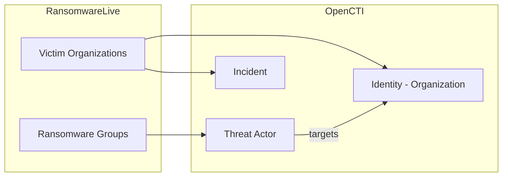

# RansomwareLive Connector

| Status | Date | Comment |
|--------|------|---------|
| Community | -    | -       |

The RansomwareLive connector imports ransomware attack data and victim information from the ransomware.live API into OpenCTI.

## Table of Contents

- [RansomwareLive Connector](#ransomwarelive-connector)
  - [Table of Contents](#table-of-contents)
  - [Introduction](#introduction)
  - [Installation](#installation)
  - [Configuration variables](#configuration-variables)
  - [Deployment](#deployment)
  - [Usage](#usage)
  - [Behavior](#behavior)
  - [Debugging](#debugging)
  - [Additional information](#additional-information)

## Introduction

RansomwareLive is a platform that tracks ransomware attacks and victim organizations. This connector imports ransomware group activity, victim information, and associated threat intelligence into OpenCTI.

## Installation

### Requirements

- OpenCTI Platform >= 6.x

## Configuration variables

Find all the configuration variables available (default/required) here: [Connector Configurations](./__metadata__)

## Deployment

### Docker Deployment

Build the Docker image:

```bash
docker build -t opencti/connector-ransomwarelive:latest .
```

Start the connector:

```bash
docker compose up -d
```

### Manual Deployment

1. Create `config.yml` based on `config.yml.sample`.

2. Install dependencies:

```bash
pip3 install -r requirements.txt
```

3. Start the connector from the `src` directory:

```bash
python3 main.py
```

## Usage

The connector runs automatically at the configured interval. To force an immediate run:

**Data Management → Ingestion → Connectors**

Find the connector and click the refresh button to reset the state and trigger a new sync.

## Behavior

The connector fetches ransomware attack data and victim information from the ransomware.live API.

### Data Flow



### Entity Mapping

| RansomwareLive Data  | OpenCTI Entity      | Description                                      |
|----------------------|---------------------|--------------------------------------------------|
| Ransomware Group     | Threat-Actor        | Ransomware threat actor                          |
| Victim Name          | Identity            | Victim organization                              |
| Attack Date          | Incident            | Ransomware incident                              |
| Victim Sector        | Sector              | Target industry sector                           |
| Victim Country       | Location            | Target geography                                 |

## Debugging

Enable verbose logging:

```env
CONNECTOR_LOG_LEVEL=debug
```

## Additional information

- **Data Source**: [ransomware.live](https://ransomware.live)
- **Ransomware Tracking**: Provides visibility into ransomware campaigns
- **Victim Intelligence**: Track targeted organizations and industries
