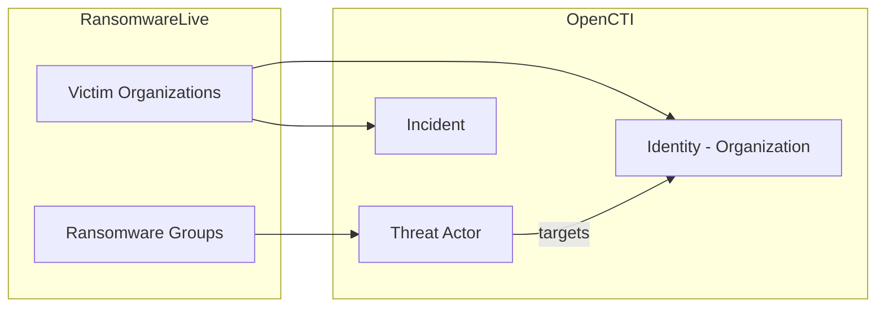

# RansomwareLive Connector

| Status | Date | Comment |
|--------|------|---------|
| Community | -    | -       |

The RansomwareLive connector imports ransomware attack data and victim information from the ransomware.live API into OpenCTI.

## Table of Contents

- [RansomwareLive Connector](#ransomwarelive-connector)
  - [Table of Contents](#table-of-contents)
  - [Introduction](#introduction)
  - [Installation](#installation)
  - [Configuration variables](#configuration-variables)
  - [Deployment](#deployment)
  - [Usage](#usage)
  - [Behavior](#behavior)
  - [Debugging](#debugging)
  - [Additional information](#additional-information)

## Introduction

RansomwareLive is a platform that tracks ransomware attacks and victim organizations. This connector imports ransomware group activity, victim information, and associated threat intelligence into OpenCTI.

## Installation

### Requirements

- OpenCTI Platform >= 6.x

## Configuration variables

Find all the configuration variables available (default/required) here: [Connector Configurations](./__metadata__)

## Deployment

### Docker Deployment

Build the Docker image:

```bash
docker build -t opencti/connector-ransomwarelive:latest .
```

Start the connector:

```bash
docker compose up -d
```

### Manual Deployment

1. Create `config.yml` based on `config.yml.sample`.

2. Install dependencies:

```bash
pip3 install -r requirements.txt
```

3. Start the connector from the `src` directory:

```bash
python3 main.py
```

## Usage

The connector runs automatically at the configured interval. To force an immediate run:

**Data Management → Ingestion → Connectors**

Find the connector and click the refresh button to reset the state and trigger a new sync.

## Behavior

The connector fetches ransomware attack data and victim information from the ransomware.live API.

### Data Flow


```mermaid
graph LR
    subgraph RansomwareLive
        direction TB
        Groups[Ransomware Groups]
        Victims[Victim Organizations]
    end

    subgraph OpenCTI
        direction LR
        ThreatActor[Threat Actor]
        Organization[Identity - Organization]
        Incident[Incident]
    end

    Groups --> ThreatActor
    Victims --> Organization
    Victims --> Incident
    ThreatActor -- targets --> Organization
```

### Entity Mapping

| RansomwareLive Data        | OpenCTI Entity       | Description                                                        |
|----------------------------|----------------------|--------------------------------------------------------------------|
| Ransomware Group           | Intrusion Set        | Primary group representation                                       |
| Ransomware Group           | Threat Actor         | Optional (enabled via `CONNECTOR_CREATE_THREAT_ACTOR`)             |
| Group Aliases              | aliases              | Alternative names on Intrusion Set and Threat Actor                |
| Group Profile URL          | External Reference   | Link to ransomware.live group profile page                         |
| Group Leak Sites           | Domain Name          | Observable per site, linked to Intrusion Set (toggleable)          |
| Group TTPs                 | Relationship (uses)  | Links Intrusion Set to ATT&CK Attack Patterns in OpenCTI           |
| Victim Name                | Identity             | Victim organization                                                |
| Attack Date                | Report               | Ransomware incident report                                         |
| Victim Sector              | Sector               | Target industry sector                                             |
| Victim Country             | Location             | Target geography                                                   |
| Leak Post URL              | External Reference   | Link to ransomware group's post (toggleable)                       |

### Toggles involving links to leak sites

`CONNECTOR_CREATE_LEAK_SITE_DOMAINS` and `CONNECTOR_CREATE_LEAK_POST_REFS` both default to `false`. When enabled, the connector will ingest `.onion` domain observables and direct URLs to ransomware group leak sites and victim posts. Before enabling either toggle, ensure that ingesting and storing links to leaked data is permitted under the laws and regulations applicable in your jurisdiction.

## Debugging

Enable verbose logging:

```env
CONNECTOR_LOG_LEVEL=debug
```

## Additional information

- **Data Source**: [ransomware.live](https://ransomware.live)
- **Ransomware Tracking**: Provides visibility into ransomware campaigns
- **Victim Intelligence**: Track targeted organizations and industries
