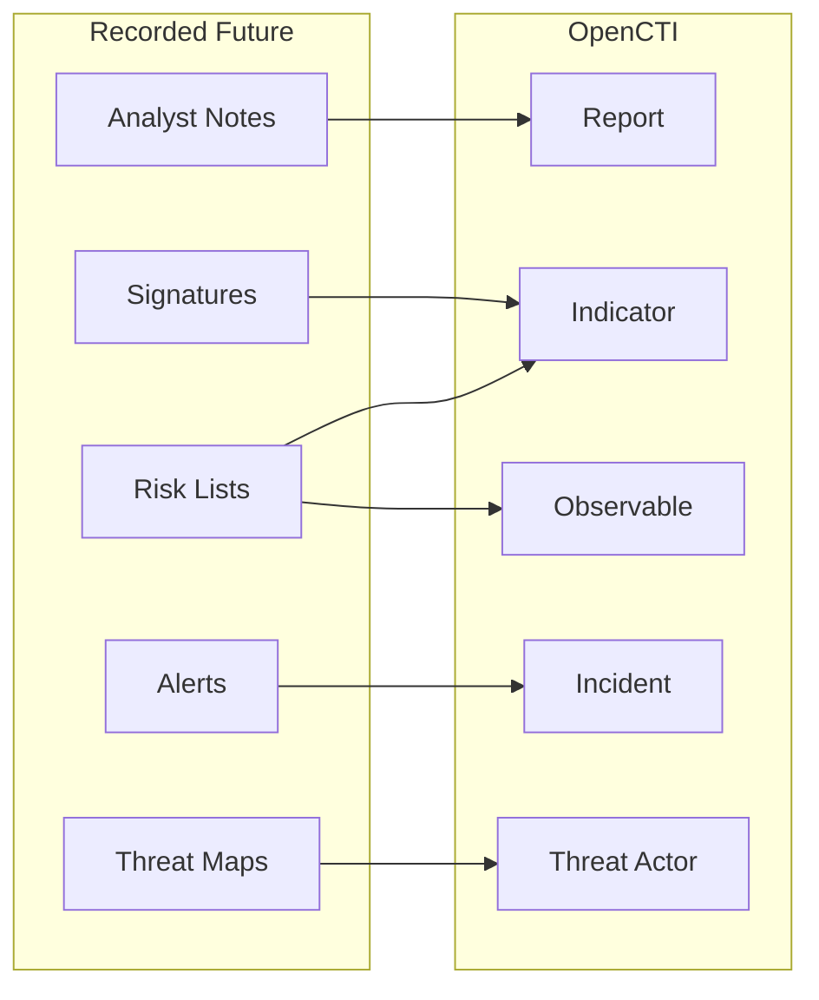

# OpenCTI Recorded Future Connector

| Status | Date | Comment |
|--------|------|---------|
| Filigran Verified | -    | -       |

The Recorded Future connector imports threat intelligence from Recorded Future's Intelligence Cloud into OpenCTI.

## Table of Contents

- [OpenCTI Recorded Future Connector](#opencti-recorded-future-connector)
  - [Table of Contents](#table-of-contents)
  - [Introduction](#introduction)
  - [Installation](#installation)
    - [Requirements](#requirements)
  - [Configuration variables](#configuration-variables)
    - [OpenCTI environment variables](#opencti-environment-variables)
    - [Base connector environment variables](#base-connector-environment-variables)
    - [Connector extra parameters environment variables](#connector-extra-parameters-environment-variables)
  - [Deployment](#deployment)
    - [Docker Deployment](#docker-deployment)
    - [Manual Deployment](#manual-deployment)
  - [Usage](#usage)
  - [Behavior](#behavior)
  - [Debugging](#debugging)
  - [Additional information](#additional-information)

## Introduction

Recorded Future provides real-time threat intelligence powered by machine learning. This connector imports analyst notes, risk lists, threat maps, signatures, and alerts from Recorded Future into OpenCTI, enabling correlation with your internal threat data.

## Installation

### Requirements

- OpenCTI Platform >= 6.x
- Recorded Future account with API access
- Recorded Future API token

## Configuration variables

There are a number of configuration options, which are set either in `docker-compose.yml` (for Docker) or in `config.yml` (for manual deployment).

### OpenCTI environment variables

| Parameter     | config.yml | Docker environment variable | Mandatory | Description                                          |
|---------------|------------|-----------------------------|-----------|------------------------------------------------------|
| OpenCTI URL   | url        | `OPENCTI_URL`               | Yes       | The URL of the OpenCTI platform.                     |
| OpenCTI Token | token      | `OPENCTI_TOKEN`             | Yes       | The default admin token set in the OpenCTI platform. |

### Base connector environment variables

| Parameter         | config.yml      | Docker environment variable   | Default           | Mandatory | Description                                                                 |
|-------------------|-----------------|-------------------------------|-------------------|-----------|-----------------------------------------------------------------------------|
| Connector ID      | id              | `CONNECTOR_ID`                |                   | Yes       | A unique `UUIDv4` identifier for this connector instance.                   |
| Connector Name    | name            | `CONNECTOR_NAME`              | Recorded Future   | No        | Name of the connector.                                                      |
| Connector Scope   | scope           | `CONNECTOR_SCOPE`             |                   | Yes       | Comma-separated observable types to import.                                 |
| Log Level         | log_level       | `CONNECTOR_LOG_LEVEL`         | error             | No        | Determines the verbosity of the logs: `debug`, `info`, `warn`, or `error`.  |
| Duration Period   | duration_period | `CONNECTOR_DURATION_PERIOD`   | PT24H             | No        | Time interval between connector runs in ISO 8601 format.                    |

### Connector extra parameters environment variables

| Parameter                               | config.yml                                     | Docker environment variable                               | Default             | Mandatory | Description                                                                 |
|-----------------------------------------|------------------------------------------------|-----------------------------------------------------------|---------------------|-----------|-----------------------------------------------------------------------------|
| Token                                   | recorded_future.token                          | `RECORDED_FUTURE_TOKEN`                                   |                     | Yes       | Recorded Future API token.                                                  |
| Initial Lookback                        | recorded_future.initial_lookback               | `RECORDED_FUTURE_INITIAL_LOOKBACK`                        | 240                 | Yes       | Hours to look back on initial run.                                          |
| TLP                                     | recorded_future.tlp                            | `RECORDED_FUTURE_TLP`                                     | amber+strict        | Yes       | TLP marking for imported data.                                              |
| Pull Analyst Notes                      | recorded_future.pull_analyst_notes             | `RECORDED_FUTURE_PULL_ANALYST_NOTES`                      | true                | No        | Import analyst notes.                                                       |
| Last Published Notes                    | recorded_future.last_published_notes           | `RECORDED_FUTURE_LAST_PUBLISHED_NOTES`                    | 24                  | Yes       | Hours of recent notes to fetch.                                             |
| Topic                                   | recorded_future.topic                          | `RECORDED_FUTURE_TOPIC`                                   |                     | No        | Filter notes by topic.                                                      |
| Insikt Only                             | recorded_future.insikt_only                    | `RECORDED_FUTURE_INSIKT_ONLY`                             | true                | No        | Only import Insikt Group notes.                                             |
| Pull Signatures                         | recorded_future.pull_signatures                | `RECORDED_FUTURE_PULL_SIGNATURES`                         | false               | No        | Import detection signatures.                                                |
| Person to Threat Actor                  | recorded_future.person_to_ta                   | `RECORDED_FUTURE_PERSON_TO_TA`                            | false               | No        | Convert person entities to threat actors.                                   |
| Threat Actor to Intrusion Set           | recorded_future.ta_to_intrusion_set            | `RECORDED_FUTURE_TA_TO_INTRUSION_SET`                     | false               | No        | Convert threat actors to intrusion sets.                                    |
| Risk as Score                           | recorded_future.risk_as_score                  | `RECORDED_FUTURE_RISK_AS_SCORE`                           | true                | No        | Use RF risk score as OpenCTI score.                                         |
| Risk Threshold                          | recorded_future.risk_threshold                 | `RECORDED_FUTURE_RISK_THRESHOLD`                          | 60                  | No        | Minimum risk score for import.                                              |
| Analyst Notes Guess Relationships       | recorded_future.analyst_notes_guess_relationships | `RECORDED_FUTURE_ANALYST_NOTES_GUESS_RELATIONSHIPS`    | false               | No        | Infer relationships from notes.                                             |
| Pull Risk List                          | recorded_future.pull_risk_list                 | `RECORDED_FUTURE_PULL_RISK_LIST`                          | false               | No        | Import risk list data.                                                      |
| Risk Rules as Label                     | recorded_future.riskrules_as_label             | `RECORDED_FUTURE_RISKRULES_AS_LABEL`                      | false               | No        | Convert risk rules to labels.                                               |
| Risk List Threshold                     | recorded_future.risk_list_threshold            | `RECORDED_FUTURE_RISK_LIST_THRESHOLD`                     | 70                  | No        | Minimum score for risk list import.                                         |
| Risk List Related Entities              | recorded_future.risklist_related_entities      | `RECORDED_FUTURE_RISKLIST_RELATED_ENTITIES`               |                     | Cond.     | Entity types for relationships (required if pull_risk_list is true).        |
| Pull Threat Maps                        | recorded_future.pull_threat_maps               | `RECORDED_FUTURE_PULL_THREAT_MAPS`                        | false               | No        | Import threat maps.                                                         |
| **Alerts Configuration**                |                                                |                                                           |                     |           |                                                                             |
| Alert Enable                            | alert.enable                                   | `ALERT_ENABLE`                                            | false               | Yes       | Enable alert import.                                                        |
| Alert Default Severity                  | alert.default_opencti_severity                 | `ALERT_DEFAULT_OPENCTI_SEVERITY`                          | low                 | No        | Default severity for alerts.                                                |
| Alert Priority Only                     | alert.priority_alerts_only                     | `ALERT_PRIORITY_ALERTS_ONLY`                              | false               | No        | Only import priority alerts.                                                |
| **Playbook Alerts Configuration**       |                                                |                                                           |                     |           |                                                                             |
| Playbook Alert Enable                   | playbook_alert.enable                          | `PLAYBOOK_ALERT_ENABLE`                                   | false               | Yes       | Enable playbook alert import.                                               |
| Domain Abuse Threshold                  | playbook_alert.domain_abuse_threshold          | `PLAYBOOK_ALERT_SEVERITY_THRESHOLD_DOMAIN_ABUSE`          | Informational       | No        | Severity threshold for domain abuse.                                        |
| Identity Novel Exposures Threshold      | playbook_alert.identity_threshold              | `PLAYBOOK_ALERT_SEVERITY_THRESHOLD_IDENTITY_NOVEL_EXPOSURES` | Informational    | No        | Severity threshold for identity exposures.                                  |
| Code Repo Leakage Threshold             | playbook_alert.code_repo_threshold             | `PLAYBOOK_ALERT_SEVERITY_THRESHOLD_CODE_REPO_LEAKAGE`     | Informational       | No        | Severity threshold for code repo leakage.                                   |
| Playbook Alert Debug                    | playbook_alert.debug                           | `PLAYBOOK_ALERT_DEBUG`                                    | false               | No        | Enable debug mode for playbook alerts.                                      |

## Deployment

### Docker Deployment

Build the Docker image:

```bash
docker build -t opencti/connector-recorded-future:latest .
```

Configure the connector in `docker-compose.yml`:

```yaml
  connector-recorded-future:
    image: opencti/connector-recorded-future:latest
    environment:
      - OPENCTI_URL=http://localhost
      - OPENCTI_TOKEN=ChangeMe
      - CONNECTOR_ID=ChangeMe
      - CONNECTOR_NAME=Recorded Future
      - CONNECTOR_SCOPE=ipv4-addr,ipv6-addr,vulnerability,domain,url,StixFile
      - CONNECTOR_LOG_LEVEL=error
      - CONNECTOR_DURATION_PERIOD=PT24H
      - RECORDED_FUTURE_TOKEN=ChangeMe
      - RECORDED_FUTURE_INITIAL_LOOKBACK=240
      - RECORDED_FUTURE_TLP=amber+strict
      - RECORDED_FUTURE_PULL_ANALYST_NOTES=True
      - RECORDED_FUTURE_LAST_PUBLISHED_NOTES=24
      - RECORDED_FUTURE_INSIKT_ONLY=True
      - RECORDED_FUTURE_RISK_AS_SCORE=True
      - RECORDED_FUTURE_RISK_THRESHOLD=60
      - ALERT_ENABLE=False
      - PLAYBOOK_ALERT_ENABLE=False
    restart: always
```

Start the connector:

```bash
docker compose up -d
```

### Manual Deployment

1. Create `config.yml` based on `config.yml.sample`.

2. Install dependencies:

```bash
pip3 install -r requirements.txt
```

3. Start the connector:

```bash
python3 main.py
```

## Usage

The connector runs automatically at the interval defined by `CONNECTOR_DURATION_PERIOD`. To force an immediate run:

**Data Management → Ingestion → Connectors**

Find the connector and click the refresh button to reset the state and trigger a new sync.

## Behavior

The connector fetches threat intelligence from Recorded Future's API and imports it as STIX 2.1 objects.

### Data Flow



### Entity Mapping

| Recorded Future Data | OpenCTI Entity      | Description                                      |
|----------------------|---------------------|--------------------------------------------------|
| Analyst Note         | Report              | Insikt Group research reports                    |
| IP Address (Risk)    | IPv4-Addr/IPv6-Addr | IP observables with risk scores                  |
| Domain (Risk)        | Domain-Name         | Domain observables with risk scores              |
| URL (Risk)           | URL                 | URL observables with risk scores                 |
| Hash (Risk)          | File                | File hash observables                            |
| Vulnerability        | Vulnerability       | CVE data with RF enrichment                      |
| Threat Actor         | Threat-Actor        | Threat actor profiles                            |
| Malware              | Malware             | Malware families                                 |
| YARA Rule            | Indicator           | YARA detection rules                             |
| Alert                | Incident            | Security alerts                                  |

### Data Sources

| Source          | Description                                        |
|-----------------|---------------------------------------------------|
| Analyst Notes   | Curated research from Insikt Group                |
| Risk Lists      | Scored IOCs (IPs, domains, URLs, hashes)          |
| Threat Maps     | Threat actor relationships and TTPs               |
| Signatures      | YARA and Snort rules                              |
| Alerts          | Real-time security alerts                         |
| Playbook Alerts | Automated playbook-generated alerts               |

## Debugging

Enable verbose logging:

```env
CONNECTOR_LOG_LEVEL=debug
```

## Additional information

- **Risk Scoring**: Recorded Future's risk scores (0-100) can be mapped to OpenCTI scores
- **Entity Types**: Configure `RISKLIST_RELATED_ENTITIES` to control relationship creation
- **TLP Levels**: Supports `white`, `green`, `amber`, `amber+strict`, `red`
- **Reference**: [Recorded Future API Documentation](https://api.recordedfuture.com/)
