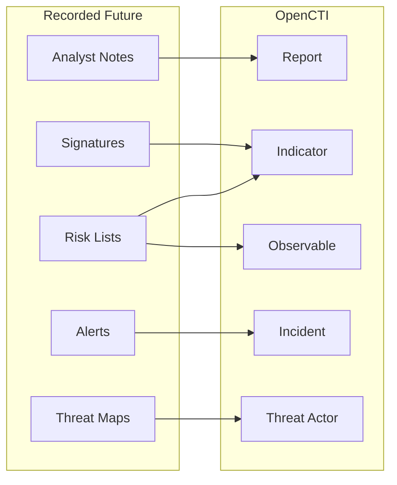
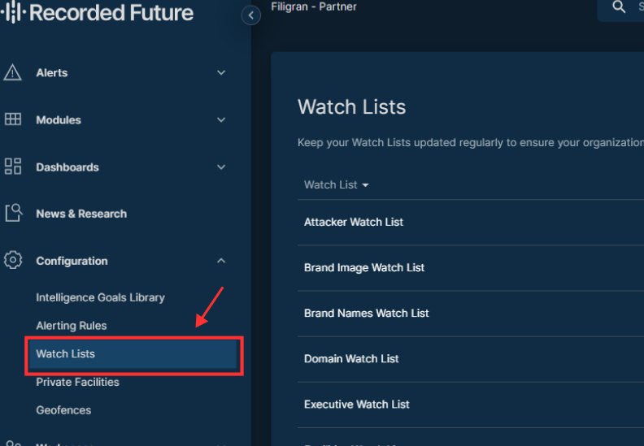
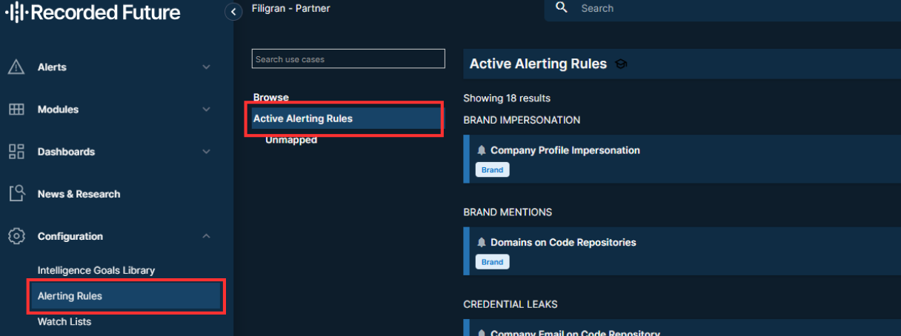
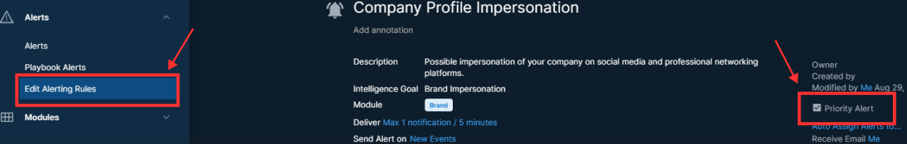
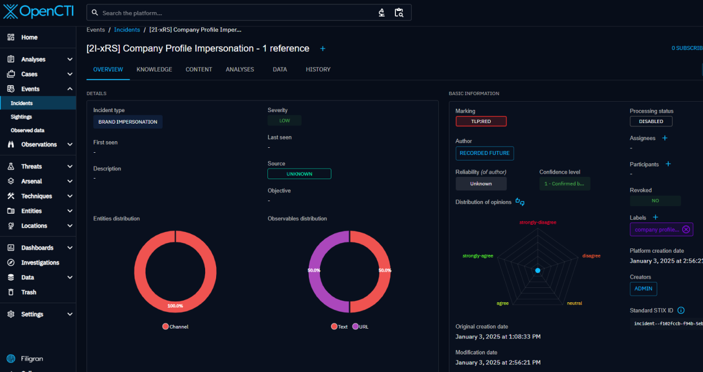
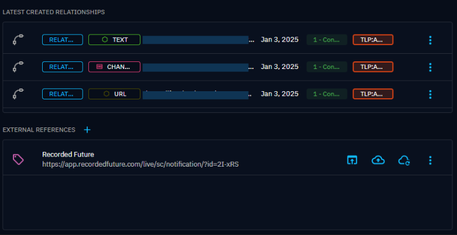
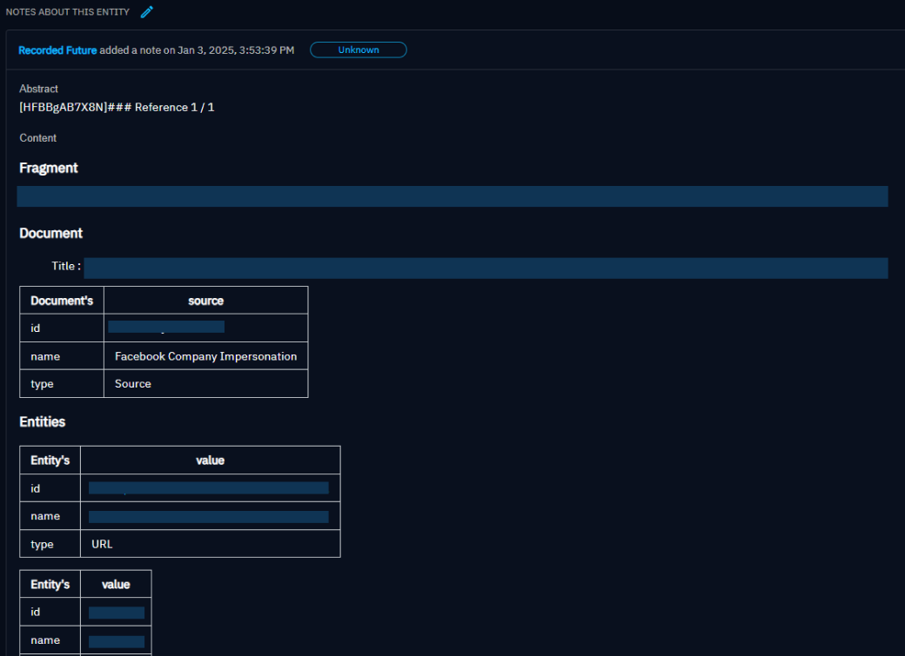

# OpenCTI Recorded Future Connector

| Status | Date | Comment |
|--------|------|---------|
| Filigran Verified | -    | -       |

The Recorded Future connector imports threat intelligence from Recorded Future's Intelligence Cloud into OpenCTI.

## Table of Contents

- [OpenCTI Recorded Future Connector](#opencti-recorded-future-connector)
  - [Table of Contents](#table-of-contents)
  - [Introduction](#introduction)
  - [Installation](#installation)
    - [Requirements](#requirements)
  - [Configuration variables](#configuration-variables)
    - [OpenCTI environment variables](#opencti-environment-variables)
    - [Base connector environment variables](#base-connector-environment-variables)
    - [Connector extra parameters environment variables](#connector-extra-parameters-environment-variables)
  - [Deployment](#deployment)
    - [Docker Deployment](#docker-deployment)
    - [Manual Deployment](#manual-deployment)
  - [Usage](#usage)
  - [Behavior](#behavior)
  - [Debugging](#debugging)
  - [Additional information](#additional-information)

## Introduction

Recorded Future provides real-time threat intelligence powered by machine learning. This connector imports analyst notes, risk lists, threat maps, signatures, and alerts from Recorded Future into OpenCTI, enabling correlation with your internal threat data.

## Installation

### Requirements

- OpenCTI Platform >= 6.x
- Recorded Future account with API access
- Recorded Future API token

## Configuration variables

There are a number of configuration options, which are set either in `docker-compose.yml` (for Docker) or in `config.yml` (for manual deployment).

### OpenCTI environment variables

| Parameter     | config.yml | Docker environment variable | Mandatory | Description                                          |
|---------------|------------|-----------------------------|-----------|------------------------------------------------------|
| OpenCTI URL   | url        | `OPENCTI_URL`               | Yes       | The URL of the OpenCTI platform.                     |
| OpenCTI Token | token      | `OPENCTI_TOKEN`             | Yes       | The default admin token set in the OpenCTI platform. |

### Base connector environment variables

| Parameter         | config.yml      | Docker environment variable   | Default           | Mandatory | Description                                                                 |
|-------------------|-----------------|-------------------------------|-------------------|-----------|-----------------------------------------------------------------------------|
| Connector ID      | id              | `CONNECTOR_ID`                |                   | Yes       | A unique `UUIDv4` identifier for this connector instance.                   |
| Connector Name    | name            | `CONNECTOR_NAME`              | Recorded Future   | No        | Name of the connector.                                                      |
| Connector Scope   | scope           | `CONNECTOR_SCOPE`             |                   | Yes       | Comma-separated observable types to import.                                 |
| Log Level         | log_level       | `CONNECTOR_LOG_LEVEL`         | error             | No        | Determines the verbosity of the logs: `debug`, `info`, `warn`, or `error`.  |
| Duration Period   | duration_period | `CONNECTOR_DURATION_PERIOD`   | PT24H             | No        | Time interval between connector runs in ISO 8601 format.                    |

### Connector extra parameters environment variables

| Parameter                               | config.yml                                     | Docker environment variable                               | Default             | Mandatory | Description                                                                 |
|-----------------------------------------|------------------------------------------------|-----------------------------------------------------------|---------------------|-----------|-----------------------------------------------------------------------------|
| Token                                   | recorded_future.token                          | `RECORDED_FUTURE_TOKEN`                                   |                     | Yes       | Recorded Future API token.                                                  |
| Initial Lookback                        | recorded_future.initial_lookback               | `RECORDED_FUTURE_INITIAL_LOOKBACK`                        | 240                 | Yes       | Hours to look back on initial run.                                          |
| TLP                                     | recorded_future.tlp                            | `RECORDED_FUTURE_TLP`                                     | amber+strict        | Yes       | TLP marking for imported data.                                              |
| Pull Analyst Notes                      | recorded_future.pull_analyst_notes             | `RECORDED_FUTURE_PULL_ANALYST_NOTES`                      | true                | No        | Import analyst notes.                                                       |
| Last Published Notes                    | recorded_future.last_published_notes           | `RECORDED_FUTURE_LAST_PUBLISHED_NOTES`                    | 24                  | Yes       | Hours of recent notes to fetch.                                             |
| Topic                                   | recorded_future.topic                          | `RECORDED_FUTURE_TOPIC`                                   |                     | No        | Filter notes by topic.                                                      |
| Insikt Only                             | recorded_future.insikt_only                    | `RECORDED_FUTURE_INSIKT_ONLY`                             | true                | No        | Only import Insikt Group notes.                                             |
| Pull Signatures                         | recorded_future.pull_signatures                | `RECORDED_FUTURE_PULL_SIGNATURES`                         | false               | No        | Import detection signatures.                                                |
| Person to Threat Actor                  | recorded_future.person_to_ta                   | `RECORDED_FUTURE_PERSON_TO_TA`                            | false               | No        | Convert person entities to threat actors.                                   |
| Threat Actor to Intrusion Set           | recorded_future.ta_to_intrusion_set            | `RECORDED_FUTURE_TA_TO_INTRUSION_SET`                     | false               | No        | Convert threat actors to intrusion sets.                                    |
| Risk as Score                           | recorded_future.risk_as_score                  | `RECORDED_FUTURE_RISK_AS_SCORE`                           | true                | No        | Use RF risk score as OpenCTI score.                                         |
| Risk Threshold                          | recorded_future.risk_threshold                 | `RECORDED_FUTURE_RISK_THRESHOLD`                          | 60                  | No        | Minimum risk score for import.                                              |
| Analyst Notes Guess Relationships       | recorded_future.analyst_notes_guess_relationships | `RECORDED_FUTURE_ANALYST_NOTES_GUESS_RELATIONSHIPS`    | false               | No        | Infer relationships from notes.                                             |
| Pull Risk List                          | recorded_future.pull_risk_list                 | `RECORDED_FUTURE_PULL_RISK_LIST`                          | false               | No        | Import risk list data.                                                      |
| Risk Rules as Label                     | recorded_future.riskrules_as_label             | `RECORDED_FUTURE_RISKRULES_AS_LABEL`                      | false               | No        | Convert risk rules to labels.                                               |
| Risk List Threshold                     | recorded_future.risk_list_threshold            | `RECORDED_FUTURE_RISK_LIST_THRESHOLD`                     | 70                  | No        | Minimum score for risk list import.                                         |
| Risk List Related Entities              | recorded_future.risklist_related_entities      | `RECORDED_FUTURE_RISKLIST_RELATED_ENTITIES`               |                     | Cond.     | Entity types for relationships (required if pull_risk_list is true).        |
| Pull Threat Maps                        | recorded_future.pull_threat_maps               | `RECORDED_FUTURE_PULL_THREAT_MAPS`                        | false               | No        | Import threat maps.                                                         |
| **Alerts Configuration**                |                                                |                                                           |                     |           |                                                                             |
| Alert Enable                            | alert.enable                                   | `ALERT_ENABLE`                                            | false               | Yes       | Enable alert import.                                                        |
| Alert Default Severity                  | alert.default_opencti_severity                 | `ALERT_DEFAULT_OPENCTI_SEVERITY`                          | low                 | No        | Default severity for alerts.                                                |
| Alert Priority Only                     | alert.priority_alerts_only                     | `ALERT_PRIORITY_ALERTS_ONLY`                              | false               | No        | Only import priority alerts.                                                |
| **Playbook Alerts Configuration**       |                                                |                                                           |                     |           |                                                                             |
| Playbook Alert Enable                   | playbook_alert.enable                          | `PLAYBOOK_ALERT_ENABLE`                                   | false               | Yes       | Enable playbook alert import.                                               |
| Domain Abuse Threshold                  | playbook_alert.domain_abuse_threshold          | `PLAYBOOK_ALERT_SEVERITY_THRESHOLD_DOMAIN_ABUSE`          | Informational       | No        | Severity threshold for domain abuse.                                        |
| Identity Novel Exposures Threshold      | playbook_alert.identity_threshold              | `PLAYBOOK_ALERT_SEVERITY_THRESHOLD_IDENTITY_NOVEL_EXPOSURES` | Informational    | No        | Severity threshold for identity exposures.                                  |
| Code Repo Leakage Threshold             | playbook_alert.code_repo_threshold             | `PLAYBOOK_ALERT_SEVERITY_THRESHOLD_CODE_REPO_LEAKAGE`     | Informational       | No        | Severity threshold for code repo leakage.                                   |
| Playbook Alert Debug                    | playbook_alert.debug                           | `PLAYBOOK_ALERT_DEBUG`                                    | false               | No        | Enable debug mode for playbook alerts.                                      |

## Deployment

### Docker Deployment

Build the Docker image:

```bash
docker build -t opencti/connector-recorded-future:latest .
```

Configure the connector in `docker-compose.yml`:

```yaml
  connector-recorded-future:
    image: opencti/connector-recorded-future:latest
    environment:
      - OPENCTI_URL=http://localhost
      - OPENCTI_TOKEN=ChangeMe
      - CONNECTOR_ID=ChangeMe
      - CONNECTOR_NAME=Recorded Future
      - CONNECTOR_SCOPE=ipv4-addr,ipv6-addr,vulnerability,domain,url,StixFile
      - CONNECTOR_LOG_LEVEL=error
      - CONNECTOR_DURATION_PERIOD=PT24H
      - RECORDED_FUTURE_TOKEN=ChangeMe
      - RECORDED_FUTURE_INITIAL_LOOKBACK=240
      - RECORDED_FUTURE_TLP=amber+strict
      - RECORDED_FUTURE_PULL_ANALYST_NOTES=True
      - RECORDED_FUTURE_LAST_PUBLISHED_NOTES=24
      - RECORDED_FUTURE_INSIKT_ONLY=True
      - RECORDED_FUTURE_RISK_AS_SCORE=True
      - RECORDED_FUTURE_RISK_THRESHOLD=60
      - ALERT_ENABLE=False
      - PLAYBOOK_ALERT_ENABLE=False
    restart: always
```

Start the connector:

```bash
docker compose up -d
```

### Manual Deployment

1. Create `config.yml` based on `config.yml.sample`.

2. Install dependencies:

```bash
pip3 install -r requirements.txt
```

3. Start the connector:

```bash
python3 main.py
```

## Usage

The connector runs automatically at the interval defined by `CONNECTOR_DURATION_PERIOD`. To force an immediate run:

**Data Management → Ingestion → Connectors**

Find the connector and click the refresh button to reset the state and trigger a new sync.

## Behavior

The connector fetches threat intelligence from Recorded Future's API and imports it as STIX 2.1 objects.

### Data Flow



### Analyst notes

Analyst Notes are notes which include analysis and insights from Insikt Group research or the organization's notes.

#### Initial population

For the first run of the connector, the connector will import Analyst Notes from Recorded Future's [Insikt Group research](https://www.recordedfuture.com/research).

Example of connector logs:

_TLP: green_

_pull_signatures: True_

_insikt_only: True_


Each Analyst Note is converted into a STIX2 report. The report contains STIX2 SDOs that are converted as per below

- Note Title and Content -> STIX2 report content
- Topic-> STIX2 report labels
- Validation Urls -> STIX2 report external references
- Note Entities -> Indicator, Observables, Threat Actors or other corresponding SDOs
- Detection Rules -> Indicators

For Note entities, the following Recorded Future Entity types are supported:

- IpAddress
- InternetDomainName
- URL
- Hash
- MitreAttackIdentifier
- Company
- Person
- Organization
- Malware
- Vulnerability
- Software
- Location: Country, City, Administrative-Area
- Sector
- Campaign
- Threat Actor

The context have been added now following the relationships below:


Example of result in the OpenCTI platform Report knowledge graph:


Give a value for the `interval` (config.yml for local deployment) or `RECORDED_FUTURE_INTERVAL` (docker-compose.yml file for deployment with Docker containers) allows you to pull Analyst Notes at regular intervals and retrieve notes from the last published date.

#### Verification

To verify that Analyst Notes have downloaded, navigate to the `Analyses` -> `Reports` tab in the OpenCTI Platform. You should see new reports authored by the Identity Recorded Future. Click on those reports to see the details and on `Knowledge` to see the context for that Note.

Example of result in the OpenCTI platform `Analyses` -> `Reports` and selecting one report:


### Risk Lists

Recorded Future comes equipped with five Recorded Future Risk Lists, which serve to correlate and enhance event data. These lists include:

- IP addresses
- Domain names
- URLs
- File hashes
- Vulnerabilities (primarily CVEs)

Subscribers who have API access can retrieve lists of entities that have been assigned risk scores by Recorded Future by utilizing the Connect API calls.

Every item in a Risk List, whether it's an IP address, domain, or another element, comes with a risk score and the details that influenced that score. Additionally, having Fusion access enables the customization of Risk Lists.

Vulnerabilities are not handled by the connector.

#### Initial population

The connector allows you to pull STIX formatted risk lists selected by risk score and indicators with risk score >= 65 are included in the list.

The following fields are included with each Risk List:

- `Name` as the value for OpenCTI IoC
- `Risk` as the score of IoC
- `RiskRules` and `RuleCriticality` will be added ***in description*** of IoC, they define the rule triggered by the IoC and the severity of the criticality score
- `FirstSeen` as the date when the IoC was first seen
- `LastSeen` as the date when the IoC was last seen
- `Links` as related entities to the IoC

One notable aspect of `RiskRules` and `RuleCriticality` is that while rule severity ranges from 1 to 4, the connector specifically includes in its descriptions only those rules rated as 3-Malicious and 4-Very Malicious. It is possible to add `RiskRules` as labels using the `riskrules_as_label: True` parameter, allowing you to filter based on them.

Example of the result in the description for an Indicator:

*pull_risk_list: True*


If `pull_risk_list` is `True`, the `risk_list_interval` is **REQUIRED** and the `risk_list_related_entities` is **REQUIRED** (at least one value must be set). This configuration allows you to choose the context that you would like to import related to the targeting IP, Domain, Hash file or URL between: "Malware", "Hash", "URL", "Threat Actor", "MitreAttackIdentifier".

For example, if you want to perform an investigation on an indicator:


Risk Lists and Analyst Notes can be retrieved simultaneously by the connector.

Give a value for the `risk_list_interval` (config.yml for local deployment) or `RECORDED_FUTURE_RISK_LIST_INTERVAL` (docker-compose.yml file for deployment with Docker containers) allows you to pull Risk Lists at regular intervals. NB: Risk Lists are updated every 12 hours by RecordedFuture, so there is no benefit in fetching them more frequently than that.

#### Verification

To verify that Risk Lists have been imported, navigate to the `Observations` -> `Indicators` tab in the OpenCTI Platform. You should see new indicators authored by the Identity Recorded Future. Click on those indicators to see the details, and on `Knowledge` to see the relationships with the related entities configured.

An example of the expected result:


### Threat Maps

Threat Maps provides a structured, repeatable method of identifying and prioritizing Threat Actors or Malware relevant to your enterprise and plotting them based on their values for potential intent and estimated opportunity.

These Threat Maps are based on your configured watchlist for example for the Industry Watch List check industry entities associated with the organization per Recorded Future ontologies.

The connector will import all `Threat Actors` and all `Malware` from the related threat maps.

#### Initial population

Pulling threat maps is Optional. If `pull_threat_maps` is `True`, the `threat_maps_interval` is **REQUIRED**.

Give a value for the `threat_maps_interval` (config.yml for local deployment) or `RECORDED_FUTURE_THREAT_MAPS_INTERVAL` (docker-compose.yml file for deployment with Docker containers) allows you to pull Threat Maps at regular intervals.

The connector will import all Malware and Threat Actors with their context.

Threat Actors will be registered as in `Intrusion Set`.

Example of result for an Intrusion Set:


Example of result if you want to perform an investigation on an intrusion set and see the context:


#### Verification

To verify that Risk Lists have been imported, navigate to the `Threats` -> `Intrusion Set` tab in the OpenCTI Platform. You should see new intrusion sets authored by the Identity Recorded Future. Click on those intrusion sets to see the details, and on `Knowledge` to see the relationships with the related entities configured.

#### Threat Maps known issues

You may find the following error:

```{"timestamp": "2025-03-15T09:05:10.734479Z", "level": "ERROR", "name": "Recorded Future", "message": "[API] Error while fetching data from https://api.recordedfuture.com/links/search: 400 Client Error: Bad Request for url: https://api.recordedfuture.com/links/search", "exc_info": "Traceback (most recent call last):\n  File \"C:\\Users\\helen\\IdeaProjects\\connectors\\external-import\\recorded-future\\src\\rflib\\rf_client.py\", line 203, in get_entities_links\n    res.raise_for_status()\n  File \"C:\\Users\\helen\\IdeaProjects\\opencti\\venv312\\Lib\\site-packages\\requests\\models.py\", line 1024, in raise_for_status\n    raise HTTPError(http_error_msg, response=self)\nrequests.exceptions.HTTPError: 400 Client Error: Bad Request for url: https://api.recordedfuture.com/links/search", "taskName": null, "attributes": {"error_response": "Number of input entities is limited to 100"}}```

The Links API doesn't allow more than 100 links between entities.

The connector will retrieve only the 100 first links.


### Alerts

Also known as Classic Alerts (or "Basic" Alerts), these are essentially saved searches that run periodically on the Recorded Future database. For example, a classic alert could search for all typosquats of a specific domain, run on a schedule (e.g., every hour), and return all detected typosquats along with some associated raw data from that timeframe.

- They are highly flexible and can be customized to search for virtually anything in the Recorded Future database.
- Many prebuilt classic alerts are available, but their functionality is limited to simple searches and raw data retrieval.

#### Prerequisites

To use Classic Alerts, you need to have a Recorded Future account with the appropriate permissions.

Then, you need to configure your watchlist in the Recorded Future platform.



Check your Alerting Rules activation



And if you want to have priority alerts, you need to check the box

]

#### Initial population

Pulling Alerts is Optional. If pulling alerts is enabled, you can choose whether if you want priority alerts only or not.

Pulling Alerts from Recorded Future will create an Incident.

Example of result for an Incident:


Here the result for related entities:


And notes will be added as well:


### Playbook Alerts

Playbook Alerts are more advanced and tailored to specific use cases. They provide enriched data and deeper context to streamline incident triage. For instance, in the case of a "Domain Abuse" Playbook Alert (focused on typosquatting), the output would include:

- DNS Records: Detailed DNS information for the domain.
- Screenshots: A screenshot of the detected domain.
- AI Analysis: An automated analysis that identifies elements like company logos, login pages, and other key indicators on the screenshot.
- Tags and Severity Levels: Automatically generated based on the enriched data and criteria.

The key advantage of Playbook Alerts is that they consolidate all necessary information in one place, enabling quicker and more efficient triage of incidents compared to Classic Alerts.

The connector will import all Playbook Alerts from the following alerting rules list:
- Domain Abuse (domain_abuse)
- Identity Exposure (identity_novel_exposures)
- Data Leakage on Code Repository (code_repo_leakage)
- Cyber Vulnerability (cyber_vulnerability)

#### Prerequisites

Same as for Alerts, you need to have a Recorded Future account with the appropriate permissions and configure alerting rules and watchlist.

#### Initial population

Pulling Playbook Alerts is Optional.
Pulling Alerts from Recorded Future will create Incident entities with related context.


You can choose alert categories to pull
```sh
  categories: 'domain_abuse,identity_novel_exposures,code_repo_leakage,cyber_vulnerability'
```

```sh
  severity_threshold_domain_abuse: 'High'
  severity_threshold_identity_novel_exposures: 'High'
  severity_threshold_code_repo_leakage: 'High'
  severity_threshold_cyber_vulnerability: 'High'
```

### Entity Mapping

| Recorded Future Data | OpenCTI Entity      | Description                                      |
|----------------------|---------------------|--------------------------------------------------|
| Analyst Note         | Report              | Insikt Group research reports                    |
| IP Address (Risk)    | IPv4-Addr/IPv6-Addr | IP observables with risk scores                  |
| Domain (Risk)        | Domain-Name         | Domain observables with risk scores              |
| URL (Risk)           | URL                 | URL observables with risk scores                 |
| Hash (Risk)          | File                | File hash observables                            |
| Vulnerability        | Vulnerability       | CVE data with RF enrichment                      |
| Threat Actor         | Threat-Actor        | Threat actor profiles                            |
| Malware              | Malware             | Malware families                                 |
| YARA Rule            | Indicator           | YARA detection rules                             |
| Alert                | Incident            | Security alerts                                  |

### Data Sources

| Source          | Description                                        |
|-----------------|---------------------------------------------------|
| Analyst Notes   | Curated research from Insikt Group                |
| Risk Lists      | Scored IOCs (IPs, domains, URLs, hashes)          |
| Threat Maps     | Threat actor relationships and TTPs               |
| Signatures      | YARA and Snort rules                              |
| Alerts          | Real-time security alerts                         |
| Playbook Alerts | Automated playbook-generated alerts               |

## Debugging

Enable verbose logging:

```env
CONNECTOR_LOG_LEVEL=debug
```

## Additional information

- **Risk Scoring**: Recorded Future's risk scores (0-100) can be mapped to OpenCTI scores
- **Entity Types**: Configure `RISKLIST_RELATED_ENTITIES` to control relationship creation
- **TLP Levels**: Supports `white`, `green`, `amber`, `amber+strict`, `red`
- **Reference**: [Recorded Future API Documentation](https://api.recordedfuture.com/)