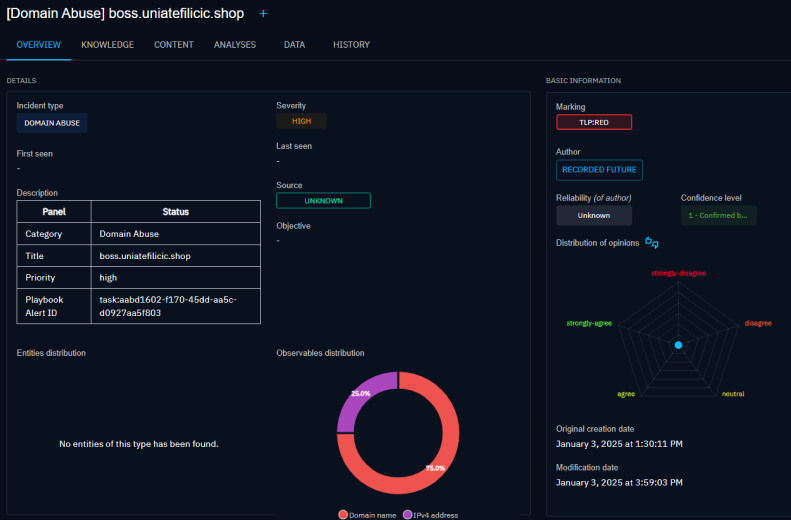
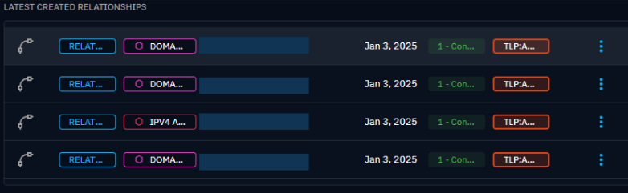
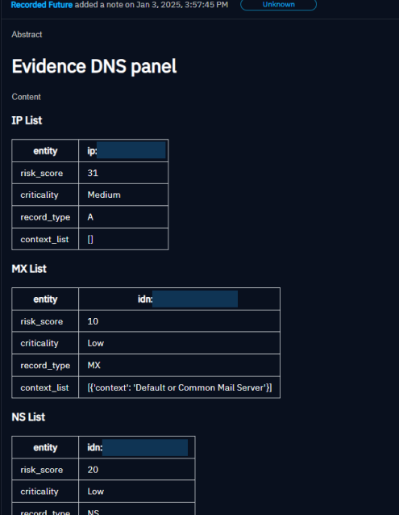

# OpenCTI Recorded Future Connector

The Recorded Future connector is a standalone Python process that collect data from Recorded Future which collects data from a wide range of sources to provide comprehensive threat intelligence.

Summary

- [OpenCTI Recorded Future Connector](#opencti-recorded-future-connector)
  - [Introduction](#introduction)
  - [Requirements](#requirements)
  - [Configuration variables](#configuration-variables)
    - [OpenCTI environment variables](#opencti-environment-variables)
    - [Base connector environment variables](#base-connector-environment-variables)
    - [Recorded Future connector environment variables](#recorded-future-connector-environment-variables)
  - [Deployment](#deployment)
    - [Docker Deployment](#docker-deployment)
    - [Manual Deployment](#manual-deployment)
  - [Usage](#usage)
  - [Behavior - What the connector imports ?](#behavior)
    - [Analyst notes](#analyst-notes)
      - [Initial population](#initial-population)
      - [Verification](#verification)
    - [Risk Lists](#risk-lists)
      - [Initial population](#initial-population-1)
      - [Verification](#verification-1)
    - [Threat Maps](#threat-maps)
      - [Initial population](#initial-population-2)
      - [Verification](#verification-2)
    - [Alerts](#alerts)
    - [Playbook Alerts](#playbook-alerts)
  - [Known Issues and Workarounds](#known-issues-and-workarounds)
    - [Importing risk lists](#importing-risk-lists)
  - [Useful Resources](#useful-resources)

---

## Introduction

[Recorded Future](https://www.recordedfuture.com/) is a cybersecurity company that specializes in providing real-time threat intelligence to help organizations anticipate, identify, and mitigate cyber threats.

The company's platform leverages machine learning and natural language processing to analyze a vast array of source:

- **Open Web Sources**: This includes publicly accessible websites, news outlets, blogs, and forums where threat actors might discuss vulnerabilities, exploits, or plan attacks.

- **Technical Data Sources**: These include data from internet infrastructure such as domain name registries, IP address allocations, and SSL certificate logs, which can be analyzed to identify malicious activity or infrastructure.

- **Dark Web Sources**: Recorded Future also scans parts of the dark web, including forums, marketplaces, and chat services where cybercriminals often operate and trade tools, services, and stolen data.

- **Social Media**: Public posts and discussions on social media platforms can sometimes reveal information about cybersecurity threats or be used by threat actors for communication.

- **Government and Industry Reports**: Reports and bulletins from cybersecurity agencies, industry groups, and security companies often contain valuable data on recent threats, vulnerabilities, and incidents.

- **Proprietary Data Sources**: Recorded Future may also use proprietary data sources or data obtained through partnerships with other cybersecurity entities.

By aggregating and analyzing data from these diverse sources, Recorded Future can identify patterns, trends, and indicators of compromise (IoCs) that help organizations understand and mitigate cyber threats more effectively.

This connector imports _Recorded Future Analyst Notes_, the _Risk Lists_ (IP, URL, Domain Name and Hash), and _Malware_ and _Threat Actors_ from Threats Maps, converts to STIX2 and imports them into OpenCTI at regular intervals.

## Requirements

To use the connector, you need to have a Recorded Future account.

- OpenCTI Platform version 5.12.0 or higher
- An API Key for accessing

## Configuration variables

There are a number of configuration options, which are set either in `docker-compose.yml` (for Docker) or in `config.yml` (for manual deployment).

### OpenCTI environment variables

Below are the parameters you'll need to set for OpenCTI:

| Parameter `OpenCTI` | config.yml | Docker environment variable | Mandatory | Description                                           |
|---------------------|------------|-----------------------------|-----------|-------------------------------------------------------|
| URL                 | `url`      | `OPENCTI_URL`               | Yes       | The URL of the OpenCTI platform.                      |
| Token               | `token`    | `OPENCTI_TOKEN`             | Yes       | The default admin token set in the OpenCTI platform.  |


### Base connector environment variables

Below are the parameters you'll need to set for running the connector properly:

| Parameter `Connector` | config.yml        | Docker environment variable    | Default                                                                       | Mandatory | Description                                                                                            |
|-----------------------|-------------------|--------------------------------|-------------------------------------------------------------------------------|-----------|--------------------------------------------------------------------------------------------------------|
| ID                    | `id`              | `CONNECTOR_ID`                 | /                                                                             | Yes       | A unique `UUIDv4` identifier for this connector instance.                                              |
| Type                  | `type`            | `CONNECTOR_TYPE`               | `EXTERNAL_IMPORT`                                                             | Yes       | Should always be set to `EXTERNAL_IMPORT` for this connector.                                          |
| Name                  | `name`            | `CONNECTOR_NAME`               | `Recorded Future`                                                             | Yes       | Name of the connector.                                                                                 |
| Scope                 | `scope`           | `CONNECTOR_SCOPE`              | `ipv4-addr,ipv6-addr,vulnerability,domain,url,file-sha256,file-md5,file-sha1` | Yes       | The scope or type of data the connector is importing, either a MIME type or Stix Object.               |
| Log Level             | `log_level`       | `CONNECTOR_LOG_LEVEL`          | `info`                                                                        | Yes       | Determines the verbosity of the logs. Options are `debug`, `info`, `warn`, or `error`.                 |
| Duration Period       | `duration_period` | `CONNECTOR_DURATION_PERIOD`    | `PT24H`                                                                       | Yes       | Determines the time interval between each launch of the connector in ISO 8601, ex: `PT24H` or `P1D`.   |
| Queue Threshold       | `queue_threshold` | `CONNECTOR_QUEUE_THRESHOLD`    | `500`                                                                         | No        | Used to determine the limit (RabbitMQ) in MB at which the connector must go into buffering mode.       |

### Recorded Future connector environment variables

Below are the parameters you'll need to set for Recorded Future connector:

| Parameter `Recorded Future`  | config.yml                   | Docker environment variable                 | Default                                               | Mandatory | Description                                                                                                                                                                                                                                                    |
|------------------------------|------------------------------|---------------------------------------------|-------------------------------------------------------|-----------|----------------------------------------------------------------------------------------------------------------------------------------------------------------------------------------------------------------------------------------------------------------|
| Token                        | `token`                      | `RECORDED_FUTURE_TOKEN`                     | /                                                     | Yes       | Token for the RF API.                                                                                                                                                                                                                                          |
| Initial lookback             | `initial_lookback`           | `RECORDED_FUTURE_INITIAL_LOOKBACK`          | `240`                                                 | Yes       | The numeric timeframe the connector will search for Analyst Notes on the first run, required, in hours.                                                                                                                                                        |
| Pull Analyst Notes           | `pull_analyst_notes`         | `RECORDED_FUTURE_PULL_ANALYST_NOTES`        | `True`                                                | yes       | A boolean flag of whether to pull entities from Analyst Notes into OpenCTI.                                                                                                                                                                                    |
| Last Published Notes         | `last_published_notes`       | `RECORDED_FUTURE_LAST_PUBLISHED_NOTES`      | `24`                                                  | Yes       | The number of hours to fetch notes in far back                                                                                                                                                                                                                 |
| Marking                      | `TLP`                        | `RECORDED_FUTURE_TLP`                       | `red`                                                 | Yes       | TLP Marking for data imported, possible values: white, green, amber, amber+strict, red                                                                                                                                                                         |
| Topic                        | `topic`                      | `RECORDED_FUTURE_TOPIC`                     | `VTrvnW,g1KBGl,ZjnoP0,aDKkpk,TXSFt5,UrMRnT,TXSFt3`    | No        | Filter Analyst Notes on a specific topic. Topics can be found [here](https://support.recordedfuture.com/hc/en-us/articles/360006361774-Analyst-Note-API). You **must** use the topic RFID, for example aUyI9M. Multiple topics are allowed (separated by ','). |
| Notes from Insikt Group      | `insikt_only`                | `RECORDED_FUTURE_INSIKT_ONLY`               | `True`                                                | No        | A boolean flag of whether to pull analyst notes only from the Insikt research team, or whether to include notes written by Users. Default to True.                                                                                                             |
| Pull signatures              | `pull_signatures`            | `RECORDED_FUTURE_PULL_SIGNATURES`           | `False`                                               | No        | Pull Yara/Snort/Sigma rules into OpenCTI                                                                                                                                                                                                                       |
| Person to Threat Actor       | `person_to_TA`               | `RECORDED_FUTURE_PERSON_TO_TA`              | `False`                                               | No        | Converts all Recorded Future entities of type person to STIX object "Threat Actor" instead of individual when import Analyst Notes. DO NOT USE unless you **really** know what you're doing                                                                    |
| Theat Actor to Intrusion Set | `TA_to_intrusion_set`        | `RECORDED_FUTURE_TA_TO_INTRUSION_SET`       | `False`                                               | No        | Converts all Recorded Future Threat Actors to STIX Object "Intrusion Set" instead of "Threat Actor" when Analyst Notes are imported. DO NOT USE unless you **really** know what you're doing                                                                   |
| Risk as score                | `risk_as_score`              | `RECORDED_FUTURE_RISK_AS_SCORE`             | `True`                                                | No        | Use Recorded Future "risk" as a score for STIX when Analyst Notes are imported                                                                                                                                                                                 |
| Risk threshold               | `risk_threshold`             | `RECORDED_FUTURE_RISK_THRESHOLD`            | `60`                                                  | No        | A threshold under which related indicators are not taken into account. Indicators related to Analyst Notes.                                                                                                                                                    |
| Pull risk list               | `pull_risk_list`             | `RECORDED_FUTURE_PULL_RISK_LIST`            | `False`                                               | No        | A boolean flag of whether to pull risk lists into OpenCTI.                                                                                                                                                                                                     |
| Risk list threshold          | `risk_list_threshold`        | `RECORDED_FUTURE_RISK_LIST_THRESHOLD`       | `70`                                                  | No        | A threshold under which related indicators are not taken into account. Indicators from Risk Lists.                                                                                                                                                             |
| Risk list related entities   | `risklist_related_entities`  | `RECORDED_FUTURE_RISKLIST_RELATED_ENTITIES` | `Malware,Hash,URL,Threat Actor,MitreAttackIdentifier` | Yes       | Related entities to an indicator from Risk List when it's imported. Required if pull_risk_list is True, possible values: Malware,Hash,URL,Threat Actor,MitreAttackIdentifier. Multiple related entities are allowed (separated by ',')                         |
| Pull threat maps             | `pull_threat_maps`           | `RECORDED_FUTURE_PULL_THREAT_MAPS`          | `False`                                               | No        | A boolean flag of whether to pull entities from Threat Maps into OpenCTI.                                                                                                                                                                                      |


## Deployment

### Docker Deployment

Before building the Docker container, you need to set the version of pycti in `requirements.txt` equal to whatever version of OpenCTI you're running. Example, `pycti==5.12.20`. If you don't, it will take the latest version, but sometimes the OpenCTI SDK fails to initialize.

Build a Docker Image using the provided `Dockerfile`.

Example:

```shell
# Replace the IMAGE NAME with the appropriate value
docker build . -t [IMAGE NAME]:latest
```

Make sure to replace the environment variables in `docker-compose.yml` with the appropriate configurations for your
environment. Then, start the docker container with the provided docker-compose.yml

```shell
docker compose up -d
# -d for detached
```

### Manual Deployment

Create a file `config.yml` based on the provided `config.yml.sample`.

Replace the configuration variables (especially the "**ChangeMe**" variables) with the appropriate configurations for
you environment.

Install the required python dependencies (preferably in a virtual environment):

```shell
pip3 install -r requirements.txt
```

Then, start the connector from recorded-future/src:

```shell
python3 main.py
```
## Usage

After Installation, the connector should require minimal interaction to use, and should update automatically at the hourly interval specified in your `docker-compose.yml` or `config.yml`.

However, if you would like to force an immediate download of a new batch of Analyst Notes, Risk Lists (when it is configured to `True`) or entities from Threat Maps (when it is configured to `True`), navigate to:

`Data management` -> `Ingestion` -> `Connectors` in the OpenCTI platform. 

Find the "Recorded Future" connector, and click on the refresh button to reset the connector's state and force a new download of data by re-running the connector.


## Behavior

### Analyst notes

Analyst Notes are notes which include analysis and insights from Insikt Group research or the organization's notes.

#### Initial population

For the first run of the connector, the connector will import Analyst Notes from Recorded Future's [Insikt Group research](https://www.recordedfuture.com/research).

Example of connector logs:

_TLP: green_

_pull_signatures: True_

_insikt_only: True_


Each Analyst Note is converted into a STIX2 report. The report contains STIX2 SDOs that are converted as per below

- Note Title and Content -> STIX2 report content
- Topic-> STIX2 report labels
- Validation Urls -> STIX2 report external references
- Note Entities -> Indicator, Observables, Threat Actors or other corresponding SDOs
- Detection Rules -> Indicators

For Note entities, the following Recorded Future Entity types are supported:

- IpAddress
- InternetDomainName
- URL
- Hash
- MitreAttackIdentifier
- Company
- Person
- Organization
- Malware
- Vulnerability
- Software
- Location: Country, City, Administrative-Area
- Sector
- Campaign
- Threat Actor

The context have been added now following the relationships below:


Example of result in the OpenCTI platform Report knowledge graph:


Give a value for the `interval` (config.yml for local deployment) or `RECORDED_FUTURE_INTERVAL` (docker-compose.yml file for deployment with Docker containers) allows you to pull Analyst Notes at regular intervals and retrieve notes from the last published date.

#### Verification

To verify that Analyst Notes have downloaded, navigate to the `Analyses` -> `Reports` tab in the OpenCTI Platform. You should see new reports authored by the Identity Recorded Future. Click on those reports to see the details and on `Knowledge` to see the context for that Note.

Example of result in the OpenCTI platform `Analyses` -> `Reports` and selecting one report:


### Risk Lists

Recorded Future comes equipped with five Recorded Future Risk Lists, which serve to correlate and enhance event data. These lists include:

- IP addresses
- Domain names
- URLs
- File hashes
- Vulnerabilities (primarily CVEs)

Subscribers who have API access can retrieve lists of entities that have been assigned risk scores by Recorded Future by utilizing the Connect API calls.

Every item in a Risk List, whether it's an IP address, domain, or another element, comes with a risk score and the details that influenced that score. Additionally, having Fusion access enables the customization of Risk Lists.

Vulnerabilities are not handled by the connector.

#### Initial population

The connector allows you to pull STIX formatted risk lists selected by risk score and indicators with risk score >= 65 are included in the list.

The following fields are included with each Risk List:

- `Name` as the value for OpenCTI IoC
- `Risk` as the score of IoC
- `RiskRules` and `RuleCriticality` will be added ***in description*** of IoC, they define the ruletriggered by the IoC and the severity of the criticality score
- `FirstSeen` as the date when the IoC was first seen
- `LastSeen` as the date when the IoC was last seen
- `Links` as related entities to the IoC

One notable aspect of `RiskRules` and `RuleCriticality` is that while rule severity ranges from 1 to 4, the connector specifically includes in its descriptions only those rules rated as 3-Malicious and 4-Very Malicious.

Example of the result in the description for an Indicator:

*pull_risk_list: True*


If `pull_risk_list` is `True`, the `risk_list_interval` is **REQUIRED** and the `risk_list_related_entities` is **REQUIRED** (at least one value must be set). This configuration allows you to choose the context that you would like to import related to the targetting IP, Domain, Hash file or URL between: "Malware", "Hash", "URL", "Threat Actor", "MitreAttackIdentifier".

For example, if you want to perform an investigation on an indicator:


Risk Lists and Analyst Notes can be retrieved simultaneously by the connector.

Give a value for the `risk_list_interval` (config.yml for local deployment) or `RECORDED_FUTURE_RISK_LIST_INTERVAL` (docker-compose.yml file for deployment with Docker containers) allows you to pull Risk Lists at regular intervals.

#### Verification

To verify that Risk Lists have been imported, navigate to the `Observations` -> `Indicators` tab in the OpenCTI Platform. You should see new indicators authored by the Identity Recorded Future. Click on those indicators to see the details, and on `Knowledge` to see the relationships with the related entities configured.

An example of the expected result:


### Threat Maps

Threat Maps provides a structured, repeatable method of identifying and prioritizing Threat Actors or Malware relevant to your enterprise and plotting them based on their values for potential intent and estimated opportunity.

These Threat Maps are based on your configured watchlist for example for the Industry Watch List check industry entities associated with the organization per Recorded Future ontologies.

The connector will import all `Threat Actors` and all `Malware` from the related threat maps.

#### Initial population

Pulling threat maps is Optional. If `pull_threat_maps` is `True`, the `threat_maps_interval` is **REQUIRED**.

Give a value for the `threat_maps_interval` (config.yml for local deployment) or `RECORDED_FUTURE_THREAT_MAPS_INTERVAL` (docker-compose.yml file for deployment with Docker containers) allows you to pull Threat Maps at regular intervals.

The connector will import all Malware and Threat Actors with their context.

Threat Actors will be registered as in `Intrusion Set`.

Example of result for an Intrusion Set:


Example of result if you want to perform an investigation on an intrusion set and see the context:


#### Verification

To verify that Risk Lists have been imported, navigate to the `Threats` -> `Intrusion Set` tab in the OpenCTI Platform. You should see new intrusion sets authored by the Identity Recorded Future. Click on those intrusion sets to see the details, and on `Knowledge` to see the relationships with the related entities configured.

### Alerts

Also known as Classic Alerts (or "Basic" Alerts), these are essentially saved searches that run periodically on the Recorded Future database. For example, a classic alert could search for all typosquats of a specific domain, run on a schedule (e.g., every hour), and return all detected typosquats along with some associated raw data from that timeframe.

- They are highly flexible and can be customized to search for virtually anything in the Recorded Future database.
- Many prebuilt classic alerts are available, but their functionality is limited to simple searches and raw data retrieval.

#### Prerequisites

To use Classic Alerts, you need to have a Recorded Future account with the appropriate permissions.

Then, you need to configure your watchlist in the Recorded Future platform.


Check your Alerting Rules activation


And if you want to have priority alerts, you need to check the box

]

#### Initial population

Pulling Alerts is Optional. If pulling alerts is enabled, you can choose whether if you want priority alerts only or not.

Pulling Alerts from Recorded Future will create an Incident.

Example of result for an Incident:


Here the result for related entities:


And notes will be added as well:


### Playbook Alerts

Playbook Alerts are more advanced and tailored to specific use cases. They provide enriched data and deeper context to streamline incident triage. For instance, in the case of a "Domain Abuse" Playbook Alert (focused on typosquatting), the output would include:

- DNS Records: Detailed DNS information for the domain.
- Screenshots: A screenshot of the detected domain.
- AI Analysis: An automated analysis that identifies elements like company logos, login pages, and other key indicators on the screenshot.
- Tags and Severity Levels: Automatically generated based on the enriched data and criteria.

The key advantage of Playbook Alerts is that they consolidate all necessary information in one place, enabling quicker and more efficient triage of incidents compared to Classic Alerts.

The connector will import all Playbook Alerts from the following alerting rules list:
- Domain Abuse
- Identity Exposure
- Data Leakage on Code Repository

#### Prerequisites

Same as for Alerts, you need to have a Recorded Future account with the appropriate permissions and configure alerting rules and watchlist.

#### Initial population

Pulling Playbook Alerts is Optional.
Pulling Alerts from Recorded Future will create an Incident.

You can choose the severity of the alerting rules to pull

```sh
  severity_threshold_domain_abuse: 'High'
  severity_threshold_identity_novel_exposures: 'High'
  severity_threshold_code_repo_leakage: 'High'
```

Example of result for an Incident:



Here the result for related entities:



And notes will be added as well:




## Known Issues and Workarounds

### Importing risk lists

Importing risk lists along with their associated entities can result in a large amount of data. Currently, you can use the `risklist_related_entities` configuration to apply filters.

For example, importing risk list with related IP Address:


You need to have a minimum of 2 workers if `pull_risk_list` is `True` to ingest properly all data in queue before the end of the interval and an interval of 48 hours is highly recommended to avoid stacking a lot of data in the RabbitMQ Recorded Future connector queue.

---

## Useful Resources

OpenCTI documentation for connectors:

- [OpenCTI Ecosystem](https://filigran.notion.site/OpenCTI-Ecosystem-868329e9fb734fca89692b2ed6087e76)
- [Connectors Deployment](https://docs.opencti.io/latest/deployment/connectors/)
- [Connectors Development](https://docs.opencti.io/latest/development/connectors/)

Recorded Future documentation (restricted access):
- [Why the alert triggered?](https://support.recordedfuture.com/hc/en-us/articles/4407128752787-Why-did-this-alert-trigger)

_Note: Base of Alerts and Playbook Alerts code was initiated by [Sydney](https://github.com/septdney/) from [Bouygues Telecom](https://www.corporate.bouyguestelecom.fr/csirt-bouygues-telecom/), thanks for the contribution_ 