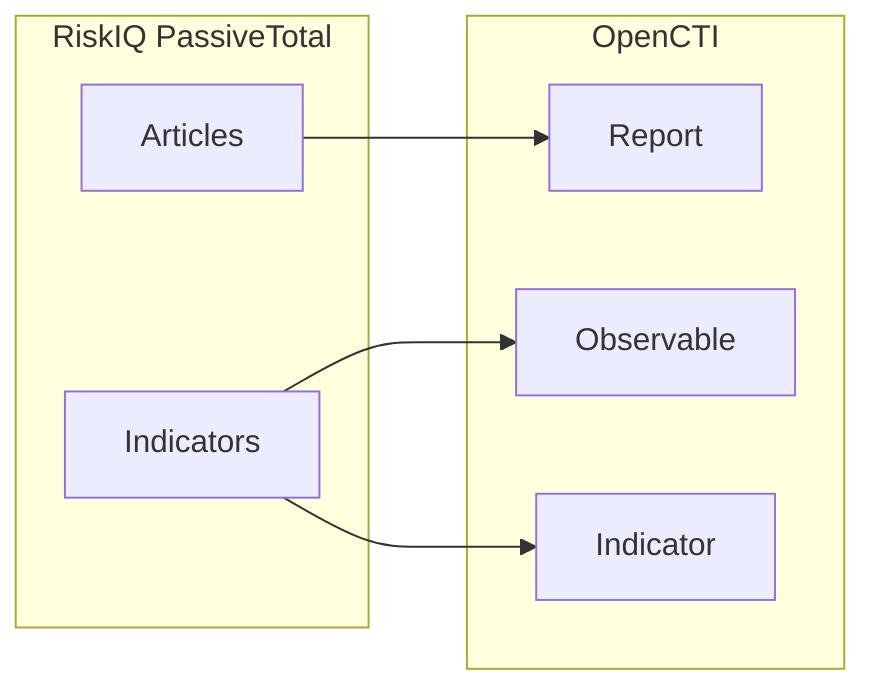

# OpenCTI RiskIQ Connector

| Status | Date | Comment |
|--------|------|---------|
| Community | -    | -       |

The RiskIQ connector imports threat intelligence articles and indicators from RiskIQ PassiveTotal into OpenCTI.

## Table of Contents

- [OpenCTI RiskIQ Connector](#opencti-riskiq-connector)
  - [Table of Contents](#table-of-contents)
  - [Introduction](#introduction)
  - [Installation](#installation)
    - [Requirements](#requirements)
  - [Configuration variables](#configuration-variables)
    - [OpenCTI environment variables](#opencti-environment-variables)
    - [Base connector environment variables](#base-connector-environment-variables)
    - [Connector extra parameters environment variables](#connector-extra-parameters-environment-variables)
  - [Deployment](#deployment)
    - [Docker Deployment](#docker-deployment)
    - [Manual Deployment](#manual-deployment)
  - [Usage](#usage)
  - [Behavior](#behavior)
  - [Debugging](#debugging)
  - [Additional information](#additional-information)

## Introduction

RiskIQ PassiveTotal provides internet-scale data collection and analysis for security teams. This connector imports RiskIQ articles and associated indicators into OpenCTI, enabling correlation with other threat intelligence sources.

## Installation

### Requirements

- OpenCTI Platform >= 6.x
- RiskIQ PassiveTotal account
- RiskIQ API credentials (username and API key)

## Configuration variables

There are a number of configuration options, which are set either in `docker-compose.yml` (for Docker) or in `config.yml` (for manual deployment).

### OpenCTI environment variables

| Parameter     | config.yml | Docker environment variable | Mandatory | Description                                          |
|---------------|------------|-----------------------------|-----------|------------------------------------------------------|
| OpenCTI URL   | url        | `OPENCTI_URL`               | Yes       | The URL of the OpenCTI platform.                     |
| OpenCTI Token | token      | `OPENCTI_TOKEN`             | Yes       | The default admin token set in the OpenCTI platform. |

### Base connector environment variables

| Parameter       | config.yml | Docker environment variable | Default | Mandatory | Description                                                                 |
|-----------------|------------|-----------------------------|---------|-----------| ----------------------------------------------------------------------------|
| Connector ID    | id         | `CONNECTOR_ID`              |         | Yes       | A unique `UUIDv4` identifier for this connector instance.                   |
| Connector Name  | name       | `CONNECTOR_NAME`            | RISKIQ  | No        | Name of the connector.                                                      |
| Connector Scope | scope      | `CONNECTOR_SCOPE`           | riskiq  | No        | The scope or type of data the connector is importing.                       |
| Log Level       | log_level  | `CONNECTOR_LOG_LEVEL`       | error   | No        | Determines the verbosity of the logs: `debug`, `info`, `warn`, or `error`.  |
| Expose Metrics  | metrics    | `CONNECTOR_EXPOSE_METRICS`  | false   | No        | Expose Prometheus metrics.                                                  |

### Connector extra parameters environment variables

| Parameter          | config.yml                | Docker environment variable     | Default                          | Mandatory | Description                                                                 |
|--------------------|---------------------------|---------------------------------|----------------------------------|-----------|-----------------------------------------------------------------------------|
| Base URL           | riskiq.base_url           | `RISKIQ_BASE_URL`               | https://api.riskiq.net/pt/v2     | No        | RiskIQ API base URL.                                                        |
| User               | riskiq.user               | `RISKIQ_USER`                   |                                  | Yes       | RiskIQ username (email).                                                    |
| Password           | riskiq.password           | `RISKIQ_PASSWORD`               |                                  | Yes       | RiskIQ API key.                                                             |
| Create Observables | riskiq.create_observables | `RISKIQ_CREATE_OBSERVABLES`     | true                             | No        | Create observables from indicators.                                         |
| Interval           | riskiq.interval_sec       | `RISKIQ_INTERVAL_SEC`           | 86400                            | No        | Time between runs in seconds (default: 24h).                                |

## Deployment

### Docker Deployment

Build the Docker image:

```bash
docker build -t opencti/connector-riskiq:latest .
```

Configure the connector in `docker-compose.yml`:

```yaml
  connector-riskiq:
    image: opencti/connector-riskiq:latest
    environment:
      - OPENCTI_URL=http://localhost
      - OPENCTI_TOKEN=ChangeMe
      - CONNECTOR_ID=ChangeMe
      - CONNECTOR_NAME=RISKIQ
      - CONNECTOR_SCOPE=riskiq
      - CONNECTOR_LOG_LEVEL=error
      - RISKIQ_BASE_URL=https://api.riskiq.net/pt/v2
      - RISKIQ_USER=ChangeMe
      - RISKIQ_PASSWORD=ChangeMe
      - RISKIQ_CREATE_OBSERVABLES=true
      - RISKIQ_INTERVAL_SEC=86400
    restart: always
```

Start the connector:

```bash
docker compose up -d
```

### Manual Deployment

1. Create `config.yml` based on `config.yml.sample`.

2. Install dependencies:

```bash
pip3 install -r requirements.txt
```

3. Start the connector:

```bash
python3 main.py
```

## Usage

The connector runs automatically at the interval defined by `RISKIQ_INTERVAL_SEC`. To force an immediate run:

**Data Management → Ingestion → Connectors**

Find the connector and click the refresh button to reset the state and trigger a new sync.

## Behavior

The connector fetches RiskIQ articles and indicators, converting them to STIX 2.1 objects.

### Data Flow



### Entity Mapping

| RiskIQ Data          | OpenCTI Entity      | Description                                      |
|----------------------|---------------------|--------------------------------------------------|
| Article              | Report              | Threat intelligence article                      |
| IP Address           | IPv4-Addr/IPv6-Addr | IP observables                                   |
| Domain               | Domain-Name         | Domain observables                               |
| Hash                 | File                | File hash observables                            |
| URL                  | URL                 | URL observables                                  |

## Debugging

Enable verbose logging:

```env
CONNECTOR_LOG_LEVEL=debug
```

## Additional information

- **PassiveTotal**: Now part of Microsoft Defender Threat Intelligence
- **API Credentials**: Username is your email; password is your API key
- **Rate Limits**: RiskIQ has API rate limits; adjust interval accordingly
- **Reference**: [RiskIQ PassiveTotal](https://community.riskiq.com/)
