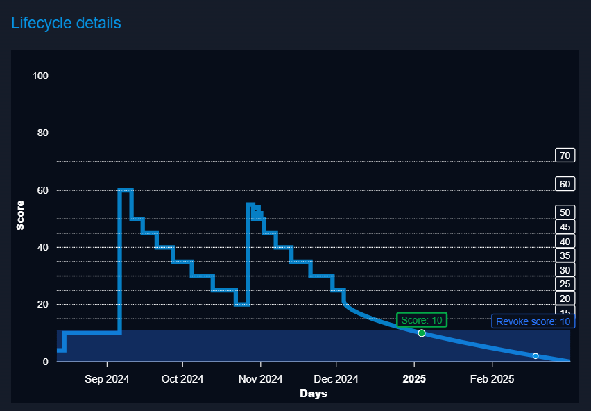

# RST Threat Feed Connector for OpenCTI by RST Cloud

| Status | Date | Comment |
|--------|------|---------|
| Partner Verified | -    | -       |

The RST Threat Feed connector imports indicators (IP, Domain, URL, Hash) with relationships to malware, TTPs, tools, threat groups, sectors, CVE, and other objects from RST Cloud into OpenCTI.

## Introduction

The **RST Threat Feed Connector** integrates RST Cloud threat intelligence feeds into OpenCTI. This connector imports Indicators (IP, Domain, URL, Hash) with their relationships to malware, TTPs, tools, threat groups, sectors, CVE, and other objects. This enhances the capability of OpenCTI by providing actionable threat intelligence data, allowing users to make informed decisions based on the latest information from ([RST Threat Feed](https://www.rstcloud.com/rst-threat-feed/)).

The feed delivers approximately 200K indicators daily, with the ability to filter by score. Each indicator has an individual score, allowing OpenCTI to keep indicator scores updated when inactive indicators become active again (c2 went offline, a domain had no A DNS entry, a phishing website was not active, etc). Scoring is aligned with OpenCTI scoring algorithms and allows you to set a custom decay speed in your platform.

Data scored between 0 and 20 is typically considered noisy. Data with a score of 45+ is used in SIEMs for real-time detection, while data scored 55+ is used for active blocking. However, everyone can set their own thresholds to find the optimal balance for their needs.

Data can be retrieved every hour or daily, depending on the use case. The feed includes multiple threat categories.
| Examples of Threat Categories |              |            |            |
| ----------------------------- | ------------ | ---------- | ---------- |
| backdoor                      | banker       | bootkit    | botnet     |
| c2                            | cryptomining | downloader | drainer    |
| dropper                       | fraud        | keylogger  | malware    |
| phishing                      | proxy        | raas       | ransomware |
| rat                           | rootkit      | scam       | scan       |
| screenshotter                 | shellprobe   | spam       | spyware    |
| stealer                       | tor_exit     | trojan     | vpn        |
| vulndriver                    | webattack    | wiper      |            |

## Key Features

- **Lots of contextual information**: Indicators come with additional info including threat category, malware name, threat actor names, tools and frameworks, TTPs, CVE, industry tags, reference to the source of the indicator and more.
- **OpenCTI Integration**: Seamlessly integrates the fetched data into OpenCTI's database.
- **Customizable Data Ingestion**: Users can specify a score threshold to control what indicators are being imported and also configure to import only new indicators.
- **Customizable Detection Flag**: Users can specify per each indicator type what is the score threshold to mark an Indicator as ready for detection (x_opencti_detection=true|false)

This connector empowers users with an expanded and in-depth insight into the cyber threat landscape by tapping into the detailed threat intelligence delivered by RST Cloud.

## Requirements
- OpenCTI Platform version 5.10.x or higher.
- An API Key for accessing RST Cloud (trial@rstcloud.net).

## Recommended connectors
This connector is aligned with data populated by common OpenCTI connectors. We recommend to install the following connectors alongside with RST Threat Feed Connector:
 - MITRE Datasets (https://github.com/OpenCTI-Platform/connectors/tree/master/external-import/mitre)
 - OpenCTI Datasets (https://github.com/OpenCTI-Platform/connectors/tree/master/external-import/opencti)
 - CISA Known Exploited Vulnerabilities (https://github.com/OpenCTI-Platform/connectors/tree/master/external-import/cisa-known-exploited-vulnerabilities)
 - **RST Threat Library** is an optional, paid add-on for RST Threat Feed customers who want access to a comprehensive threat taxonomy and alias mapping (https://rstcloud.com/rst-threat-library/) 

 By default, the RST Threat Feed connector maps threat names from the RST codename taxonomy to format that is used public repositories (MITRE, Malpedia) where possible. However, many threat names are not present in public taxonomies. With RST Threat Library, you get:
  - All aliases of the same threat name, not just the primary code.
  - Unified threat profiles, enabling you to correlate and consume intelligence from multiple sources (e.g., MITRE, Recorded Future, Microsoft, CrowdStrike, and many more) under a single taxonomy.
  - Enhanced context and mapping for threat actors, malware, campaigns, tools, TTPs, and vulnerabilities.

**Note:**  
The RST Threat Feed connector includes basic mapping to public taxonomies for free. RST Threat Library is a separate subscription for customers who need full aliasing and advanced threat profile mapping. For more information or to request access, contact [trial@rstcloud.net](mailto:trial@rstcloud.net).

## Configuration

Configuring the connector is straightforward. The minimal setup requires entering the RST Cloud API key and specifying the OpenCTI connection settings. Below is the full list of parameters you can configure:

| Parameter                                          | Docker envvar                                | Mandatory | Description                                                                                                                                                                                                  |
| -------------------------------------------------- | -------------------------------------------- | --------- | ------------------------------------------------------------------------------------------------------------------------------------------------------------------------------------------------------------ |
| OpenCTI URL                                        | `OPENCTI_URL`                                | Yes       | The URL of the OpenCTI platform.                                                                                                                                                                             |
| OpenCTI Token                                      | `OPENCTI_TOKEN`                              | Yes       | The default admin token set in the OpenCTI platform.                                                                                                                                                         |
| Connector ID                                       | `CONNECTOR_ID`                               | Yes       | A unique `UUIDv4` identifier for this connector instance.                                                                                                                                                    |
| Connector Name                                     | `CONNECTOR_NAME`                             | Yes       | Name of the connector. For example: `RST Threat Feed`.                                                                                                                                                       |
| Connector Scope                                    | `CONNECTOR_SCOPE`                            | Yes       | The scope or type of data the connector is importing, either a MIME type or Stix Object. E.g. application/json                                                                                               |
| Log Level                                          | `CONNECTOR_LOG_LEVEL`                        | Yes       | Determines the verbosity of the logs. Options are `debug`, `info`, `warn`, or `error`.                                                                                                                       |
| Interval                                           | `CONFIG_INTERVAL`                            | Yes       | Determines how often the connector will run, set in hours.                                                                                                                                                   |
| RST Threat Feed API Key                            | `RST_THREAT_FEED_API_KEY`                    | Yes       | Your API Key for accessing RST Cloud.                                                                                                                                                                        |
| RST Threat Feed Base URL                           | `RST_THREAT_FEED_BASEURL`                    | No        | By default, use https://api.rstcloud.net/v1. In some cases, you may want to use a local API endpoint                                                                                                         |
| SSL Verification                                   | `RST_THREAT_FEED_SSL_VERIFY`                 | No        | Default: `true`. If set to `false`, SSL verification is disabled (use with caution, sometimes needed when SSL inspection is enabled).                                                                        |
| Enable IP Threat Feed                              | `RST_THREAT_FEED_IP`                         | No        | Default: `true`. If `true`, the connector retrieves threat intelligence data for IP addresses.                                                                                                               |
| Enable Domain Threat Feed                          | `RST_THREAT_FEED_DOMAIN`                     | No        | Default: `true`. If `true`, the connector retrieves threat intelligence data for domains.                                                                                                                    |
| Enable URL Threat Feed                             | `RST_THREAT_FEED_URL`                        | No        | Default: `true`. If `true`, the connector retrieves threat intelligence data for URLs.                                                                                                                       |
| Enable Hash Threat Feed                            | `RST_THREAT_FEED_HASH`                       | No        | Default: `true`. If `true`, the connector retrieves threat intelligence data for file hashes (MD5, SHA1, SHA256).                                                                                            |
| Threat Feed Data Fetch Interval                    | `RST_THREAT_FEED_LATEST`                     | No        | Default: `day`. Defines how often the latest threat feed data is fetched. Options: `1h`, `4h`, `12h`, or `day`.                                                                                              |
| RST Threat Feed Connection Timeout                 | `RST_THREAT_FEED_CONTIMEOUT`                 | No        | Connection timeout to the API. Default (sec): `30`                                                                                                                                                           |
| RST Threat Feed Read Timeout                       | `RST_THREAT_FEED_READTIMEOUT`                | No        | Read timeout for each feed. Our API redirects the connector to download data from AWS S3. If the connector is unable to fetch the feed in time, increase the read timeout. Default (sec): `120`              |
| RST Threat Feed Download Retry Count               | `RST_THREAT_FEED_RETRY`                      | No        | Default (attempts): `2` . Defines the number of attempts to download the feed.                                                                                                                               |
| RST Threat Feed Max Retries                        | `RST_THREAT_FEED_MAX_RETRIES`                | No        | Maximum number of retry attempts for connection issues when sending the data to OpenCTI. Default: `3`                                                                                                        |
| RST Threat Feed Retry Delay                        | `RST_THREAT_FEED_RETRY_DELAY`                | No        | Initial delay in seconds before retrying a failed connection to OpenCTI. Default: `10`                                                                                                                       |
| RST Threat Feed Retry Backoff Multiplier           | `RST_THREAT_FEED_RETRY_BACKOFF_MULTIPLIER`   | No        | Multiplier applied to the retry delay for exponential backoff between retries to send data to OpenCTI. For example, with a delay of 10 and multiplier 2.0, delays will be 10, 20, 40 seconds. Default: `2.0` |
| RST Threat Feed Fetch Interval                     | `RST_THREAT_FEED_INTERVAL`                   | No        | Default (sec): `86400`. If you choose to fetch data hourly, please update this interval accordingly.                                                                                                         |
| RST Threat Feed Minimal Score to Import            | `RST_THREAT_FEED_MIN_SCORE_IMPORT`           | No        | Import only indicators with risk score more than X. The objects that are related to these indicators will also be imported with corresponding relations. Default (score): `20`                               |
| RST Threat Feed Minimum Score for IP Detection     | `RST_THREAT_FEED_MIN_SCORE_DETECTION_IP`     | No        | Indicators with risk score more than X are marked with x_opencti_detection=true. Default (score): `45`                                                                                                       |
| RST Threat Feed Minimum Score for Domain Detection | `RST_THREAT_FEED_MIN_SCORE_DETECTION_DOMAIN` | No        | Indicators with risk score more than X are marked with x_opencti_detection=true. Default (score): `45`                                                                                                       |
| RST Threat Feed Minimum Score for URL Detection    | `RST_THREAT_FEED_MIN_SCORE_DETECTION_URL`    | No        | Indicators with risk score more than X are marked with x_opencti_detection=true. Default (score): `45`                                                                                                       |
| RST Threat Feed Minimum Score for Hash Detection   | `RST_THREAT_FEED_MIN_SCORE_DETECTION_HASH`   | No        | Indicators with risk score more than X are marked with x_opencti_detection=true. Default (score): `45`                                                                                                       |
| Import only New Indicators                         | `RST_THREAT_FEED_ONLY_NEW`                   | No        | Defines if you only want to import indicators with recent "First Seen" or also want to re-import changes to the indicators with "Last Seen" >= yesterday. Default: `true`                                    |
| Import only Attributed Indicators                  | `RST_THREAT_FEED_ONLY_ATTRIBUTED`            | No        | Defines if you only want to import indicators that are attributed to known threats. Default: `false`                                                                                                         |
| Keep named vulnerabilities                         | `RST_THREAT_FEED_KEEP_NAMED_VULNS`           | No        | Defines if the connector needs to create named vulnerabilities like ldapnightmare as separate objects or it should just use CVE numbers. Default: `true`                                                     |
| Create custom TTPs                                 | `RST_THREAT_FEED_CREATE_CUSTOM_TTPS`         | No        | A user can select if `attack-pattern` objects with custom names that are still not present in the MITRE ATT&CK framework are to be created or not. Options are `true`, `false`. Default: `true`              |
