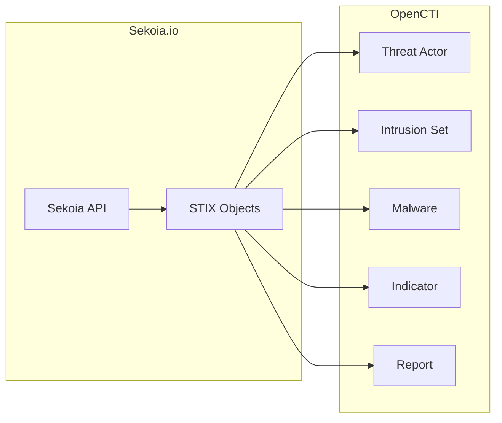

# OpenCTI Sekoia Connector

| Status | Date | Comment |
|--------|------|---------|
| Filigran Verified | -    | -       |

The Sekoia connector imports threat intelligence from the Sekoia.io threat intelligence platform into OpenCTI.

## Table of Contents

- [OpenCTI Sekoia Connector](#opencti-sekoia-connector)
  - [Table of Contents](#table-of-contents)
  - [Introduction](#introduction)
  - [Installation](#installation)
    - [Requirements](#requirements)
  - [Configuration variables](#configuration-variables)
    - [OpenCTI environment variables](#opencti-environment-variables)
    - [Base connector environment variables](#base-connector-environment-variables)
    - [Connector extra parameters environment variables](#connector-extra-parameters-environment-variables)
  - [Deployment](#deployment)
    - [Docker Deployment](#docker-deployment)
    - [Manual Deployment](#manual-deployment)
  - [Usage](#usage)
  - [Behavior](#behavior)
  - [Debugging](#debugging)
  - [Additional information](#additional-information)

## Introduction

Sekoia.io is an extended detection and response (XDR) platform that includes a comprehensive threat intelligence feed. This connector synchronizes Sekoia's threat intelligence data with OpenCTI, providing access to indicators, threat actors, malware, and campaign intelligence.

## Installation

### Requirements

- OpenCTI Platform >= 6.x
- Sekoia.io account with API access
- Sekoia API key

## Configuration variables

There are a number of configuration options, which are set either in `docker-compose.yml` (for Docker) or in `config.yml` (for manual deployment).

### OpenCTI environment variables

| Parameter     | config.yml | Docker environment variable | Mandatory | Description                                          |
|---------------|------------|-----------------------------|-----------|------------------------------------------------------|
| OpenCTI URL   | url        | `OPENCTI_URL`               | Yes       | The URL of the OpenCTI platform.                     |
| OpenCTI Token | token      | `OPENCTI_TOKEN`             | Yes       | The default admin token set in the OpenCTI platform. |

### Base connector environment variables

| Parameter         | config.yml      | Docker environment variable   | Default  | Mandatory | Description                                                                 |
|-------------------|-----------------|-------------------------------|----------|-----------|-----------------------------------------------------------------------------|
| Connector ID      | id              | `CONNECTOR_ID`                |          | Yes       | A unique `UUIDv4` identifier for this connector instance.                   |
| Connector Name    | name            | `CONNECTOR_NAME`              | Sekoia   | No        | Name of the connector.                                                      |
| Connector Scope   | scope           | `CONNECTOR_SCOPE`             | sekoia   | No        | The scope or type of data the connector is importing.                       |
| Log Level         | log_level       | `CONNECTOR_LOG_LEVEL`         | info     | No        | Determines the verbosity of the logs: `debug`, `info`, `warn`, or `error`.  |
| Duration Period   | duration_period | `CONNECTOR_DURATION_PERIOD`   | PT5M     | No        | Time interval between connector runs in ISO 8601 format.                    |

### Connector extra parameters environment variables

| Parameter     | config.yml       | Docker environment variable | Default | Mandatory | Description                       |
|---------------|------------------|-----------------------------|---------|-----------|-----------------------------------|
| API Key       | sekoia.api_key   | `SEKOIA_API_KEY`            |         | Yes       | Sekoia.io API key.                |

## Deployment

### Docker Deployment

Build the Docker image:

```bash
docker build -t opencti/connector-sekoia:latest .
```

Configure the connector in `docker-compose.yml`:

```yaml
  connector-sekoia:
    image: opencti/connector-sekoia:latest
    environment:
      - OPENCTI_URL=http://localhost
      - OPENCTI_TOKEN=ChangeMe
      - SEKOIA_API_KEY=ChangeMe
    restart: always
```

Start the connector:

```bash
docker compose up -d
```

### Manual Deployment

1. Create `config.yml` based on `config.yml.sample`.

2. Install dependencies:

```bash
pip3 install -r requirements.txt
```

3. Start the connector:

```bash
python3 main.py
```

## Usage

The connector runs automatically at the interval defined by `CONNECTOR_DURATION_PERIOD`. To force an immediate run:

**Data Management → Ingestion → Connectors**

Find the connector and click the refresh button to reset the state and trigger a new sync.

## Behavior

The connector fetches threat intelligence from Sekoia's API and imports it as STIX 2.1 objects.

### Data Flow



### Entity Mapping

| Sekoia Data          | OpenCTI Entity      | Description                                      |
|----------------------|---------------------|--------------------------------------------------|
| Threat Actor         | Threat-Actor        | Threat actor profiles                            |
| Intrusion Set        | Intrusion-Set       | Threat groups                                    |
| Malware              | Malware             | Malware families and samples                     |
| Tool                 | Tool                | Attack tools                                     |
| Attack Pattern       | Attack-Pattern      | MITRE ATT&CK techniques                          |
| Indicator            | Indicator           | IOCs with patterns                               |
| Observable           | Observable          | Technical observables                            |
| Report               | Report              | Intelligence reports                             |
| Campaign             | Campaign            | Attack campaigns                                 |
| Vulnerability        | Vulnerability       | CVE data                                         |

## Debugging

Enable verbose logging:

```env
CONNECTOR_LOG_LEVEL=debug
```

## Additional information

- **STIX Native**: Sekoia provides data in STIX 2.1 format, ensuring high compatibility
- **API Key**: Obtain your API key from the Sekoia.io platform settings
- **Rate Limits**: The connector respects Sekoia's API rate limits
- **Reference**: [Sekoia.io Documentation](https://docs.sekoia.io/)
