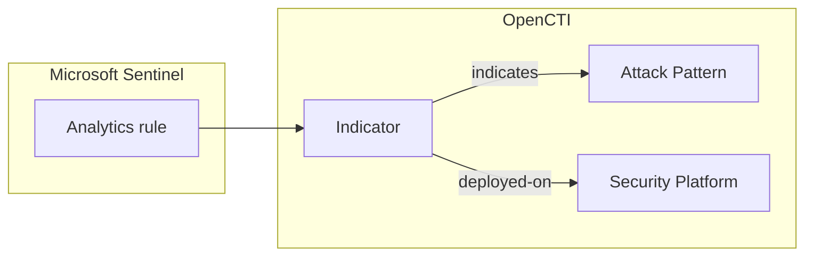

# OpenCTI Microsoft Sentinel Analytics Rules Connector

| Status              | Date | Comment |
|---------------------|------|---------|
| Filigran Maintained | -    | -       |

Table of Contents

- [OpenCTI Microsoft Sentinel Analytics Rules Connector](#opencti-microsoft-sentinel-analytics-rules-connector)
  - [Introduction](#introduction)
  - [Installation](#installation)
    - [Requirements](#requirements)
    - [Permissions in Azure](#permissions-in-azure)
  - [Configuration variables](#configuration-variables)
  - [Deployment](#deployment)
    - [Docker Deployment](#docker-deployment)
    - [Manual Deployment](#manual-deployment)
  - [Usage](#usage)
  - [Behavior](#behavior)
    - [Entity mapping](#entity-mapping)
    - [Rule kinds](#rule-kinds)
    - [Deployment status and reconciliation](#deployment-status-and-reconciliation)
    - [ATT&CK techniques](#attck-techniques)
    - [The deployed-on relationship](#the-deployed-on-relationship)
  - [Debugging](#debugging)
  - [Additional information](#additional-information)

## Introduction

This connector imports the analytics rules deployed in a
[Microsoft Sentinel](https://azure.microsoft.com/products/microsoft-sentinel) workspace into OpenCTI.
Each rule becomes an Indicator whose pattern is the rule KQL query, linked to the MITRE ATT&CK techniques
the rule detects and recorded as deployed on the Microsoft Sentinel platform with its current status.

Together with the other deployed-rule importers (Splunk, Elastic Security, CrowdStrike Falcon, Google
SecOps), it feeds the detection layer of the OpenCTI Threat-Informed Defense Matrix: for each technique
used by the threats you track, which rules exist, where they run, and whether they are enabled.

The connector is read-only on the Azure side: it only lists alert rules, and never creates, modifies,
enables or disables one.

## Installation

### Requirements

- OpenCTI Platform >= 7.261002.0 for the `deployed-on` relationship and the rule metadata properties.
  Older platforms are supported: deployments are then recorded as `related-to` relationships (see
  [The deployed-on relationship](#the-deployed-on-relationship)).
- `pycti==7.261002.0` and the connectors SDK (`src/requirements.txt`).
- Network access to Microsoft Entra ID (`login.microsoftonline.com`) and Azure Resource Manager
  (`management.azure.com`), or their sovereign cloud equivalents.

### Permissions in Azure

1. Register an application in Microsoft Entra ID and create a client secret for it.
2. Assign the application the built-in Azure role **Microsoft Sentinel Reader** on the Log Analytics
   workspace (or on its resource group). The role grants `Microsoft.SecurityInsights/*/read`, which
   includes reading alert rules. No write permission is required.

The connector uses the OAuth 2.0 client credentials flow with the scope `<management_url>/.default`.

## Configuration variables

Find all the configuration variables available here: [Connector Configurations](./__metadata__/CONNECTOR_CONFIG_DOC.md)

_The `opencti` and `connector` options in the `docker-compose.yml` and `config.yml` are the same as for any other connector.
For more information regarding variables, please refer to [OpenCTI's documentation on connectors](https://docs.opencti.io/latest/deployment/connectors/)._

Connector-specific variables:

| Docker environment variable | `config.yml` key | Required | Default | Description |
|---|---|---|---|---|
| `SENTINEL_ANALYTICS_RULES_TENANT_ID` | `sentinel_analytics_rules.tenant_id` | Yes | | Entra ID tenant of the application. |
| `SENTINEL_ANALYTICS_RULES_CLIENT_ID` | `sentinel_analytics_rules.client_id` | Yes | | Application (client) id. |
| `SENTINEL_ANALYTICS_RULES_CLIENT_SECRET` | `sentinel_analytics_rules.client_secret` | Yes | | Client secret. |
| `SENTINEL_ANALYTICS_RULES_SUBSCRIPTION_ID` | `sentinel_analytics_rules.subscription_id` | Yes | | Subscription of the workspace. |
| `SENTINEL_ANALYTICS_RULES_RESOURCE_GROUP` | `sentinel_analytics_rules.resource_group` | Yes | | Resource group of the workspace. |
| `SENTINEL_ANALYTICS_RULES_WORKSPACE_NAME` | `sentinel_analytics_rules.workspace_name` | Yes | | Log Analytics workspace running Microsoft Sentinel. |
| `SENTINEL_ANALYTICS_RULES_MANAGEMENT_URL` | `sentinel_analytics_rules.management_url` | No | `https://management.azure.com` | Azure Resource Manager endpoint (sovereign clouds: `https://management.usgovcloudapi.net`, `https://management.chinacloudapi.cn`). |
| `SENTINEL_ANALYTICS_RULES_LOGIN_URL` | `sentinel_analytics_rules.login_url` | No | `https://login.microsoftonline.com` | Entra ID authority (sovereign clouds: `https://login.microsoftonline.us`, `https://login.chinacloudapi.cn`). |
| `SENTINEL_ANALYTICS_RULES_API_VERSION` | `sentinel_analytics_rules.api_version` | No | `2025-07-01-preview` | Microsoft.SecurityInsights API version. The default returns NRT rules and sub-techniques, which the latest stable version does not. |
| `SENTINEL_ANALYTICS_RULES_IMPORT_DISABLED_RULES` | `sentinel_analytics_rules.import_disabled_rules` | No | `true` | Import disabled rules with the status `deployed`. When `false`, disabled rules are left out (and count as removed). |
| `SENTINEL_ANALYTICS_RULES_REQUEST_TIMEOUT` | `sentinel_analytics_rules.request_timeout` | No | `60` | Timeout of each HTTP request, in seconds. |
| `SENTINEL_ANALYTICS_RULES_MAX_RETRIES` | `sentinel_analytics_rules.max_retries` | No | `5` | Retries on 429, 5xx and network errors, with exponential backoff honoring `Retry-After`. |
| `SENTINEL_ANALYTICS_RULES_PLATFORM_NAME` | `sentinel_analytics_rules.platform_name` | No | `Microsoft Sentinel` | Name of the Security Platform in OpenCTI. Use one name per workspace. |
| `SENTINEL_ANALYTICS_RULES_PLATFORM_ID` | `sentinel_analytics_rules.platform_id` | No | | Id (internal or STIX) of an existing Security Platform in OpenCTI, for example the one the Microsoft Sentinel stream connector of the same workspace reports to. Takes precedence over the platform name and type: the rules are deployed on that platform, which the connector references and never rewrites. A run fails when the id is not a Security Platform. |
| `SENTINEL_ANALYTICS_RULES_PLATFORM_TYPE` | `sentinel_analytics_rules.platform_type` | No | `SIEM` | `security_platform_type` of that platform: `SIEM`, `EDR`, `XDR`, `SOAR`, `NDR` or `ISPM`. |
| `SENTINEL_ANALYTICS_RULES_TLP_LEVEL` | `sentinel_analytics_rules.tlp_level` | No | `amber` | TLP marking of every imported object. |

The connector runs every `CONNECTOR_DURATION_PERIOD` (default `PT6H`); every run reads the full rule set.

## Deployment

### Docker Deployment

Build a Docker Image using the provided `Dockerfile`:

```shell
docker build . -t opencti/connector-sentinel-analytics-rules:latest
```

Set the environment variables in `docker-compose.yml` (at least `OPENCTI_URL`, `OPENCTI_TOKEN`,
`CONNECTOR_ID` and the six required `SENTINEL_ANALYTICS_RULES_*` variables), then:

```shell
docker compose up -d
```

### Manual Deployment

Create `config.yml` from `config.yml.sample` and fill in the `ChangeMe` values. Then, in a virtual
environment:

```shell
cd src
pip3 install -r requirements.txt
python3 main.py
```

`entrypoint.sh` starts the connector the same way from `/opt/opencti-connector-sentinel-analytics-rules`.

## Usage

The connector runs on its schedule. To trigger a run immediately, go to **Data management ->
Ingestion -> Connectors**, open the connector and reset its state: the next run happens right away and
re-reads every rule.

## Behavior



### Entity mapping

| Sentinel alert rule | OpenCTI |
|---|---|
| `properties.query` | Indicator `pattern`, `pattern_type: kql` |
| `properties.displayName`, `properties.description` | Indicator `name`, `description` |
| `systemData.createdAt` (or `properties.lastModifiedUtc`) | Indicator `valid_from`, `deployed-on` `deployed_at` |
| `properties.severity` (`Informational`, `Low`, `Medium`, `High`) | Indicator `x_opencti_rule_level` |
| `name` (rule GUID, unique in the workspace) | External reference `external_id`, `deployed-on` `external_id` (current and `removed` deployments) |
| `properties.techniques`, `properties.subTechniques` | `indicates` relationships to Attack Patterns |
| `properties.enabled` | `deployed-on` `deployment_status`: `active` (enabled) or `deployed` (disabled) |

Every object carries the `Microsoft` author and the configured TLP marking. The Security Platform
identity (`identity_class: securityplatform`) is named after `SENTINEL_ANALYTICS_RULES_PLATFORM_NAME`. When `SENTINEL_ANALYTICS_RULES_PLATFORM_ID` designates an existing Security Platform, the deployments target that platform instead, which the bundles reference without carrying its identity.

### Rule kinds

`Scheduled` and `NRT` (near-real-time) rules carry a KQL query and are imported. `Fusion`,
`MLBehaviorAnalytics`, `ThreatIntelligence` and `MicrosoftSecurityIncidentCreation` rules are built-in
correlations without detection logic that could be represented as an indicator pattern: they are left
out and counted per kind in the run summary.

### Deployment status and reconciliation

Every run reads all the rules and sends, for each one, its Indicator and its deployment with
`last_sync_at` set to the time of the run. The connector state keeps the Indicator of every rule imported
by the previous run (keyed by its rule GUID), so that:

- a rule deleted since the previous run gets the status `removed` and a `removed_at` time;
- a rule whose query changed gets a new Indicator; the Indicator of the previous query gets the status
  `removed`.

A removed rule whose Indicator was deleted from OpenCTI in the meantime is skipped. If OpenCTI cannot be
asked whether the Indicator still exists, the removal is retried on the next run.

### ATT&CK techniques

Each technique and sub-technique of the rule (`techniques`, `subTechniques`) gives an `indicates`
relationship from the rule Indicator to the Attack Pattern whose id is derived from the MITRE id
(`T1059`, `T1059.001`), which is the id of the technique imported by the MITRE ATT&CK connector. Tactics
create no relationship. Once per run, OpenCTI is asked which techniques it already holds: those are
referenced as they are and never renamed or re-attributed. A technique OpenCTI does not hold yet is
created under its MITRE id; the MITRE ATT&CK connector gives it its name when it imports it.

### The deployed-on relationship

The `deployed-on` relationship (Indicator -> Security Platform) and its `deployment_status`,
`external_id`, `deployed_at`, `last_sync_at` and `removed_at` properties are defined by the OpenCTI
dissemination assurance feature
([OpenCTI-Platform/opencti#18680](https://github.com/OpenCTI-Platform/opencti/issues/18680)). Once per
run, the connector checks the relationship schema of the platform (`schemaRelationsTypesMapping`). When
`deployed-on` is not defined between an Indicator and a Security Platform, it records each deployment as
a `related-to` relationship described as `Deployed on <platform> (status: <status>, rule id: <rule_id>)`
instead, and logs one warning per run.

## Debugging

Set `CONNECTOR_LOG_LEVEL=debug` for verbose logs. Each run ends with a summary log: rules read, active,
disabled, removed, techniques linked, rules left out per reason (`kind_Fusion`, `no_query`, `disabled`,
...) and the relationship used for deployments. Throttled (429), failing (5xx) and unreachable requests
are logged with the delay before the next attempt. An expired or revoked access token is renewed once.

## Additional information

- Azure REST API: [Alert Rules - List](https://learn.microsoft.com/rest/api/securityinsights/alert-rules/list).
- One connector instance reads one workspace; deploy one instance per workspace (with distinct
  `CONNECTOR_ID` and `SENTINEL_ANALYTICS_RULES_PLATFORM_NAME` or `SENTINEL_ANALYTICS_RULES_PLATFORM_ID`).
- Switching from the platform name to a platform id (or between ids) moves the deployments: the
  previous platform gets every deployment marked `removed` and the new one gets the current ones.
  When OpenCTI cannot be asked about those removals, they are retried on the next runs while the new
  platform is reconciled normally from the first run on.
