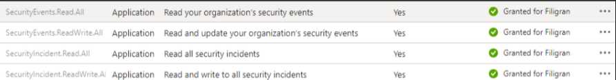

# OpenCTI Sentinel Incidents Connector


Table of Contents

- [OpenCTI Sentinel Incidents Connector](#opencti-sentinel-incidents-connector)
    - [Introduction](#introduction)
    - [Installation](#installation)
        - [Requirements](#requirements)
    - [Configuration variables](#configuration-variables)
        - [OpenCTI environment variables](#opencti-environment-variables)
        - [Base connector environment variables](#base-connector-environment-variables)
        - [Connector extra parameters environment variables](#connector-extra-parameters-environment-variables)
    - [Deployment](#deployment)
        - [Docker Deployment](#docker-deployment)
        - [Manual Deployment](#manual-deployment)
    - [Usage](#usage)
    - [Behavior](#behavior)
    - [Debugging](#debugging)
    - [Additional information](#additional-information)

## Introduction

This OpenCTI connector allows to import indicators and observables from Microsoft Sentinel's incidents to your OpenCTI
platform.

## Installation

If you don't know how to get the `tenant_id`, `client_id`, and `client_secret` information, here's a screenshot to
help !


It's also important to define the necessary permissions in Sentinel for the connector to work.

In the Azure portal, you need to set :  
Home > Application Registration > OpenCTI (your name) > API Permissions  
and enable the permissions named :  
- "SecurityEvent.Read.All"
- "SecurityEvent.ReadWrite.All"
- "SecurityIncident.Read.All"
- "SecurityIncident.ReadWrite.All"  


You will then be able to view the data (indicators) in :  
Home > Microsoft Sentinel > OpenCTI (Your Name) > Threat Indicators

For more information, visit:

- [Microsoft Security-Authorization](https://learn.microsoft.com/en-us/graph/security-authorization)
- [Microsoft Connect-Threat-Intelligence-Tip](https://learn.microsoft.com/en-us/azure/sentinel/connect-threat-intelligence-tip)

Another interesting link:

- [Microsoft Sentinel-Threat-Intelligence](https://learn.microsoft.com/en-us/azure/architecture/example-scenario/data/sentinel-threat-intelligence#import-threat-indicators-with-the-platforms-data-connector)

### Requirements

- OpenCTI Platform >= 6.4

## Configuration variables

There are a number of configuration options, which are set either in `docker-compose.yml` (for Docker) or
in `config.yml` (for manual deployment).

### OpenCTI environment variables

Below are the parameters you'll need to set for OpenCTI:

| Parameter     | config.yml `opencti` | Docker environment variable | Mandatory | Description                                          |
|---------------|----------------------|-----------------------------|-----------|------------------------------------------------------|
| OpenCTI URL   | `url`                | `OPENCTI_URL`               | Yes       | The URL of the OpenCTI platform.                     |
| OpenCTI Token | `token`              | `OPENCTI_TOKEN`             | Yes       | The default admin token set in the OpenCTI platform. |

### Base connector environment variables

Below are the parameters you'll need to set for running the connector properly:

| Parameter       | config.yml `connector` | Docker environment variable | Default         | Mandatory | Description                                                                              |
|-----------------|------------------------|-----------------------------|-----------------|-----------|------------------------------------------------------------------------------------------|
| Connector ID    | `id`                   | `CONNECTOR_ID`              | /               | Yes       | A unique `UUIDv4` identifier for this connector instance.                                |
| Connector Type  | `type`                 | `CONNECTOR_TYPE`            | EXTERNAL_IMPORT | Yes       | Should always be set to `EXTERNAL_IMPORT` for this connector.                            |
| Connector Name  | `name`                 | `CONNECTOR_NAME`            |                 | Yes       | Name of the connector.                                                                   |
| Connector Scope | `scope`                | `CONNECTOR_SCOPE`           |                 | Yes       | The scope or type of data the connector is importing, either a MIME type or Stix Object. |
| Log Level       | `log_level`            | `CONNECTOR_LOG_LEVEL`       | info            | Yes       | Determines the verbosity of the logs. Options are `debug`, `info`, `warn`, or `error`.   |

### Connector extra parameters environment variables

Below are the parameters you'll need to set for the connector:

| Parameter         | config.yml `sentinel_incidents` | Docker environment variable            | Default                | Mandatory | Description                                                                                                              |
|-------------------|---------------------------------|----------------------------------------|------------------------|-----------|--------------------------------------------------------------------------------------------------------------------------|
| Tenant ID         | `tenant_id`                     | `SENTINEL_INCIDENTS_TENANT_ID`         |                        | Yes       | Your Azure App Tenant ID, see the screenshot to help you find this information.                                          |
| Client ID         | `client_id`                     | `SENTINEL_INCIDENTS_CLIENT_ID`         |                        | Yes       | Your Azure App Client ID, see the screenshot to help you find this information.                                          |
| Client Secret     | `client_secret`                 | `SENTINEL_INCIDENTS_CLIENT_SECRET`     |                        | Yes       | Your Azure App Client secret, See the screenshot to help you find this information.                                      |
| Login URL         | `login_url`                     | `SENTINEL_INCIDENTS_LOGIN_URL`         |                        | Yes       | Login URL for Microsoft which is `https://login.microsoft.com`                                                           |
| API Base URL      | `api_base_url`                  | `SENTINEL_INCIDENTS_API_BASE_URL`      |                        | Yes       | The resource the API will use which is `https://graph.microsoft.com`                                                     |
| Incident URL Path | `incident_path`                 | `SENTINEL_INCIDENTS_INCIDENT_PATH`     |                        | Yes       | The incident URL that will be used which is `/v1.0/security/incidents`                                                   |
| Target Product    | `target_product`                | `SENTINEL_INCIDENTS_TARGET_PRODUCT`    |                        | Yes       | `Azure Sentinel` or `Microsoft Defender` ATP                                                                             |
| Import start date | `import_start_date`             | `SENTINEL_INCIDENTS_IMPORT_START_DATE` | `2020-01-01T00:00:00Z` | No        | Import starting date (in YYYY-MM-DD format or YYYY-MM-DDTHH:MM:SSZ format) - used only if connector's state is not set   |

## Deployment

### Docker Deployment

Before building the Docker container, you need to set the version of pycti in `requirements.txt` equal to whatever
version of OpenCTI you're running. Example, `pycti==6.3.4`. If you don't, it will take the latest version, but
sometimes the OpenCTI SDK fails to initialize.

Build a Docker Image using the provided `Dockerfile`.

Example:

```shell
# Replace the IMAGE NAME with the appropriate value
docker build . -t [IMAGE NAME]:latest
```

Make sure to replace the environment variables in `docker-compose.yml` with the appropriate configurations for your
environment. Then, start the docker container with the provided docker-compose.yml

```shell
docker compose up -d
# -d for detached
```

### Manual Deployment

Create a file `config.yml` based on the provided `config.yml.sample`.

Replace the configuration variables (especially the "**ChangeMe**" variables) with the appropriate configurations for
you environment.

Install the required python dependencies (preferably in a virtual environment):

```shell
pip3 install -r requirements.txt
```

Then, start the connector from recorded-future/src:

```shell
python3 main.py
```

## Usage

After Installation, the connector should require minimal interaction to use, and should update automatically at a
regular interval specified in your `docker-compose.yml` or `config.yml` in `duration_period`.

However, if you would like to force an immediate download of a new batch of entities, navigate to:

`Data management` -> `Ingestion` -> `Connectors` in the OpenCTI platform.

Find the connector, and click on the refresh button to reset the connector's state and force a new
download of data by re-running the connector.

## Debugging

The connector can be debugged by setting the appropiate log level.
Note that logging messages can be added using `self.helper.connector_logger,{LOG_LEVEL}("Sample message")`, i.
e., `self.helper.connector_logger.error("An error message")`.

