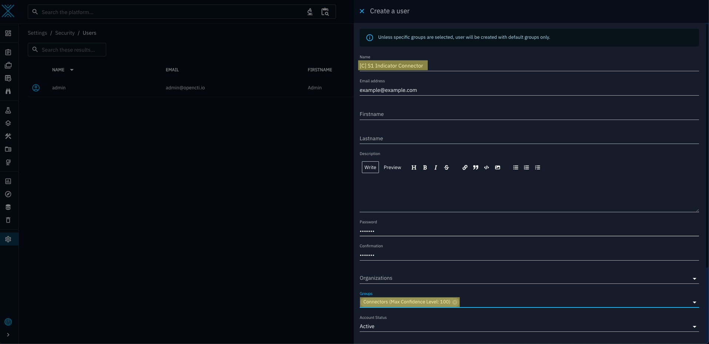

# OpenCTI SentinelOne Incident External Import Connector

This connector allows Incidents from a SentinelOne account to be created within an OpenCTI Instance

 

This software is provided as a community-driven project and is not officially supported by SentinelOne. It is offered on an "as-is" basis, without warranties or guarantees, either express or implied. Users are encouraged to thoroughly test and validate the software before deploying it in their environments. While community contributions and feedback are welcome, SentinelOne does not provide formal technical support, maintenance, or updates for this project.

 

- This version of the connector creates the following objects in correspondence with a SentinelOne Incident:
    - An Incident with all pivotal information
    - Observable of the affected endpoint
    - Attack Patterns corresponding to the MITRE Attack Patterns identified for the Incident
    - Notes based on the actual notes made for the Incident
    - Indicators for any hashes of malicious files
    - An external reference to the Incident in SentinelOne if deeper analysis is required.

 

## How It Works
The connector will create a corresponding OpenCTI Incident for `flagged` SentinelOne threats only.

 

- To `flag` a threat in SentinelOne, simply create a new note on the threat's page whose text is the value of `SIGN`. You will define this as an environment variable in the setup (`[OpenCTI_add]` by default).

 

- Each fetch interval, the connector will scan the threats on your SentinelOne account, triggering the creation process on those that are flagged. The interval between scans is determined by the enviroment variable `CONNECTOR_DURATION_PERIOD` that you will define in seconds.

 

## Implementation
After appending the container to your compose file, you will need to create a new user in your OpenCTI instance and retrieve some information for your SentinelOne Account in order to interface with it 

 
 

### Retrieving Your Account ID

- Click on the settings icon at the bottom of the left panel on the console. 
- From the `Settings` menu, select `ACCOUNTS` and click on the account you seek to use in the below list.
- You will now be in the `Sentinels` menu. From here, select `ACCOUNT INFO` (you may need to scroll to the right on smaller monitors to see it).
- Underneath your account name you will see your account ID in the field `ACCOUNT ID`

 

### Generating an API Key

- Click on your email address in the top right corner of the menu on the SentinelOne Console. 
- Click the `Actions` dropdown button and hover over `API Token Operations`.
- Click `Regenerate API token` and proceed with the required Authentication.
- **Note:** you do not need to include the `'APIToken '`component of the string in any configs

 

### Determining Your SentinelOne URL
Your SentinelOne URL is simply the first component of the URL you use to access the console.

When configuring the connector, ensure that you include the ending '/'. For example, for the above image, you would input `https://usea1-purple.sentinelone.net/`

 

### Creating the Connector User
It is best practice to create a new user under the `Connectors` group and to use its token to interface with your instance.

- Locate the gear (Settings) icon on the left menu and click `Security`.
- On the menu on the right click on the `Users` option. 
- Click the blue `+` icon at the bottom of the list
- Enter `[C] S1 Incident Connector`. **Note:** you can name this whatever you'd like, but you should include `[C]` at the start regardless.
- Enter the required information and ensure that under the `Groups` field `Connectors` is this selected option. 

 

## Configuration

### OpenCTI Parameters
##### OpenCTI Instance URL
- The URL of your OpenCTI instance within its internal network.
- Example: `http://opencti:8080`
- Environment Variable: `OPENCTI_URL`
- Config.yml: `url`

##### OpenCTI User Token
- The token of the user specifically created for this Connector, under the `Connectors` group.
- Example: `11111111-2222-3333-4444-555555555555`
- Environment Variable: `OPENCTI_TOKEN`
- Config.yml: `token`

 

### Connector Parameters

##### Connector ID
- Unique UUIDv4 identifier for the connector.
- Example: `11111111-2222-3333-4444-555555555555`
- Environment Variable: `CONNECTOR_ID`
- Config.yml: `id`

##### Connector Name
- The Connector's name as it will appear in OpenCTI.
- Example: `SentinelOne Indicator Export Stream`
- Environment Variable: `CONNECTOR_NAME`
- Config.yml: `name`

##### Connector Scope
- The scope applied to the connector.
- Example: `all`
- Environment Variable: `CONNECTOR_SCOPE`
- Config.yml: `scope`

##### Connector Log Level
- The level of logs/outputs presented. `info` is recommended.
- Example: `info`
- Environment Variable: `CONNECTOR_LOG_LEVEL`
- Config.yml: `log_level`

##### Connector Duration Period
- The intervals at which the Connector will scan for (and subsequently process) newly flagged Incidents in ISO8601 format. A value of `PT5M`, to scan every 5 minutes, is recommended. 
- Example: `PT5M`
- Environment Variable: `CONNECTOR_DURATION_PERIOD`
- Config.yml: `duration_period`

 

### SentinelOne Parameters

##### SentinelOne URL
- The SentinelOne URL used to access the console. **NOTE:** The URL should not end with a `/`.
- Example: `https://usea1-purple.sentinelone.net`
- Environment Variable: `S1_URL`
- Config.yml: `url`

##### SentinelOne API Key
- The API key for your SentinelOne account (JWT). **NOTE:** Should not include `APIToken`.
- Example: `eyJraWQiO...`
- Environment Variable: `S1_API_KEY`
- Config.yml: `api_key`

##### SentinelOne Account ID
- The ID of your SentinelOne Account.
- Example: `1234567890123456789`
- Environment Variable: `S1_ACCOUNT_ID`
- Config.yml: `account_id`

##### Maximum API Attempts
- The maximum number of times the connector will retry push attempts when they fail. `5` is recommended as failures almost only ever occur due to the API rate limits Exponential backoffs are implemented alongside this to handle the rate limits.
- Example: `5`
- Environment Variable: `MAX_API_ATTEMPTS`
- Config.yml: `max_api_attempts`

##### Incident Flag String
- The string that will be inputted into a note for an Incident in SentinelOne to flag it for importing. 
- Example: `[OpenCTI_add]`
- Environment Variable: `SIGN`
- Config.yml: `sign`

 
