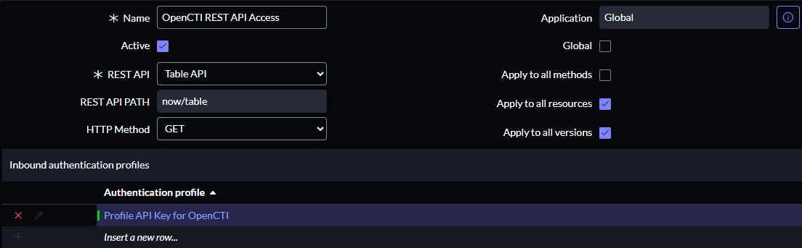

# OpenCTI External Ingestion Connector ServiceNow
Table of Contents

- [OpenCTI External Ingestion Connector ServiceNow](#opencti-external-ingestion-connector-servicenow)
  - [Introduction](#introduction)
  - [Installation](#installation)
    - [Requirements](#requirements)
  - [Configuration variables](#configuration-variables)
    - [OpenCTI environment variables](#opencti-environment-variables)
    - [Base connector environment variables](#base-connector-environment-variables)
    - [Connector extra parameters environment variables](#connector-extra-parameters-environment-variables)
  - [Deployment](#deployment)
    - [Docker Deployment](#docker-deployment)
    - [Manual Deployment](#manual-deployment)
  - [Usage](#usage)
  - [Behavior](#behavior)
  - [Debugging](#debugging)
  - [Additional information](#additional-information)

## Status Filigran

| Status            | Date | Comment |
|-------------------|------|---------|
| Filigran Verified | -    | -       |

## Introduction

**Introducing ServiceNow**

ServiceNow is an intelligent cloud platform designed to automate, connect and optimize workflows across the enterprise. It enables organizations to modernize their processes, improve employee and customer experience, and enhance their agility in the face of constant change.

**What is ServiceNow ?**
ServiceNow defines itself as a “System of Action” rather than a simple system of record. It leverages companies' existing systems and data to orchestrate and automate tasks and processes, without the need to replace existing infrastructures. Thanks to intuitive interfaces and low-code/no-code tools, it enables rapid adoption and customization to the specific needs of each organization.

To find out more, visit the official ServiceNow website: 
https://www.servicenow.com/what-is-servicenow.html

## Installation

### Requirements

- pycti==6.6.4
- validators==0.33.0
- pydantic>=2.10, <3
- requests~=2.32.3
- stix2~=3.0.1
- PyYAML==6.0.2
- aiohttp~=3.11.11
- tenacity~=9.0.0
- pydantic-settings==2.8.1
- python-dotenv>=1.0.1, <2

## Configuration variables environment

A variety of configuration options are available, and the connector will load them from a single source, following a specific order of precedence:

  1. The `.env` file – This is the primary configuration source, if present. You can use the provided `.env.sample` as a reference.
  2. The `config.yml` file – If no `.env` file is found, the connector will look for a `config.yml` file instead (a `config.yml.sample` is also available as a starting point).
  3. System environment variables – If neither a `.env` nor a `config.yml` file is available, the connector will fall back to system environment variables.

A `docker-compose.yml` file is also available to simplify Docker-based deployments and supports passing environment variables through directly via the system environment.

### OpenCTI environment variables

Below are the parameters you'll need to set for OpenCTI:

| Parameter     | config.yml | Docker environment variable | Mandatory | Description                                          |
|---------------|------------|-----------------------------|-----------|------------------------------------------------------|
| OpenCTI URL   | `url`      | `OPENCTI_URL`               | Yes       | The URL of the OpenCTI platform.                     |
| OpenCTI Token | `token`    | `OPENCTI_TOKEN`             | Yes       | The default admin token set in the OpenCTI platform. |

### Base connector environment variables

Below are the parameters you'll need to set for running the connector properly:

| Parameter `Connector`       | config.yml                    | Docker environment variable             | Default           | Mandatory | Description                                                                                      |
|-----------------------------|-------------------------------|-----------------------------------------|-------------------|-----------|--------------------------------------------------------------------------------------------------|
| ID                          | `id`                          | `CONNECTOR_ID`                          | /                 | Yes       | A unique `UUIDv4` identifier for this connector instance.                                        |
| Type                        | `type`                        | `CONNECTOR_TYPE`                        | `EXTERNAL_IMPORT` | No        | Should always be set to `EXTERNAL_IMPORT` for this connector.                                    |
| Name                        | `name`                        | `CONNECTOR_NAME`                        | `ServiceNow`      | No        | Name of the connector.                                                                           |
| Scope                       | `scope`                       | `CONNECTOR_SCOPE`                       | `ServiceNow`      | No        | The scope or type of data the connector is importing, either a MIME type or Stix Object.         |
| Log level                   | `log_level`                   | `CONNECTOR_LOG_LEVEL`                   | `error`           | No        | Determines the verbosity of the logs. Options are `debug`, `info`, `warn`, or `error`.           |
| Duration period             | `duration_period`             | `CONNECTOR_DURATION_PERIOD`             | `PT24H`           | No        | Determines the time interval between each launch of the connector in ISO 8601, ex: `PT24H`.      |
| Queue threshold             | `queue_threshold`             | `CONNECTOR_QUEUE_THRESHOLD`             | `500`             | No        | Used to determine the limit (RabbitMQ) in MB at which the connector must go into buffering mode. |
| Run and terminate           | `run_and_terminate`           | `CONNECTOR_RUN_AND_TERMINATE`           | `False`           | No        | Launch the connector once if set to `True`.                                                      |
| Send to queue               | `send_to_queue`               | `CONNECTOR_SEND_TO_QUEUE`               | `True`            | No        | If set to `True`, the connector will send data to the queue.                                     |
| Send to directory           | `send_to_directory`           | `CONNECTOR_SEND_TO_DIRECTORY`           | `False`           | No        | If set to `True`, the connector will send data to a directory.                                   |
| Send to directory path      | `send_to_directory_path`      | `CONNECTOR_SEND_TO_DIRECTORY_PATH`      | `None`            | No        | The path to the directory where data will be sent if `CONNECTOR_SEND_TO_DIRECTORY` is `True`.    |
| Send to directory retention | `send_to_directory_retention` | `CONNECTOR_SEND_TO_DIRECTORY_RETENTION` | `7`               | No        | The number of days to retain data in the directory.                                              |

### Connector extra parameters environment variables

Below are the parameters you'll need to set for the connector:

| Parameter `ServiceNow` | config.yml            | Docker environment variable      | Default | Mandatory | Description                                                                                                                          |
|------------------------|-----------------------|----------------------------------|---------|-----------|--------------------------------------------------------------------------------------------------------------------------------------|
| Instance name          | `instance_name`       | `SERVICENOW_INSTANCE_NAME`       | /       | Yes       | Representing the ServiceNow server name.                                                                                             |
| Api key                | `api_key`             | `SERVICENOW_API_KEY`             | /       | Yes       | Secure identifier used to validate access to ServiceNow APIs.                                                                        |
| Api version            | `api_version`         | `SERVICENOW_API_VERSION`         | `v2`    | No        | ServiceNow API version used for REST requests.                                                                                       |
| Api retry              | `api_retry`           | `SERVICENOW_API_RETRY`           | `5`     | No        | Maximum number of retry attempts in case of API failure.                                                                             |
| Api backoff            | `api_backoff`         | `SERVICENOW_API_BACKOFF`         | `PT30S` | No        | Exponential backoff duration between API retries (ISO 8601 duration format).                                                         |
| Import start date      | `import_start_date`   | `SERVICENOW_IMPORT_START_DATE`   | /       | Yes       | The date from which data import should start. (Format YYYY-MM-DD)                                                                    |
| State to exclude       | `state_to_exclude`    | `SERVICENOW_STATE_TO_EXCLUDE`    | `None`  | No        | List of security incident states to exclude from import. Example: "eradicate,analysis,closed,cancelled,draft,contain,review,recover" |
| Severity to exclude    | `severity_to_exclude` | `SERVICENOW_SEVERITY_TO_EXCLUDE` | `None`  | No        | List of security incident severities to exclude from import. Example: "high,medium,low"                                              |
| Priority to exclude    | `priority_to_exclude` | `SERVICENOW_PRIORITY_TO_EXCLUDE` | `None`  | No        | List of security incident priorities to exclude from import. Example: "critical,high,moderate,low,planning"                          |
| TLP level              | `tlp_level`           | `SERVICENOW_TLP_LEVEL`           | `red`   | No        | TLP markings for exported data (Available: clear, green, amber, amber+strict, red)                                                   |

## Deployment

### Docker Deployment

Before building the Docker container, you need to set the version of pycti in `requirements.txt` equal to whatever
version of OpenCTI you're running. Example, `pycti==6.6.4`. If you don't, it will take the latest version, but
sometimes the OpenCTI SDK fails to initialize.

Build a Docker Image using the provided `Dockerfile`.

Example:

```shell
# Replace the IMAGE NAME with the appropriate value
docker build . -t [IMAGE NAME]:latest
```

Make sure to replace the environment variables in `docker-compose.yml` with the appropriate configurations for your
environment. Then, start the docker container with the provided docker-compose.yml

```shell
docker compose up -d
# -d for detached
```

### Manual Deployment

Create a file `.env` based on the provided `.env.sample`.
Create a file `config.yml` based on the provided `config.yml.sample`.

Replace the configuration variables (especially the "**ChangeMe**" variables) with the appropriate configurations for
you environment.

Install the required python dependencies (preferably in a virtual environment):

```shell
pip3 install -r requirements.txt
```

Then, start the connector from recorded-future/src:

```shell
python3 main.py
```

---

---

## Usage

After Installation, the connector should require minimal interaction to use, and should update automatically at a regular interval specified in your `docker-compose.yml` or `config.yml` in `duration_period`.

However, if you would like to force an immediate download of a new batch of entities, navigate to:

`Data management` -> `Ingestion` -> `Connectors` in the OpenCTI platform.

Find the connector, and click on the refresh button to reset the connector's state and force a new
download of data by re-running the connector.

---

---

## Connector operating phases

The connector works in three main stages:

1. Collect Intelligence from ServiceNow
2. Prepare Intelligence (and data transformation)
3. Send Intelligence to OpenCTI

---

### Phase 1 - Collect Intelligence

During this phase, the connector will make several calls to ServiceNow, and here's the url structure that will be used:

`GET https://<YOUR_INSTANCE_NAME>.service-now.com/api/now/<YOUR_API_VERSION>/table/<TABLE_NAME>?<QUERY_PARAMETERS>`

Three initial calls to retrieve the following metadata:
- Status
- Severity
- Priority

For security incident filtering to work properly, the following environment variables are required:
- `STATUS_TO_EXCLUDE`
- `SEVERITY_TO_EXCLUDE`
- `PRIORITY_TO_EXCLUDE`

The connector must have access to the name of the `sys_choice` table in your ServiceNow instance. This table is used to match labels to internal field values.
If access to this table is restricted, or if the values defined in your environment variables do not match the choices configured in your ServiceNow instance, a warning message will be displayed. In this case, the filter(s) selected will simply be ignored.

The connector retrieves Security Incidents from ServiceNow while applying exclusion filters — if configured — based on `state`, `severity`, and `priority`. If no exclusion is set, all incidents are collected. Additionally, a time-based filter is applied on the update date `sys_updated_on`

Additionally, a time-based filter is applied on the update date `sys_updated_on` and not on the `sys_created_on`:

On the first run, the reference date is defined by the `IMPORT_START_DATE` environment variable. On subsequent runs, the connector uses the `last_run_start_datetime` value to determine which security incidents to collect.

Once the filtered list of Security Incidents is obtained, the connector proceeds to import the following:

- All `Tasks` associated with each incident
- All `Observables` linked to these incidents (WIP)

---

### Phase 2 - Prepare Intelligence

During this phase, the connector carries out :

- Data validation and modeling via Pydantic
- Transformation of validated models into OpenCTI compatible STIX 2.1 representations.

All generated entities are associated by default with a `TLP:RED`.

#### Mapping entities from ServiceNow to OpenCTI :

Security Incident:

| SIR in ServiceNow                     | Case incident Response in OpenCTI                                                                                                    |
|---------------------------------------|--------------------------------------------------------------------------------------------------------------------------------------|
| Number SIR + Short description        | `Name`                                                                                                                               |
| Severity                              | `Severity` (Can be `Unknown` if the value does not correspond to the levels allowed by OpenCTI: `low`, `medium`, `high`, `critical`) |
| Priority                              | `Priority`                                                                                                                           |
| Category                              | `Incident Response Type`                                                                                                             |
| Subcategory                           | `Labels`                                                                                                                             |
| Description + Comments and work notes | `Descriptions` (`comments and work notes` become a markdown table)                                                                   |

ServiceNow's `MITRE` fields related to the Security incident are mapped as follows:

| ServiceNow       | OpenCTI          |
|------------------|------------------|
| MITRE Technique  | `Attack Pattern` |
| MITRE Tactic     | `Attack Pattern` |
| MITRE Group      | `Intrusion Set`  |
| MITRE Malware    | `Malware`        |
| MITRE Tool       | `Tool`           |

For each `Task` related to the Security incident:

| SIT in ServiceNow                     | Task in OpenCTI                                                     |
|---------------------------------------|---------------------------------------------------------------------|
| Number SIT + Short description        | `Name`                                                              |
| Due date                              | `Due date`                                                          |
| Tags + Security Tags                  | `Labels`                                                            |
| Description + Comments and work notes | `Descriptions` (`comments and work notes` become a markdown table)  |

For each `Observables` related to the Security incident:

---

### Phase 3 - Send Intelligence

Finally, all the STIX representations generated are sent to the OpenCTI platform.

---

---

## Behavior

---

### Release version compatible with the connector

Compatible release versions (tested) for ServiceNow instances are :
- Yokohama - v2
- Xanadu - v2

---

### Security incident import date management
The connector imports security incidents based on their last update date (`sys_updated_on`), not their creation date (`sys_created_on`). This behaviour has both benefits and important implications that you should be aware of.

Benefits :
  - Each time a security incident is updated in ServiceNow (e.g. `status`, `severity`, `comments`, etc.), the connector re-imports it with all the updated information.
  - This ensures continuous synchronisation with the current status of security incidents in ServiceNow, even after they are initially created.

Please note : 
  - On the first run, the reference date is defined by the `IMPORT_START_DATE` environment variable. On subsequent runs, the connector uses the `last_run_start_datetime` value to determine which security incidents to collect. 
  - The connector does not distinguish whether the modified field is actually used by it. So an update to an unused field (such as PIR - Post-Incident Review) can still trigger a complete re-import of the security incident without any real change in OpenCTI.
  - You can also observe the import of security incidents created before the configured `import_start_date`, but updated after this date.
  → For example, a security incident created in `2024-01-01` and updated in `2025-05-01` will be imported even if the `import_start_date` is configured as `2025-01-01`. In OpenCTI the creation date will be displayed as `2024-01-01` as this is its original value.

---

### Prerequisites in ServiceNow

- Role : Administrator
- All > Application Manager


- Plugin required : **API Key and HMAC Authentication** (Check that the plugin is correctly installed)


- Application required : **Security Incident Response**


---

### Configure API key - Token-based authentication (step by step) :

There are 3 important steps to obtaining a valid token !

1. Create a **REST API key**.
2. Create an **inbound authentication profile**.
3. Create a **REST API Access policy**.

---

#### 1 - Create a REST API key

- All > System Web Services > API Access Policies > REST API Key


- Click on `New`
- On the form, fill the fields


- You can submit the form
- Open the record that was created to view the token generated and click on unlock icon (Toggle password visibility)


- This is the token you should use for OpenCTI's ServiceNow connector.
- But there are still some steps to be taken before the token is functional. (Otherwise, you may encounter this error).

```json
{
    "error": {
        "message": "User Not Authenticated",
        "detail": "Required to provide Auth information"
    },
    "status": "failure"
}
```

---

#### 2 - Create an inbound authentication profile

- All > System Web Services > API Access Policies > Inbound Authentication Profile


- Click on `New`
- And click on `Create API KEY authentication profiles`


- Add your name (ex: "Profile API Key for OpenCTI")
- Unlock Auth Parameter
- Click on icon Search (Lookup using list)


- click on the two `x-sn-apikey` parameters to add them to Auth Parameter :
  - `Header for API Key`
  - `Query Parameter for API Key`


- You can submit the form

---

#### 3 - Create a REST API Access policy

- All > System Web Services > REST API Access Policies


- Click on `New`
- Fill in the fields as follows :


- Now, in the Authentication profile section, click on `insert a new row...`
- And select the profile you created earlier (Example : `Profile API Key for OpenCTI`)



- You can submit the form, and now your token is operational.

---

---

## Debugging

The connector can be debugged by setting the appropiate log level.
Note that logging messages can be added using `self.helper.connector_logger,{LOG_LEVEL}("Sample message")`, i.
e., `self.helper.connector_logger.error("An error message")`.

---

---

## Additional information


