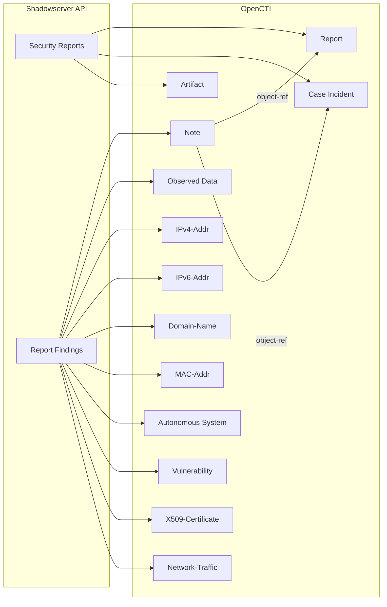

# OpenCTI Shadowserver Connector

| Status    | Date | Comment |
| --------- | ---- | ------- |
| Community | -    | -       |

The Shadowserver connector imports security reports from The Shadowserver Foundation into OpenCTI.

## Table of Contents

- [OpenCTI Shadowserver Connector](#opencti-shadowserver-connector)
  - [Table of Contents](#table-of-contents)
  - [Introduction](#introduction)
  - [Installation](#installation)
    - [Requirements](#requirements)
  - [Configuration variables](#configuration-variables)
    - [OpenCTI environment variables](#opencti-environment-variables)
    - [Base connector environment variables](#base-connector-environment-variables)
    - [Connector extra parameters environment variables](#connector-extra-parameters-environment-variables)
  - [Deployment](#deployment)
    - [Docker Deployment](#docker-deployment)
    - [Manual Deployment](#manual-deployment)
  - [Usage](#usage)
  - [Behavior](#behavior)
  - [Debugging](#debugging)
  - [Additional information](#additional-information)

## Introduction

The [Shadowserver Foundation](https://www.shadowserver.org/) is a nonprofit security organization that gathers, analyzes, and freely shares cyber threat intelligence with network owners and national CERTs worldwide.

This connector uses Shadowserver's Reports API to query available reports and transform them into STIX objects for OpenCTI. All available reports are downloaded, and an `Artifact` object is created with the original file. STIX `Note` objects are added to both the `Report` and `Case Incident` with a markdown rendition of each finding.

**API and Report References:**

- https://github.com/The-Shadowserver-Foundation/api_utils/wiki/API:-Reports-Query
- https://interchange.shadowserver.org/schema/reports.json

## Installation

### Requirements

- OpenCTI Platform >= 6.x
- [Shadowserver Reports subscription](https://www.shadowserver.org/what-we-do/network-reporting/get-reports/)

## Configuration variables

Configuration parameters can be provided via **`.env`** file, **`config.yml`** file, or directly as **environment variables**.

**Priority**: YAML → .env → environment → defaults

Find all the configuration variables available here: [Connector Configurations](./__metadata__/CONNECTOR_CONFIG_DOC.md)

_The `opencti` and `connector` options in the `docker-compose.yml` and `config.yml` are the same as for any other connector.
For more information regarding variables, please refer to [OpenCTI's documentation on connectors](https://docs.opencti.io/latest/deployment/connectors/)._

## Deployment

### Docker Deployment

Build the Docker image:

```bash
docker build -t opencti/connector-shadowserver:latest .
```

Configure the connector in `docker-compose.yml`:

```yaml
connector-shadowserver:
  image: opencti/connector-shadowserver:latest
  environment:
    - OPENCTI_URL=http://localhost
    - OPENCTI_TOKEN=ChangeMe
    - CONNECTOR_ID=ChangeMe
    - CONNECTOR_NAME=Shadowserver
    - CONNECTOR_SCOPE=stix2
    - CONNECTOR_LOG_LEVEL=info
    - CONNECTOR_DURATION_PERIOD=P1D
    - SHADOWSERVER_API_KEY=ChangeMe
    - SHADOWSERVER_API_SECRET=ChangeMe
    - SHADOWSERVER_MARKING=TLP:CLEAR
    - SHADOWSERVER_CREATE_INCIDENT=false
  restart: always
```

Start the connector:

```bash
docker compose up -d
```

### Manual Deployment

1. Create `config.yml` based on `config.yml.sample`.

2. Install dependencies:

```bash
pip3 install -r requirements.txt
```

3. Start the connector:

```bash
python3 main.py
```

## Usage

The connector runs automatically at the interval defined by `CONNECTOR_DURATION_PERIOD`. To force an immediate run:

**Data Management → Ingestion → Connectors**

Find the connector and click the refresh button to reset the state and trigger a new data fetch.

## Behavior

The connector fetches security reports from Shadowserver API and transforms them into STIX objects for OpenCTI.

### Data Flow



### Entity Mapping

The connector creates the following STIX objects and relationships:

| Shadowserver Data | OpenCTI Entity        | Description                   |
| ----------------- | --------------------- | ----------------------------- |
| Report            | Report                | Security report with findings |
| Report            | Case Incident         | Optional incident from report |
| Report File       | Artifact              | Original report file          |
| Finding           | Note                  | Markdown rendition of finding |
| Finding Data      | Observed Data         | Observed data container       |
| IP Address        | IPv4-Addr / IPv6-Addr | IP address observable         |
| Domain            | Domain-Name           | Domain name observable        |
| MAC Address       | MAC-Addr              | MAC address observable        |
| ASN               | Autonomous System     | AS information                |
| CVE               | Vulnerability         | Referenced vulnerability      |
| Certificate       | X509-Certificate      | SSL/TLS certificate           |
| Traffic Data      | Network-Traffic       | Network traffic information   |
| Author            | Identity              | Shadowserver as author        |
| TLP               | Marking Definition    | Configured TLP marking        |

### Processing Details

1. **Initial Run**: Imports last 30 days of reports
2. **Subsequent Runs**: Updates with last 3 days of reports
3. **Report Processing**:
   - Downloads original report as Artifact
   - Creates Report with summary
   - Optionally creates Case Incident
   - Parses findings into Notes with markdown tables
   - Extracts observables from findings

### Report Types

Shadowserver provides various report types covering:

- Open services (DNS, NTP, SSDP, etc.)
- Vulnerable services
- Botnet infections
- Amplification attacks
- Misconfigured devices
- Compromised systems

See [Shadowserver Report Schema](https://interchange.shadowserver.org/schema/reports.json) for details.

## Debugging

Enable verbose logging:

```env
CONNECTOR_LOG_LEVEL=debug
```

Logging can be added using:

```python
self.helper.connector_logger.{LOG_LEVEL}("Sample message", meta={})
```

## Additional information

- **Subscription Required**: Shadowserver Reports subscription is required
- **Initial Import**: First run imports 30 days of historical data
- **Incremental Updates**: Subsequent runs import 3 days of data
- **Nonprofit Data**: Shadowserver is a nonprofit security organization
- **Reference**: [Shadowserver Foundation](https://www.shadowserver.org/)
