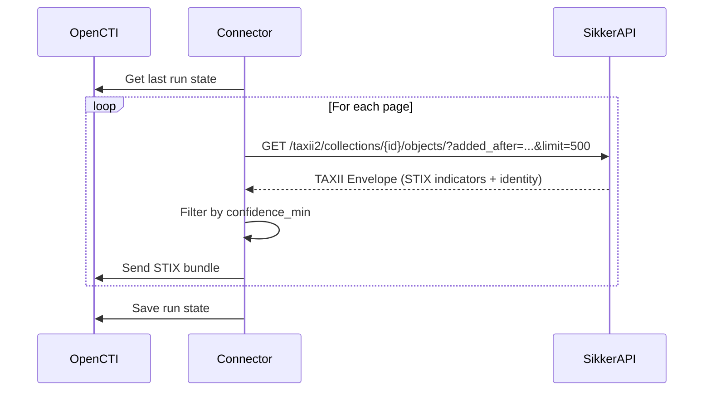

# OpenCTI SikkerAPI Connector

| Status    | Date       | Comment                              |
|-----------|------------|--------------------------------------|
| Community | 2026-02-21 | Initial contribution by [SikkerAPI](https://sikkerapi.com) |

## Table of Contents

- [Introduction](#introduction)
- [Requirements](#requirements)
- [Configuration](#configuration)
- [Deployment](#deployment)
  - [Docker Deployment](#docker-deployment)
  - [Manual Deployment](#manual-deployment)
- [Usage](#usage)
- [Behavior](#behavior)
- [Debugging](#debugging)

## Introduction

This connector imports IP reputation indicators from [SikkerAPI](https://sikkerapi.com) into OpenCTI via a TAXII 2.1 feed.

SikkerAPI operates a globally distributed honeypot network that captures real attacker behavior across SSH, HTTP, FTP, SMB, and other protocols. The connector pulls STIX 2.1 indicator objects that include:

- **IP address patterns** (`[ipv4-addr:value = '...']`)
- **Confidence scores** (0-100) based on observed attack behavior
- **MITRE ATT&CK mappings** via kill chain phases
- **Behavioral labels** (brute-force, credential-harvesting, port-scanning, etc.)
- **External references** to MITRE ATT&CK techniques

## Requirements

- OpenCTI Platform >= 6.8.0
- A SikkerAPI API key ([sign up free](https://sikkerapi.com))

## Configuration

### OpenCTI environment variables

| Parameter   | Environment Variable | config.yml  | Default | Description                 |
|-------------|---------------------|-------------|---------|-----------------------------|
| OpenCTI URL | `OPENCTI_URL`       | `opencti.url` | —     | Your OpenCTI instance URL   |
| OpenCTI Token | `OPENCTI_TOKEN`   | `opencti.token` | —   | API token for OpenCTI       |

### Base connector environment variables

| Parameter       | Environment Variable        | config.yml                | Default      | Description                          |
|-----------------|-----------------------------|---------------------------|--------------|--------------------------------------|
| Connector ID    | `CONNECTOR_ID`              | `connector.id`            | —            | Unique UUID for this connector       |
| Connector Name  | `CONNECTOR_NAME`            | `connector.name`          | `SikkerAPI`  | Display name in OpenCTI              |
| Connector Scope | `CONNECTOR_SCOPE`           | `connector.scope`         | `sikkerapi`  | Connector scope                      |
| Log Level       | `CONNECTOR_LOG_LEVEL`       | `connector.log_level`     | `info`       | `debug`, `info`, `warning`, `error`  |
| Duration Period | `CONNECTOR_DURATION_PERIOD` | `connector.duration_period` | `PT6H`     | ISO 8601 interval between runs       |

### Connector extra parameters

| Parameter          | Environment Variable         | config.yml                    | Default                        | Description                                |
|--------------------|------------------------------|-------------------------------|--------------------------------|--------------------------------------------|
| API Key            | `SIKKERAPI_API_KEY`          | `sikkerapi.api_key`           | —                              | Your SikkerAPI API key (`sk_...`)          |
| Base URL           | `SIKKERAPI_BASE_URL`         | `sikkerapi.base_url`          | `https://api.sikkerapi.com`    | API base URL                               |
| Collection ID      | `SIKKERAPI_COLLECTION_ID`    | `sikkerapi.collection_id`     | `sikker-threat-intel`          | TAXII collection to poll                   |
| Page Size          | `SIKKERAPI_PAGE_SIZE`        | `sikkerapi.page_size`         | `500`                          | Indicators per page (1-1000)               |
| Min Confidence     | `SIKKERAPI_CONFIDENCE_MIN`   | `sikkerapi.confidence_min`    | `0`                            | Only import indicators at or above this    |
| Import Start Date  | `SIKKERAPI_IMPORT_START_DATE`| `sikkerapi.import_start_date` | —                              | ISO 8601 timestamp, only import after this |

## Deployment

### Docker Deployment

Build a Docker Image using the provided `Dockerfile`:

```sh
docker compose up -d
```

### Manual Deployment

```sh
cd src
cp config.yml.sample config.yml
# Edit config.yml with your values
pip3 install -r requirements.txt
python3 main.py
```

## Usage

After deployment, the connector will run at the interval configured by `CONNECTOR_DURATION_PERIOD` (default: every 6 hours). Each run:

1. Fetches new STIX indicators from SikkerAPI's TAXII 2.1 endpoint
2. Filters by confidence threshold (if configured)
3. Sends STIX bundles to OpenCTI

The connector tracks its last successful run and only fetches indicators updated since then.

## Behavior



| SikkerAPI STIX Object | OpenCTI Entity     |
|-----------------------|--------------------|
| `indicator`           | Indicator          |
| `identity`            | Identity (Organization) |

## Debugging

To enable debug logging, set `CONNECTOR_LOG_LEVEL=debug` in your environment or config file.

## Getting an API Key

1. Sign up at [sikkerapi.com](https://sikkerapi.com)
2. Go to [Dashboard > API Keys](https://dashboard.sikkerapi.com/api-keys)
3. Create a new key

The free tier includes TAXII feed access.
