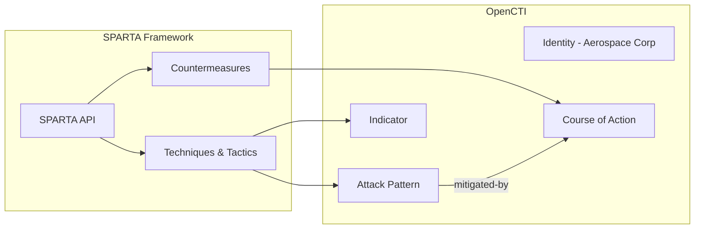

# OpenCTI Aerospace SPARTA Connector

The SPARTA connector imports Space Attack Research and Tactic Analysis (SPARTA) framework data from The Aerospace Corporation into OpenCTI.

| Status            | Date       | Comment |
|-------------------|------------|---------|
| Filigran Verified | 2025-11-07 | -       |

## Table of Contents

- [OpenCTI Aerospace SPARTA Connector](#opencti-aerospace-sparta-connector)
  - [Table of Contents](#table-of-contents)
  - [Introduction](#introduction)
  - [Installation](#installation)
    - [Requirements](#requirements)
  - [Configuration variables](#configuration-variables)
    - [OpenCTI environment variables](#opencti-environment-variables)
    - [Base connector environment variables](#base-connector-environment-variables)
    - [Connector extra parameters environment variables](#connector-extra-parameters-environment-variables)
  - [Deployment](#deployment)
    - [Docker Deployment](#docker-deployment)
    - [Manual Deployment](#manual-deployment)
  - [Usage](#usage)
  - [Behavior](#behavior)
  - [Debugging](#debugging)
  - [Additional information](#additional-information)

## Introduction

The [Aerospace Corporation](https://aerospace.org/) created the Space Attack Research and Tactic Analysis ([SPARTA](https://sparta.aerospace.org/)) matrix to address information and communication barriers that hinder the identification and sharing of space-system Tactics, Techniques, and Procedures (TTPs).

SPARTA provides unclassified information to space professionals about how spacecraft may be compromised via cyber and traditional counterspace means. The matrix defines and categorizes commonly identified activities that contribute to spacecraft compromises.

Where applicable, SPARTA TTPs are cross-referenced to other Aerospace related work like TOR 2021-01333 REV A and TOR-2023-02161 Rev A, available in the Related Work menu of the SPARTA website.

## Installation

### Requirements

- OpenCTI Platform >= 6.x
- Internet access to SPARTA API

## Configuration variables

Configuration options can be provided from multiple sources with the following priority:

1. **`.env` file** - Primary configuration source (use `.env.sample` as reference)
2. **`config.yml` file** - If no `.env` file found (use `config.yml.sample` as reference)
3. **System environment variables** - Fallback if neither file is available

Find all configuration variables in: [Connector Configurations](./__metadata__)

### OpenCTI environment variables

| Parameter     | config.yml | Docker environment variable | Mandatory | Description                                          |
|---------------|------------|-----------------------------|-----------|------------------------------------------------------|
| OpenCTI URL   | url        | `OPENCTI_URL`               | Yes       | The URL of the OpenCTI platform.                     |
| OpenCTI Token | token      | `OPENCTI_TOKEN`             | Yes       | The default admin token set in the OpenCTI platform. |

### Base connector environment variables

| Parameter       | config.yml      | Docker environment variable   | Default | Mandatory | Description                                                              |
|-----------------|-----------------|-------------------------------|---------|-----------|--------------------------------------------------------------------------|
| Connector ID    | id              | `CONNECTOR_ID`                |         | Yes       | A unique `UUIDv4` identifier for this connector instance.                |
| Connector Name  | name            | `CONNECTOR_NAME`              | SPARTA  | No        | Name of the connector.                                                   |
| Connector Scope | scope           | `CONNECTOR_SCOPE`             |         | Yes       | The scope or type of data the connector is importing.                    |
| Log Level       | log_level       | `CONNECTOR_LOG_LEVEL`         | info    | No        | Determines the verbosity of logs: `debug`, `info`, `warning`, `error`.   |
| Duration Period | duration_period | `CONNECTOR_DURATION_PERIOD`   |         | Yes       | Interval between runs in ISO 8601 format.                                |

### Connector extra parameters environment variables

See configuration metadata in the `__metadata__` folder for additional connector-specific parameters.

## Deployment

### Docker Deployment

Build the Docker image:

```bash
docker build -t opencti/connector-sparta:latest .
```

Configure the connector in `docker-compose.yml`:

```yaml
  connector-sparta:
    image: opencti/connector-sparta:latest
    environment:
      - OPENCTI_URL=http://localhost
      - OPENCTI_TOKEN=ChangeMe
      - CONNECTOR_ID=ChangeMe
      - CONNECTOR_NAME=SPARTA
      - CONNECTOR_SCOPE=sparta
      - CONNECTOR_LOG_LEVEL=info
      - CONNECTOR_DURATION_PERIOD=P7D
    restart: always
```

Start the connector:

```bash
docker compose up -d
```

### Manual Deployment

1. Create `config.yml` based on `config.yml.sample`.

2. Install dependencies:

```bash
pip3 install -r requirements.txt
```

3. Start the connector:

```bash
python3 main.py
```

## Usage

The connector runs automatically at the interval defined by `CONNECTOR_DURATION_PERIOD`. To force an immediate run:

**Data Management → Ingestion → Connectors**

Find the connector and click the refresh button to reset the state and trigger a new data fetch.

## Behavior

The connector fetches the SPARTA framework from The Aerospace Corporation and imports it into OpenCTI.

### Data Flow



### Entity Mapping

| SPARTA Data          | OpenCTI Entity      | Description                                      |
|----------------------|---------------------|--------------------------------------------------|
| Technique            | Attack Pattern      | Space attack technique/TTP                       |
| Countermeasure       | Course of Action    | Mitigation for attack technique                  |
| Indicator            | Indicator           | Detection indicator for technique                |
| Aerospace Corp       | Identity            | Author organization                              |

### Scope

The connector imports the following entity types:

- **Attack Pattern**: Space attack techniques and tactics from the SPARTA matrix
- **Course of Action**: Countermeasures and mitigations for space threats
- **Indicator**: Detection indicators associated with techniques
- **Identity**: The Aerospace Corporation as the author

### TLP Marking

All imported data is marked with **TLP:WHITE** as SPARTA is publicly available unclassified information.

## Debugging

Enable verbose logging:

```env
CONNECTOR_LOG_LEVEL=debug
```

## Additional information

- **Public Data**: SPARTA framework is publicly available at https://sparta.aerospace.org/
- **Framework Updates**: SPARTA is periodically updated by The Aerospace Corporation
- **Cross-References**: TTPs reference related Aerospace publications
- **Reference**: [SPARTA - Space Attack Research and Tactic Analysis](https://sparta.aerospace.org/)
