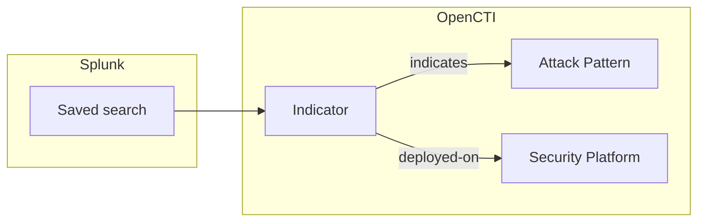

# OpenCTI Splunk Saved Searches Connector

| Status              | Date | Comment |
|---------------------|------|---------|
| Filigran Maintained | -    | -       |

Table of Contents

- [OpenCTI Splunk Saved Searches Connector](#opencti-splunk-saved-searches-connector)
  - [Introduction](#introduction)
  - [Installation](#installation)
    - [Requirements](#requirements)
    - [Permissions in Splunk](#permissions-in-splunk)
  - [Configuration variables](#configuration-variables)
  - [Deployment](#deployment)
    - [Docker Deployment](#docker-deployment)
    - [Manual Deployment](#manual-deployment)
  - [Usage](#usage)
  - [Behavior](#behavior)
    - [Which saved searches are imported](#which-saved-searches-are-imported)
    - [Entity mapping](#entity-mapping)
    - [Deployment status and reconciliation](#deployment-status-and-reconciliation)
    - [ATT&CK techniques](#attck-techniques)
    - [The deployed-on relationship](#the-deployed-on-relationship)
  - [Debugging](#debugging)
  - [Additional information](#additional-information)

## Introduction

This connector imports the detections deployed in [Splunk](https://www.splunk.com/) into OpenCTI:
Splunk Enterprise Security correlation searches (including the Splunk Security Content / ESCU
detections) and scheduled searches that trigger alert actions. Each saved search becomes an Indicator
whose pattern is its SPL query, linked to the MITRE ATT&CK techniques it detects and recorded as deployed
on the Splunk platform with its current status.

Together with the other deployed-rule importers (Microsoft Sentinel, Elastic Security, CrowdStrike
Falcon, Google SecOps), it feeds the detection layer of the OpenCTI Threat-Informed Defense Matrix: for
each technique used by the threats you track, which rules exist, where they run, and whether they are
enabled.

The connector is read-only on the Splunk side: it only lists saved searches, and never creates,
modifies, enables or schedules one.

## Installation

### Requirements

- OpenCTI Platform >= 7.261002.0 for the `deployed-on` relationship and the rule metadata properties.
  Older platforms are supported: deployments are then recorded as `related-to` relationships (see
  [The deployed-on relationship](#the-deployed-on-relationship)).
- `pycti==7.261002.0` and the connectors SDK (`src/requirements.txt`).
- Network access to the Splunk REST API (management port, `8089` by default).

### Permissions in Splunk

1. Enable token authentication (**Settings -> Tokens -> Token Settings**).
2. Create a dedicated Splunk user whose role can read the saved searches of the apps to import: the
   built-in `user` role reads app and globally shared searches; with Enterprise Security, `ess_analyst`
   reads the correlation searches. Reading searches kept private by other users requires the
   `admin_all_objects` capability. No write capability is required.
3. Create an authentication token for that user (**Settings -> Tokens -> New Token**). It is sent as
   `Authorization: Bearer <token>`.

## Configuration variables

Find all the configuration variables available here: [Connector Configurations](./__metadata__/CONNECTOR_CONFIG_DOC.md)

_The `opencti` and `connector` options in the `docker-compose.yml` and `config.yml` are the same as for any other connector.
For more information regarding variables, please refer to [OpenCTI's documentation on connectors](https://docs.opencti.io/latest/deployment/connectors/)._

Connector-specific variables:

| Docker environment variable | `config.yml` key | Required | Default | Description |
|---|---|---|---|---|
| `SPLUNK_SAVED_SEARCHES_API_URL` | `splunk_saved_searches.api_url` | Yes | | Base URL of the Splunk REST API, e.g. `https://splunk.example.com:8089`. |
| `SPLUNK_SAVED_SEARCHES_TOKEN` | `splunk_saved_searches.token` | Yes | | Splunk authentication token. |
| `SPLUNK_SAVED_SEARCHES_APP` | `splunk_saved_searches.app` | No | `-` | App namespace to read (`-`: every app), e.g. `SplunkEnterpriseSecuritySuite`. |
| `SPLUNK_SAVED_SEARCHES_OWNER` | `splunk_saved_searches.owner` | No | `-` | Owner namespace to read (`-`: every owner), e.g. `nobody`. |
| `SPLUNK_SAVED_SEARCHES_SEARCH_SCOPE` | `splunk_saved_searches.search_scope` | No | `alerts` | `correlation_searches`, `alerts` (correlation searches and alerting scheduled searches) or `all`. |
| `SPLUNK_SAVED_SEARCHES_WEB_URL` | `splunk_saved_searches.web_url` | No | | Base URL of Splunk Web, e.g. `https://splunk.example.com:8000`. When set, each Indicator links to its search. |
| `SPLUNK_SAVED_SEARCHES_IMPORT_DISABLED_RULES` | `splunk_saved_searches.import_disabled_rules` | No | `true` | Import disabled searches with the status `deployed`. When `false`, disabled searches are left out (and count as removed). |
| `SPLUNK_SAVED_SEARCHES_PAGE_SIZE` | `splunk_saved_searches.page_size` | No | `100` | Saved searches per page (1-10000). |
| `SPLUNK_SAVED_SEARCHES_REQUEST_TIMEOUT` | `splunk_saved_searches.request_timeout` | No | `60` | Timeout of each HTTP request, in seconds. |
| `SPLUNK_SAVED_SEARCHES_MAX_RETRIES` | `splunk_saved_searches.max_retries` | No | `5` | Retries on 429, 5xx and network errors, with exponential backoff honoring `Retry-After`. |
| `SPLUNK_SAVED_SEARCHES_VERIFY_SSL` | `splunk_saved_searches.verify_ssl` | No | `true` | Verify the TLS certificate of the REST API. |
| `SPLUNK_SAVED_SEARCHES_PLATFORM_NAME` | `splunk_saved_searches.platform_name` | No | `Splunk` | Name of the Security Platform in OpenCTI. Use one name per Splunk deployment. |
| `SPLUNK_SAVED_SEARCHES_PLATFORM_TYPE` | `splunk_saved_searches.platform_type` | No | `SIEM` | `security_platform_type` of that platform: `SIEM`, `EDR`, `XDR`, `SOAR`, `NDR` or `ISPM`. |
| `SPLUNK_SAVED_SEARCHES_TLP_LEVEL` | `splunk_saved_searches.tlp_level` | No | `amber` | TLP marking of every imported object. |

The connector runs every `CONNECTOR_DURATION_PERIOD` (default `PT6H`); every run reads the full set of
saved searches.

## Deployment

### Docker Deployment

Build a Docker Image using the provided `Dockerfile`:

```shell
docker build . -t opencti/connector-splunk-saved-searches:latest
```

Set the environment variables in `docker-compose.yml` (at least `OPENCTI_URL`, `OPENCTI_TOKEN`,
`CONNECTOR_ID`, `SPLUNK_SAVED_SEARCHES_API_URL` and `SPLUNK_SAVED_SEARCHES_TOKEN`), then:

```shell
docker compose up -d
```

### Manual Deployment

Create `config.yml` from `config.yml.sample` and fill in the `ChangeMe` values. Then, in a virtual
environment:

```shell
cd src
pip3 install -r requirements.txt
python3 main.py
```

`entrypoint.sh` starts the connector the same way from `/opt/opencti-connector-splunk-saved-searches`.

## Usage

The connector runs on its schedule. To trigger a run immediately, go to **Data management ->
Ingestion -> Connectors**, open the connector and reset its state: the next run happens right away and
re-reads every saved search.

## Behavior



### Which saved searches are imported

| `SEARCH_SCOPE` | Imported saved searches |
|---|---|
| `correlation_searches` | Enterprise Security correlation searches (`action.correlationsearch.enabled = 1`). |
| `alerts` (default) | Correlation searches, and scheduled searches (`is_scheduled = 1`) with at least one alert action (`actions`) or tracked alerts (`alert.track = 1`). Reports and dashboards' searches are left out. |
| `all` | Every saved search with a search string. |

### Entity mapping

| Splunk saved search | OpenCTI |
|---|---|
| `search` | Indicator `pattern`, `pattern_type: spl` |
| `action.correlationsearch.label` (or the saved search name), `description` | Indicator `name`, `description` |
| `updated` | Indicator `valid_from` |
| `action.notable.param.severity`, else `alert.severity` | Indicator `x_opencti_rule_level` (see below) |
| Saved search name | External reference `external_id`, `deployed-on` `external_id` |
| Splunk Web link (`<web_url>/app/<app>/search?s=<saved search>`) | External reference `url`, when `WEB_URL` is set |
| `action.correlationsearch.annotations` `mitre_attack` | `indicates` relationships to Attack Patterns |
| `disabled` | `deployed-on` `deployment_status`: `active` (enabled) or `deployed` (disabled) |

Severity: the notable event severity of a correlation search (`informational`, `low`, `medium`, `high`,
`critical`) is used as is. Otherwise `alert.severity` is mapped: 1 (debug) and 2 (info) to
`informational`, 3 (warn) to `low`, 4 (error) to `medium`, 5 (severe) to `high`, 6 (fatal) to `critical`.

Splunk does not expose the creation time of a saved search: `deployed_at` is not set. Every object
carries the `Splunk` author and the configured TLP marking. The Security Platform identity
(`identity_class: securityplatform`) is named after `SPLUNK_SAVED_SEARCHES_PLATFORM_NAME`.

### Deployment status and reconciliation

Every run reads all the saved searches and sends, for each one, its Indicator and its deployment with
`last_sync_at` set to the time of the run. The connector state keeps the Indicator of every search
imported by the previous run (keyed by app, owner and name), so that:

- a search deleted since the previous run (or no longer in scope) gets the status `removed` and a
  `removed_at` time;
- a search whose SPL changed gets a new Indicator; the Indicator of the previous SPL gets the status
  `removed`.

A removed search whose Indicator was deleted from OpenCTI in the meantime is skipped. If OpenCTI cannot be
asked whether the Indicator still exists, the removal is retried on the next run.

### ATT&CK techniques

The techniques and sub-techniques of the correlation search annotations (`mitre_attack`, as written by
Splunk Security Content) give one `indicates` relationship each, from the Indicator to the Attack Pattern
whose id is derived from the MITRE id. Searches without annotations are searched for technique ids
written in their name, label or description: standalone uppercase ids (`T1059`, `T1059.001`) and
`attack.mitre.org/techniques/...` links only, so words or hashes never match.

Once per run, OpenCTI is asked which techniques it already holds: those are referenced as they are and
never renamed or re-attributed. A technique OpenCTI does not hold yet is created under its MITRE id; the
MITRE ATT&CK connector gives it its name when it imports it.

### The deployed-on relationship

The `deployed-on` relationship (Indicator -> Security Platform) and its `deployment_status`,
`external_id`, `deployed_at`, `last_sync_at` and `removed_at` properties are defined by the OpenCTI
dissemination assurance feature
([OpenCTI-Platform/opencti#18680](https://github.com/OpenCTI-Platform/opencti/issues/18680)). Once per
run, the connector checks the relationship schema of the platform (`schemaRelationsTypesMapping`). When
`deployed-on` is not defined between an Indicator and a Security Platform, it records each deployment as
a `related-to` relationship described as `Deployed on <platform> (status: <status>, rule id: <name>)`
instead, and logs one warning per run.

## Debugging

Set `CONNECTOR_LOG_LEVEL=debug` for verbose logs. Each run ends with a summary log: searches imported,
active, disabled, removed, techniques linked, searches left out per reason (`out_of_scope`, `no_query`,
`disabled`, ...) and the relationship used for deployments. Failing (5xx), throttled (429) and
unreachable requests are logged with the delay before the next attempt.

## Additional information

- Splunk REST API: [saved/searches](https://docs.splunk.com/Documentation/Splunk/latest/RESTREF/RESTsearch#saved.2Fsearches).
- One connector instance reads one Splunk deployment; deploy one instance per deployment (with distinct
  `CONNECTOR_ID` and `SPLUNK_SAVED_SEARCHES_PLATFORM_NAME`).
