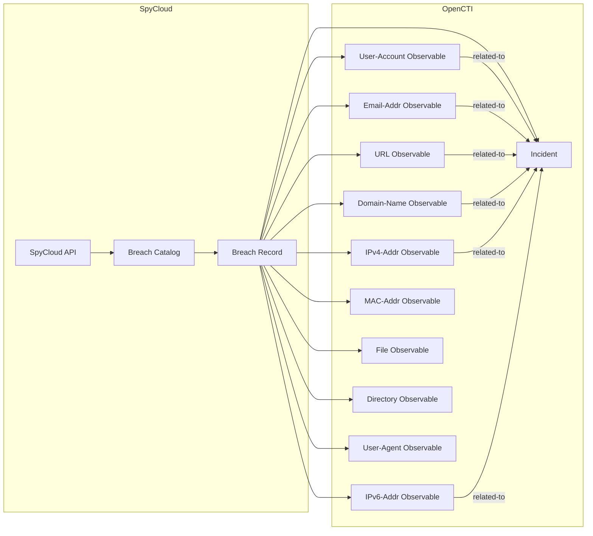

# OpenCTI SpyCloud Connector

The SpyCloud connector imports breach records and compromised data from SpyCloud's threat intelligence platform into OpenCTI as incidents and observables.

| Status            | Date | Comment |
|-------------------|------|---------|
| Filigran Verified | -    | -       |

## Table of Contents

- [OpenCTI SpyCloud Connector](#opencti-spycloud-connector)
  - [Table of Contents](#table-of-contents)
  - [Introduction](#introduction)
  - [Installation](#installation)
    - [Requirements](#requirements)
  - [Configuration variables](#configuration-variables)
    - [OpenCTI environment variables](#opencti-environment-variables)
    - [Base connector environment variables](#base-connector-environment-variables)
    - [Connector extra parameters environment variables](#connector-extra-parameters-environment-variables)
  - [Deployment](#deployment)
    - [Docker Deployment](#docker-deployment)
    - [Manual Deployment](#manual-deployment)
  - [Usage](#usage)
  - [Behavior](#behavior)
  - [Debugging](#debugging)
  - [Additional information](#additional-information)

## Introduction

[SpyCloud](https://spycloud.com/) monitors and tracks compromised data, such as login credentials and personal information, across the web and other sources. This connector imports breach records from SpyCloud into OpenCTI as incidents and observables.

[Documentation about SpyCloud API](https://spycloud-external.readme.io/sc-enterprise-api/docs/getting-started) is available on their platform.

## Installation

### Requirements

- OpenCTI Platform >= 6.5.x
- SpyCloud subscription with API access
- IP address whitelisting on SpyCloud platform

## Configuration variables

There are a number of configuration options, which are set either in `docker-compose.yml` (for Docker) or in `config.yml` (for manual deployment).

> **Note**: All environment variables' values are strings (e.g., stringified numbers, dates in ISO format, comma-separated lists).

### OpenCTI environment variables

| Parameter     | config.yml | Docker environment variable | Mandatory | Description                                          |
|---------------|------------|-----------------------------|-----------|------------------------------------------------------|
| OpenCTI URL   | url        | `OPENCTI_URL`               | Yes       | The URL of the OpenCTI platform.                     |
| OpenCTI Token | token      | `OPENCTI_TOKEN`             | Yes       | The default admin token set in the OpenCTI platform. |

### Base connector environment variables

| Parameter       | config.yml      | Docker environment variable   | Default  | Mandatory | Description                                                              |
|-----------------|-----------------|-------------------------------|----------|-----------|--------------------------------------------------------------------------|
| Connector ID    | id              | `CONNECTOR_ID`                |          | Yes       | A unique `UUIDv4` identifier for this connector instance.                |
| Connector Name  | name            | `CONNECTOR_NAME`              | SpyCloud | No        | Name of the connector.                                                   |
| Connector Scope | scope           | `CONNECTOR_SCOPE`             | spycloud | No        | The scope or type of data the connector is importing.                    |
| Log Level       | log_level       | `CONNECTOR_LOG_LEVEL`         | info     | No        | Determines the verbosity of logs: `debug`, `info`, `warn`, or `error`.   |
| Duration Period | duration_period | `CONNECTOR_DURATION_PERIOD`   |          | Yes       | Interval between runs in ISO 8601 format (e.g., `PT1H`).                 |

### Connector extra parameters environment variables

| Parameter         | config.yml        | Docker environment variable  | Default             | Mandatory | Description                                                    |
|-------------------|-------------------|------------------------------|---------------------|-----------|----------------------------------------------------------------|
| API Base URL      | api_base_url      | `SPYCLOUD_API_BASE_URL`      |                     | Yes       | SpyCloud API base URL.                                         |
| API Key           | api_key           | `SPYCLOUD_API_KEY`           |                     | Yes       | SpyCloud API key.                                              |
| Severity Levels   | severity_levels   | `SPYCLOUD_SEVERITY_LEVELS`   |                     | No        | Filter by severity: `2`, `5`, `20`, `25` (comma-separated).    |
| Watchlist Types   | watchlist_types   | `SPYCLOUD_WATCHLIST_TYPES`   |                     | No        | Filter by type: `email`, `domain`, `subdomain`, `ip`.          |
| TLP Level         | tlp_level         | `SPYCLOUD_TLP_LEVEL`         | amber+strict        | No        | TLP marking: `white`, `green`, `amber`, `amber+strict`, `red`. |
| Import Start Date | import_start_date | `SPYCLOUD_IMPORT_START_DATE` | 1970-01-01T00:00Z   | No        | Starting date in ISO 8601 format if state is not set.          |

## Deployment

### Docker Deployment

Build the Docker image:

```bash
docker build -t opencti/connector-spycloud:latest .
```

Configure the connector in `docker-compose.yml`:

```yaml
  connector-spycloud:
    image: opencti/connector-spycloud:latest
    environment:
      - OPENCTI_URL=http://localhost
      - OPENCTI_TOKEN=ChangeMe
      - CONNECTOR_ID=ChangeMe
      - CONNECTOR_NAME=SpyCloud
      - CONNECTOR_SCOPE=spycloud
      - CONNECTOR_LOG_LEVEL=info
      - CONNECTOR_DURATION_PERIOD=PT1H
      - SPYCLOUD_API_BASE_URL=ChangeMe
      - SPYCLOUD_API_KEY=ChangeMe
      - SPYCLOUD_TLP_LEVEL=amber+strict
    restart: always
```

Start the connector:

```bash
docker compose up -d
```

### Manual Deployment

1. Create `config.yml` based on `config.yml.sample`.

2. Install dependencies:

```bash
pip install .
```

3. Start the connector:

```bash
python main.py
```

## Usage

The connector runs automatically at the interval defined by `CONNECTOR_DURATION_PERIOD`. To force an immediate run:

**Data Management → Ingestion → Connectors**

Find the connector and click the refresh button to reset the state and trigger a new data fetch.

## Behavior

The connector fetches breach records from SpyCloud API and transforms them into OpenCTI incidents with associated observables.

### Data Flow



### Entity Mapping

| SpyCloud Field       | OpenCTI Entity      | Description                                      |
|----------------------|---------------------|--------------------------------------------------|
| Breach Record        | Incident            | Data breach incident with severity               |
| email                | Email-Addr          | Compromised email address                        |
| username             | User-Account        | Compromised username                             |
| user_hostname        | User-Account        | User hostname                                    |
| target_url           | URL                 | Target URL in breach                             |
| target_domain        | Domain-Name         | Target domain                                    |
| target_subdomain     | Domain-Name         | Target subdomain                                 |
| ip_addresses         | IPv4/IPv6-Addr      | Associated IP addresses                          |
| mac_address          | MAC-Addr            | MAC address                                      |
| infected_path        | File + Directory    | Infected file path                               |
| user_agent           | User-Agent          | Browser user agent                               |

### Severity Mapping

| SpyCloud Code | SpyCloud Level | OpenCTI Severity |
|---------------|----------------|------------------|
| 2             | Low            | low              |
| 5             | Medium         | medium           |
| 20            | High           | high             |
| 25            | Critical       | critical         |

### Incident Properties

| SpyCloud Field        | OpenCTI Property     | Description                          |
|-----------------------|----------------------|--------------------------------------|
| breach_catalog.title  | source               | Source of the breach                 |
| severity              | severity             | Incident severity                    |
| spycloud_publish_date | created_at           | Incident creation date               |
| spycloud_publish_date | first_seen           | First seen timestamp                 |
| All fields            | description          | Markdown table of breach details     |

### Relationships Created

| Source        | Relationship | Target          | Description                           |
|---------------|--------------|-----------------|---------------------------------------|
| Observable    | related-to   | Incident        | Observable related to breach incident |
| Email-Addr    | belongs-to   | User-Account    | Email belongs to user account         |

## Debugging

Enable verbose logging:

```env
CONNECTOR_LOG_LEVEL=debug
```

### Known Issues

| Issue                  | Description                                                    | Solution                                         |
|------------------------|----------------------------------------------------------------|--------------------------------------------------|
| 403 - Unauthorized     | IP address not whitelisted on SpyCloud platform                | Whitelist connector IP in SpyCloud settings      |
| 504 - Gateway Timeout  | Some filter combinations cause timeouts                        | Choose different filter combinations             |

Additional [limitations](https://spycloud-external.readme.io/sc-enterprise-api/docs/getting-started#limitations) are documented by SpyCloud.

## Additional information

- **Authentication**: Requires API key + IP whitelisting
- **Scheduler**: Uses OpenCTI connector scheduler for periodic imports
- **Incident Type**: All incidents created with type `data-breach`
- **Reference**: [SpyCloud API Documentation](https://spycloud-external.readme.io/sc-enterprise-api/docs/getting-started)
