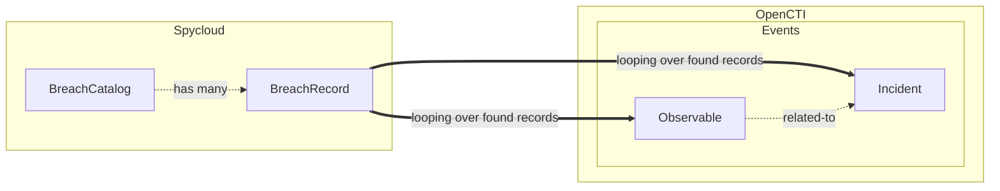

# Spycloud OpenCTI External Import connector

Table of Contents

- [pycloud OpenCTI External Import connector](#opencti-external-ingestion-connector-template)
  - [Introduction](#introduction)
  - [Installation](#installation)
    - [Requirements](#requirements)
  - [Configuration variables](#configuration-variables)
    - [OpenCTI environment variables](#opencti-environment-variables)
    - [External import connector environment variables](#external-import-connector-environment-variables)
    - [Spycloud environment variables](#spycloud-environment-variables)
  - [Deployment](#deployment)
    - [Docker Deployment](#docker-deployment)
    - [Manual Deployment](#manual-deployment)
  - [Usage](#usage)
  - [Behavior](#behavior)
  - [Debugging](#debugging)
  - [Additional information](#additional-information)

## Introduction

This connector allows organizations to feed OpenCTI using **Spycloud** knowledge.

Spycloud monitors and tracks compromised data, such as login credentials and personal information, across the web and other sources.
This connector imports such data, aka _breach records_, from Spycloud into OpenCTI as incidents and observables.

[Documentation about Spycloud API](https://spycloud-external.readme.io/sc-enterprise-api/docs/getting-started) is available on their platform.

## Installation

### Requirements

- OpenCTI Platform >= 6.5.X

## Configuration variables

There are a number of configuration options, which are set either in `docker-compose.yml` (for Docker) or
in `config.yml` (for manual deployment).

### OpenCTI environment variables

Below are the parameters you'll need to set for OpenCTI.  
**We assume that all environment variables' values are strings (e.g. stringified numbers, dates in ISO format, comma-separated lists, ...)**

| Parameter     | config.yml | Docker environment variable | Mandatory | Description                                          |
| ------------- | ---------- | --------------------------- | --------- | ---------------------------------------------------- |
| OpenCTI URL   | url        | `OPENCTI_URL`               | Yes       | The URL of the OpenCTI platform.                     |
| OpenCTI Token | token      | `OPENCTI_TOKEN`             | Yes       | The default admin token set in the OpenCTI platform. |

### External import connector environment variables

Below are the parameters you'll need to set for running the connector properly:

| Parameter       | config.yml      | Docker environment variable | Default    | Mandatory | Description                                                                              |
| --------------- | --------------- | --------------------------- | ---------- | --------- | ---------------------------------------------------------------------------------------- |
| Connector ID    | id              | `CONNECTOR_ID`              | /          | Yes       | A unique `UUIDv4` identifier for this connector instance.                                |
| Connector Name  | name            | `CONNECTOR_NAME`            | /          | Yes       | Name of the connector.                                                                   |
| Connector Scope | scope           | `CONNECTOR_SCOPE`           | "spycloud" | Yes       | The scope or type of data the connector is importing, either a MIME type or Stix Object. |
| Log Level       | log_level       | `CONNECTOR_LOG_LEVEL`       | "info"     | Yes       | Determines the verbosity of the logs. Options are `debug`, `info`, `warn`, or `error`.   |
| Duration Period | duration_period | `CONNECTOR_DURATION_PERIOD` | /          | Yes       | Period of time to wait between two connector's runs (in ISO-8601 format)                 |

### Spycloud environment variables

Below are the parameters you'll need to set for the connector:

| Parameter         | config.yml        | Docker environment variable  | Default             | Mandatory | Description                                                                                                                                                     |
| ----------------- | ----------------- | ---------------------------- | ------------------- | --------- | --------------------------------------------------------------------------------------------------------------------------------------------------------------- |
| API base URL      | api_base_url      | `SPYCLOUD_API_BASE_URL`      | /                   | Yes       | Spycloud API base url                                                                                                                                           |
| API key           | api_key           | `SPYCLOUD_API_KEY`           | /                   | Yes       | Spycloud API key                                                                                                                                                |
| Severity levels   | severity_levels   | `SPYCLOUD_SEVERITY_LEVELS`   | /                   | No        | List of severity levels to filter breach records by. Allowed values are ["2", "5", "20", "25"]. If not set, all breach records will be returned                 |
| Watchlist types   | watchlist_types   | `SPYCLOUD_WATCHLIST_TYPES`   | /                   | No        | List of watchlist types to filter breach records by. Allowed values are ["email", "domain", "subdomain", "ip"]. If not set, all breach records will be returned |
| TLP Level         | tlp_level         | `SPYCLOUD_TLP_LEVEL`         | "amber+strict"      | No        | TLP level to set on imported entities (allowed values are ['white', 'green', 'amber', 'amber+strict', 'red'])                                                   |
| Import start date | import_start_date | `SPYCLOUD_IMPORT_START_DATE` | "1970-01-01T00:00Z" | No        | Date to start import from (in ISO-8601 format) if connector's state doesn't contain last imported incident(s) datetime.                                         |

Please find further details about Spycloud filters in their [API documentation](https://spycloud-external.readme.io/sc-enterprise-api/reference/data-watchlist)

## Deployment

### Docker Deployment

Before building the Docker container, you need to set the version of pycti in `requirements.txt` equal to whatever
version of OpenCTI you're running. Example, `pycti==5.12.20`. If you don't, it will take the latest version, but
sometimes the OpenCTI SDK fails to initialize.

Build a Docker Image using the provided `Dockerfile`.

Example:

```shell
# Replace the IMAGE NAME with the appropriate value
docker build . -t [IMAGE NAME]:latest
```

Make sure to replace the environment variables in `docker-compose.yml` with the appropriate configurations for your
environment. Then, start the docker container with the provided docker-compose.yml

```shell
docker compose up -d
# -d for detached
```

### Manual Deployment

Create a file `config.yml` based on the provided `config.yml.sample`.

Replace the configuration variables (especially the "**ChangeMe**" variables) with the appropriate configurations for
you environment.

Install the required python dependencies (preferably in a virtual environment):

```shell
pip install .
```

Then, start the connector from recorded-future/src:

```shell
python main.py
```

## Usage

After Installation, the connector should require minimal interaction to use, and should update automatically at a
regular interval specified in your `docker-compose.yml` or `config.yml` in `duration_period`.

However, if you would like to force an immediate download of a new batch of entities, navigate to:

`Data management` -> `Ingestion` -> `Connectors` in the OpenCTI platform.

Find the connector, and click on the refresh button to reset the connector's state and force a new
download of data by re-running the connector.

## Behavior

<!--
Describe how the connector functions:
* What data is ingested, updated, or modified
* Important considerations for users when utilizing this connector
* Additional relevant details
-->

### General

This connector leverages OpenCTI connector _scheduler_, so it imports Spycloud breach records and create corresponding incidents and their related observables in OpenCTI at a defined periodicity.  
General documentation about connectors and the scheduler can be found on [Filigran's official doc](https://filigran.io/auto-backpressue-control-octi-connectors/#h-purpose-of-the-scheduler).

### Authentication

In order to authenticate the connector and access Spycloud API, an account with an API key must be set on their platform _and_ the IP address of the running connector must be whitelisted. More information is available in [Spycloud documentation](https://spycloud-external.readme.io/sc-enterprise-api/docs/getting-started#authentication).

### Data

The graph below describes all the different entities that can be created and/or updated by the connector in OpenCTI from
Spycloud's breach records.

| As each breach record can contain a lot of heterogeneous information, all fields are gathered into incident's description as a markdown table.
| These fields are saved as they are returned by Spycloud API.



## Debugging

The connector can be debugged by setting the appropiate log level.
Note that logging messages can be added using `self.helper.connector_logger,{LOG_LEVEL}("Sample message")`, i.
e., `self.helper.connector_logger.error("An error message")`.

### Known issues

- 403 - Unauthorized:  
   Spycloud requires client to authenticate with an API key, but also to whitelist the IP addresses accessing their services.  
   If this issue occurs, please double-check whitelisted IP addresses on Spycloud platform.

- 504 - Gateway Timeout:  
   Timeouts can occur using some combination of filters (e.g. `severity_levels = '5,20'` resulted in many timeouts during connector's development - it's depending on Spycloud data).  
   To mitigate timeout issues, a retry strategy has been implemented though it rarely solves the issue. Please choose wisely the combination of filters used.  
   If the issue still occurs, and/or a specific combination of filters is required, please reach out to Spycloud support for further help.

Some [other limitations](https://spycloud-external.readme.io/sc-enterprise-api/docs/getting-started#limitations) are documented by Spycloud on their platform.
