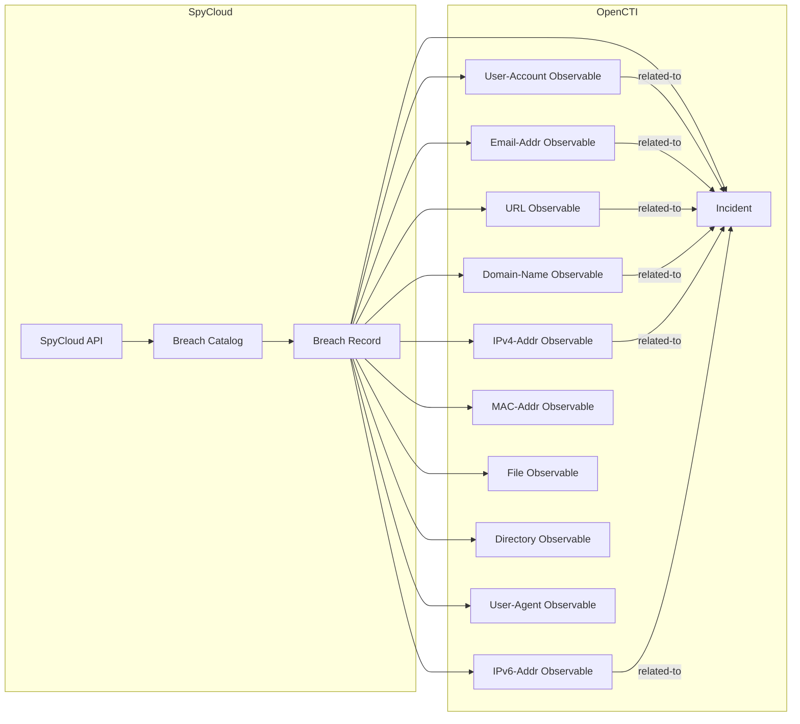

# OpenCTI SpyCloud Connector

| Status | Date | Comment |
|--------|------|---------|
| Filigran Verified | -    | -       |

The SpyCloud connector imports breach records and compromised data from SpyCloud's threat intelligence platform into OpenCTI as incidents and observables.

## Table of Contents

- [OpenCTI SpyCloud Connector](#opencti-spycloud-connector)
  - [Table of Contents](#table-of-contents)
  - [Introduction](#introduction)
  - [Installation](#installation)
    - [Requirements](#requirements)
  - [Configuration variables](#configuration-variables)
  - [Deployment](#deployment)
    - [Docker Deployment](#docker-deployment)
    - [Manual Deployment](#manual-deployment)
  - [Usage](#usage)
  - [Behavior](#behavior)
  - [Debugging](#debugging)
  - [Additional information](#additional-information)

## Introduction

[SpyCloud](https://spycloud.com/) monitors and tracks compromised data, such as login credentials and personal information, across the web and other sources. This connector imports breach records from SpyCloud into OpenCTI as incidents and observables.

[Documentation about SpyCloud API](https://spycloud-external.readme.io/sc-enterprise-api/docs/getting-started) is available on their platform.

## Installation

### Requirements

- OpenCTI Platform >= 6.5.x
- SpyCloud subscription with API access
- IP address whitelisting on SpyCloud platform

## Configuration variables

Find all the configuration variables available here: [Connector Configurations](./__metadata__/CONNECTOR_CONFIG_DOC.md)

_The `opencti` and `connector` options in the `docker-compose.yml` and `config.yml` are the same as for any other connector.
For more information regarding variables, please refer to [OpenCTI's documentation on connectors](https://docs.opencti.io/latest/deployment/connectors/)._

## Deployment

### Docker Deployment

Build the Docker image:

```bash
docker build -t opencti/connector-spycloud:latest .
```

Configure the connector in `docker-compose.yml`:

```yaml
  connector-spycloud:
    image: opencti/connector-spycloud:latest
    environment:
      - OPENCTI_URL=http://localhost
      - OPENCTI_TOKEN=ChangeMe
      - CONNECTOR_ID=ChangeMe
      - CONNECTOR_NAME=SpyCloud
      - CONNECTOR_SCOPE=spycloud
      - CONNECTOR_LOG_LEVEL=info
      - CONNECTOR_DURATION_PERIOD=PT1H
      - SPYCLOUD_API_BASE_URL=ChangeMe
      - SPYCLOUD_API_KEY=ChangeMe
      - SPYCLOUD_TLP_LEVEL=amber+strict
    restart: always
```

Start the connector:

```bash
docker compose up -d
```

### Manual Deployment

1. Create `config.yml` based on `config.yml.sample`.

2. Install dependencies:

```bash
pip install .
```

3. Start the connector:

```bash
python main.py
```

## Usage

The connector runs automatically at the interval defined by `CONNECTOR_DURATION_PERIOD`. To force an immediate run:

**Data Management → Ingestion → Connectors**

Find the connector and click the refresh button to reset the state and trigger a new data fetch.

## Behavior

The connector fetches breach records from SpyCloud API and transforms them into OpenCTI incidents with associated observables.

### Data Flow


```mermaid
graph LR
    subgraph SpyCloud
        direction TB
        API[SpyCloud API]
        BreachCatalog[Breach Catalog]
        BreachRecord[Breach Record]
    end

    subgraph OpenCTI
        direction LR
        Incident[Incident]
        UserAccount[User-Account Observable]
        EmailAddress[Email-Addr Observable]
        URL[URL Observable]
        Domain[Domain-Name Observable]
        IPv4[IPv4-Addr Observable]
        IPv6[IPv6-Addr Observable]
        MAC[MAC-Addr Observable]
        File[File Observable]
        Directory[Directory Observable]
        UserAgent[User-Agent Observable]
    end

    API --> BreachCatalog
    BreachCatalog --> BreachRecord
    BreachRecord --> Incident
    BreachRecord --> UserAccount
    BreachRecord --> EmailAddress
    BreachRecord --> URL
    BreachRecord --> Domain
    BreachRecord --> IPv4
    BreachRecord --> IPv6
    BreachRecord --> MAC
    BreachRecord --> File
    BreachRecord --> Directory
    BreachRecord --> UserAgent
    
    UserAccount -- related-to --> Incident
    EmailAddress -- related-to --> Incident
    URL -- related-to --> Incident
    Domain -- related-to --> Incident
    IPv4 -- related-to --> Incident
    IPv6 -- related-to --> Incident
```

### Entity Mapping

| SpyCloud Field       | OpenCTI Entity      | Description                                      |
|----------------------|---------------------|--------------------------------------------------|
| Breach Record        | Incident            | Data breach incident with severity               |
| email                | Email-Addr          | Compromised email address                        |
| username             | User-Account        | Compromised username                             |
| user_hostname        | User-Account        | User hostname                                    |
| target_url           | URL                 | Target URL in breach                             |
| target_domain        | Domain-Name         | Target domain                                    |
| target_subdomain     | Domain-Name         | Target subdomain                                 |
| ip_addresses         | IPv4/IPv6-Addr      | Associated IP addresses                          |
| mac_address          | MAC-Addr            | MAC address                                      |
| infected_path        | File + Directory    | Infected file path                               |
| user_agent           | User-Agent          | Browser user agent                               |

### Severity Mapping

| SpyCloud Code | SpyCloud Level | OpenCTI Severity |
|---------------|----------------|------------------|
| 2             | Low            | low              |
| 5             | Medium         | medium           |
| 20            | High           | high             |
| 25            | Critical       | critical         |

### Incident Properties

| SpyCloud Field        | OpenCTI Property     | Description                          |
|-----------------------|----------------------|--------------------------------------|
| breach_catalog.title  | source               | Source of the breach                 |
| severity              | severity             | Incident severity                    |
| spycloud_publish_date | created_at           | Incident creation date               |
| spycloud_publish_date | first_seen           | First seen timestamp                 |
| All fields            | description          | Markdown table of breach details     |

### Relationships Created

| Source        | Relationship | Target          | Description                           |
|---------------|--------------|-----------------|---------------------------------------|
| Observable    | related-to   | Incident        | Observable related to breach incident |
| Email-Addr    | belongs-to   | User-Account    | Email belongs to user account         |

## Debugging

Enable verbose logging:

```env
CONNECTOR_LOG_LEVEL=debug
```

### Known Issues

| Issue                  | Description                                                    | Solution                                         |
|------------------------|----------------------------------------------------------------|--------------------------------------------------|
| 403 - Unauthorized     | IP address not whitelisted on SpyCloud platform                | Whitelist connector IP in SpyCloud settings      |
| 504 - Gateway Timeout  | Some filter combinations cause timeouts                        | Choose different filter combinations             |

Additional [limitations](https://spycloud-external.readme.io/sc-enterprise-api/docs/getting-started#limitations) are documented by SpyCloud.

## Additional information

- **Authentication**: Requires API key + IP whitelisting
- **Scheduler**: Uses OpenCTI connector scheduler for periodic imports
- **Incident Type**: All incidents created with type `data-breach`
- **Reference**: [SpyCloud API Documentation](https://spycloud-external.readme.io/sc-enterprise-api/docs/getting-started)
