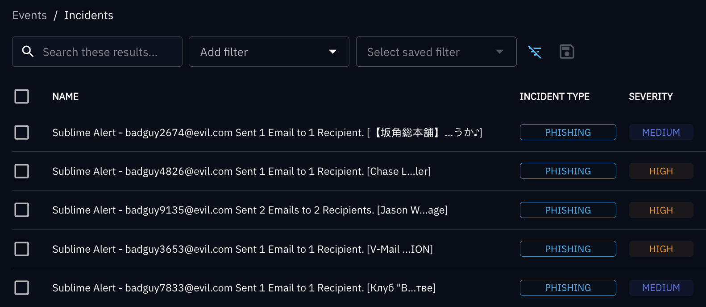
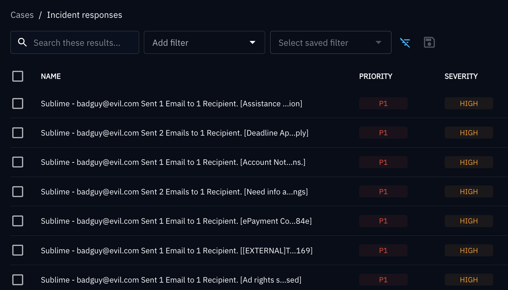
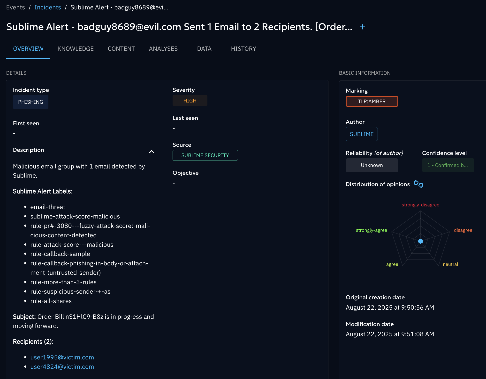

# Sublime Security OpenCTI Connector

An OpenCTI external import connector that retrieves malicious email message groups from Sublime Security's API and ingests them as OpenCTI Incidents and Cases.

## Architecture

The connector polls Sublime Security's message groups API endpoint to retrieve flagged email data. Each message group is transformed into a STIX bundle containing:

- One Incident object representing each email group
- One Case object linked to the Incident for analysis
- Observables extracted from email content (URLs, domains, IPs, email addresses, attachment file hashes)

Example of event incidents created per message group:




Example of cases created per incident:




Example details added to an event incident:




## Installation

### Configuration

Use the provided Docker Compose file to paste the values into your existing OpenCTI docker-compose.yml and configure environment variables:

Required environment variables in `docker-compose.yml`:

```yaml
    environment:
      - OPENCTI_URL=http://opencti:8080
      - OPENCTI_TOKEN=ChangeMe

      - CONNECTOR_ID=a2c156d3-3bbe-4170-b370-bf6faebb56e2
      - CONNECTOR_NAME=Sublime Security
      - CONNECTOR_SCOPE=sublime
      - CONNECTOR_LOG_LEVEL=info
      - CONNECTOR_DURATION_PERIOD=PT3M  # ISO 8601 duration (PT10M = 10 minutes)

      - SUBLIME_URL=https://platform.sublime.security
      - SUBLIME_TOKEN=ChangeMe
      - SUBLIME_INCIDENT_TYPE=phishing  # STIX incident type
      - SUBLIME_INCIDENT_PREFIX=Sublime Alert - 
      - SUBLIME_CASE_PREFIX=Case - 
      - SUBLIME_AUTO_CREATE_CASES=false  # Automatically create cases for incidents
      - SUBLIME_VERDICTS=malicious  # Multiple verdicts can comma-separated like: malicious,suspicious
      - SUBLIME_SET_PRIORITY=true  # Enable priority mapping from attack score verdict
      - SUBLIME_SET_SEVERITY=true  # Enable severity mapping from attack score verdict
      - SUBLIME_CONFIDENCE_LEVEL=80 # 0-100 confidence score
      - SUBLIME_FIRST_RUN_DURATION=PT8H  # Duration for initial data fetch in ISO 8601 format (P14D = 14 days, PT1H = 1 hour)
      - SUBLIME_FORCE_HISTORICAL=false  # Force historical fetch by overriding existing state
      - SUBLIME_BATCH_SIZE=100   # Number of message groups to process per batch (default: 100)


```

### Deployment

For local builds, add the build option to your docker-compose.yml with the specific file to the connector. For example:

```    build: 
        context: ~/threat-intel/OpenCTI/sublime_connector_opencti
```

To start the container:
```bash
docker compose up --build -d
```

Monitor connector logs:
```bash
docker compose logs -f connector-sublime
```

## Configuration Reference

### Required Variables

| Variable | Description |
|----------|-------------|
| `OPENCTI_URL` | OpenCTI platform URL |
| `OPENCTI_TOKEN` | OpenCTI API authentication token |
| `CONNECTOR_ID` | Unique identifier for this connector instance |
| `CONNECTOR_NAME` | Display name for the connector |
| `CONNECTOR_SCOPE` | Connector scope identifier |
| `SUBLIME_URL` | `https://platform.sublime.security` | Sublime platform URL for API connections |
| `SUBLIME_TOKEN` | Sublime Security API authentication token |

### Optional Variables

| Variable | Default | Description |
|----------|---------|-------------|
| `CONNECTOR_DURATION_PERIOD` | `PT3M` | Polling interval (ISO 8601 duration format) |
| `SUBLIME_INCIDENT_TYPE` | `phishing` | Label to apply to incident type |
| `SUBLIME_INCIDENT_PREFIX` | `Sublime Incident - ` | Prefix for incident object names |
| `SUBLIME_CASE_PREFIX` | `Case - ` | Prefix for case object names |
| `SUBLIME_AUTO_CREATE_CASES` | `false` | Automatically create investigation cases |
| `SUBLIME_VERDICTS` | `malicious` | Comma-separated attack score verdicts to process |
| `SUBLIME_CONFIDENCE_LEVEL` | `80` | Confidence score for STIX objects (0-100) |
| `SUBLIME_FIRST_RUN_DURATION` | `PT8H` | ISO 8601 duration for initial data fetch on first run |
| `SUBLIME_FORCE_HISTORICAL` | `false` | Force historical fetch ignoring existing state for correcting improper states |
| `SUBLIME_SET_PRIORITY` | `false` | Enable priority mapping from attack score |
| `SUBLIME_SET_SEVERITY` | `false` | Enable severity mapping from attack score |
| `SUBLIME_BATCH_SIZE` | `100` | Number of messages per processing batch |


## API Token Configuration

### Sublime Security API Token

1. Access Sublime Security platform
2. Navigate to Automate → API
3. Note the Base URL to be used for connector configuration
3. Select "New Key" to generate a new key for this connector
4. Configure `SUBLIME_TOKEN` environment variable to use this token

### OpenCTI API Token

1. Access OpenCTI platform
2. Navigate to Settings → Parameters → API access
3. Create token with connector permissions
4. Configure `OPENCTI_TOKEN` environment variable
