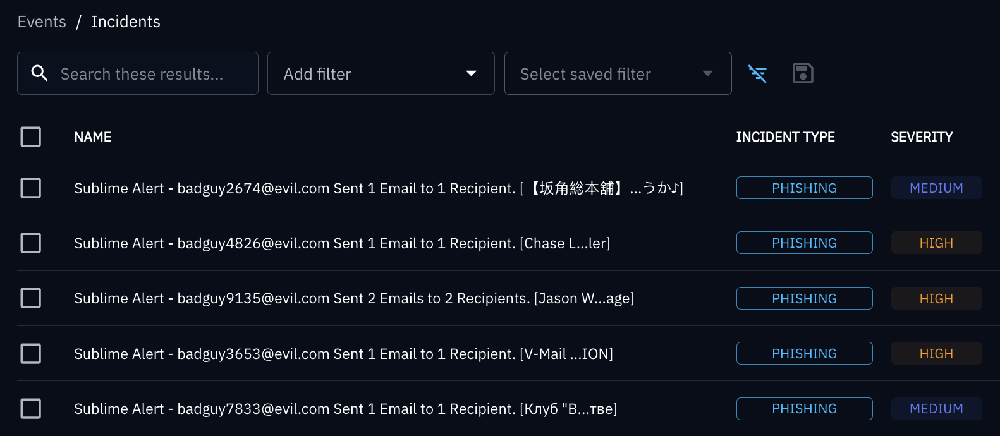
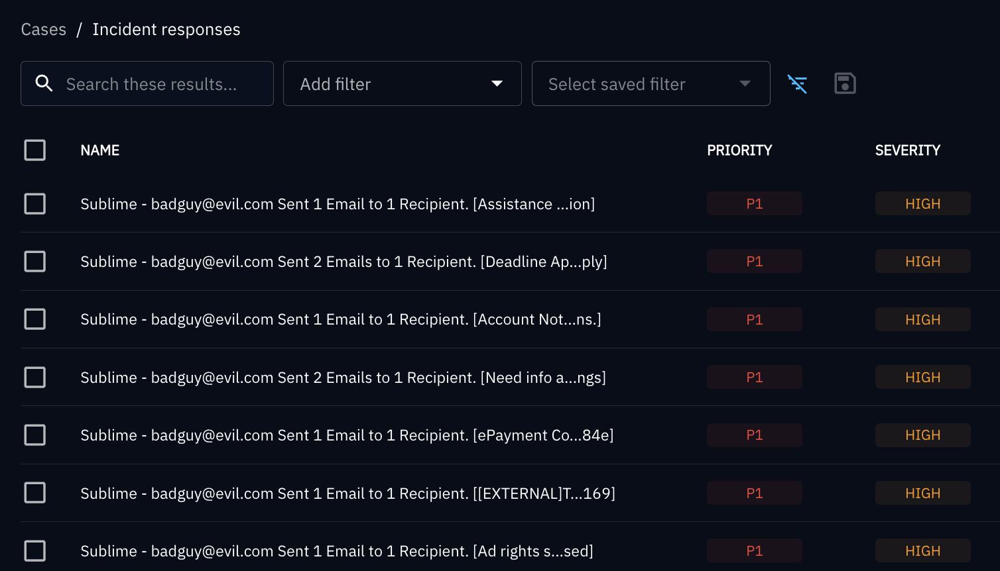
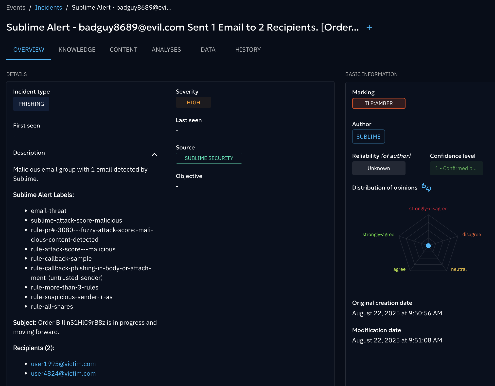

# Sublime Security OpenCTI Connector

| Status | Date | Comment |
|--------|------|---------|
| Community | -    | -       |

An OpenCTI external import connector that retrieves malicious email message groups from Sublime Security's API and ingests them as OpenCTI Incidents and Cases.

## Architecture

The connector polls Sublime Security's message groups API endpoint to retrieve flagged email data. Each message group is transformed into a STIX bundle containing:

- One Incident object representing each email group
- One Case object linked to the Incident for analysis
- Observables extracted from email content (URLs, domains, IPs, email addresses, attachment file hashes)

Example of event incidents created per message group:



Example of cases created per incident:



Example details added to an event incident:



## Installation

## Configuration

Find all the configuration variables available here: [Connector Configurations](./__metadata__/CONNECTOR_CONFIG_DOC.md)

_The `opencti` and `connector` options in the `docker-compose.yml` and `config.yml` are the same as for any other connector.
For more information regarding variables, please refer to [OpenCTI's documentation on connectors](https://docs.opencti.io/latest/deployment/connectors/)._


### Deployment

If you are building the connector locally or customizing it, add a build: section to your compose service:

```
    build:
        context: .
```

To start the container:
```bash
docker compose up --build -d
```

Monitor connector logs:
```bash
docker compose logs -f connector-sublime
```

## API Token Configuration

### Sublime Security API Token

1. Log in to the Sublime Security platform
2. Navigate to Automate > API
3. Note the Base URL to be used for connector configuration
3. Select "New Key" to generate a new token for this connector
4. Configure `SUBLIME_TOKEN` environment variable to use this token

### OpenCTI API Token

1. Log in to your OpenCTI instance
2. Navigate to Settings > Parameters > API access
3. Create token with connector permissions
4. Configure `OPENCTI_TOKEN` environment variable with this token value
