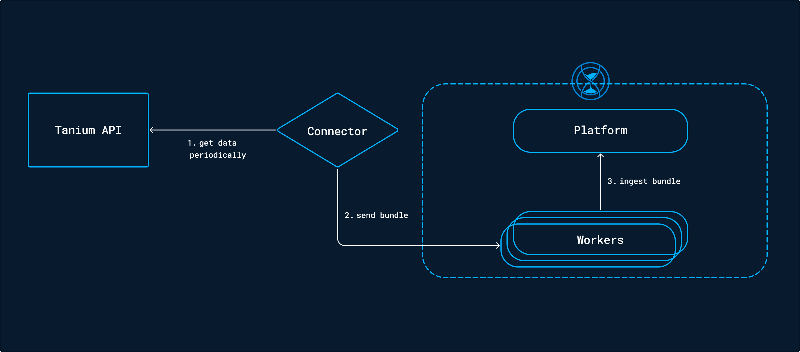
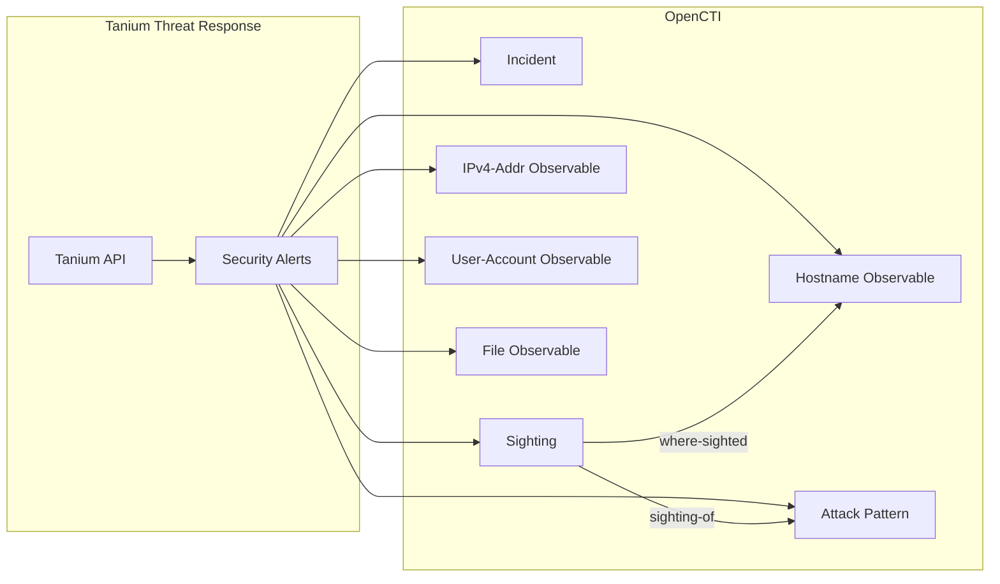

# OpenCTI Tanium Incidents Connector

The Tanium Incidents connector imports security alerts from Tanium Threat Response into OpenCTI as incidents and sightings.

| Status            | Date | Comment |
|-------------------|------|---------|
| Filigran Verified | -    | -       |

## Table of Contents

- [OpenCTI Tanium Incidents Connector](#opencti-tanium-incidents-connector)
  - [Table of Contents](#table-of-contents)
  - [Introduction](#introduction)
  - [Installation](#installation)
    - [Requirements](#requirements)
  - [Configuration variables](#configuration-variables)
    - [OpenCTI environment variables](#opencti-environment-variables)
    - [Base connector environment variables](#base-connector-environment-variables)
    - [Connector extra parameters environment variables](#connector-extra-parameters-environment-variables)
  - [Deployment](#deployment)
    - [Docker Deployment](#docker-deployment)
    - [Manual Deployment](#manual-deployment)
  - [Usage](#usage)
  - [Behavior](#behavior)
  - [Debugging](#debugging)
  - [Additional information](#additional-information)

## Introduction

This connector allows organizations to feed OpenCTI sightings using **Tanium Threat Response** alerts. It imports Tanium alerts and creates corresponding incidents and sightings in OpenCTI at a defined periodicity.



## Installation

### Requirements

- OpenCTI Platform >= 5.0.0
- Tanium Threat Response >= 3.X.X
- Tanium API access token

## Configuration variables

There are a number of configuration options, which are set either in `docker-compose.yml` (for Docker) or in `config.yml` (for manual deployment).

### OpenCTI environment variables

| Parameter     | config.yml | Docker environment variable | Mandatory | Description                                          |
|---------------|------------|-----------------------------|-----------|------------------------------------------------------|
| OpenCTI URL   | url        | `OPENCTI_URL`               | Yes       | The URL of the OpenCTI platform.                     |
| OpenCTI Token | token      | `OPENCTI_TOKEN`             | Yes       | The default admin token set in the OpenCTI platform. |

### Base connector environment variables

| Parameter                 | config.yml        | Docker environment variable   | Default | Mandatory | Description                                                              |
|---------------------------|-------------------|-------------------------------|---------|-----------|--------------------------------------------------------------------------|
| Connector ID              | id                | `CONNECTOR_ID`                |         | Yes       | A unique `UUIDv4` identifier for this connector instance.                |
| Connector Name            | name              | `CONNECTOR_NAME`              | Tanium  | No        | Name of the connector.                                                   |
| Connector Scope           | scope             | `CONNECTOR_SCOPE`             | tanium  | No        | The scope or type of data the connector is importing.                    |
| Log Level                 | log_level         | `CONNECTOR_LOG_LEVEL`         | info    | No        | Determines the verbosity of logs: `debug`, `info`, `warn`, or `error`.   |
| Connector Duration Period | duration_period   | `CONNECTOR_DURATION_PERIOD`   |         | Yes       | Interval between runs in ISO 8601 format (e.g., `PT1H`).                 |

### Connector extra parameters environment variables

| Parameter               | config.yml                         | Docker environment variable          | Default | Mandatory | Description                                                    |
|-------------------------|------------------------------------|--------------------------------------|---------|-----------|----------------------------------------------------------------|
| Tanium API Base URL     | tanium_incidents_url               | `TANIUM_INCIDENTS_URL`               |         | Yes       | The Tanium instance API URL.                                   |
| Tanium Console Base URL | tanium_incidents_url_console       | `TANIUM_INCIDENTS_URL_CONSOLE`       |         | Yes       | The Tanium instance console URL.                               |
| SSL Verification        | tanium_incidents_ssl_verify        | `TANIUM_INCIDENTS_SSL_VERIFY`        | True    | No        | Enable SSL certificate verification.                           |
| Tanium API Token        | tanium_incidents_token             | `TANIUM_INCIDENTS_TOKEN`             |         | Yes       | The Tanium API token.                                          |
| Import Alerts           | tanium_incidents_import_alerts     | `TANIUM_INCIDENTS_IMPORT_ALERTS`     | True    | No        | Enable alerts import.                                          |
| Import Start Date       | tanium_incidents_import_start_date | `TANIUM_INCIDENTS_IMPORT_START_DATE` |         | No        | Starting date (YYYY-MM-DD), used only if state is not set.     |

## Deployment

### Docker Deployment

Build the Docker image:

```bash
docker build -t opencti/connector-tanium-incidents:latest .
```

Configure the connector in `docker-compose.yml`:

```yaml
  connector-tanium-incidents:
    image: opencti/connector-tanium-incidents:latest
    environment:
      - OPENCTI_URL=http://localhost
      - OPENCTI_TOKEN=ChangeMe
      - CONNECTOR_ID=ChangeMe
      - CONNECTOR_NAME=Tanium Incidents
      - CONNECTOR_SCOPE=tanium
      - CONNECTOR_LOG_LEVEL=info
      - CONNECTOR_DURATION_PERIOD=PT1H
      - TANIUM_INCIDENTS_URL=https://tanium.example.com/api
      - TANIUM_INCIDENTS_URL_CONSOLE=https://tanium.example.com
      - TANIUM_INCIDENTS_SSL_VERIFY=true
      - TANIUM_INCIDENTS_TOKEN=ChangeMe
      - TANIUM_INCIDENTS_IMPORT_ALERTS=true
    restart: always
```

Start the connector:

```bash
docker compose up -d
```

### Manual Deployment

1. Create `config.yml` based on `config.yml.sample`.

2. Install dependencies:

```bash
pip3 install -r requirements.txt
```

3. Start the connector:

```bash
python3 main.py
```

## Usage

The connector runs automatically at the interval defined by `CONNECTOR_DURATION_PERIOD`. To force an immediate run:

**Data Management → Ingestion → Connectors**

Find the connector and click the refresh button to reset the state and trigger a new data fetch.

## Behavior

The connector fetches alerts from Tanium Threat Response API and converts them into OpenCTI incidents with associated observables and sightings.

### Data Flow



### Entity Mapping

| Tanium Alert Field        | OpenCTI Entity      | Description                                      |
|---------------------------|---------------------|--------------------------------------------------|
| Alert                     | Incident            | Security incident with severity and description  |
| MITRE Technique           | Attack Pattern      | MITRE ATT&CK technique with x_mitre_id           |
| computerName              | Hostname            | Custom hostname observable                       |
| computerIpAddress         | IPv4-Addr           | Computer IP address observable                   |
| process.user              | User-Account        | User account associated with alert               |
| process.file              | File                | File with hashes (MD5, SHA-1, SHA-256)           |
| Alert Detection           | Sighting            | Sighting linking ATT&CK technique to hostname    |

### Incident Properties

| Tanium Field     | OpenCTI Property       | Description                          |
|------------------|------------------------|--------------------------------------|
| name             | name                   | Alert name                           |
| alertedAt        | created                | Alert timestamp                      |
| description      | description            | Alert description                    |
| priority         | severity               | Alert priority level                 |
| guid             | external_reference     | Link to Tanium console               |

### Relationships Created

| Source        | Relationship     | Target          | Description                           |
|---------------|------------------|-----------------|---------------------------------------|
| Sighting      | sighting-of      | Attack Pattern  | What was sighted                      |
| Sighting      | where-sighted    | Hostname        | Where the sighting occurred           |
| Incident      | related-to       | Observable      | Incident related observables          |

### Processing Details

1. **Alert Fetching**: Retrieves alerts from Tanium Threat Response API
2. **Incident Creation**: Creates incident with severity, description, and external reference to Tanium console
3. **Observable Extraction**: Extracts hostname, IP, user account, and file observables from alert details
4. **Attack Pattern Mapping**: Maps MITRE ATT&CK techniques to attack patterns
5. **Sighting Creation**: Creates sightings linking attack patterns to observed hosts

### TLP Marking

All imported data is marked with **TLP:RED** by default as it represents sensitive internal security alert data.

## Debugging

Enable verbose logging:

```env
CONNECTOR_LOG_LEVEL=debug
```

## Additional information

- **External References**: Each incident links back to the Tanium console for detailed investigation
- **MITRE ATT&CK**: Attack patterns include `x_mitre_id` for proper mapping
- **File Hashes**: Supports MD5, SHA-1, and SHA-256 hash extraction
- **Reference**: [Tanium Threat Response](https://www.tanium.com/products/tanium-threat-response/)
